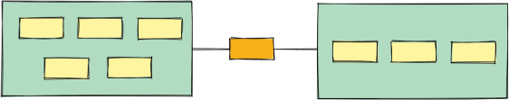
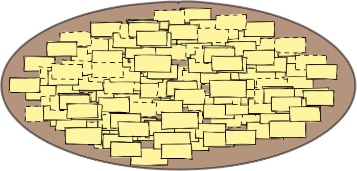
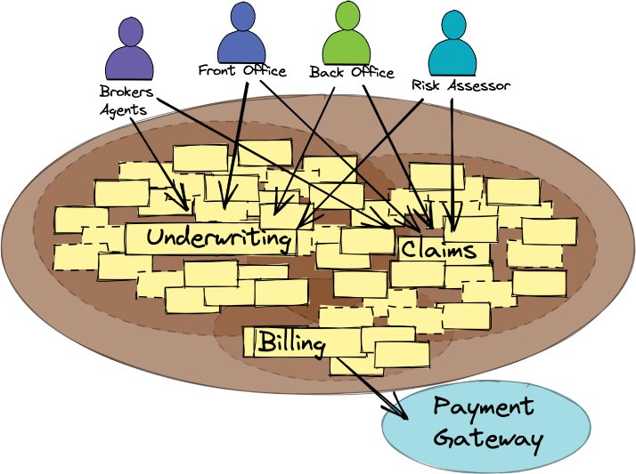
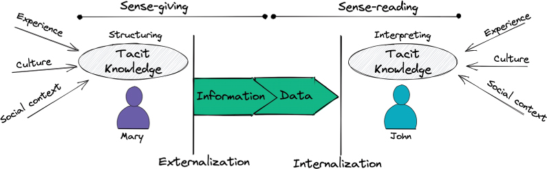
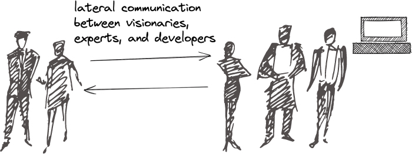
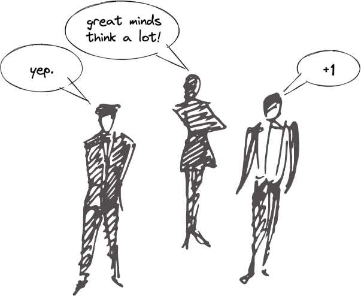
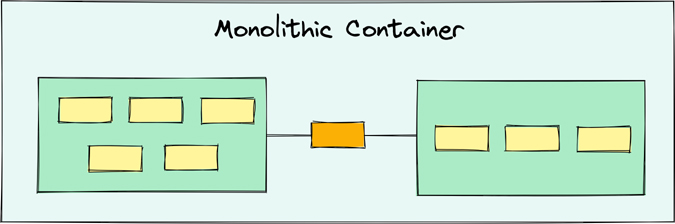
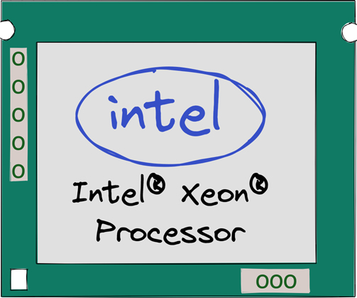
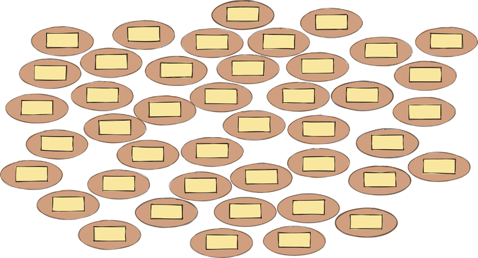

# 业务目标和数字化转型

最杰出的商业成就是创造出一种被大量消费者所需要、完全独一无二、价格最优的产品。从历史上看，从一般意义上讲，实现这样的成就取决于识别关键市场人口必不可少的或非常需要的东西的能力。这反映在柏拉图著作中的格言中：“我们的需要将是真正的创造者。”今天，这句话被称为“需要是发明之母”。
然而，最深刻的创新者是那些甚至在消费者意识到需要它之前就发明了一种巧妙产品的人。这样的成就是偶然发生的，但也源于那些敢于问“为什么不呢？”1 也许数学家和哲学家阿尔弗雷德·诺斯·怀特黑德 (Alfred North Whitehead) 在论证“发明的基础是科学，而科学是几乎完全是愉快的求知欲的产物”[ANW]。

> 1.（乔治）萧伯纳：“有些人看到事物的本来面目并问为什么。其他人梦想着从未有过的事情，并问为什么不。”

当然，绝大多数企业都面临着一个严峻的现实：产品开发方面的突破对市场产生深远的影响并不是每天都会发生的。发明完全独特的产品来占领整个市场似乎就像无所事事并击中一罐金子的中心一样。
因此，主要的商业计划是创造竞争。独特性体现在对复制品的定价上，而不是在创造原件上。击中这么大的目标完全是普通的，缺乏想象力，甚至不是成功的必经之路。如果创造（更多）竞争似乎是最好的玩法，请考虑史蒂夫·乔布斯的建议：“你不能看着竞争就说你会做得更好。你必须看看竞争对手，然后说你会以不同的方式去做。”

> SpaceX 创新
>
> 从 1970 年到 2000 年，将一公斤物体发射到太空的平均成本为每公斤 18,500 美元。对于 SpaceX Falcon 9，成本仅为每公斤 2,720 美元。这是一个 7:1 的改进因素，因此现在 SpaceX 几乎拥有所有太空发射业务的原因已经不是什么秘密了。他们是如何做到的呢？他们没有做的是根据与政府签订的合同工作——也就是说，这是迄今为止唯一的筹资机制。他们的目标是大幅降低将物品发射到太空的成本。他们的主要子目标是回收和再利用助推火箭。 YouTube 上有一段精彩的视频，内容是他们为实现目标而撞毁的所有助推器。整合事件的策略（在这种情况下，测试助推器启动）是多个工程团队如何与所有其他团队快速试用他们的最新版本。政府合同永远不会容忍 SpaceX 遭受的崩溃。然而，坠机事件将可靠、廉价的助推火箭的开发速度提高了大约 5 倍，这只是通过尝试发现未知的未知数，而不是试图通过令人痛苦的细节来考虑所有事情。这是一种非常经典的工程方法，但在承包模型中绝不会被允许。 SpaceX 团队表示，发生坠机事故并发现问题比尝试永远等待直到没有风险要便宜得多。 [玛丽·波彭迪克]

模仿不是一种策略。差异化是。
差异化是企业必须不断追求的战略目标。如果纯粹的发明看起来几乎是不可能的，那么对创新的持续和顽强的改进就不应该。在本书中，我们承担了通过不断改进数字化转型来帮助读者实现战略性业务差异化的任务。

## 数字化转型：目标是什么？
理解非平凡的制造是一项重大的壮举，不应该阻止任何人采取小的、科学的步骤，并持续致力于实际创新。无论到达 Z 的复杂性如何，在从 A 开始时进行实验以到达 B 是一个现实的期望。在那之后，达到 C 是可行的，然后导致 D。这是一个保持我们的实验室外套和口袋保护器的问题，并承认可以占领新市场的独特产品可能一直盯着我们看。
无论 Microsoft Office 从一开始就被认为是一种提高员工生产力的创新，它肯定是该市场上最成功的套件。借助 Office 365，Microsoft 无需重新发明文字处理器和电子表格即可进行创新。但是，它确实添加了新的交付机制和功能，使整个团队能够进行协作以及其他功能。微软是否通过数字化转型创新再次获胜？
数字化转型由业务创新者负责，但企业通常会忽视转型的创新部分。变革性创新要求企业了解不断变化的基础设施平台与构建新产品价值之间的区别。例如，尽管将业务数字资产从本地数据中心转移到云端可能是一项重要的 IT 计划，但它本身并不是创新的业务计划。
将你的软件迁移到云是否符合数字化转型的要求？可能，但如果此举支持未来的差异化，则更是如此。如果云提供了新的创新机会，或者至少减轻了数字资产运营的极高成本并将这些资金引导到新产品上，则最有资格。将云视为通过将你从大多数传统数据中心责任中解放出来而创造的机会。然而，如果向云的转变相当于用一组成本换取一组不同的成本，那将不会是变革性的。亚马逊向外界提供其已经成功的计算基础设施是该公司的数字化转型，导致了云创新。向亚马逊支付订阅费用以使用其云并不是对订阅者的变革性创新。教训很明确：创新或被创新。
正如迁移到云不是创新一样，创建新的分布式计算架构也不是创新。用户不关心分布式计算、微服务或单体，甚至特性。用户关心结果。需要迅速改进用户成果，并且不会对其工作流程产生负面影响。为了让软件有机会进行有意义的转型，其架构和设计必须支持尽快交付更好的用户成果。
使用云时，改进的架构和设计方法（以及任何其他可以提高生产力的调整良好的步骤）使实现创新的转型目标成为可能。使用基础设施即服务可以让企业腾出时间来开发创新的业务软件，而不是忙于尝试在其基础设施上进行创新。基础设施创新不仅耗时且成本高昂，而且可能无益于企业的底线，而且内部开发基础设施可能永远无法满足基础设施和运营需求以及 AWS、谷歌云平台和 Azure。然而，情况并非总是如此。对于某些企业而言，将运营引入内部或将其保留在那里会更具成本效益 [a16z-CloudCostParadox]。
请记住，它是 A 到 B、B 到 C、C 到 D……愿意重复这些步骤中的任何一个，以便你可以学到足够的知识来进行下一个步骤。了解在到达 K 之前从 J 返回到 G 是预期的，并且 Z 永远不会发生，这是一种解放。团队可以创新，但这些转型步骤都不能容忍冗长的周期。第 2 章“基本战略学习工具”展示了实验如何是创新的朋友和优柔寡断的敌人。

### 软件架构快速浏览
本节介绍术语软件架构——这里经常提到的术语。这是一个相当广泛的主题，本书将对其进行更详细的介绍。
现在，将软件架构视为类似于构建架构。建筑物具有结构，通过提供指定的功能，它反映了建筑师和业主之间就设计功能进行的沟通结果。一座建筑由各种子系统构成一个完整的系统，每个子系统都有其特定的用途和作用。这些子系统都与建筑物的其他部分松散或更紧密地连接，单独工作或与其他部分协同工作，使建筑物达到其目的。例如，建筑物的空调需要电力、管道工程、恒温器、绝缘材料，甚至建筑物的封闭区域来冷却，如果该子系统要有效的话。
同样，软件架构提供了结构设计——即许多结构的表述，而不是一个。结构设计组织系统组件，为它们提供在协同工作时进行通信的方式。该结构还用于隔离组件集群，以便它们可以独立运行。因此，结构必须帮助实现质量属性而不是功能属性，而其中的组件实现系统构建团队指定的功能。
图 1.1 说明了两个子系统（仅显示了整个系统的一个片段），每个子系统都有在内部协同工作但与其他子系统隔离的组件。两个子系统通过通信通道交换信息，中间的方框代表交换的信息。假设这两个子系统在物理上被分成两个部署单元，并通过网络进行通信。这构成了分布式系统的一部分。

图 1.1 软件架构提供子系统内的结构并支持它们之间的通信。

构建和软件架构的另一个重要方面是它们必须支持不可避免的变化。如果现有组件无法满足任一架构中的新需求，则它们必须可更换，无需付出极大的成本或努力。架构还必须能够适应可能需要的扩展，同样不会对整体架构产生重大影响。

## 为什么软件会出错
我们不想夸大企业软件开发状况不佳的严重性，我们认为也不能夸大其词。
在与财富和全球公司讨论企业软件系统状况时，我们很快就了解了他们的主要痛点。这些总是与经过数十年维护、在创新发生很久之后的老旧软件有关。大多数讨论都认为软件开发被视为业务的成本中心，这使得投资改进变得更加困难。然而，今天，软件应该是一个利润中心。不幸的是，30 多年前，当软件旨在使某些操作比手工劳动更快地工作时，集体企业的思维方式就停滞不前了。
特定的应用程序（或子系统）从要构建的核心业务原因开始。随着时间的推移，其核心目的将得到加强甚至发生很大变化。不断添加的功能可能会变得如此广泛，以至于应用程序的原始目的失去了，它可能对不同的业务功能意味着不同的东西，而这些理解的全部多样性并不容易知道。这通常会导致许多手在搅拌锅。最终，紧急开发从战略转变为通过修复紧急错误和直接在数据库中修补数据以补偿故障来保持软件运行。新功能通常缓慢而谨慎地添加，以避免产生更多错误。即便如此，注入新的 bug 是不可避免的：随着系统混乱程度的不断增加和历史视角的丧失，不可能确定单个给定的更改将对更大的软件主体产生的全面影响。
团队承认，无论是在单个应用程序（子系统）中还是在任何大型系统中，都没有明确和有意地表达软件架构。考虑到硬件设计和操作环境（例如云）的进步，在存在某种架构意义的地方，它通常是脆弱和过时的。软件设计也是无意的，因此似乎不存在。因此，实现背后的大多数想法都是隐含的，只存在于少数参与其中的人的记忆中。建筑和设计基本上都是临时的，而且很奇怪。由于草率的工作，这些未被识别的失败会导致一些非常草率的结果。
仅仅出于技术原因引入架构与根本不产生明确定义的架构一样危险。软件架构师和开发人员经常对与他们以前采用的开发风格相关的新开发风格，甚至是新命名的软件工具非常着迷，该软件工具是很多炒作和行业嗡嗡声的主题。这通常会引入意外的复杂性 ^2^，因为 IT 专业人员并不完全了解他们不明智的决定会对整个系统产生什么影响，包括其执行环境和操作。是的，微服务架构和 Kubernetes 等工具虽然在适当的环境中适当适用，但推动了许多不合格的采用。不幸的是，这种采用很少由对业务需求的洞察力驱动。

> 2 偶然的复杂性是由开发人员试图解决问题引起的，可以修复。一些软件也有本质的复杂性，这是由正在解决的问题引起的。尽管无法避免基本的复杂性，但通常可以将其隔离在专门为解决这些问题而设计的子系统和组件中。

由于未能执行紧急更改而导致系统内软件模型不准确的长期积累被描述为债务隐喻。相比之下，接受系统不受控制的更改所产生的累积称为软件熵。两者都值得仔细研究。

### 债务隐喻
几十年前，当时从事财务软件工作的非常聪明的软件开发人员 Ward Cunningham 需要向他的老板解释为什么目前针对软件变革的努力是必要的 [Cunningham]。所做的更改绝不是临时的；事实上，他们恰恰相反。所做的各种更改会使软件开发人员看起来好像一直都知道他们在做什么，并使其看起来很容易做到。他们使用的特定技术现在称为软件重构。在这种情况下，重构是按照它要实现的方式完成的——也就是说，将新业务知识的获取反映到软件模型中。
为了证明这项工作的合理性，Cunningham 需要解释说，如果团队没有对软件进行调整以匹配他们对问题领域不断增长的了解，他们将继续因现有软件与他们当前精炼的理解之间的分歧而跌跌撞撞.反过来，持续的磕磕绊绊会减慢团队的持续开发进度，这就像支付贷款利息一样。于是，债务比喻诞生了。
任何人都可以借钱让他们比没有拿到钱更快地做事。当然，只要贷款存在，借款人就会支付利息。在软件中承担债务的主要想法是能够更快地发布，但你必须尽快偿还债务。通过重构软件以反映团队新获得的业务需求知识来偿还债务。在当时的行业中，就像今天一样，软件在知道存在债务的情况下急于向用户提供，但团队往往认为你永远不必偿还债务。
当然，我们都知道接下来会发生什么。如果债务继续堆积并且这个人借的钱越来越多，借款人的所有钱都将用于支付利息，并且他们的购买力将达到零。问题与软件债务的运作方式相同，因为最终深陷债务的开发人员将受到严重损害。添加新功能将花费越来越长的时间，以至于团队几乎没有任何进展。
当代对债务比喻的理解的主要问题之一是，许多开发人员认为这个比喻支持故意交付设计和实施不佳的软件，以便更快地交付。然而，这个比喻并不支持这种做法。尝试这一壮举更像是借入利率可向上调整的次级贷款^3^，这通常会导致借款人在财务上过度扩张以至违约。债务只有在受到控制时才有用；否则，它会在整个系统内造成不稳定。

> 3 很难理解有些人对 2008 年的金融危机并不熟悉，这场危机将延续多年。这场（最终是全球性的）危机是由向不合格借款人购买房屋的次级贷款引发的。本书手稿的一些早期读者问：“什么是次级贷款？”了解那段历史可以使这些读者免于许多经济上的悲痛。

### 软件熵
软件熵 ^4^ 是一个不同的比喻，但在它描述的软件系统条件方面与债务比喻密切相关。熵一词在热力学领域的统计力学中用于测量系统的无序。不打算深入探讨这个话题：“热力学第二定律指出，孤立系统的熵永远不会随着时间的推移而减少。孤立系统自发地向热力学平衡演化，即具有最大熵的状态”[熵]。软件熵比喻描述了软件系统的变化是不可避免的情况，除非做出积极的努力来阻止它，否则这种变化将导致不受控制的复杂性增加 [Jacobson]。

> 4 除了熵之外的其他类似物也描绘了这个问题的生动画面，例如软件腐烂、软件侵蚀和软件衰减。作者主要使用熵。

### 大泥球

类似于前面描述的应用程序或系统已被称为“大泥球”。在架构方面，它被进一步描述为结构随意；蔓延;马虎；管道胶带和打包布线；丛林;不受管制的增长；重复，方便的维修。 “信息在系统的远距离元素之间混杂共享，经常到几乎所有重要信息都变得全局或重复的地步。系统的整体结构可能永远不会被很好地定义。如果是这样，它可能已经被侵蚀得面目全非”[BBoM]。
将大泥球“架构”描述为非架构似乎很合适。
在本章的其余部分以及本书的一般内容中，我们将重点介绍以下几个特征： 结构随意；不受管制的增长；反复的、方便的维修；混杂共享的信息；所有重要信息全局或重复。
大泥球的企业规范导致组织经历竞争瘫痪，这种情况已经蔓延到各个商业行业。对于曾经享有竞争优势的大型企业来说，被负债累累和几乎完全熵的系统拖累是很常见的。
你可以轻松地将图 1.2 中的 Big Ball of Mud 系统与图 1.1 中描绘的系统进行对比。当然，图 1.1 中的系统部分并不代表图 1.2 中系统支持的功能数量，但显然第一个系统的架构带来了秩序，而第二个系统的架构缺乏则带来了混乱。

图 1.2 大泥球可能被归类为非架构。

这些混乱的情况每年都会阻止多个软件发布，从而导致比前几年软件发布更严重的问题。 个人和他们所属的团队往往变得漠不关心和自满，因为他们知道他们无法做出他们认为扭转局面所必需的改变。 从那里开始的下一个层次正在变得幻灭和士气低落。 面临这种情况的企业无法在软件方面进行创新并在这种情况下继续竞争。 最终，他们沦为一家可以取得重大进展的灵活初创公司的牺牲品，在几个月到几年内，它可以取代以前的市场领导者。

### 运行示例
从现在开始，我们将使用现有的大泥球进行案例研究，并描述受影响的企业在面临相关的深度债务和熵的现实时难以创新的情况。因为你可能已经厌倦了阅读坏消息，这里有一个剧透：情况会随着时间的推移而改善。
没有比从现实世界中借用的例子来解释每个公司在软件开发中必须面对的问题更好的方法了。此处提供的作为处理现有大泥球的案例研究的示例来自保险业。
在人生的某个阶段，几乎每个人都必须与保险公司打交道。人们寻求获得多样化的保险单的原因有多种。有些是为了满足法律要求，有些是为未来提供安全措施。这些政策包括健康保护、个人险种（例如人寿、汽车、房屋、抵押贷款、金融产品投资、国际旅行），甚至丢失最喜欢的一套高尔夫球杆。保险领域的保单产品创新似乎永无止境，几乎可以涵盖任何可以想象的风险。如果存在潜在风险，你很可能会找到一家为其提供保险的保险公司。
保险背后的基本思想是，某些人或事物有损失的风险，并且在发生此类损失时，可以通过收取费用来恢复被保险人或事物的计算财务价值。由于大数定律，保险是一项成功的商业主张。该法规定，由于承保风险的人和物数量众多，所有被承保的人和物的整体损失风险很小，因此所有人支付的费用将远大于实际支付的费用。损失。此外，损失的可能性越大，保险公司为提供承保而收取的费用就越高。
想象一下保险领域的复杂性。汽车和房屋的保险范围相同吗？调整一些适用于汽车的业务规则是否可以覆盖房屋？即使汽车和房屋政策可能被认为“足够接近”以保持很多共同点，但请考虑这两种政策类型所涉及的不同风险。
考虑一些示例场景。一辆汽车撞到另一辆汽车的可能性比房子的一部分撞到另一栋房子并造成损坏的可能性要高得多。厨房因日常使用而发生火灾的可能性大于汽车发动机因日常使用而着火的可能性。正如我们所见，两种保险之间的区别并不微妙。在考虑各种可能的承保范围时，需要大量投资才能提供对面临风险的人有价值的保单，并且不会对保险公司造成损失。
因此，保险公司在业务战略、运营和软件开发方面的复杂性是可以理解的。这就是为什么保险公司倾向于专注于一小部分可保产品。并不是他们不想成为市场上更大的参与者，而是成本很容易超过在所有可能的细分市场中竞争的好处。因此，保险公司更多地尝试在他们已经获得专业知识的保险产品中处于领先地位也就不足为奇了。即便如此，调整业务战略、接受陌生但可衡量的风险以及开发新产品可能是一个不容错过的有利可图的机会。
是时候介绍 NuCoverage 保险了。这家虚构的公司基于作者以前经历过的真实场景。 NuCoverage 已成为美国低成本汽车保险的领导者。该公司成立于 2001 年，其商业计划是专注于为安全驾驶员提供低成本的保费。它看到了专注于这个特定市场的明显机会，并取得了成功。成功来自该公司非常准确地评估风险和保费并提供市场上成本最低的保单的能力。近 20 年后，该公司为整个美国市场的 23% 提供保险，但在专业的低成本安全驾驶员市场中为近 70% 提供保险。

### 当前业务背景
尽管 NuCoverage 是汽车保险的领导者，但它希望将业务扩展到其他类型的保险产品。该公司最近增加了家庭保险，并正在努力增加个人保险。然而，添加新的保险产品变得比原先想象的更加复杂。
在个人保险产品线的开发过程中，管理层有机会与美国最大的银行之一 WellBank 签署合作协议。该交易涉及使 WellBank 能够以自己的品牌销售汽车保险。 WellBank 看到了销售汽车保险及其熟悉的汽车贷款的巨大潜力。 WellBank 汽车保险政策的背后是 NuCoverage。
当然，NuCoverage 汽车保险产品与 WellBank 销售的产品之间存在差异。最显着的差异涉及以下领域：

- 保费和承保范围
- 规则和溢价计算
- 风险评估

尽管 NuCoverage 以前从未经历过这种合作关系，但业务领导者立即看到了扩大影响范围的潜力，甚至可能引入全新的创新业务战略。但以什么形式？

### 商业机遇
NuCoverage 的董事会和高管认识到比 WellBank 合作伙伴关系更大的战略机遇：他们可以推出一个白标^5^保险平台，以支持任何数量的新兴保险公司。许多类型的企业可能支持以企业自有品牌销售保险产品。每家企业都最了解其客户并掌握可以提供哪些保险产品。最近与 WellBank 达成的合作伙伴关系只是一个例子。 NuCoverage 当然可以确定其他有远见的合作伙伴，他们会分享以白标销售保险产品的愿景。

> 5 白标产品是由一家公司（生产商）生产的产品或服务，其他公司（营销商）对其进行了重新命名以使其看起来好像是他们制造的。

例如，NuCoverage 可以与提供自己融资的汽车制造商建立合作伙伴关系。当客户购买汽车时，经销商可以提供融资和制造商品牌保险。可能性是无限的，因为任何随机的公司都不能轻易成为保险公司，但仍然可以从通过保险销售获得的利润中受益。从长远来看，NuCoverage 考虑通过新的保险产品进行多元化，例如摩托车、游艇，甚至宠物保险。
对于董事会和高管来说，这种可能性似乎非常令人兴奋，但当软件管理团队得知这些计划时，他们中的一些人不得不艰难地吞下了。最初的汽车保险应用程序是在巨大的交付压力下快速构建的，这很快导致了一个大泥球巨石。如图 1.3 所示，随着 20 多年的变化和大量未偿债务，以及个人保险系统的持续发展，团队已经达到了扼杀计划外复杂性的地步。现有的软件绝对不支持当前的业务目标。尽管如此，开发需要响应号召。

图 1.3 NuCoverage 大泥球。所有业务活动都与负债累累且接近最大熵的错综复杂的软件组件交织在一起。

NuCoverage 必须明白的是，它的业务不再仅仅是保险业务。它一直是一家产品公司，但它的产品是保险单。它的数字化转型正在引领该公司成为一家技术公司，其产品现在包括软件。为此，NuCoverage 必须开始像一家技术产品公司一样思考并做出支持该定位的决策——不仅是作为一个快速补丁，而且是长期的。这是公司心态的一个非常重要的转变。如果仅由技术选择驱动，NuCoverage 的数字化转型就不会成功。公司高管在决定使用哪些数字工具以及如何使用它们之前，需要专注于改变组织成员的思维方式以及组织文化和流程。

## 你的企业和康威定律

很久以前（嗯，在 1967 年），在不远处（我们自己的）的一个星系中，另一位真正聪明的软件开发人员提出了一个不可避免的系统开发现实。它是如此不可避免，以至于它已成为众所周知的法律。真正聪明的开发者是梅尔康威，这个不可避免的现实被称为康威定律。

> 康威定律：“设计系统受限于生产设计的组织，这些设计是这些组织的通信结构的副本”[康威]。

与前面描述的大泥球的相关性是相当明显的。通常是沟通中断导致“结构随意；不受管制的增长；重复，方便的维修。”
尽管如此，几乎总是缺少另一个重要的沟通组件：业务利益相关者和技术利益相关者进行富有成效的沟通，从而导致深度学习，进而导致创新。

> 断言：那些想要构建具有创新性的优秀软件的人必须在尝试其他任何事情之前正确地获得这种沟通-学习-创新途径。

有趣的是，这些法律。是否有可能在法律上“变得更好”？例如，在万有引力定律中，人类无法真正“变得更好”。我们知道，如果我们跳下去，我们就会着陆。定律和我们地球的引力影响甚至使我们能够计算出任何跳跃的人可能有多少悬空时间。有些人可以跳得更高更远，但他们仍然与地球上的其他人一样受到同样的万有引力定律的约束。
正如我们在万有引力定律方面没有变得更好一样，我们在康威定律方面也没有真正变得更好。我们受制于它。那么我们如何得到康威定律，对吗？通过训练自己更好地处理这条法律不可避免的现实。考虑挑战和可能性。

### 沟通是关于知识的

知识是每个公司最重要的资产。一个组织不可能在所有方面都出类拔萃，因此它必须选择其核心能力。公司在其专业领域内获得的特定知识有助于建立竞争优势。
尽管公司的知识可以在文档等物理工件以及模型和算法中通过源代码实现具体化，但这些都无法与其员工的集体知识相提并论。大部分知识是由个人在他们的头脑中携带的。未被外化的知识称为隐性知识。它可以是集体的，例如企业内部不成文程序的惯例，或者每个人都拥有的个人首选的工作方式。个人知识是关于技能和工艺的——公司自成立以来收集的未记录的商业秘密以及历史和背景知识。
组织内部的人们通过有效的沟通交流知识。他们的沟通越好，公司的知识共享就越好。然而，知识不仅仅是静态共享的，就像在没有其他收益的情况下提供百科全书式输入一样。带着成就目标分享知识会导致学习，而集体学习的经验会导致突破性创新。

### 知识不是人工制品

因为知识不是一个人以与交换物理对象相同的方式传递给另一个人的东西，所以知识转移是作为意义给予和意义阅读的组合发生的，如图 1.4 [波兰尼] 所示。

图 1.4 通过意义赋予和意义阅读过程的隐性知识转移。

当一个人交流知识时，就会产生意义。知识被结构化为信息并具体化[LAMSADE]。接收方的人经历了感官阅读的过程。这个人从收到的信息中提取数据，创造个人知识并将其内化。两个人对相同信息赋予相同含义的可能性不仅取决于这些人之间发生的交流的准确性，还取决于过去的经验和接收者放置它的特定上下文。
不能保证某人收到的信息正是另一个人想要传达的信息。这通过一个具体的例子来说明。

### 电话游戏

电话游戏说明了某些通信结构的问题。你可能知道这个游戏的另一个名字，但规则是一样的。人们排成一条线，在这条线的一端，一个人向排队的下一个人低声说一条消息，然后再重复给下一个人，依此类推，直到消息传到队伍中的最后一个人。最后，最后一个消息接收者告诉大家他们收到的消息，行首的人透露原始消息。当然，乐趣来自于重复的信息在到达结尾时变得严重扭曲。
这个游戏和对交流的影响最有趣的是，失真发生在每个单独的交流点。队列中的每个人，即使是最接近消息来源的人，都会被告知一些他们无法准确重复的内容。中继点越多，信息就越扭曲。
本质上，中继通信的每一点都会创建一个新的翻译。这凸显了一个现实，即即使是两个人之间的交流也很困难。达成明确和一致并非不可行，但要达成一致可能具有挑战性。
当这种情况发生在业务中时，它不是游戏，也不是很有趣。而且，当然，信息越复杂，出现更大程度的不准确的可能性就越大。如图 1.5 所示，通常有很多中继点。在非常大的组织中，甚至可能有 20 多个级别。作者经常听到如此多的层次结构，以至于组织中的任何事情都很难以任何程度的准确度完成，而接近生产线末端的软件开发人员对此感到惊讶。

图 1.5 从 C 级到项目经理再到开发人员的典型沟通结构。

### 达成协议很难

可以克服团队成员的消极情绪，例如冷漠、自满、幻灭和士气低落。它是通过帮助团队创建可实现的目标并提供新的轻量级技术来完成的，例如塑造团队以更好地沟通和参与逐步的、价值驱动的软件重构。
然而，沟通点之间的分离甚至每个层次结构的沟通方式都可能导致业务和技术利益相关者之间的差距越来越大。面对巨大的变化，沟通的鸿沟很大，就很难达成一致。
当技术领导认为他们自己和他们的团队受到对其工作的批评并暗示即将发生重大变化时，就会出现一个有害的问题。毕竟，听到的扭曲信息暗示已经存在很长时间的东西是不可持续的。正如历史上不止一次提到的那样，人类有自负，而且往往对他们辛勤工作的成果进行了大量投资。这种强烈的依恋通常被称为“已婚”。当像婚姻这样紧密相连的制度似乎易碎时，相关各方往往采取防御姿态，不仅紧紧抓住已经完成的事情，而且还坚持事情已经完成的方式。超越这种强硬的立场并不容易。
也有来自外部的人强烈推荐那种与往常不相容的变化。这个明显的对手并没有在相互冲突的时间力量下经历几十年的辛勤工作，这些力量被归咎于导致今天像两个酸痛的拇指一样跳动的深层软件债务和熵。所有这些不舒服的感觉都堆积成一个压力锅的情绪和“高管背叛！”的喊叫声。在技术领导的自觉思想中。很明显，责任方已被挑出来，现在将在无情的不可能的情况下，在一辆超速行驶的公共汽车下迅速推挤，继续交付的费用将得到偿还。
当技术领导有这些疑虑时，他们通常会通过向至少几个支持他们担忧的团队成员倾诉来增加他们的疑虑。自然而然，那些提供支持的团队成员自己会向他人倾诉，这种恐惧会导致广泛的抵制。

### 但并非不可能
整个问题最常被一种被称为“我们与他们”的公司文化所延续。再次发生这种情况是因为通信结构不完善。回头看图 1.5，你看到一个大问题了吗？这是等级制度，它滋生了“我们与他们”的心态。上级下诏，下级执行。如果保留这种等级制度，高管们就不应该期望导致合作变革的结果。
合作变革必须源自领导层，而领导层则始于执行层面。当行政领导看到分层指挥和控制的站不住脚的结果时，答案是不要用新的控制取代旧的控制。
在每一项努力中，团队在大型企业中的成功率远远高于个人。成熟的运动队通过制定创新的剧本并以繁琐的精确度将每场比赛传达给整个团队来取得成功。
像团队一样行事需要成为一个团队。在团队中，沟通不是一种方式。任何一个团队成员都可以有足够的经验来表明剧本中的某些东西被忽略了，或者通过这个或那个额外的移动或消除低效率，给定的游戏可能会更好。当每个团队成员都因其能力和经验丰富的观点而受到尊重时，它有助于使沟通更加有效（图 1.6）。

图 1.6 最佳沟通结构是团队合作的结果。

考虑以下优化沟通的关键：

- 是我们，不是我们和他们。
- 仆人式领导不得低于任何人。
- 实现构建战略组织结构的力量。
- 任何人都不应该因为交流他们的建设性观点而感到受到威胁。
- 积极影响对于激励人们采取建设性行动至关重要。
- 在相互尊重的基础上建立业务-技术合作伙伴关系至关重要。
- 深度沟通、批判性思维和合作对于实现颠覆性、变革性的软件系统必不可少。

这些战略行为模式并不新鲜。它们已有数百年的历史，是成功组织的实践。
康威定律不会让任何人猜测如何使组织沟通结构为更大的利益而工作。正如康威论文的结论所述：

> 我们找到了一个设计组织结构的标准：设计工作应该根据沟通的需要来组织。
> 因为最先出现的设计几乎从来都不是最好的解决方案，所以流行的系统概念可能需要改变。因此，组织的灵活性对于有效设计很重要。
> 必须找到奖励设计经理保持组织精简和灵活的方法。 [康威]

这些想法反映在图 1.5 中，并贯穿本书。

## (重新)思考软件策略

在更技术性的部分之前专注于思考和重新思考是可取的。在我们了解必须追求什么战略业务目标之前，我们不应该尝试指定系统技术特征。经过一番思考和再思考，引入系统级规划才有意义和目的。

### 思考

被称为许多可引用引文的来源，（乔治）萧伯纳就思想发表了以下声明：

> 我想你很少思考。很少有人一年想超过两三次。通过每周思考一两次，我为自己赢得了国际声誉。

当然，我们每天都在思考。没有思想，生活是不可能的。然而，Shaw 有趣的陈述揭示了一个关于一般人的有趣事实。生活中的大部分时间都是在日常工作中进行的，并且经常使用一种自动驾驶仪。人们越不需要考虑细节，他们就越不会有意识地思考他们所做的事情。这就是为什么老年人往往会失去认知，除非他们在晚年保持精神上的投入。肖表明，即使是思想家中最著名的人的深刻思考也不会经常发生。因此，即使知识工作者也担心缺乏深思熟虑，这是正确的。
知识工作者自动驾驶的问题在于软件对错误的容忍度很小，尤其是长时间未解决的错误。如果个别软件开发人员不小心，他们将在偿还软件债务方面变得松懈，并过渡到允许不受管制的增长和使用重复、权宜之计的修复模式。
还有一个担忧是，开发人员将开始越来越依赖公司想要销售的产品，而不是在他们的业务重点背景下为自己考虑。新技术的嗡嗡声和炒作是从外部以比内部业务渠道更频繁的方式涌入的。然而，持续的鼓点缺少当地最重要的背景。自满的开发人员可能希望通过技术来解决问题。其他人只是渴望新玩具能够吸引他们的注意力。同样，害怕错过（FOMO）背后的动力也不是由深刻的批判性思维驱动的。
正如图 1.7 所强调的那样，对系统规范中涉及的所有内容进行大量思考对于做出正确的业务决策以及随后的必要支持技术决策至关重要。以下是一些动机检查器：

 -我们在做什么？也许发布低质量的软件是为了满足最后期限。这并不能使团队在以后进行重构时处于有利地位，而且重构没有计划的可能性很大。该团队可能正在推动使用更新、更流行的架构作为解决方案进行大规模重新实现。不要忽视这样一个事实，即相关人员已经未能将有用的架构引入现有系统，或者允许在维护已经存在的架构方面出现失误。

我们为什么要这样做？基于将产品作为解决方案销售的外部信息听起来可能比采取明智的步骤来支持已经失去存在理由的现有软件以换取简单地保持其运行更有吸引力。 FOMO 和 CV 驱动的开发可以成为更强大的动力，而不是实践良好的开发技术。确保特定架构或技术符合实际业务和技术需求。

想想所有的事情。每一次学习都必须以批判性思维进行检查，无论是支持还是反对。有强烈的意见并大声说话是没有任何证据的。以知情的方式、清晰、广泛、深入和批判性地思考都是极其重要的。这些可以导致深度学习。

图 1.7 成为思想领袖。多思考，多讨论。

寻求深入思考开启了我们真正的使命，即重新思考我们的软件开发方法，从而实现战略差异化。

### 重新思考
据说古老的希波克拉底誓言^6^中包含了“首先不要伤害”这句话。这似乎不仅与医学有关，而且与其他领域有关，包括软件工程。遗留系统就是——遗留系统。遗产意味着价值，是被继承的东西。毕竟，如果它没有价值，它就不是遗产；它会被拔掉。该系统的持续和广泛使用使其成为目前不可替代的。尽管软件专业人士通常认为企业没有得到它，但企业完全将数十年的投资投入到一个支持和仍然支持收入的系统中，而不能受到损害。

> 6 希波克拉底誓言在今天是否仍然被认为具有相关性和适用性，或者“首先不要伤害”的具体声明起源于什么时候，这些都不是重点。许多医生仍然认为誓言和突出显示的声明很重要。

当然，沉重的债务和熵可能不是目前负责保持系统运行的人的错，也不是强烈建议最终更换系统的人的错。坦率地说，许多遗留系统确实需要一些帮助才能退休。当这些系统使用一种或多种过时的编程语言、技术和硬件实现时，情况尤其如此，这些编程语言、技术和硬件是由有曾孙辈的人或不再与我们在一起的人创建的。如果这听起来像是使用旧数据库并在大型计算机上运行的 COBOL，作者不会否认相似之处。
尽管如此，还有其他系统符合此描述，例如许多基于 C/C++ 构建的业务系统。在工作完成时，C/C++ 无疑是比 COBOL 更好的选择。一大优势是 C 程序所需的内存占用量低，而且很多软件都是为 PC 构建的，而且它们的 RAM 限制为 256K-640K。还有一些系统建立在完全过时和不受支持的语言和技术上，例如 FoxPro、边缘化的 Delphi 和唯一几乎已死的 Visual Basic 语言。
更换遗留系统的主要问题与更换过程中丢失功能有关，或者只是破坏了以前工作的东西。面对持续的遗留变化也会发生替换——也许是缓慢的变化，但仍然会发生变化。变化并不一定意味着新功能。它可能意味着每天的代码补丁和持久化数据。尝试替换移动目标就像尝试替换移动目标。这个很难（硬。更不用说该软件已经处于它所处的状态这一事实，因为它没有得到应有和需要的照顾。因此，随着目标的移动和人们积极地向它开火，突然引入非常谨慎的态度似乎充其量是不确定的。
使用现代架构、编程语言和技术合理地替换系统并不会使任务变得不那么危险。许多人得出的结论是，通过撕开当前的实现并编写一个新的实现来跳入并克服它是唯一的出路。对于那些支持这种努力的人来说，通常需要几个月的时间来完成这一壮举，不受变化的干扰。该请求转化为停止移动目标数月，并且正如已经指出的那样，系统很可能需要对代码和数据进行修补。那些会被搁置一段未知的时间吗？

> 当别无选择时
>
> 当平台从一个实现中转移出来时，其中一位作者参与了这样的努力。例如，考虑将具有在 MS-DOS 上实现的图形用户界面的大型系统迁移到 Microsoft Windows API。在深入研究问题之前你从未想过的许多事情中，一件非常棘手的事情是两个 API 可能会转置参数。例如，在不同的 API 中，GUI X、Y 坐标系发生了变化。即使缺少其中一个翻译也可能导致难以追踪的无法解释的问题。在这种情况下，“极其困难”涉及数月的调查。复杂性的首要原因是 C/C++ 程序的不安全内存空间，其中不正确的内存引用不仅以无效的方式覆盖内存，而且有时最终每次都以不同的方式覆盖内存。因此，奇怪的内存访问违规以许多神秘的方式发生。
> 当然，这不是当今现代化面临的典型问题——现代编程语言大多防止这种特定类型的错误。无论如何，存在完全不可预测的潜在问题。处理这些计划外的并发症可能会消耗掉大部分“几个月”，这些“月数”可能是为“跳入、撕开并编写新的代码”而保留的。它总是比你想象的更难，需要更长的时间。

这一切的反思在哪里？在炸毁常见的遗留逃生舱口时，似乎会造成很多伤害。这是对巨大问题的下意识反应，导致很有可能用巨大的问题取代它们或以两组巨大的问题结束。作为企业规范的大泥球会导致竞争性瘫痪——但为了首先不造成伤害，如果有任何希望进行恢复健康的治疗，患者必须仍然能够呼吸。我们需要找到一种方法来重新实现，但不是通过进行一次引起巨大轰动的炮弹潜水。这需要一些特殊的防溅措施和操作。
尚未考虑的是创造新的学习机会。如果我们只是用 C# 重写一个最初用 Visual Basic 实现的大型系统，那么从战略的角度来看，什么也学不到。例如，一位客户在更换 COBOL 遗留系统时观察到，40 多年来开发的 70% 的业务规则已经过时。这些仍然存在于 COBOL 代码中，需要认知负荷来处理它们。现在，想象一下不学习这些信息，而是花费时间和精力将所有这些业务规则从 COBOL 转换为现代架构、编程语言和技术集。转型已经是一个复杂的多年计划，没有包括大量不必要的返工。
扩展我们之前的动机检查器，以下问题突出了重要战略学习的必要性：

- 业务目标和战略是什么？战略计划中的每个软件功能都应该直接可追溯至核心业务目标。为此，请说明 (1) 业务目标，(2) 为实现该目标必须受到影响的目标细分市场（个人和/或群体），以及 (3) 必须对目标细分市场产生的影响.在了解必要的影响之前，无法确定所需的软件功能或一系列特定要求。本书后面将介绍揭示战略目标和影响的工具。
- 为什么我们不这样做？在制定战略决策时需要考虑技术中的另一个重要术语：你不需要它（YAGNI）。该术语旨在帮助团队避免开发当前不必要的业务功能，这样做是有充分理由的。花费时间和金钱并承担风险来交付不必要的软件是一个糟糕的选择。不幸的是，声明 YAGNI 已经成为一种普遍的方式来诋毁任何对立的观点。使用 YAGNI 作为王牌不会赢得团队忠诚度或创造突破性的学习机会。有时不实现一些“不需要”的功能是一个巨大的错误。如果一个可以带来创新差异化的突破被立即击落，更多的可能是射手的深度思考和识别机会的能力或机会的丧失。事实上，绝对拒绝为后续讨论腾出空间将暴露出混合中最弱的思想家。
- 我们可以尝试新事物吗？团队可能会同意或不同意在他们的目标市场中可行的方法。几乎不可能完全预见市场对给定策略表达的反应。准确衡量市场的反应需要让市场有机会尝试商业理念。使用实验科学可能是了解策略的真正可能性和局限性的唯一途径；然而，要尝试新事物，在既定的思维模式之外进行思考并不总是那么容易。 “当人们被束缚在某个模型上时，他们很难意识到，特别是如果它是潜意识的，或者已经融入了文化或他们的期望，以至于他们再也看不到它在多大程度上阻碍了他们”[Brabandère]。
- 服务级别要求是什么？一旦理解了一组合理的战略业务目标，所涉及的团队就可以开始确定必须做出的必要架构决策。候选架构决策将取决于服务级别要求。团队不应过快地确定解决方案，因为延迟对架构的某些细节的决策通常具有优势。例如，即使团队确信微服务架构是必要的，延迟引入由计算网络分离的服务可以帮助团队专注于实际业务驱动因素，而不是过早地试图应对分布式计算开销。 （请参阅第 2 章“基本战略学习工具”中的“最后部署”部分。）

重新思考是关键的一步，而且感觉是对的。多维和批判性思考以及从普通位置重新思考到新的战略有利位置是有益的。
然而，我们不必得出结论，所有遗留的 Monoliths 都必然是 Big Ball of Mud 品种。虽然绝大多数肯定是大泥球系统，但我们在做出这个判断之前必须仔细考虑。接下来提出的观点如下。

## 单体是坏的吗？

在过去的几年里，应用于软件的 Monolith 和 Monolithic 这两个词已经有了非常消极的含义。即便如此，仅仅因为绝大多数 Monolithic 遗留系统已经到达了 Big Ball of Mud 区域，这并不意味着它是一个必要的目的地。问题不是 Monolith，而是泥土。
Monolith 一词可以简单地表示整个应用程序或整个系统的软件位于一个容器中，该容器旨在容纳多个子系统。 Monolith 容器通常包含整个应用程序或系统的所有或大部分子系统。因为系统的每一部分都保存在一个容器中，所以它被描述为独立的。
Monolith 的内部架构可以设计为保持不同子系统的组件相互隔离，但也可以提供子系统之间通信和信息交换的手段。图 1.8 显示了与图 1.1 相同的两个子系统，但两个子系统都在一个整体容器中。

图 1.8 一个整体容器，显示了整个系统的一部分。这里只显示了构成整体的可能有几个子系统中的两个。

在图 1.1 中，我们假设两个子系统在两个进程中彼此物理分离，并且它们通过网络进行通信。该图暗示了一个分布式系统。在图 1.8 中，相同的两个子系统在物理上处于同一进程中，并通过简单的进程内机制（例如编程语言方法或函数）执行它们的信息交换。
即使最终的系统架构是微服务，从单体开始的系统也有优势。子系统之间没有网络可以防止很多问题，这些问题在早期是不必要的，而且会适得其反。此外，当允许紧密耦合更容易时，使用 Monolith 是展示对子系统之间松散耦合的承诺的好方法。如果计划转换为微服务架构，你最终会发现耦合实际上有多么松散。
虽然有些人反对在早期开发中使用单体架构的方法，其中分布式微服务架构是目标，但请保留判断，直到本书的第二部分和第三部分讨论这个主题。

## 微服务好不好？

术语微服务已经有很多不同的含义。一种定义是，一个微服务不应超过 100 行代码。另一个声称它不是 100 行，而是 400 行。另一个声称它是 1,000 行。所有这些尝试的定义至少存在一些问题，这可能更多地反映在名称本身上。 “微”一词通常被视为意味着大小——但“微”是什么意思呢？
当使用“micro”来描述计算机 CPU 时，完整的术语是微处理器。微处理器背后的基本思想是它将 CPU 的所有功能打包到一个或几个集成电路上。在微处理器的设计和可用之前，计算机通常依赖于具有许多集成电路的许多电路板。
但是请注意，术语微处理器不包含大小的概念，好像某个任意特定数量的集成电路或晶体管是否合适。图 1.9 显示了一个恰当的例子——可用的最强大的 CPU 之一仍然是微处理器。例如，28 核 Xeon Platinum 8180 拥有 80 亿个晶体管。 Intel 4004 有 2,250 个晶体管（1971 年）。两者都是微处理器。

图 1.9 英特尔至强是最强大的现代微处理器之一。没有人说它不是微处理器，因为它有“太多的电路和晶体管”。

微处理器限制通常根据用途设置；也就是说，某些微处理器类型根本不需要提供其他类型的微处理器。它们可用于电力资源有限的小型设备，因此需要较少的电力消耗。此外，当单个微处理器的能力——即使是一个突出的比例——不足以满足计算环境时，计算机会配备多个微处理器。
对微服务中的代码行数进行任意限制的另一个问题是，编程语言与支持某些特定系统功能所需的代码行数有很大关系。说 Java 的这个限制是 100 行代码不同于说 Ruby 的 100 行代码，因为 Java 往往需要比 Ruby 多 33% 的代码。在 Java 与 Clojure 的对决中，Java 需要多出约 360% 的代码行。
此外，更重要的是，创建微小的微服务已被证明会导致许多缺点：

- 微服务的绝对数量可以增长到数百、数千甚至数万。
- 缺乏对依赖性的理解会导致变化的不可预测性。
- 变化的不可预测性导致没有变化或退役。
- 使用类似（复制粘贴）功能创建了更多微服务。
- 不断增长但经常过时的微服务的费用也在增加。

这些主要缺点表明，结果不太可能是所希望的更清洁的分布式系统解决方案和自治。有了本章给出的背景，问题就很明显了。从本质上讲，许多微小的微服务创造了与 Monolithic Big Ball of Mud 相同的情况，如图 1.10 所示。没有人了解这个系统，它会遇到与整体式大泥球相同的问题：随意的结构；不受管制的增长；反复的、方便的维修；混杂共享的信息；所有重要信息全局或重复。

图 1.10 许多微小的微服务导致分布式的大泥球。

可能会做出一些解决方案和额外的努力来超越这些结果，但它们通常不会为每个微服务使用完全独立的容器部署。
考虑微服务的最佳方式不是定义大小，而是确定目的。 与 Monolith 相比，微服务很小，但我们提供的指导是避免实现微小的微服务。 这些要点稍后将在本书的第二部分详细讨论。

## 不要责怪敏捷
在 1969 年的电影《如果是星期二，这一定是比利时》中，导游带领一群美国人在欧洲进行快节奏的观光旅游。就旅游而言，这是一个典型的旅行者走过场的例子。
敏捷软件开发也会发生同样的情况。 “现在是上午 10:00，我们站着。我们必须做敏捷。”参考每日站会，走过场将原本有价值的项目交流变成了仅仅是仪式。阅读 Scrum.org 上关于“敏捷：方法论、框架或哲学”的主题，真的让人大开眼界。在撰写本文时，大约有 20 条回复，以及大约同样多的不同答案。^7^关于此问题的一个合理问题是，为什么这很重要？

> 7 鉴于三个选项的排列数是 6，不知何故以 20 个答案结尾似乎比甚至有 20 个答案更奇怪。

最近，敏捷软件开发受到了很多批评。或许大部分批评都指向一种特定的项目管理方法，在几天的培训后可以获得精通认证，因为这两者经常混为一谈。考虑到敏捷软件开发应该代表什么，这是一种可悲的状态。正如之前 Scrum.org 的经验所指出的那样，许多声称使用敏捷方法或敏捷的行业无法真正定义它。
最初的敏捷哲学从未承诺将糟糕的软件开发人员变成优秀的软件开发人员。敏捷做出过任何承诺吗？有一种以敏捷方式开发软件的心态（敏捷宣言），这背后有一段历史 [Cockburn]。正如已经观察到的，敏捷甚至不能让开发人员接受这种心态。
考虑一个问题。敏捷软件开发的想法已经变成了关于是否将这种方法称为敏捷、敏捷或“敏捷”的争论。事实上，我们甚至可以因为将其称为“方法”而引火烧身。因此，从这里开始，我们将不再将“it”称为“it”，而是将其称为#agile。该术语旨在代表所有可能的用途。无论每个人选择拼写#agile，软件开发人员都必须要求从#agile 中获得的比#agile 从他们身上获得的多。
考虑第二个问题。一些相当简单的概念已经变得非常复杂。例如，#agile 的术语和步骤实际上是以地铁图的形式呈现的。至少有一家高端咨询公司以纽约市或伦敦地铁/地铁系统地图的形式展示其#agile 方法。虽然在庞大的地铁网络上旅行并不是特别复杂，但大多数人不会选择每天或每周走一次大型系统中的每条路线，只是为了到达一个必要的目的地，比如早上的工作场所和家里的晚上。
这都是非常不幸的。许多人劫持了#agile 并将其移离其起源地很远，或者只是天真地旅行。用法应该简单得多。在#agile 中工作应该归结为这四件事：协作、交付、反思和改进 [Cockburn-Forgiveness]。
在接受任何无关的和复杂的路线之前，团队应该学习如何通过以下四个基本步骤去上班和回家：

1. 确定目标。目标大于个人工作任务。他们需要协作来发现你的软件必须对消费者产生的影响。这些影响以积极的方式改变了消费者的行为。它们被消费者认为是他们需要的东西，但在他们意识到自己的需要之前。
2. 定义短迭代并实施。迭代是一个过程，在该过程中，一系列操作的重复产生的结果逐渐接近于期望的结果。一个团队合作确定这些。考虑到项目压力、不可避免的中断和其他干扰，包括一天和一周的结束，团队应该将工作项目限制在容易记住和掌握的数量上。
3. 在实现合法价值时部署增量。增量是增加的动作或过程，尤其是在数量或价值方面；获得或增加的东西；或某事改变的数量或程度。如果一天的工作无法交付价值，那么至少可以实现价值的增加。团队应该能够将一两天额外的迭代串联起来并实现价值交付。
4. 查看结果，记录债务，转到 1。现在反思已完成（或未完成）的工作，并打算改进。增量是否达到了预期的和重要的影响？如果没有，团队可能会转向另一组具有不同值增量的迭代。如果是这样，请注意团队认为成功的原因。即使达到了某些关键价值的交付，增量结果也不会让团队感到完全成功是正常的。实施会导致更多的学习和对问题空间的更清晰的理解。迭代是有时间限制的，并没有留出足够的时间来立即重构或重构当前的结果。记录为债务。可以在下一次迭代中解决债务问题，从而增加交付的改进价值。

计划得太早会导致目标和执行的冲突。走得太远太快会导致故意忽视债务或忘记记录债务。当压力很大时，团队可能迟早无法解决债务问题。
在对基本#agile 的简要概述中确定的几个步骤可以使团队向前迈进很长的路。这是实验提供的心态，也是#agile 应该主要关注的内容。 #agile 可能比#agile 获得更多。

## 摆脱困境
任何陷入大泥球并在技术和技术上绕道复杂的公司都需要摆脱困境并找到出路。没有一个答案；没有银弹。同时，也有可以很好地为企业服务的手段。
一个已经负债累累并可能达到最大熵水平的软件系统需要数年甚至数十年的时间才能侵蚀和偏离那么远。从这个烂摊子中取得进展需要时间。即便如此，实现重大变革并不是浪费时间或金钱。考虑这个断言的两个原因，两者都是基于继续投资于一个失败的提议的错误决定：

- 承诺的升级。这是一种人类行为模式，在这种模式中，个人或团体面临越来越多的决策、行动或投资的负面结果，但会继续行为而不是改变路线。参与者保持非理性的行为，但与之前的决策和行动保持一致 [EoC]。
- 沉没成本谬误。沉没成本是过去支付的金额，不再与有关未来的决策相关。 “事实上，沉没成本确实会影响人们的决定，人们相信投资（例如沉没成本）可以证明进一步的支出是合理的。人们表现出“一旦对金钱、努力或时间进行了投资，就更倾向于继续努力。”这种行为可以被描述为“一掷千金”，同时拒绝屈服于所谓的“减少损失”[SunkCost]。

这并不意味着节省现有系统的任何部分总是等同于追逐沉没成本谬误。关键是继续维持现有系统的现状，其债务沉重且熵接近最大，从情感角度和财务状况来看都是失败的主张。
时间不会停滞不前，变化不会停止，而团队英勇地击败了伟大的棕色斑点。随着时间的流逝，同时被泥泞和不可避免的变化所包围，并且不陷入更深，这是绝对必要的。在这些条件下取得成功更多地取决于态度而不是分布式计算。积极的态度是通过信心培养的，本书的其余部分提供了许多工具和技术，以建立大步实现战略创新所需的信心。

## 概括
本章讨论了创新作为实现软件差异化作为主要业务目标的一种手段的重要性。在“软件正在吞噬世界”的时代，以数字化转型为目标的不懈改进是最强的表现。引入了软件架构，以及它在每个公司中扮演的角色。本章探讨了康威定律的影响如何塑造组织和团队内部的沟通路径，以及它如何影响组织和团队生产的软件。讨论交流的重要性使知识这个话题脱颖而出。知识是每家公司最重要的资产之一。为了使用软件获得最佳结果，知识必须从默会提高到共享。没有适当的沟通途径，知识就无法共享，也没有两者都无法实现竞争优势。最终，糟糕的沟通会导致知识不完整和软件建模不佳——然后导致“大泥球”成为可能的最佳结果。最后，我们专注于最初的#agile 思维方式以及它如何帮助团队摆脱困境并专注于正确的目标。
本章的主要观点如下：

- 创新是数字化转型最重要的方面。创新导致与竞争对手的盈利差异化，因此应该成为每个公司的战略目标。
- 软件架构必须支持不可避免的变化，而无需付出极大的成本和努力。没有好的架构，最好的选择就是糟糕的架构，这最终会导致非架构。
- Big Bull of Mud 通常是沟通中断的结果，不可能导致深度学习和共享知识。
- 组织中的人员必须通过开放和细致入微的交流来交流知识，这可以带来创新的突破。
- 单体不一定是坏的，微服务也不一定是好的。根据目的选择一个而不是另一个是明智决定的结果。

第 2 章介绍了有助于缓解沟通不畅并为企业文化设定更高标准的战略学习工具。通过应用这些工具，你可以了解如何根据实验做出明智的决策，以及它们如何影响最终的软件及其架构。

## 参考

- [ANW] A. N. 怀特海德。 “技术教育及其与科学和文学的关系。”数学公报 9，没有。 128 (1917): 20–33。
- [a16z-CloudCostParadox] https://a16z.com/2021/05/27/cost-of-cloud-paradox-market-cap-cloud-lifecycle-scale-growth-repatriation-optimization/
- [BBoM] https://en.wikipedia.org/wiki/Big_ball_of_mud
- [布拉班代尔] Luc de Brabandère 和 Alan Iny。在新盒子中思考：商业创造力的新范式。纽约：兰登书屋，2013 年。
- [Cockburn] https://web.archive.org/web/20170626102447/http://alistair.cockburn.us/How+I+saved+Agile+and+the+Rest+of+the+World
- [Cockburn-Forgiveness] https://www.youtube.com/watch?v=pq1EXK_yL04（以法语、英语和西班牙语呈现）
- [康威] http://melconway.com/Home/Committees_Paper.html
- [坎宁安] http://wiki.c2.com/?WardExplainsDebtMetaphor
- [熵] https://en.wikipedia.org/wiki/Entropy
- [EoC] https://en.wikipedia.org/wiki/Escalation_of_commitment
- [雅各布森] https://en.wikipedia.org/wiki/Software_entropy
- [LAMSADE] Pierre-Emmanuel Arduin、Michel Grundstein、Elsa Negre 和 Camille Rosenthal-Sabroux。 “形式化经验模型：一种增强用户和设计师之间交流的方法。” IEEE 第七届信息科学研究挑战国际会议（2013 年）：1-10。 doi：10.1109/RCIS.2013.6577697。
- [宣言] https://agilemanifesto.org/
- [波兰尼] M.波兰尼。 “感觉给予和感觉阅读。”哲学：皇家哲学研究所杂志 42，没有。 162 (1967): 301–323。
- [沉没成本] https://en.wikipedia.org/wiki/Sunk_cost