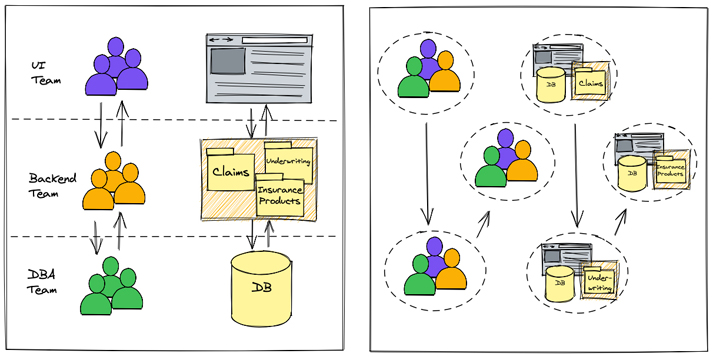
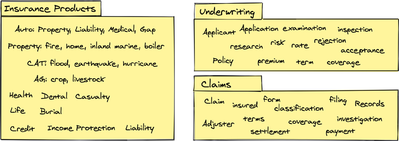
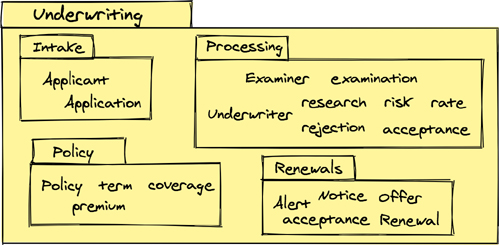
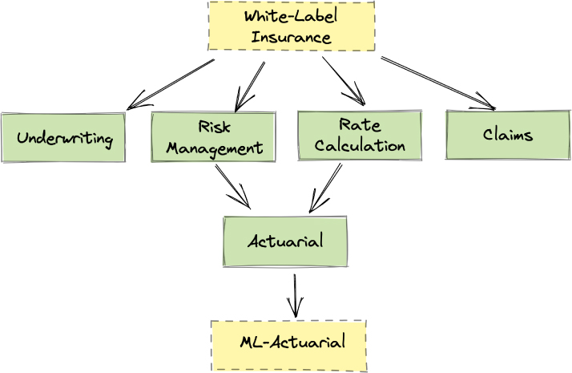
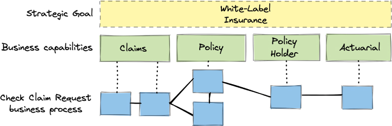
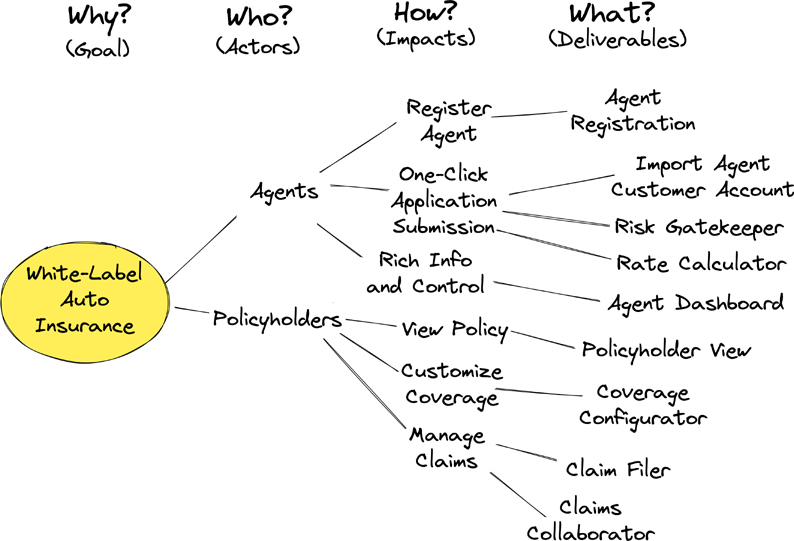
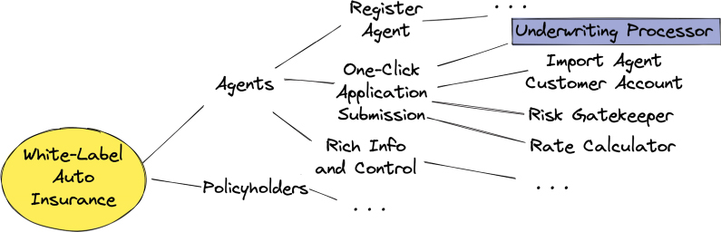
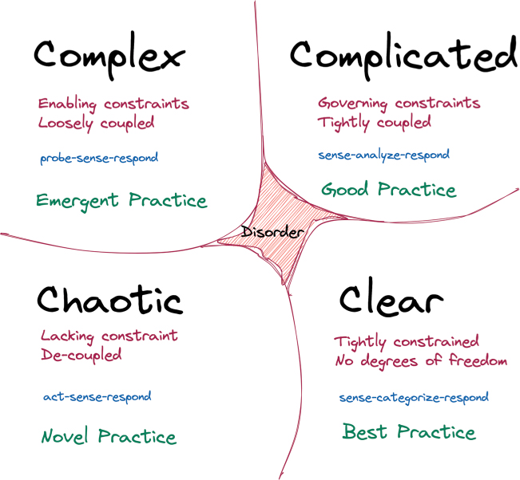

# 基本战略学习工具

战略是业务创造的什么方面，导致有意独特并产生利润来源组合的新举措。它询问，我们的企业必须做什么才能将其与其他企业区分开来，或者扩展和增加其独特性？这使得战略规划成为实现创新的一种手段，但在识别有价值的差异化战略方面实际上必须有创新。

> 所以你不能出去问人们，你知道，下一件大事是什么。亨利福特有一句很棒的话，对吧？他说，“如果我问我的顾客他们想要什么，他们会告诉我‘一匹更快的马’。”
> ——史蒂夫·乔布斯

这并不意味着询问客户他们认为下一件大事是徒劳的。实际上，“更快的马”可以很好地暗示“更快的旅行”是关键。与客户和一般公众交谈很重要。尽管如此，企业还是应该有能力敏锐地了解企业的哪些部分。这是成功的必要条件。它必须被追捧，而挖掘和发现是通过学习进行的。请注意乔布斯引述的前面部分，谈到了苹果自己在 iPod 方面的内部人才。

> 我们做 iTunes 是因为我们都喜欢音乐。我们制作了我们认为是 iTunes 中最好的点唱机。然后我们都想随身携带我们的整个音乐库。团队真的很努力。他们工作如此努力的原因是因为我们都想要一个。你懂？我的意思是，最初的几百个客户是我们。
> 这不是关于流行文化，也不是关于愚弄人们，也不是关于说服人们他们想要他们不想要的东西。我们弄清楚我们想要什么。而且我认为我们非常擅长拥有正确的纪律来思考是否有很多其他人也会想要它。这就是我们得到报酬去做的事情。
> ——史蒂夫·乔布斯

要学好，拥有良好的工具来挖掘以从人和事实中挖掘知识肯定会有所帮助。本章提供战略发现工具并演示如何使用它们。一些最好的工具更注重内部而不是外部。

## 早晚做出决定，正确与错误
如果你不学习如何在及时做出正确与错误的决定中茁壮成长，那么你的决定可能会陷入瘫痪。两者都可以发挥我们的优势。不要害怕做决定。了解何时应该做出决定。有些决定最好尽早做出；其他的最好越晚越好。有些决定是正确的；有些会出错。获得毅力并掌握必要的技巧来庆祝艰难的决定，无论是对还是错。
#agile 的一个共同原则是所有的决定都应该在最后一个负责任的时刻做出 [Cohn]。在任何给定时间，我们如何知道我们何时到达了“最后一个负责任的时刻”决策点？ Mary 和 Tom Poppendieck 提供了建议：

> 并发软件开发意味着在只知道部分需求时开始开发，并在短迭代中进行开发，以提供导致系统出现的反馈。并发开发可以将承诺推迟到最后一个负责任的时刻，即未能做出决定消除了一个重要选择的时刻。如果承诺延迟到最后一个负责任的时刻之后，那么默认情况下会做出决定，这通常不是做出决定的好方法。 [流行音乐]

更简洁地说，可以说不应该不负责任地做出决定，无论是早做还是晚做[LeanArch]。当没有足够的洞察力来支持任何给定的决定时，就会发生不负责任的决策，这很可能是过早做出决定的时候。然而，如果当前有足够的信息来支持决策，则有可能获得必要的洞察力。如果信息可用但未经审查，接下来的步骤应该是显而易见的。
随着时间的推移，避免做出必要的决定甚至比做出错误的决定更糟糕。有上进心的员工不会坐等事情发生。早期，编写一些初始代码或定义通用建模抽象是常见的行为，并且通常至少涉及一些坚持不同方向的开发人员。这些武断的行为导致了承诺，但将团队排除在决策过程之外。该模式为应用程序或可以持续整个软件生命周期的底层架构设置了明确的结构。
问问自己，基于未经证实的假设致力于不受控制的结构、形式和抽象是否真的可取？显然，最好有意识地决定应用程序架构应该采取的方向。即便如此，团队还是有可能因为害怕创建错误的架构而拖着集体的脚步。
如果团队有足够的信息可以开始，就可以做出决定。这可能涉及几个从业者提供不同的观点，但踢罐头不能无限期地继续下去。此外，如果我们做出一些糟糕的决定，它们不一定是一成不变的。假设一个团队可以诚实地接受错误决定的负面影响，并且不允许他们不加处理，他们将尽快采取纠正措施。尽早重构架构结构并不是一个大的时间槽。后来，这个成本增加了。修正课程是学习的一部分，学习应该带来改变。
然而，如果我们在做出错误决定之前等待很长时间才开始构建应用程序，会有什么收获？延迟是否会产生与采取纠正措施时做出的决定相同的决定？或者正在经历错误决定的不良影响导致更好的决定？经验表明，后者往往占上风。这就是我们记录债务并尽快偿还的原因。这实际上是在最后负责任的时刻做出成熟的决策。
这又回到了态度：不要被决策或做出被证明是错误的决定而麻痹。作为一名计算机科学家 - 一个有目的的软件开发人员 - 几乎所做的一切都可以被视为实验。我们相信，一些实验只是证实了我们的假设是正确的。还进行了其他实验，以确定我们认为是否经得起考验。
最后，早早做出一些决定是不负责任的。例如，预先确定架构，例如使用微服务，或尝试创建通用解决方案和建模抽象，都是错误的。这些决定应该推迟到我们证明这些选择是合理和必要的。
专家和业余爱好者之间的差异与时机有很大关系。
在他的文章“延迟承诺”（IEEE 软件，1988 年 5 月/6 月）中，英国著名计算机科学家兼教授 Harold Thimbleby 观察到业余爱好者和专家之间的区别在于专家知道如何尽可能长时间地推迟承诺和隐藏他们的错误，在它们引起问题之前修复缺陷。业余爱好者试图在第一时间把所有事情都做好，因此他们解决问题的能力超负荷，最终导致他们过早地做出错误的决定 [DrDobbs]。
Thimbleby 没有说的是，专家不断地记录债务并支付它，即使这是在他们孤立的想法中非正式地完成的。
决策的结果是它触发的学习过程。决策导致行动，从而导致新的需求和知识的出现。同时，在解决核心应用挑战方面也取得了进展。不要忽视决策的这一方面，因为最终它归结为学习和知识获取。如第 1 章“业务目标和数字化转型”所述，知识是任何企业中最重要的资产。知识改变一切。
我们的不确定性仍然存在以其他方式影响我们的风险。认知偏见经常导致人们做出不负责任的决定。我们也可能会陷入谬误，例如害怕错过等 [LogFal]。考虑在不负责任地选择微服务的背景下的一些影响：

- 诉诸权威。诉诸权威是源于一个被判断为权威的人的论证，并肯定了一个主张，即该主张是真实的。例如，如果被公认为专家的人声称微服务是好的而单体应用是坏的，那么听众可能会做出有害且不适合他们自己上下文的决定。
- 呼吁新颖。对新颖性的诉求假设一个想法的新颖性是其真实性的证据。如果微服务是最新时尚，那么采用是必须的。
- 跟风谬误。类似于害怕错过。当争论诉诸于一个想法的日益流行作为接受它为真的理由时，就会出现随波逐流谬误。人们仅仅将一个想法突然吸引追随者这一事实作为加入潮流并自己成为该想法追随者的理由。微服务越来越受欢迎，因此我们也必须非常迅速地采用它们。

有可用的工具可以帮助对抗各种谬论和确认偏见。其中之一是使用批判性思维。

> 批判性思维是一种思维模式，要求人们进行反思，并注意指导他们的信念和行动的决策。批判性思维使人们能够以更多的逻辑进行推理，处理复杂的信息并查看问题的各个方面，从而得出更可靠的结论。 [CT]

软件开发涉及大量决策，无论特定决策是否具有重大影响。在整个软件生命周期中，跟踪所采用的道路和未采用的道路很少是直截了当的。对于项目新人来说尤其如此。然而，长期的团队成员甚至很难回忆起过去的每一个决定。也许特定的团队成员没有直接参与特定的决策。更常见的是，一个团队做出的决定的数量之多，再加上这些决定的记忆并未因频繁穿越海马体而得到加强，阻碍了即时回忆。在这种情况下，团队通常只知道决策的结果，而无法追踪决策的原因。
尽管通常被忽视或完全没有考虑，决策跟踪应该是软件开发中最重要的活动之一。架构决策记录（ADR）等工具帮助团队维护决策日志，这对于跟踪团队的决策旅程非常有帮助，包括发生了什么以及为什么。 ADR 有助于将决策的初始主题与该决策的预期和最终结果联系起来。本章后面的“战略架构”部分更详细地描述了 ADR 和其他技术。
存在丰富的软件开发技术，可以帮助团队推迟具有约束力的长期决策并跟踪在软件开发项目的生命周期中做出的决策。这些将在本书后面进行描述。其中一种工具是端口和适配器架构，在第 8 章“基础架构”中进行了讨论。此外，本章稍后将介绍的诸如 Cynefin 之类的认知框架可用于辅助决策。

## 文化和团队
创建使用实验和学习的#agile 文化要求人们因错误而得到奖励，只要这个过程最终导致正确，无论“正确”最终是什么。想要在数字化转型中取得成功的企业必须将其文化从软件作为支持的角度转变为软件作为产品的观点。文化很重要，团队的组建和支持方式也很重要。

> 工程模型与承包商模型
>
> 这是介绍使用工程模型方法进行软件开发而不是承包商模型的想法的好地方。首先考虑典型的承包商模型。在这种模式下，无论是员工使用还是实际承包商使用，开发人员都必须被赋予准确的工作任务，并且他们不能以任何小的方式失败。工程模型使用基于假设的实验来探索多种选择，以努力学习和改进。
> SpaceX 和特斯拉使用工程模型。相比之下，绝大多数软件项目在承包商模式内运行。在这两种方法之间的对峙中，这导致整个软件行业的人均创新是最明显的。
> “SpaceX 实现了他们的关键目标——大幅降低将有效载荷发射到太空的成本，并在大大缩短的时间内回收和再利用助推火箭。如何？ SpaceX 没有做的是与政府签订合同，这是近年来太空探索的唯一资助机制。相反，他们愿意用火箭来实现他们的目标。集成事件的策略（在这种情况下，测试助推器启动）是多个工程团队如何快速试用他们最新版本的组件与所有其他团队开发的组件。政府绝不会容忍 SpaceX 遭受的坠机事故，这意味着政府承包商别无选择，只能在第一时间做出纠正。然而，SpaceX 仅仅通过尝试去发现未知的未知数，而不是试图通过令人痛苦的细节来思考所有事情，从而将可靠、廉价的助推火箭的开发速度提高了 5 倍。这是一种经典的工程方法，但通常不允许在承包商模型中使用。 SpaceX 工程团队发现，为了发现问题而发生坠机事故比“永远”等待直到没有风险要便宜得多”[Mary Poppendieck]。

企业文化包含有助于其独特的物理、社会和心理环境的价值观和行为。文化影响团队互动的方式、创造知识的背景、他们对某些变化的接受或抵制，以及最终他们分享或保留知识的方式。文化代表组织成员的集体价值观、信仰和原则[Org-Culture]。
组织应该为被认为是健康的文化而努力。目的是获得文化利益，例如更好地与实现组织的愿景、使命和目标保持一致。其他好处包括提高公司各个部门和部门之间的团队凝聚力、更高的员工积极性和更高的效率。
文化不是一成不变的。它可以根据领导和员工的行为得到改善或破坏。如果文化目前不健康，则需要对其进行改变以产生良好的健康益处。
在尝试建立其他任何事物之前，应该开始建立健康的组织文化。没有充分考虑健康文化方面的企业可能会失去劳动力，从而失去知识库的一部分。从长远来看，这种失败还会破坏生产力和创新，从而导致企业变得不那么成功。
专注于促进创新的文化受到领导者和员工的重视。尽管领导者声称了解建立创新文化需要什么，但创建和维持它是困难的。显然，构建创新文化的一个障碍是不了解这种文化是什么以及如何培养它。

### 失败并不致命

一个组织对失败的看法是最重要的文化因素之一，无论是好是坏。为什么这么多团队害怕失败？对失败的恐惧决定了团队成员做出决定或完全避免做出决定的方式。更准确地说，害怕做出错误的决定，然后导致失败，这往往是决定永远推迟或从未做出的原因。
回想本章前面的内容，工程模型通过允许失败来胜过承包商模型，以便组织可以学习。失败不是目的。相反，重点是挑战假设，以至于某些失败是不可避免的。所有的实验失败都是达到目的的一种手段，去了解什么是有效的。有人说，如果一个团队根本没有失败，他们就不是在探索。相反，团队正在根据他们已经知道的最佳情况做出决定，这很可能很平常。
对失败的恐惧比失败本身更糟糕吗？哪个更糟，失败还是从不尝试？莱特兄弟于 1899 年开始进行航空研究和实验，但在他们最初的努力之后多次失败。据说，他们的成功很大程度上要归功于之前其他人的许多失败。大多数人只记得 1903 年他们第一次成功的动力飞机飞行。事实上，这应该是这样的——庆祝到达和选择的路线。
建立#agile、容忍失败的文化，培养实验意愿并为人们提供心理安全，只会增加业务成功和竞争优势。然而，它必须通过一些严格的行为来抵消。虽然组织的文化应该容忍失败，但它应该不能容忍无能和自满 [Pisano]。这种态度在软件开发中尤为重要，因为它充满了不确定性。大量的 Big Ball of Mud（参见第 1 章，“业务目标和数字化转型”）系统，以及这些已成为世界规范的事实，证明在某些成功过程中失败是很常见的。然而，这个问题最终会反复出现，从而导致战略消亡。

1. 从一开始就创建一个大泥球在软件开发原则方面是失败的（这并不意味着它是故意的）。
2. 大泥球系统实际上在其有用的范围内发挥作用这一事实是业务的初步成功。
3. 如果不努力改变 1 的长期影响，那么 Big Ball of Mud 系统代码库只会变得更糟，以后会产生更大的影响。
4. 大泥球系统响应变化的能力下降到惯性点，最终导致无法满足企业的长期需求。

失败可以带来有趣的学习机会。重要的经验教训也可能是糟糕的模型设计、脆弱的代码、有缺陷的架构、有缺陷的分析和普遍的无能的结果。在第 3 点之前，当然在第 4 点之前，认识到这些情况是至关重要的。
因此，必须区分积极和消极的失败。积极的失败会产生信息和知识，而消极的失败可能代价高昂且对企业有害。只有面对最终导致成功的有形学习成果和知识，才能实现失败的回报。莱特兄弟失败了很多次，但他们也最终在飞行中取得了成功。

### 失败文化不是责备文化

失败和责备文化之间的关系通常不是很清楚。责备文化是消极的，因为它基于对失败的惩罚，无论这些失败最终会导致积极还是消极的结果。在责备文化中，学习成果不被庆祝，并且通常不被视为对最终成功的真正关键。相反，它们被丢弃。
责备文化也阻碍了实验中的任何举措。结果是事情继续以相同的、行人的、普通的方式完成。每个人都害怕尝试新事物，因为如果他们失败了，就会受到指责。在具有责备文化的组织中，成功充其量被忽略了，就好像没有失败的可能性一样，失败是要受到惩罚的。没有人愿意冒险。这闻起来像承包商模型。
因此，企业没有创新，而是试图通过运营效率来增加利润。一些最流行的方法是使用合并和收购。这些导致了大量的人员整合，这确实会带来更大的利润。这条路线通常不会将业务创新作为一种有利可图的追求。相反，运营效率被视为继续向股东提供有利年度报告的最简单方法。这种策略虽然可以一时奏效，但不能产生无穷的收益。事实上，这只是收益递减的不同途径。如果没有另一次合并或收购，利润就会趋向于零。

> 生与死的决定：COVID-19 疫苗和采矿救援
>
> 疫情期间，美国政府资助了众多疫苗研发项目。有些失败了。有些人成功了。政府知道有些人会失败，但它愿意冒这个风险，期待有些人会成功。
> 智利的矿难和随后的救援是另一个试验的例子。此次行动由可能是该国顶级采矿工程师领导，他同时尝试了 4 或 5 种方法以营救矿工。有些失败了；其他人没有像成功的那样迅速和及时地到达矿工。重要的是挽救了生命。
> 当挑战事关生死时，使用多个选项始终是正确的工程方法。即使情况并非如此，探索多种选择通常是解决棘手问题的最快、最有效的方法。 [玛丽·波彭迪克]

至少可以说，专注于运营效率的企业是指责文化的温床。这种有缺陷的文化使用（被动）积极的管理、团队内部的微观管理、对团队工作的侵入性时间跟踪，并迫使团队成员加班以赶上最后期限。当绩效受到如此严格的审查，以至于避免看起来很糟糕的唯一方法是让别人看起来很糟糕时，责备扮演着重要的角色。
实验不一定比缺乏实验更昂贵。通过知识共享实现有效学习的交流也是如此。从康威定律的角度考虑两者。

### 正确使用康威定律
正如第 1 章“业务目标和数字化转型”所述，我们无法在康威定律中“变得更好”，就像我们无法在万有引力定律中“变得更好”一样。法律是不可避免的。由于地球尺度上的重力，在正常环境中没有变化。如果你站在法国或美国的某个地方，重力是一样的。然而，在宇宙尺度上，引力是不一样的。根据一个人是在地球上还是在月球上，他们不会以相同的方式体验重力。这也适用于康威定律。 ^1^

> 1 在我们体验月球上的软件开发之前，我们只会说明不同的条件可以改变康威定律对地球团队的影响。

每个组织都有不同的康威定律，因为每个组织的结构和组织都不同。进行组织变革将减少或加强康威定律的影响。正如团队拓扑 [TT] 中所强调的那样，如果所需的理论系统架构不适合组织模型，那么两者之一将需要改变。
然而，认为任何重组都应该仅用于技术架构目的是错误的。技术架构是业务战略架构的支持需求。单个团队组织必须促进业务专家和软件开发专家之间必要的上下文对话。 “领域专家参与对于架构，就像最终用户参与对于功能开发一样。你应该会发现最终用户和领域专家是你在精益和敏捷项目中最宝贵的联系人”[LA]。

> 2015 年，ThoughtWorks 的人创造了“逆康威机动”的组织模式。当微服务变得非常流行时，它被编纂。该模式建议根据所需的架构结构组织团队，而不是期望现有团队与架构目标相匹配。通过重新配置团队以实现最佳的团队间沟通，由于优化的沟通结构，更可能获得所需的架构。 [TW-ICM]

Mel Conway 的原始论文在结论中解决了这种非常“机动”的问题。此处列出了该论文的相关引述以供参考：

> “我们找到了一个设计组织结构的标准：设计工作应该根据沟通的需要来组织。”

> “组织的灵活性对于有效设计很重要。”

> “奖励保持组织精简和灵活的设计经理。”

康威因具有洞察力来编纂他很久以前在 1967 年观察到（并于 1968 年发表）的法律解决方案而值得称赞。
问题仍然存在，如何有效地组织团队以改善团队之间的沟通？我们在这里列出了一些机会：

- 保持团队团结。据布鲁斯·塔克曼 [Tuckman] 所说，团队在进入表演阶段之前，必须经历形成和规范的步骤。团队成员需要时间来找到有效地相互合作的方法。许多交流是非正式的，是习惯问题。团队建立了一种隐性知识，使他们能够执行^2^——但这需要时间。

    > 2 当一个团队在项目模式下工作并且项目被认为已经完成时，团队往往会解散，软件交给维护团队。前球队的默会知识无法在过渡中幸存下来。

- 限制团队规模。你应该建立尽可能小的团队，但不能更小，以处理给定的软件领域解决方案。随着团队的成长，大团队内部的协调和沟通成本逐渐变差。此外，团队规模因素不仅取决于第一康威定律（“沟通决定设计”）；也就是说，通信路径也可以通过应用 Fred Brooks 的互通公式来估计：n(n – 1) / 2 [Brooks]。组成团队的人越多，沟通就越差。会有太多的通信路径。例如，10 人将有 45 条通信路径，3 50 人将有 1,225 条路径。 5 到 10 人的团队被认为是最佳的。

> 10 * (10 – 1) / 2 = 45。

- 建立独立的团队。相互依赖的团队之间的有效协调需要大量的时间和精力。最小化代码依赖性、发布协调和部署可以对交付时间和质量产生积极影响。
- 围绕业务能力组织团队。软件开发是一个非常复杂的过程，需要多种技能。因此，鼓励团队内部技能的多样性。如果团队由具有不同技能的人组成，例如业务专家、软件架构师、开发人员、测试人员、DevOps，甚至是最终用户，他们都可以胜任这项任务。这样的一系列技能不仅为决策和问责提供了自主权，而且根据康威定律，还可以建立更健康的结构（不专注于孤立的技能）。使用这种方法，就不需要在团队外部进行大量沟通来执行日常职责。
- 为团队定义通信网关。拥有广泛技能和重要自主权的团队可以优化团队内的沟通，但仍必须通过网关塑造团队间的沟通。结果可能是与架构组件之间的通信类似的形状。考虑团队间讨论需要协议，以及团队之间的映射和转换。协议应建立界限以防止干扰团队目标、分心，甚至可能未经授权的交流。这些应该反映与集成软件架构的一对一关系。上下文映射的主题在第 6 章“映射、失败和成功——选择两个”中讨论。
- 将单一职责分配给团队。要求一个团队在同一架构中管理过多的任务和上下文，或者更糟的是，并行分配多个项目，结果不会很好。除非避免这些错误，否则沟通的复杂性将增加和重叠，存在将上下文概念混合在一起和混淆的风险。然而，单一职责并不一定意味着单一上下文，因为团队可能会决定解决单个问题空间可能需要多个上下文。
- 从团队中消除多任务处理。尽管与康威定律没有直接关系，但人脑并不能非常有效地进行多任务处理，尤其是在解决复杂问题的情况下。多任务需要上下文切换。人类在这方面做得不好，因为我们需要依赖于上下文的记忆。每个上下文切换可能需要几分钟甚至几十分钟才能完成。多任务处理不仅仅是生产力杀手——它还破坏了有效的沟通渠道。多任务处理对人类有用的误解可以通过观察尝试它的人产生的大量错误来纠正，例如完全忽略对任何给予应有关注的人来说都是基本的步骤。令人惊讶的是，在这种情况下，低于平均水平的非常聪明的人会变得如此聪明。

图 2.1 描绘了不同的团队组织，产生了与各自团队组织相匹配的不同架构结构。在左侧，团队是技能孤岛。通常，处于沟通十字路口的团队（图 2.1 中的支持团队）承担着其他人（DBA 团队和 UI 团队）之间的沟通和协调的所有责任。使团队效率更低的原因是他们在多种业务环境中工作——这里是索赔、承保和保险产品——这是需要考虑的额外复杂性来源。相互依赖和高度协调的通信使向业务交付的价值变得复杂。



图 2.1 康威定律。左：技能孤岛。右：跨职能技能、业务能力。

在图 2.1 的右侧，团队是跨职能的，并与业务能力保持一致。请注意，这些团队是自治的，并对他们拥有的子系统架构的整个生命周期负责。他们的日常职责不仅仅是软件开发；该团队还深入了解他们开发的软件在生产中的表现。这有助于更好地与最终用户联系，因为团队成员必须在支持工作中协助他们。这是一种良性循环，因为来自客户和用户的新洞察帮助团队提升他们所负责的业务能力。
不容忽视的一点是创建团队的重要性，主要是为了业务专家和软件开发专家之间的团队内上下文交流。如果一个团队可以轻松与其他团队交流，但不能与业务专家进行深入沟通以支持构建自己的战略交付物，那么根本的沟通问题还没有解决，甚至可能比重组前更糟.

### 启用安全实验
承认责备和失败文化之间的差异是建立更好和健康文化的第一步。下一步是为企业提供安全的实验——这并不意味着组织只是允许其团队随机选择架构或技术。
安全的实验意味着纪律，而纪律意味着仔细选择可能产生巨大学习成果和知识的想法。对“安全”有不同的解释，但正如 Erik Hollnagel 所说，“安全是一种免于不可接受风险的自由”[Hollnagel]。换句话说，这个过程必须允许防止不希望的事件和防止不希望的结果。
在进行安全试验的同时，对学习过程进行评估，并检查收集到的信息，这使组织能够决定是否应该推进或取消试验。重要的是通过减少故障来提高安全性，从而降低业务风险。杀死一个安全的实验比盲目尝试新事物并称之为实验的风险要小；否则，一切都可以称为实验。

## 模块优先
那么，我们将从“基本的战略学习工具”（包括对成功所必需的失败文化的讨论）直接转变为“模块”的一些技术主题？首先，这个话题真的不是很有技术性。每个人都知道，各种容器都是用来盛放物品的（例如，厨房抽屉和用于在冰箱中储存食物的抽屉）。容器的标签方式以及每个容器中的内容应该合乎逻辑。否则，当需要从容器中检索所需项目时，将很难找到它们。对于软件开发，团队必须在尝试做其他事情之前正确地做到这一点。第 1 章中不是对康威定律做出了同样的断言吗？对，就是这样。

> 康威定律继续[康威]：
> 为什么大型系统会解体？这个过程似乎发生在三个步骤中，前两个是可控的，第三个是我们同态的直接结果。
> 首先，最初的设计者意识到系统会很大，再加上他们组织中的某些压力，因此无法抗拒将太多人分配给设计工作的诱惑。
> 其次，将传统的管理智慧应用于大型设计组织会导致其沟通结构瓦解。
> 第三，同态确保系统的结构将反映设计组织中发生的解体。

认为模块只是一个“技术主题”是卖空支持战略学习的最有价值的工具之一。
模块化也是人类如何处理必须解决的非常复杂问题的解决方案。没有人能够牢记整个业务问题空间并有效地处理它。在解决一个大问题之前，人类倾向于将他们所知道的分解成更小的问题集。较小的问题更容易推理。当然，然后将小问题的解决方案结合起来解决大问题；否则，模块化将毫无用处。
这种解决问题的方式深深植根于心理学，反映了人类思维的局限性。人脑一次只能关注一组非常有限的概念。这在 George A. Miller 1956 年的论文中有所描述，“神奇的数字 7，正负二：我们处理信息的能力的一些限制”[米勒]。米勒定律说，人类可以在短期记忆中保留 7 ± 2 个“块”或信息片段。确切的数字可能因人而异，但可以肯定的是，这种能力非常有限。由于这个限制，人类将信息分层分解成更小的块，直到它们的大小适合我们的心理模型，而不会对认知负荷造成压力，这会阻止信息的处理。
现在，回到模块的角度。将这些组件应用于解决复杂问题有助于管理经过分解过程的信息块。这使得解决复杂的问题成为可能，因为人类可以使用逐步处理来创造成功的结果。
模块化也是康威定律不可或缺的基础。那是因为模块是我们应该捕获关键通信以及从中学到的东西的地方。同时，模块可以使团队免于在他们的解决方案空间中涂抹泥土。模块既用作概念边界又用作物理隔间。
别担心。一会一切都会变得有意义。考虑模块如何通过交流支持学习。
图 2.2 显示了三个模块：保险产品、承保和索赔。这三个中的每一个都是独立业务能力的所在地。



图 2.2 模块既是概念边界又是物理隔间。

一个团队由业务和软件开发利益相关者组成。就本示例而言，假设一个团队仅负责三种业务功能中的一种。此处将讨论的团队负责为承保提供解决方案。
对于这个团队，承保被视为他们对话的主要背景。然而，为了提供承保解决方案，团队可能还需要讨论保险产品和索赔，甚至其他业务能力。然而，他们在其他对话环境中没有责任或权力。
因为他们的对话将在整个业务领域中采用不同的路径，所以团队成员必须认识到他们的讨论何时“退出”他们自己的上下文，“进入”另一个上下文，可能还有其他上下文，然后“返回”到他们自己的上下文。在对话中，如果团队学到了一些与他们自己的上下文相关的东西，他们应该在他们的上下文模块中记录一些他们认为是保持者的词或表达——也就是说，那些肯定有助于推动他们进一步讨论和最终解决方案的词或表达。
概念模块没有位置，那么字面上记录的对话在哪里？目前，这可以在白板、维基或其他类型的文档中。当然，不从擦除的白板上丢失这些信息的问题应该会影响如何更永久地捕获它。
如果这有助于他们的沟通，团队还可以记录他们对话中适用于另一个模块的任何部分，但团队无权对其他上下文做出坚定、持久的决定。事实上，如果团队需要有关其他上下文的任何官方详细信息，他们将不得不与各自的团队进行沟通。因此，他们为外国语境提出的任何术语或表达方式都只是代表其他团队负责的真实事物。此外，无论是代理还是官方，为其他上下文记录的术语和表达都放在各自的上下文模块中，而不是在团队的模块中。
随着团队对话的进展，它们会带来更多的学习，并且团队会继续识别其他业务概念。图 2.3 反映了进展，包括在主承保模块内创建附加模块有助于进一步组织他们的对话，因为它们变得更加具体。



图 2.3 用于组织源代码的其他模块隔间的模块隔间。

一个公平的问题是，将内部模块——Intake、Processing、Policy 和 Renewals——提升为它们自己的顶级模块是否有意义？这是一种可以及时考虑的可能性，这样做是有好处的。但具体在哪里？在这个时候，团队应该回到之前的建议，实质上是“团队还没有足够的信息来接受这个决定。”现在去那里是不负责任的。未来的对话可能会朝着这个方向发展，但现在就得出这个结论是没有意义的。此时，将其称为基于当前确定的概念的（非）决策，以及团队对每个概念相对于其他概念的凝聚力的理解，使它们不太可能分离。
这很酷。这就像团队试图在他们自己的概念边界内保持一切整洁。但他们不仅仅是在尝试——他们正在成功。这是朝着避免大泥球的正确方向迈出的重要一步。考虑到良好的沟通和决策是软件开发背后的主要优势，团队肯定走在正确的轨道上。
在软件实施中反映这些措施也很重要。团队必须防止他们对话式设计中的顺序反映到软件模型中，以免随着时间的推移而受到破坏。这导致了模块的第二次使用：模块也是一个物理隔间。团队应该创建一个物理模块来放置他们的源代码。使用图 2.3 中的示例，表 2.1 列出了相应软件模块的示例。
表 2.1 承保模块为实施提供了明确的隔间

| 模块名称                                 | 描述               |
| ---------------------------------------- | ------------------ |
| NuCoverage.Underwriting                  | 承保根模块         |
| NuCoverage.Underwriting.Model            | 保存承保模型的模块 |
| NuCoverage.Underwriting.Model.Intake     | 进气模型模块       |
| NuCoverage.Underwriting.Model.Policy     | 策略模型模块       |
| NuCoverage.Underwriting.Model.Processing | 加工模型模块       |
| NuCoverage.Underwriting.Model.Renewals   | 更新模型模块       |

根据所使用的实际编程语言，这些模块的声明方式可能会有所不同，但现在这并不重要。重要的是团队可以创建具有非常明确名称的隔间，以清楚地标识事物所属的位置。考虑到他们的基本感受力，在这个时间点上不可能存在混乱或无序。
这种方法的另一个优点是，如果团队在未来的任何时候决定将任何模型提升为自己的顶级模块，那么对现有模块的重构非常简单。考虑到这一点，很明显模块化每次都胜过下意识的部署决策。

## 最后部署

首先选择微服务是危险的。长期选择 Monoliths 也是危险的。与#agile 中的任何决策一样，这些决策应该在最后负责任的时刻做出。以下是敏捷宣言中的两个原则：

- 我们的首要任务是通过早期和持续交付有价值的软件来满足客户。
- 频繁地交付工作软件，间隔从几周到几个月不等，并且倾向于较短的时间范围。

今天，“偏爱较短的时间尺度”可能意味着几天、几小时甚至几分钟。总而言之，这意味着提前交付并经常交付。
在这种情况下，部署决策如何才能尽可能延迟？考虑类型而不是开始和频率。部署类型是一种选择，有多种部署选项可供选择。选择可以改变。无论部署选择如何，交付开始和持续频率都是强制性的。 ^4^

> 4 第 9 章，“消息和事件驱动的架构”，介绍了无服务器架构的不同之处，其中可能包括功能即服务 (FaaS)。

在早期，最好选择支持快速实验、实施和交付的部署选项。这特别指出在早期阶段使用单体架构，因为在理解业务问题之前尝试解决分布式计算问题是徒劳的。
为了公开这一点，许多软件开发人员喜欢分布式计算背后的想法。考虑前景很酷，甚至令人兴奋。对于那些从未尝试过或经验不足的人来说，尽快深入分布式计算是一件令人兴奋的事情。
这有点像任何新事物，例如驾驶。当你年轻时，开车的机会通常是备受期待的冒险。在驾驶挑战不再新鲜之后，快速驾驶可能是一种新的刺激。在高成本的超速罚单或严重事故（加上高成本的罚单！）削弱了在公共道路上高速驾驶的吸引力后，人们意识到驾驶在很大程度上是达到目的的一种手段。尽管如此，获得一辆令人难以置信的跑车并进入赛道的想法引发了新的激动人心的想法。即便如此，从一个点到另一个点安全旅行的吸引力还是很难否认。尤其是当你有一个家庭时，这是最重要的。
那些做过分布式计算的人发现它具有挑战性，并且让它运行良好是一种不可否认的乐趣。同时，分布式计算并不是一项惊险刺激的运动。这很难。任何能够既现实又负责任的有经验的软件开发人员都会承认分布式计算是达到目的的一种手段。应该是业务驱动因素导致考虑任何能够产生良好客户成果的计算基础设施。
如果将软件交付到云是产生业务驱动的客户满意度的一种手段，那么很可能至少需要一些分布式计算。尽管如此，找到减少计算资源总分布或尽可能降低复杂性的方法应该是重中之重。如果对此仍有疑问，请返回第 1 章并重新阅读“数字化转型：目标是什么？”一节。
我们不提倡使用单体应用而不是微服务。我们提倡针对业务环境做出最佳决策。避免分布式计算固有的问题——涉及网络连接的子系统间软件通信——最好地支持早期交付和持续交付。早期，没有必要面对规模和性能挑战，因为它们根本不存在。
当企业在最后一个负责任的时刻决定开放对系统的更大访问权时，团队必须准备好衡量系统如何处理不断增加的负载。当性能和规模指标趋向于解决这些问题时，将一个或多个模块从单体中提取到微服务中可能是一种合理的前进方式。诚然，这需要一种使用架构和设计技术的开发风格，以反映微服务的松散耦合，但在单体应用中无缝工作，并且没有分布式计算常见的故障条件。
当团队首先决定模块，并且当部署选项开始时尽可能简单，这种方法使他们能够在最负责任的时间根据经验信息做出决策。

## 两者之间的一切
在模块之后，但在高级部署决策之前，还有大量工作要做。工作涉及以下任务：

- 确定哪些业务功能将托管在系统的给定部分
- 确定有影响力的战略功能
- 了解软件开发的复杂性和风险
- 协作以了解整体业务流程
- 推理出用于证明所有这些工作正确的断言。

以下各节涵盖了这些任务中的前三项。第 3 章“事件优先实验和发现”，涵盖了围绕业务流程的协作学习，以及对软件正确性断言的推理。

### 业务能力、业务流程和战略目标

业务能力是为产生收入而存在的业务功能。有些功能是核心业务能力，有些则不是。核心业务能力是企业必须在其中脱颖而出并脱颖而出的能力。企业必须在其核心能力方面进行创新。支持性业务能力是使一项或多项核心能力发挥作用所需的能力，但不是业务应尝试创新的能力。然而，现成的购买可能无法获得支持能力，在这种情况下，它可能必须被构建。还有通用的业务能力，例如那些保持业务正常运行但不直接支持业务核心能力的能力。应尽可能购买（许可、订阅等）这些通用业务功能。
请注意，业务能力是业务的内容，而不是方式。考虑承保是一项 NuCoverage 业务能力。公司如何执行此功能可以由人工使用蜗牛邮件和电话来完成，也可以通过完全自动化的数字工作流处理来完成。 what 和 how 是两个不同的东西。如何成为实现细节很重要，但随着时间的推移可能会发生变化。即便如此，在可预见的未来，什么——承保——很可能会存在。
NuCoverage 必须进行创新，以具有竞争力的折扣提供保险产品，并且仍能带来至少与竞争对手实现的收益一样好的收益。此外，NuCoverage 现在将通过提供带有白标的保险产品来进行创新。这些显然是直接的收入来源。然而，哪些是核心业务能力，哪些是支持业务能力？考虑图 2.4 中说明并在下面的列表中描述的推理。

- 承保是一种能力，可以就给定的可保风险是否值得签发保单或是否必须拒绝保单做出决定。业务能力是通过数字化工作流处理来实现的，但工作流处理是如何完成的并不是业务能力。
- 因为承保不是凭空发生的，所以假设需要某种形式的风险管理来区分什么是好的商业投资，什么是对企业不利的。在保险业中，这种风险管理以精算问题为中心，并且复杂到足以保持科学的地位。当前的精算业务能力基于行业数据和经验，但未来将通过更大的数据集和快速机器学习 (ML) 算法得到增强，这些算法可以确定好的风险与坏的风险。未来的算法将是实现，而不是业务能力。
- 每家保险公司都必须处理针对保单提出的索赔，NuCoverage 也不例外。公平损失追偿是保险公司与被保险人达成的交易。对于数字化优先的保险公司来说，深入了解投保人的损失和适用的承保范围是核心业务能力。这是一个既不为重置价值支付过多费用的问题，又不因不公平的和解而使声誉受损。索赔将如何运作？这是一个必须回答的问题，但如何与业务能力不同。
- NuCoverage 发展到使用企业资源规划 (ERP) 系统有助于提高业务运营效率的地步，这绝不是不重要的。运营效率应尽可能使 NuCoverage 受益。然而，如前所述，仅靠运营效率的繁荣并不是一种可持续的商业模式。因为 ERP 不是创收的核心，它在业务的核心能力方面是通用的。不是为了过分简化问题，而是为了突出核心功能和其他功能之间的区别，选择 ERP 本质上是在多个产品之间进行选择，这些产品在功能和优势列表中选中了所有相同的框。
- NuCoverage 现在正处于进入白标保险平台市场的风口浪尖。虽然它可能被认为只是对不同技术集的改变，但它更像是一种思维方式的调整。 NuCoverage 必须转变为软件即产品模式，而不是将软件视为支持。启动并运行它是核心。在运行良好的机器之后，它将及时远离核心地位，但目前使 WellBank 交易成功至关重要。



图 2.4 一些 NuCoverage 业务功能。 实心框是目前的业务能力； 虚线框是未来的业务能力。

以上几点提示需要回答几个问题。 承保是核心业务能力吗？ 精算是一种支持性的业务能力吗？ 索赔下是否有可能揭示更多业务能力的详细信息？ NuCoverage 将如何成功实现如此大的飞跃，在不损害当前业务模式的情况下融入全新的业务模式？ 这些问题稍后会在我们根据战略设计更仔细地研究它们时得到解答。
现在，让我们关注业务流程——业务的运作方式及其与业务能力的内容的关系。 业务流程是一系列定义和支持业务能力的活动，因此也是战略业务目标。 大多数流程涉及多个协同工作的业务功能，如图 2.5 所示。



图 2.5 业务流程涉及支持战略目标的多种业务能力。

例如，Claims 业务能力涉及许多支持该能力的业务流程，例如 Check Claim Request 和 Settle Claim。 Check Claim Request 业务流程在 NuCoverage 定义新的战略目标（即支持白标保险）之前就已存在，但它当然必须适应新目标，如图 2.5 所示。考虑 Check Claim Request 业务流程当前的工作方式：

1. 当记录了针对保单的新索赔时，它就会启动。检查索赔请求可能需要协调除索赔之外的多种业务功能。例如，将需要策略业务能力来检查策略是否仍处于活动状态。可能会发生针对无效或刚刚过期的保单的索赔记录。显然，请求在大多数情况下可能会被丢弃，但不一定总是如此。任何业务中总会有一些必须解决的极端案例。
2. 完成检查后，保单业务功能会提供承保信息，这将决定应如何处理索赔。
3. 接下来，保单持有人管理业务能力提供保单持有人信息的当前和历史视图。如果驾驶执照记录有任何问题（例如暂停或取消），或检查当前保单持有人的邮政地址以进行索赔后续流程，则检查与索赔涉及的驾驶员相关的任何信息可能会很有用.
4. 对精算业务功能进行检查以丢弃任何欺诈性索赔请求。

为了支持白标业务战略目标，NuCoverage 可能决定为移动设备实施并行检查索赔请求。这可能成为与 WellBank 等代理客户进行更多交易的推动因素。需要注意的是，在此过程中将涉及更多业务功能，所有功能都同时运行。索赔业务能力也可能是组织级别更广泛业务流程的一部分。
一个重要的问题仍未得到解答。团队如何在不混淆或混淆两者的情况下讨论和发现业务能力和业务流程，从而导致会议误入歧途？以下是一些经验法则：

- 区分业务能力与业务流程的最佳方式是使用命名风格。通常，业务功能应使用名词-动词组合命名，例如 Subscription Billing^5^ 或 Claims Processing。^6^ 相反，业务流程应使用动词-名词组合命名，例如 Check Claim Request。

> 5 为该业务功能选择 Billing 名称是因为它是一个动词，它演示了如何将其误认为是业务流程。注意全称是Subscription Billing，遵循业务能力命名规则。在本书的其他地方，为了简洁起见，可能会使用 Billing。
>
> 6 在本书的其他地方，为了简洁起见，可能会使用 Claims 而不是全称 Claims Processing。

- 业务流程表明公司对如何完成工作感兴趣，相应的流程模型很好地描述了业务流程。因此，业务能力捕获结构，而业务流程捕获流。
- 由于技术进步、监管、内部政策、渠道偏好和其他因素，业务流程可能会经常变化，因此它们被认为是不稳定的。业务能力捕捉业务的本质并关注结果；因此，它们的更改频率要低得多。

业务能力促进战略层面的沟通。使用业务能力进行战略讨论的好处包括它们的更高层次、概念性和更抽象的概念和意图。然而，在与业务利益相关者的讨论中尝试确定业务能力可能会被流程所忽视。很多业务人员都是流程驱动的、注重结果的，所以他们自然更喜欢谈论业务流程而不是业务能力。
由于所有这些原因，理解和识别业务能力和业务流程之间的区别很重要。这是一个微妙但非常重要的区别。该过程在业务能力之间产生耦合。错误地基于流程而不是业务能力设计模型边界，反之亦然，可能会削弱业务活动和运营，并且它们不利于组织中的自然沟通渠道。第 5 章“上下文专业知识”探讨了如何将业务能力实现为软件模型。
重要的要点很简单：业务流程支撑业务能力，业务能力支撑业务战略。

### 有目的的战略交付
软件开发中最大的问题之一是在软件中开发对业务几乎没有价值的功能和特性。是的，这是断言你不需要它 (YAGNI) 的经典原因——但即便如此，在这种情况下调用 YAGNI 大多不会发生或无法被听到。
通常，这种浪费的发生是因为软件开发人员没有与业务利益相关者建立良好的沟通渠道和协作。这自然会导致创建本不应该存在的软件。并不是说一些团队认为一个功能在他们自己看来是一个好主意并立即交付。相反，更常见的情况是开发人员不理解业务利益相关者表达的需求。如果他们不知道他们的实现是错误的，并且直到未来某个时间才会使用，它就会保持未使用状态，并作为一个遥远的问题潜伏在等待中。
同样常见的问题是业务利益相关者和有影响力的客户/用户需要某些功能，或者销售和营销人员由于意识到完成大宗交易的潜力而感知到需求，而这种需求推动了增加。然后，在交付想象的价值后，需求可能会因多种原因消失：客户/用户找到了解决方法，或者失去了热情，销售团队根据承诺完成了交易，甚至完全失去了交易。在某个时候，想象的价值在实现它的艰巨而冒险的工作完成后被遗忘了。
实现不必要功能的另一个原因甚至更基本 - 简单的旧错误决策。当然，这个问题可以归结为学习失败，但如果可以通过进行更便宜的实验来避免这种成本，那么完全实现这些功能的代价可能太高了。
所有这些情况都是业务利益相关者和软件开发团队感到沮丧的主要来源。更糟糕的是，当不保留决策日志时，除了依赖隐性知识外，几乎没有可追溯性。同时，虽然决策日志告诉团队为什么会发生某些事情，但它们在回退错误功能的情况下几乎没有帮助。有些人会争辩说，源代码版本控制可以指向删除未使用代码的方法——如果版本控制决策是在假设该功能可能是错误的情况下做出的，那就是正确的。坦率地说，使用源代码版本控制来回退那些没有被怀疑是错误的、潜伏了很长时间以及其他功能现在依赖的功能，充其量是一个不确定的提议。
在上述所有情况下，问题不在于源代码版本控制的弱点。这通常是两个问题之一：

- 这是一个失败的沟通问题，一个警告已经在本书中以一致的鼓声响起。
- 意见和执念迫使做出决定，而不是明确确定的基于目标的业务驱动因素。

在第一种情况下，请返回鼓部分。在第二种情况下，显然需要提出实际的业务目标。
一个名为 Impact Mapping [Impact] 的决策工具旨在促进此类决策，并有助于将战略功能投资与单纯的想象价值区分开来。要确定实现战略目标必须产生的影响，请考虑以下问题：

1. 为什么？列出一些业务目标。目标的完整列表不是必需的，因为可以一次命名一个目标。然而，列出几个或几个可能有助于确定更具战略意义的那些，并表明它们与不太重要的有何不同。 “让玛丽开心”不是商业目标，“让 WellBank 开心”也不是。 “捆绑房屋和汽车保险”是一个商业目标，“按家庭地址报价房屋和汽车捆绑费率”和“白标汽车保险”也是如此。
2. 谁？对于给定的目标，确定一个或多个必须受到影响以改变其行为以实现业务目标的参与者。就本工具而言，“参与者”是指必须受到影响才能实现既定目标的个人、团体、组织、系统或类似事物。确定的任何参与者都可以是积极的、中立的或消极的。换句话说，所产生的影响必须改变已经对业务持积极态度的参与者的行为。或者，参与者目前可能对业务漠不关心甚至消极。这可能是另一个解决方案的用户或提供该解决方案的业务，在这两种情况下，我们的业务都必须影响行为的变化。
3. 如何？定义为实现目标必须对每个参与者产生的影响。这不是一个参与者可能需要的所有可能功能的抓包，而是一组精选的业务活动，专注于通过将非常具体的行为或缺乏行为改变为改进的行为来实现战略目标。重要的是要包括不仅针对积极参与者的影响，还包括针对中立和负面参与者的影响。对于负面行为者，可能会阻碍该业务产生积极影响的国家影响，以及如何克服和消除障碍。
4. 什么？命名实现每个影响所需的可交付成果。在战略软件的背景下，可交付成果通常是实现导致特定影响的手段的软件功能。但是请注意，在确定可交付成果时，软件可能不是最佳答案。或者应该采取临时措施，直到可以实施软件。例如，在 NuCoverage 能够实施基于使用机器学习算法分析的快速数据的高度自动化的精算系统之前，该公司可能会选择使用高度熟练的人类承保人来引导其承保业务能力。承销商还可以与作为业务专家的精算师一起帮助指定精算系统。随着时间的推移，人类承销商可以转变为全职工作，成为软件创新能力的专家。

大多数软件计划将从第 4 步开始，可能永远不会确定第 3、2 或 1 步。就战略业务而言，第 1-4 步不仅是正确的顺序，而且提供了明确的前进方向。这些步骤用于寻找甚至非技术或其他填补空白的方法以实现业务目标。这样做时，他们还可以指出减少财务支出的方法，因为当不需要所有答案看起来都像软件时，最好的可交付成果可能会更加明显。
正如 Impact Mapping [Impact] 中所指出的，思维导图是将这种技术付诸实践的好方法。图 2.6 提供了模板和示例。



图 2.6 白标汽车保险的影响图。

在图 2.6 所示的影响中，一些是必要的支持性影响，另一些是战略性的。例如，支持性影响是新代理（例如 WellBank）必须能够注册。^7^ 注册后，通过战略影响为代理提供快速提交新的有效申请的方法： 一个- 点击申请提交。

> 不对任何人开放。成为保险代理人有一个合格的过程。 NuCoverage 通过特许经营安排帮助新代理入职，但将注册详细信息留给新代理。

与一键式申请提交影响相关的是三个可交付成果：进口代理客户账户、风险门卫和费率计算器。第一个，进口代理客户账户，目前不存在任何形式。另外两个在某种程度上存在，因为它们已经被用于支持当前的核心业务。毫无疑问，将需要一个新的可交付成果将这些联系在一起。这意味着映射器应该识别一些控制组件，例如承保处理器，以管理后台工作流。这一发现如图 2.7 所示。第 3 章更详细地介绍了这些组件。



图 2.7 一键式申请提交中的进一步发现揭示了一个名为 Underwriting Processor 的控制组件。

### 使用 Cynefin 做出决策
如果系统的每个需求都预先知道并且非常详细，软件开发活动就会容易得多。但是，不：需求是设想出来的，然后又改变了，又改变了，又改变了。实验结果、新知识获取、生产使用反馈、竞争对手活动和市场中断等外部因素不能提前数月甚至数周纳入开发计划。
许多企业相信，对原始计划进行一些调整就足够了。 NuCoverage 将通过白标产品寻求新的市场机会。自然地，这将波及其业务战略、组织以及软件开发。企业如何才能更全面地了解实现这种变化所需的努力？
Cynefin 框架是可用于此目的的工具。它由戴夫·斯诺登 (Dave Snowden) 于 1999 年创建，并已成功应用于许多领域，包括工业、研究、政治和软件开发。它帮助决策者确定他们如何看待情况以及他们如何理解自己和他人的行为。
如图 2.8 所示，Cynefin 框架包括四个域：清晰、复杂、复杂和混乱。第五个领域 Disorder 位于中心。



图 2.8 Cynefin 框架及其五个域。

在下面的列表中，业务驱动程序用作示例。然而，Cynefin 域也可以使用技术驱动程序来解释。

- 清除。也称为 Obvious 或 Simple，Clear 意味着因果关系是众所周知的，可以提前预测的，并且对于任何有理智的人来说都是不言而喻的。应用了常见的做法，方法是感知——看看会发生什么；分类——使其适合预定义的类别；并做出回应——决定做什么。每个人都已经知道正确答案了。 NuCoverage 的软件开发团队已经知道如何处理电子文档，而且他们很清楚这是如何完成的。
- 复杂的。因果关系需要进一步分析。在这种情况下，业务专家的知识用于确保应用以前成功的实践。虽然问题可能有多种解决方案，但专家的知识用于确定应该做什么。方法是感知——看看发生了什么；分析——使用专业知识进行调查或分析；并做出回应——决定做什么。尽管承保是保险行业的常见流程，但如果不依赖专家知识的指导，软件开发人员将无法正确实施承保解决方案。
- 复杂的。因果关系只有事后才清楚。复杂的问题有更多不可预测的结果。尽管对于如何获得正确的解决方案可能存在期望，但尝试实施这些解决方案可能不会带来良好甚至可接受的结果。只有在犯错或通过观察导致事后实现之后，组织才更有可能找到好的解决方案。这是必须进行安全实验的地方。必须从失败中获取知识，并且必须使用新的理解来推动实践、环境和数字资产的变化。在这个领域，结果不断变化，以至于无法确保成功地应用专家知识和通用实践。相反，它是创新和新兴实践的结果。方法是探索——收集实验输入；感觉——观察失败或成功；然后做出回应——决定做什么。多行保险中的全自动数字精算分析是一个复杂的领域。
- 混乱的。在系统层面上没有因果关系。这种情况需要立即解决。当经历危机时，有必要在它造成进一步伤害之前解决它。首先，必须恢复秩序状态。混乱是由导致无法控制结果的事故引起的，需要采取紧急措施来控制局势。方法是行动——尝试稳定；感觉——观察失败或成功；并做出回应——决定下一步做什么。在这种情况下，一个区域的系统故障会级联到其他区域并导致重大服务中断。在采取任何纠正措施之前，必须首先稳定系统。
- 紊乱。当你不确定自己处于哪个阶段以及任何计划是否有效时，这就是领域。无序是最危险的情况，必须尽快退出。为此，必须迅速分解局势；必须分析组件；组织必须确定给定组件属于其他四个域中的哪一个；它必须选择合适的方法来解决问题的每个组成部分。只有在秩序恢复后才能进行计划的进展。现在很明显 Disorder 是集中的，因为情况的组成部分被推到了其他四个领域之一。

对于混乱和无序域，在稳定局势后，必须注意进行彻底的回顾和预防计划，以避免将来发生确切或类似的中断。自然，包括对有缺陷的数字资产的知情更改在内的预防计划必须很快实施，并且需要改进对受影响区域和整个系统的监控和观察。
Cynefin 框架的一个关键组成部分是知识。了解每种情况有助于使问题和解决方案更加明显。使用每个域的推荐方法（感知-分类-响应等）有助于更好地理解问题并将每个域过渡到较低的复杂性级别。域之间的转换是顺时针进行的。需要注意的是，Clear domain 解决方案可能会导致自满并很快转向 Chaos。当隐性知识丢失（关键人物在没有知识转移的情况下离开公司）、此类知识应用不当，或者常见的成功实践已经过时但仍在继续使用时，就会发生这种情况。
根据斯诺登的说法，使用敏捷项目管理是一种从复杂域过渡到复杂域的方法。将一个大而复杂的领域分解成许多更小的问题会降低必须解决的问题的复杂性。
结论是新软件开发至少在复杂域中，通常在复杂域中，有时在混沌域中。许多客户和开发人员将软件开发视为一项复杂的工作，但很少将其视为复杂的。一般来说，参与软件开发的每个人都非常擅长低估复杂性，但是当它变得明显时会感到惊讶，并且通常这最终会产生甚至可能导致混乱，或者至少是深债务和熵的解决方案。
当一个复杂的领域被认可时——或者更糟的是，当它不是时——如果团队既不幼稚也不在智力上不诚实，他们就会承认没有明显的方法可以从问题到解决方案。一旦理解了 Complex，就必须采用使用安全实验的交互式方法。
此外，在复杂域中，决策者的最佳信息来源不是预测，而是观察已经发生的事情。观察提供了迭代实验所基于的经验模型。适应频繁变化的状态有助于团队更好地理解问题，从而做出明智的决策以支持正确的解决方案。本章后面的“应用工具”部分演示了 NuCoverage 如何使用 Cynefin 框架来确定它是否应该使用微服务。

## 你的意大利面在哪里？它煮得有多快？
到目前为止，本书已经投入了两章，介绍了如何通过软件开发进行战略性创新，从而通过差异化寻求独特的商业价值。接下来的两章将进一步探索，深入探讨协作通信、学习和改进的软件组织。原因？为获得战略性的竞争优势而创新是很困难的。
无论个人的食物偏好如何，意大利面和其他面条菜肴通常都是大多数人的最爱。如果不是少数人的情况，那肯定是大多数人的情况。只是想象一堆意大利面或亚洲面条配上美味的酱汁，人们就会追求食欲。
考虑到这一点，很难想象意大利面会让我们的胃口大开。然而，术语“意大利面条式代码”是在几十年前引入的，用来描述一个非常糟糕的软件系统令人作呕的源代码。它让人们想要寻求一种完全不同的修复方法。写得不好的软件最可悲的是，在不增加实现复杂性的情况下，业务复杂性已经足够具有挑战性。
意大利面业务总是存在于软件之前，而意大利面代码是系统存在的祸根。 Ad hoc 架构、软件模型的渐进式失真、错误选择的抽象、甚至在实现之前寻求代码重用的机会以及不熟练的开发人员是软件复杂性阻止业务以创新的程度解决业务复杂性的一些原因。对抗软件复杂性。通过烹饪业务的复杂性来实现。
做意大利面的一小步是火箭科学的一大飞跃吗？据说“选择某个名词不是火箭科学”。在这种情况下，将“选择某个名词”替换为软件开发：“软件开发不是火箭科学。”然而，软件业务创新继续有规律地解决越来越困难的问题。
第 1 章和第 2 章以及接下来几章中提供的工具旨在帮助你在 10 到 12 分钟内烹制商业意大利面——也就是说，这比没有工具的情况下实现的速度更快。有时，烹饪速度更快的并不是工具本身。关键通常是解锁人类思维，以达到比没有工具时更高的效率。

## 战略架构
软件架构通常被视为一组由具有技术头脑的专业人员做出的决策。软件组件、子系统和整个系统解决方案的架构通常属于被称为软件架构师的专业人士。架构师这个词有许多不同的含义和含义，而这种含义通常与商业文化有关。作者认识具有深厚技术资格的架构师，他们仍然定期从事编程任务；在相反的极端，一些架构师在他们的职业生涯中只是短暂地或从未实施过软件。事实上，这个范围的任何一端都没有资格或取消以建筑师身份服务的人担任重要角色的资格。资格总是基于才能、态度、适应性和敏捷性。
软件架构师必须具备创建灵活架构的能力，该架构可以随时适应战略变化以支持即时决策。发现软件架构中最严重的失败之处在于架构师做出的架构决策超出了已证明成功的常见实践，那些缺乏现实世界的约束——有时被称为象牙塔架构师和架构——以及那些没有尝试的临时决定显示基于通信的结构。这些故障可以分为两类：不良架构和无架构。 （第一章使用了非架构一词。）
显然，软件架构师不应该是负责架构的唯一专业人员。该架构支持由多个不同利益相关者开发的价值链交付。因为架构是一个支持指定解决方案的人之间交流的地方，并且包含一个灵活的结构来支持围绕解决方案的当前和未来决策，所以它真正属于每个利益相关者，包括业务专家和开发人员。这引出了一个关键点：软件架构师必须具备公开促进协作的技能，从而形成良好的架构。
简单明了，这本书提倡一种非常简单和通用的架构风格。它以几个不同的名称而闻名。这种样式的两个最常见的名称是端口和适配器以及六角形。它也被称为 Clean Architecture，一个不太常见的名称是 Onion Architecture。这些都是同一事物的不同绰号。无论如何，这种架构风格在实现和更改的每个点都支持灵活性和适应性，你将在第 8 章“基础架构”中详细了解。
战略软件架构的一个关键观点是它如何随时间演变，以及出于什么原因。在应用程序、子系统和整个系统的生命周期中跟踪某些决策背后的动机可能很困难。必须向团队的新成员解释决策。对于长期工作的团队成员来说，能够刷新自己的记忆并向业务利益相关者解释事情为什么会这样也很重要。
值得庆幸的是，有一个简单、敏捷的工具，称为架构决策记录 (ADR)，可以在此过程中提供帮助。 ADR 可帮助团队跟踪长期做出的软件决策。 ADR 提供了一个文档模板，用于捕获做出的每个重要架构决策及其上下文和结果。
每个 ADR 都应与其适用的源代码一起存储，以便任何团队成员都可以轻松访问它们。你可能会抗议 #agile 不需要任何文档，并且当前的代码应该是不言自明的。这种观点并不完全准确。 #agile 方法避免了无用的文档，但允许任何有助于技术和业务利益相关者理解当前上下文的文档。更重要的是，ADR 非常轻量级。
有许多 ADR 模板可用，但 Michael Nygard 提出了一个特别简单但功能强大的 [Nygard-ADR]。他的观点是，ADR 应该是“架构上重要”决策的记录集合，这些决策会影响结构、非功能特性、依赖性、接口或构建技术。让我们检查一下这个模板的结构：

- 标题：决策的不言自明的标题。
- 状态：决定的状态，如提议、接受、拒绝、不赞成、被取代等。
- 背景：描述观察到的问题，促使这个决定或改变。
- 决定：描述选择的解决方案以及原因。
- 后果：描述由于这种变化，什么更容易或更困难。

下一节提供了 NuCoverage 中团队的 ADR 示例。

## 应用工具
NuCoverage 必须确定它是否应该继续使用现有的 Monolithic 应用程序运行其业务，或者使用不同的架构来支持其新的白标策略。 其高级架构师建议使用微服务架构。 仓促做出这样的决定是不明智的。 业务和技术利益相关者决定使用 Cynefin 框架，通过促进彻底分析的决策工具来更好地了解情况。 表 2.2 总结了他们的想法。
表 2.2 Cynefin 用于确定从单体架构迁移到微服务架构的风险和复杂性

|            | 当前上下文                                                   | 移民的危险                                                   | 应对危险                                                     |
| ---------- | ------------------------------------------------------------ | ------------------------------------------------------------ | ------------------------------------------------------------ |
| 已知       | Monolith 模块化得很好。<br/>从进程内到网络调用拆分模块不是问题。<br/>团队中的每个成员都熟知微服务的常见做法。 | 自满和舒适。<br/>团队有深入挖掘分布式系统的强烈愿望。<br/>没有对当前状态进行深入分析。 普遍的惯例不存在。 | 认识到“常见做法”的价值和局限性。<br/>不要以为这只是向微服务的简单过渡。<br/>不要过度简化解决方案。 |
| 已知的未知 | Monolith 可能没有很好的模块化，但目前它的整个应用范围还未知。<br/>社区中尚未建立微服务的通用实践。<br/>团队没有从 Monoliths 迁移到微服务的经验。 | 专家们忽略了新的移民方法。<br/>专家对自己的解决方案或过去解决方案的效率过于自信。<br/>专家的观点相互矛盾，他们无法就移民的共同方法达成一致。 | 鼓励外部和内部利益相关者挑战专家的意见。<br/>使用实验和基于场景的分析来迫使人们以不同的方式思考响应。 |
| 未知的未知 | Monolith 没有很好的模块化，当然，通过网络替代进程内通信也不是一件容易的事。<br/>没有人就从 Monolith 迁移到微服务的最佳实践达成一致。<br/>团队没有迁移到微服务的经验，很难找到真正的专家来完成这项任务。 | 希望利益相关者加速解决迁移问题。<br/>将给定的决定强加于其他利益相关者的诱惑。<br/>对移民的威权应对模式。 | 要有耐心，让模式通过实验出现。<br/>从失败中学习，看看哪些做法有效，哪些无效。 |
| 混乱不可知 | 单体应用程序难以每天部署和重启。<br/>许多生产错误导致团队需要额外的紧急支持时间来使业务正常运行。 | 太长时间依赖通过使用发现的本地实践。<br/>没有创新。<br/>过度依赖“领导者崇拜”架构师来保持业务系统运行。 | 建立并行团队来处理同一领域的问题。<br/>挑战当前的观点，鼓励创新。<br/>从这个上下文转移到一个复杂的上下文。 |

经过大量分析，所有相关利益相关者都同意 NuCoverage 属于 Complex 领域，因为没有人相信当前的 Monolithic 应用程序可以轻松转换为基于微服务的分布式架构。 无论是在社区中还是在知名的微服务专家之间，似乎都没有对常见做法达成广泛共识。
使用微服务架构的一个含义是必须在每个服务之间交换消息。 为了围绕此要求做出架构决策，围绕各种机制进行了讨论，最终决定最初使用基于 REST 的消息传递。 这个决定在清单 2.1 所示的 ADR 中被捕获。
清单 2.1 捕获 REST 消息交换决策的 ADR

```
Title: ADR 001: REST Message Exchange

Status: Experimental; Accepted

Context: Feed event messages to collaborating subsystems

Decision: Remain technology agnostic by using Web standards

Consequences:
Advantages: HTTP; Scale; Inexpensive for experiments
Disadvantages: Performance (but unlikely)
```

目前关于最佳前进道路的想法体现在以下几点：

- 确保实验环境可以选择失败，不受报复。
- 将实验范围限制为当前的 Monolithic 应用程序。
- 聘请两名专家，团队可以向他们学习，并帮助避免失败的可能性。

在建立软件架构和设计模式方面存在紧迫感，NuCoverage 可以使用这些架构和设计模式将其 Monolith 安全转换为微服务架构风格，所有这些都是为了支持新的白标保险战略计划。即便如此，团队仍在取得良好进展，并期待着未来的旅程。

## 概括

本章介绍了多种战略学习工具，包括作为成功推动因素的文化。考虑这些对于任何企业通过差异化和创新实现其战略目标而言必不可少的。做出明智的决定至关重要，因为临时决定的结果完全不可靠。将上下文应用于决策并形成洞察力至关重要。为了加强这一点，文化上安全的实验和受控失败对于更好的决策至关重要，因为康威定律对劣等人是无情的。因此，将问题空间划分为更小的块有助于理解，并且使用结构良好的模块对于这项工作至关重要。将业务能力视为运营发生在内部和之间的模块化部门，这是每个有望带来创收的企业的核心。基于目标的决策优于基于特征的决策，而影响映射可帮助团队有目的地做出战略决策。某些工具（例如 Cynefin 框架）可帮助做出决策。其他的，例如 ADR，可以在长期跟踪的同时做出决策。
本章最突出的要点如下：

1. 了解何时做出最合适的决策对于负责任的决策至关重要。
2. 实验结果是做出明智决策的重要知识来源。
3. 当心组织文化以及它如何影响实验和受控失败作为决策工具的安全使用。
4. 认识到业务能力导致应用模块化以更好地理解和解决问题。
5. Cynefin 和 ADR 等工具有助于决策和长期可追溯性。

下一章将探讨事件优先的实验和发现工具，这些工具可以实现快速学习和探索，从而带来创新。

## 参考
- [布鲁克斯] Frederick P. Brooks, Jr. 神话般的人月。马萨诸塞州雷丁：Addison-Wesley，1975 年。
- [科恩] 迈克·科恩。应用的用户故事：用于敏捷软件开发。马萨诸塞州波士顿：Addison-Wesley，2004 年。
- [康威] http://melconway.com/Home/Committees_Paper.html
- [CT]《书评与笔记：教学思维技能：理论与实践》。琼·巴伦和罗伯特·斯腾伯格。 1987. W. H. Freeman, & Co.，纽约。 275 页。指数。 ISBN 0-7167-1791-3。平装。”科学、技术与社会公报 8，没有。 1 (1988): 101. doi:10.1177/0270467688008001113。 ISSN 0270-4676。
- [DrDobbs] 玛丽·波彭迪克。 “变形模具。” 2003 年 8 月 1 日。https://www.drdobbs.com/morphing-the-mold/184415014。
- [霍尔纳格尔] 埃里克·霍尔纳格尔。 “ETTO 原则：效率与彻底性的权衡或为什么正确的事情有时会出错。” https://skybrary.aero/bookshelf/books/4836.pdf。
- [影响] Gojko Adzic。影响映射：对软件产品和项目产生重大影响。 https://www.impactmapping.org/。
- [洛杉矶] James O. Coplien 和 Gertrud Bjornvig。精益架构：用于敏捷软件开发。新泽西州霍博肯：威利，2010 年。
- [LogFal] https://www.logicalfallacies.info
- [米勒]“神奇的数字七，正负二：我们处理信息能力的一些限制。” https://en.wikipedia.org/wiki/The_Magical_Number_Seven,_Plus_or_Minus_Two。
- [Nygard-ADR] https://github.com/joelparkerhenderson/architecture_decision_record/blob/master/adr_template_by_michael_nygard.md
- [组织文化]“组织文化”。 https://en.wikipedia.org/wiki/Organizational_culture。
- [皮萨诺] 加里·皮萨诺。 “关于创新文化的硬道理。” https://hbr.org/2019/01/the-hard-truth-about-innovative-cultures。
- [Poppendieck] Mary Poppendieck 和 Tom Poppendieck。精益软件开发：敏捷工具包。马萨诸塞州波士顿：Addison-Wesley，2003 年。
- [TT] 马修·斯凯尔顿和曼努埃尔·派斯。团队拓扑。俄勒冈州波特兰市：IT 革命，2019 年。
- [塔克曼] 布鲁斯·W·塔克曼。 “小团体的发展顺序。”心理公报 63（1965）：384-399。
- [TW-ICM] https://www.thoughtworks.com/radar/techniques/inverse-conway-maneuver