# 事件优先实验和发现

外向的人喜欢交流，许多业务主管、销售和营销人员以及其他面向客户的角色的人员都符合这种描述。他们往往会因社交互动而充满活力和活力。许多外向的人发现他们最好的洞察力是无保留的表达和积极倾听的结果。软件开发人员和程序员通常是极端的对立面——内向的人有强烈的沉默和孤独冲动，同时也欢迎有机会解决具有挑战性的难题。对于这些专业人士来说，大量的人、嘈杂的谈话和参与的社会要求可能会让人筋疲力尽。
然而，与流行观点相反，这些刻板印象都不一定准确。事实上，在几十年前，据估计，在 450 位 CEO 中，70% 的高管是内向的。在“沟通是生活的工作人员”[财富-坎贝尔] 的环境中，这通常无助于这些领导者阐明他们的商业愿景和模式。无论个性特征被认为是优势还是劣势，个人就是他们，而且大多数人都能够超越自己，正面应对复杂的任务。克服弱点的能力，即使是那些源于长处的弱点——外向在参与知识共享时会导致急躁和霸道的支配地位——几乎每个人都有[倒U]。这样做势在必行，因为聪明和受人尊敬的人之间的协作沟通是战略创新和差异化中不可否认的机构，它将一个企业与所有其他企业区分开来。
问题是，广泛的人格类型如何克服沟通挑战以深入了解协作沟通、学习和改进的软件构建？这就是本章要解决的主题。
在软件开发中，一些基本概念是组件协同工作方式的基础。我们首先介绍这些概念，以便我们可以快速建立以充分利用有助于主动学习的工具，并为加速知识获取开辟道路。

## 命令和事件
我们人类每天所做的大部分事情都是为了响应命令和事件。我们倾向于根据行动的意图（命令）和行动的结果（事件）来捕捉人类的思维。考虑与工作相关的人与人之间的交流。
有时我们所做的是对命令的反应，例如“在营业结束前向董事会提交愿景声明”。这句话可能不被认为是命令，但归根结底，这正是它的意思。做某事需要跟进，这是当务之急。
我们每天参与的第二种交流是对事件做出反应。当愿景声明完成并提交给董事会时，董事会成员可能会对愿景文件可用这一事实做出反应。他们的部分反应将是阅读愿景声明并准备在董事会下次会议时对其发表评论。在这种情况下，事件是愿景文件被交付给董事会。
由于其他优先事项或个人情况，董事会的一名或多名成员可能无法立即阅读该文件，甚至根本无法阅读。这意味着该事件可能有三种结果：
接受事件携带的事实。然后，通过人为思考，董事会成员接收者将这一事实转化为一些自我命令：阅读愿景文件并准备对愿景文件发表的评论。
将事件携带事实的处理推迟到以后，届时可能可以在将来处理事件发生的事实。
完全忽略对事件携带事实的处理，知道其他人更有资格评论它。
有了这种理解，请考虑这些通信概念如何应用于软件：首先是命令，然后是事件。
在讨论“事件优先”时，为什么要以命令开头？这是一个马和车的困境。事件主要是命令的结果。但是等等——我们还没有定义。在软件中，什么是命令，什么是事件？
在软件中，命令是一个命令式记录——即一组数据，它被命名为执行某事的显式请求。回想大约 30 年前图形用户界面大量出现时，请考虑填充其窗口的典型“确定”按钮和“取消”按钮。用户单击这些按钮可使软件执行某些操作。这些按钮被称为命令按钮，因为当点击按钮时，它会导致一个命令发生。标记为 OK 的按钮在单击时会导致一个操作，通常意味着通过应用它来完成此对话框窗口。单击取消按钮意味着取消应用该对话框窗口。因此，通常作为用户单击导致命令执行的特定按钮的结果来执行软件命令动作，并且在对话窗口中输入的数据集被包括作为命令的一部分。
从软件的角度来看，事件捕获了执行命令这一事实的记录。它是一组以表达过去发生的动作的方式命名的数据。澄清一下，事件通常是由命令引起的。对企业而言，事件的重要性足以记录事件。现在将这种理解与对话窗口 OK 命令结合起来：一旦它被执行，就会记录一个事件，并且该事件可能包含来自命令的部分或全部数据。
考虑使用命令和事件组合的示例。申请人想申请一份保险单。为此，申请人需要填写一份包含所需数据的在线政策申请表。为了提交数据，用户界面有一个名为立即应用的命令按钮。单击“立即应用”按钮将表单作为“立即应用”命令数据的一部分提交给服务。收到表单数据后，该服务对其进行验证，并假设数据完整且正确，该服务通过记录名为 Policy Application Submitted 的事件来启动策略批准过程，该事件保存来自命令的相关数据。图 3.1 说明了这个过程。

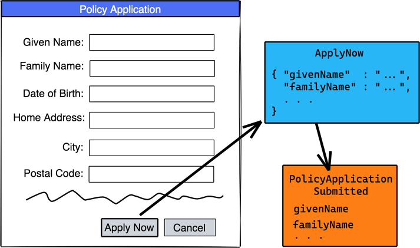

图 3.1 Apply Now 命令导致 Policy Application Submitted 事件。

请注意 Apply Now 命令在命令式中是如何声明的，就像现在这样做一样。一个命令可能会被拒绝，这种情况下可能会因为应用程序无效而被拒绝。
假设“立即申请”命令执行完毕，则该事实被记录在一个事件中，该事件被命名为过去时的名词-动词表达，Policy Application Submitted。通常，事件被持久化到数据库中以完全保留记录的事实以保证后续使用。
在某些情况下，事件发生时没有引起它的命令。例如，当时钟到达特定时间（例如 8 月 31 日的 23:59:59）时，可能会发生事件。对于特定的业务，月份已经结束可能很重要。如果这对我们虚构的示例公司 NuCoverage 来说是一个重要场合，那么它可以被视为一个事实事件。如果在销售上下文中捕获诸如 Month Ended 之类的名称，它可能会很好地工作。然而，在会计等财务环境中，月末意味着不同的东西。例如，Ledger Period Closed 可以很好地作为记录簿的事件。图 3.2 描述了这种基于时间的事件模型。

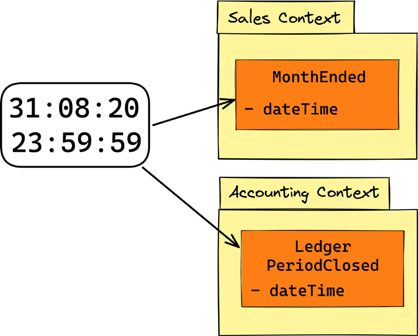

图 3.2 由日期时间变化引起的事件；不涉及命令。

这进一步说明了第 2 章“基本战略学习工具”中介绍的想法。在命名概念时尊重交流的上下文是至关重要的。第 2 章侧重于名为索赔、承保和保险产品的上下文。本章介绍了作为两个附加上下文的销售和会计，每个上下文都包含在一个独特的模块中。这个例子强调了在给定的业务中可能存在许多不同的上下文，并且为了进行有效的沟通，这些上下文必须是清晰的，并且在软件设计对话期间处于团队成员的头脑中。

### 使用软件模型

可能不明显的是，前面的示例是软件模型的表达。软件建模是理解企业复杂性的重要组成部分。此外，生成的模型用于将日常业务程序和流程与软件组件相关联。如果软件模型的名称不是随意选择的，而是经过深思熟虑的选择并与团队沟通的背景相协调，则它们的名称才有意义。
从现在开始，本书将大量利用软件建模作为一种实践，引导深度学习和突破性洞察，从而实现差异化创新。事件是团队使用的工具的核心，可帮助他们向深度学习迈出建设性的、快速的步伐。此外，命令和几个软件建模概念都发挥着重要作用。

## 使用 EventStorming 快速学习
著名的发明家和创新者托马斯·爱迪生 (Thomas Edison) 评论了他多次取得成功的尝试。在经历了大量通常被称为“失败”的事情之后，爱迪生说，“我没有失败。我刚刚发现了 10,000 种行不通的方法。”
爱迪生实际上并没有发明灯泡。在他着手解决这个问题的时候，灯泡已经在路灯、工厂和商店中变得普遍了。但他们有局限性。爱迪生发明的是第一个实用且价格合理的灯泡 [Time-Edison]。这个设备也不是他自己发明的。为了完成这一壮举，爱迪生的团队测试了 6,000 种不同的灯丝，然后找到了符合目标的灯丝 [爱迪生博物馆]。
亚历山大·格雷厄姆·贝尔发明了电话——有点像。其他几个人争辩说他们创造了最初的发明。无论如何，经过几个世纪的实验和其他人的发现，包括 1667 年英国物理学家兼博学者罗伯特·胡克 (Robert Hooke) 发明的原声弦电话，贝尔于 1876 年获得了他的专利电话。爱迪生还通过发明碳麦克风为电话的成功做出了贡献，这种麦克风产生了强大的电话信号。然而，电话的使用最初并不令人印象深刻，因为它跨越了电报交换，惠及极少数消费者。如果没有电话交换机的最终发明，电话的广泛使用将永远不可能[电话历史]。
这里提出的观点是，往往是目光短浅或缺乏知识导致较少的创新，然后其他人设想对这些先前的发明进行改进。关键点：团队通常会开始解决一组问题，但会通过实验和协作发现更多的创新机会。不要阻止这种情况发生，因为它可能指出最初的目标只是明显而普通的，或者充其量只是一个过渡步骤。这个过程是由沟通主导的，这就是导致创新的原因。
在容错文化中进行实验是创造创新环境的关键。然而，阻碍这种环境的因素是以下问题：在实现创新之前必须面对多少次失败，以及需要多长时间和多少资金？
诚然，有 6,000 到 10,000 次失败很少是业务计划、时间表和预算的一部分。再说一次，早期的灯泡或早期的电话都不是。

> 简而言之，卓越的组织是那些超越检测和分析失败并试图产生智能组织以实现学习和创新的明确目的的组织。并不是这些组织中的管理者喜欢失败。但他们认为这是实验的必要副产品。他们还意识到他们不必用大量预算进行戏剧性的实验。通常，一个小型飞行员、新技术的试运行或模拟就足够了。 [HBR-失败]

实际上，真正推动技术进步非常需要这些伟大的发明，例如真正量子计算的广泛可用性。反过来，那些寻求发明的人必须准备好在实验中投入大量资金，并学习至少 10,000 种行不通的方法。对于其他所有人来说，将渐进式创新作为产生收入的手段，然后再投资于建立更多渐进式创新，是关键。快速且廉价地学习是必要的。
作为通信、协作和基于发现的学习的一流方法，由 Alberto Brandolini 概念化和开发的建模工具和称为 EventStorming [EventStorming] 的技术集以低开销提供了这些好处。这种方法的成本来自于包括所有参与创意会议所需的知识工作者，而这些会议仅受他们集体想象力的限制。会议既不排除业务专家也不排除软件开发专家。相反，EventStorming 需要每个有远见、至关重要的利益、问题、答案、讨论已知已知和已知未知的意愿以及挖掘未知未知的坚韧的每个人的参与。它呼吁所有人利用这些知识来实现超乎寻常的成就。

> 笔记
> 作者之一 Vaughn Vernon 在他 2016 年出版的著作 Domain-Driven Design Distilled [DDD-Distilled] 中强调了 EventStorming。正是在 Vaughn 于 2013 年在欧洲举办的 IDDD 研讨会活动中，Alberto Brandolini 受邀作为讲师参与，EventStorming 首次被引入。这也是领域驱动设计 (DDD) 被介绍给大量专业人士并站稳脚跟的地方，也是本书作者第一次见面的地方。那次研讨会是软件开发史上的一个光辉时刻。从那时起，Vaughn 和该研讨会中的几名学生就一直使用并支持 EventStorming。

实现超乎寻常的软件交付要求必须克服所有通常无法交流（导致不愉快的交流）的业务孤岛，或者甚至使跨部门合作望而却步。非沟通和各种竞争和对抗行为都阻碍了创新。企业最终遭受的损失甚至比阻碍取得进步的人还要多。每个人都有选择，应该提供两个选择：合作或让路。
EventStorming 背后的基本思想是对系统中一系列按时间排序的描述性事件进行建模。基于事实的事件作为过去事件的模型元素记录在便签上，并辅以其他类型的模型元素，这些模型元素捕获有关动态环境的支持细节。时间顺序是从左到右记录的。图 3.3 中模型中的橙色元素（如果以颜色呈现）是事件，其他颜色表示补充、支持元素。从整个时间线中一致使用的橙色元素的数量来看，应该清楚这是一个事件优先建模的工具。

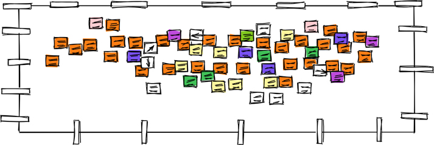

图 3.3 EventStorming 产生对商业机会的洞察力和意识。

### 何时需要远程会话

EventStorming 主要是作为一种面对面的活动来促进的。但是，可以使用在线协作工具（例如语音和视频通话）以及使用具有绘图功能的虚拟白板来近似计算。作者既体验过，也讨论过在虚拟环境中举行风暴会议的优点和缺点。
使用远程会话的优点是团队可以由远程工作人员组成，他们仍然需要协作才能完成创造性工作。在由于面对面协作造成的健康威胁而虚拟一切的时代，这不仅是一个优势，而且是当务之急。即使假设面对面协作再次普遍可行，远程会话仍将是必要的——即使由于 COVID-19 大流行之前的企业政策，它不是一种选择。远程就在这里。
远程 EventStorming 会话通常遇到的主要障碍是通信渠道被扼杀。大多数人现在都目睹了两个人之间的对话，在身体运动和声音接收延迟几秒钟的情况下，通常是断断续续的。当试图让大量的人参与这样的讨论时，这个问题就变得更糟了。对于面对面的会议，对话往往会分叉并重新加入——但如果这种情况开始发生，并且有更多的人在线参与，那将比只有两个人谈话时发生的情况要糟糕得多。这可以通过建立对话协议来处理，例如举手和虚拟分组讨论室，但这些都不能促进面对面会议提供的那种交互。与任何协作设置一样，我们在平台的局限性范围内得到了我们所得到的。
考虑到视频通话和虚拟白板都需要计算机显示空间，因此在许多远程会议中还存在物理空间限制。当参与者至少有两个显示器或一个非常大的显示器时，这并不是真正的问题。在较小的显示区域内托管视频通话，在较大的区域内托管虚拟白板，通常可以使体验更好；然而，企业高管和其他管理人员拥有如此大的观看空间的情况并不多见。你应该强烈将此视为开展业务的成本。你可以通过为需要参与的每个人购买足够大的外部显示器来克服显示器空间限制。这样的显示器通常可以以每个几百美元/欧元的价格购买，并且大多数笔记本电脑都具有同时驱动板载和外部显示器的能力。那些目前不熟悉这些大型显示器的人很快就会发现它们是必不可少的，即使是在远程 EventStorming 之外。
一些从业者——包括 EventStorming 的创始人 Alberto Brandolini——得出的结论是，在线协作工具 [Remote-Bad] 不可能正确使用这种技术。其他人更喜欢虚拟方法而不是面对面的会议，并且对此非常满意。此类促进者的参与者数量往往非常有限，并非出于意图，而是基于需要。
远程团队的广泛存在，以及即使在我们不想要的情况下也迫使我们远离远程的绝望时代，已经产生了对虚拟 EventStorming 会话的明确需求。这是连阿尔贝托都承认的[远程要求]。

### 促进会议

本章的这一部分将亲自讨论 EventStorming。使用前面的建议和常识，当你别无选择时，除了远程协助之外，尽可能多地应用以下部分中概述的最佳实践。首先讨论物理建模工具，然后描述个人所需的努力。

### 建模表面
EventStorming 需要一个几乎无限的建模表面，可以通过在宽墙上贴一条长纸条来创建，比如 10 米/码。^1^ 这个宽度显然不是无限的，但对于很多情况来说就足够了，并且因此无限制。如果这还不够，团队必须找到更宽的墙或在相邻的墙上继续。根据购买选项，可能会提供兼容纸卷（914 毫米/36 英寸宽），例如，3M 遮蔽纸 [3M-Paper]、3M Scotch Banner and Sign Paper [Scotch-Paper]、Pacon Colored Kraft Duo- Finish Paper [Pacon-Paper]，以及各种绘图纸选项。图 3.4 说明了这种设置。

> 1 是的，作者很清楚米和码的长度不同。但是对于了解公制的人和了解标准的人来说，测量是有意义的。

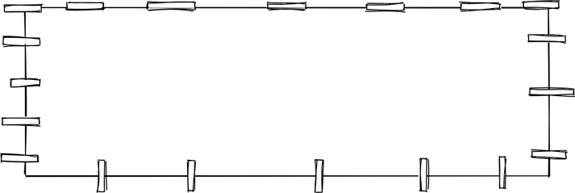

图 3.4 使用宽墙和长纸条作为造型表面。

### 标记

参与者必须进行手写，所以你应该得到这些很棒的笔：Sharpie Fine Point Permanent Marker [Sharpie]（不是 Sharpie Ultra Fine！），如图 3.5 所示。这不是一个玩笑;钢笔有明显的不同。如果他们使用铅笔、圆珠笔或超细笔，参与者即使在很短的距离内也无法很好地看到笔迹。如果他们使用非常厚的记号笔，由于墨水渗出和书写空间有限，字迹将难以辨认。同样不容忽视的是，作者坚持认为 Sharpie Fine Point 笔可以让所有参与者变得更聪明。 Just Right™ 不仅仅适用于“金发姑娘和三只熊”[Goldilocks]。

图 3.5 正确的标记让每个人都更聪明。 承诺。

### 便利贴

大量特定颜色的便签用作模型元素类型。每种颜色都代表特定建模视角内的不同类型的概念。即便如此，一个重要的考虑因素是避免将风暴会议变成一门科学。保持建模体验简单，记住业务本身已经足够复杂，而不会增加建模复杂性的额外负担。风暴最重要的方面是产生开放的交流，导致基于发现的学习。纠正新来者以创建“完美定义的模型”将适得其反，因为这会赶走对成功至关重要的人分享重要的交流。如果每个人都相互理解并为突破性学习做出贡献，则称其为成功经验。
考虑使用图 3.6 中显示并在以下列表中描述的元素颜色和类型。

- 命令为浅蓝色。命令是命令式的，是做某事的明确要求。通常，命令是用户对数据执行某些操作的手势的结果。
- 事件是橙色的。事件记录了在给定模型上下文中发生了重要事件的事实，并且通常是用户成功执行命令的结果。事件被命名为过去时的名词-动词。例如，我们的模型包括名为 Policy Application Submitted、Month Ended 和 Ledger Period Closed 的事件。鉴于此工具名为 EventStorming，预计更多的粘性将是事件，至少在早期是这样，因为正是事件驱动了建模体验。
- 政策是紫色的。策略是命名的业务规则或必须满足的一组规则，或一组可用于结果的指南。例如，在执行命令后，会发出一个事件，并且可能会决定该事件如何影响下游模型。 （紫色是一种通用颜色，制造商实际上可能将其命名为丁香色或桑色。）
- 聚合体/实体呈淡黄色。这是保存数据、应用命令并影响数据的地方，事件是描述所发生情况的结果。这些元素是模型的名词，例如 Application、Risk、Policy、Claim 和 Coverage。
- 用户角色是亮黄色。这是在模型中扮演角色的用户，例如承销商或调整者。它也可能是为代表具有列举特征的某人而选择的角色名称。这些元素对于浏览特定场景、故事和用例非常有用。人物角色可用于预测想象中的个人将如何思考以及在给定的一组环境下他们将做什么或想要做什么。
- 视图/查询是森林绿色。要为用户呈现视图，必须在数据存储上执行查询以检索视图的数据。此元素还可以表示何时必须将事件发生投影到数据存储中以更新视图数据，以便后续查询和呈现到用户界面。
- 进程是紫色的。流程类似于政策，但负责执行一系列步骤以产生最终结果。执行这一系列步骤的路由规则基本上是一个指定过程的策略。 （紫色是一种通用颜色，实际上可能被命名为丁香或桑葚。）
- 上下文和外部系统是浅粉色。你的业务流程可能会受到外部系统的刺激，或者外部系统会受到正在建模的流程的影响。外部系统和子系统与团队和内部对话相关。此外，随着风暴活动的增加，系统的哪些区域属于特定的通信环境可能会变得更加清晰。如果是这样，在模型区域上方放置一个粉红色的粘性物体并命名上下文。
- 机会是绿色的。标记模型中代表探索和试验机会的区域，以利用新的竞争优势。那些熟悉优势、劣势、机会、威胁 (SWOT) 分析的人可能认为这些与机会相似。
- 问题是红色的。这些便签标记了模型中业务流程特定区域中的问题需要进一步探索和试验的位置。额外的努力应该导致改进，并可能进行创新。熟悉 SWOT 分析的人可能认为这些与威胁类似。
- 投票箭头为深蓝色。在富有成效的风暴会议之后，每个建模者都会得到两个深蓝色的贴纸，在上面绘制箭头并将它们指向模型中的机会和/或问题。有最多箭头指向的机会和/或问题应该是我们接下来关注的领域。
- 笔记是白色的。如果有空间，可以将注释直接写在任何适用的模型元素上。写笔记可能表明应该定义策略。有时笔记横切多个模型元素，但不要求策略。此外，绘制方向/流向箭头可能很有用，尤其是当流向上游返回时。这两种类型的笔记都可以放在白色的便签上，也可以放在明显不是模型元素的另一种颜色的笔记上。不要直接在纸模型面上书写。模型元素便笺会四处移动，便笺上的注释可以随之移动。写在纸模型表面上的注释和符号无法移动，因此它们最终会成为分散注意力的划痕。

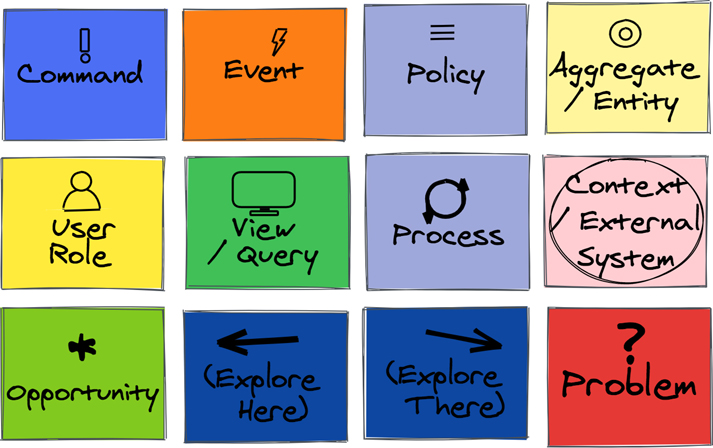

图 3.6 按颜色和类型名称的便签建模元素。 （注意：对于印刷书籍的读者，颜色已用图案表示。）

自从 EventStorming 技术出现以来，带有“标准颜色”的便签变得越来越难以找到，因此你可能需要将调色板调整为可用的任何颜色。在这种情况下，请务必提供类似于图 3.6 中所示的模板。为每个模型元素类型使用不同的颜色以保持所有协作者彼此同步非常重要。
此外，你应该为每个模型元素类型创建一个唯一的图标。图标的主要原因是为色盲参与者指示元素类型。在举办研讨会时，作者经常遇到患有某种形式的色盲的学生。对于某些人来说，颜色之间的差异明显地表现为灰色阴影或更深的色调。即便如此，图标可以帮助他们快速区分元素类型，甚至可以为不熟悉调色板的新参与者提供便利。

### 大图建模

使用 EventStorming 时，大图建模是一种发现正在探索的系统整体流程的练习。通常，商业横贯大陆的航班会在 35,000 英尺/10,700 米的高度巡航。在晴朗的天空下，从那个高度，人眼可以看到 240 英里/386 公里，甚至可能更远。相对而言，这就是大局风暴所期望的流程和流程的系统愿景。站在地面上，人眼可以看到大约 3.3 英里/5.3 公里。这可能是所需的相对距离，但在使用设计级风暴时可能更小。

> 笔记
> 使用 EventStorming 进行大图建模是本书的主题。设计级建模的详细讨论和示例可在我们的后续实施书中找到，实施战略单体和微服务（Vernon 和 Jaskuła，Addison-Wesley，即将出版）。

要有效地使用 EventStorming，了解建模元素如何协同工作非常重要。根据范围（大图或设计级别），使用的模型元素类型的数量和组合往往会更少或更多（或至少不同）。考虑根据大图模型元素的常见用途创建一个备忘单。

### 备忘单
工具名称 EventStorming 为模型元素类型中的优先级提供了很好的线索。即便如此，其他元素也会很有帮助。本书讨论了九个，可以根据手头的建模情况以各种组合方式使用。图 3.7 提供了备忘单建模元素的视图，以下要点给出了如何使用它们的想法。

- 事件。使用在流程中表达想法所需的任意数量的事件元素，从左到右创建一个时间线。有关此过程的更多详细信息将在后面的“应用工具”部分中介绍，但现在考虑用事件淹没建模表面。首先，顺序不如事件的存在重要，越多越好。
- 命令。事件通常由命令引起，但并非总是如此。命令通常是某些用户操作的结果。因此，如果显示导致事件的命令有用，请将命令元素放在它导致的事件的左侧。那是因为命令在事件之前按时间顺序发生。
- 政策。因为在暴风骤雨中会发现一些之前的未知数，所以会话参与者自然会对一些正在酝酿中的想法感到陌生。与其花大量时间试图挖掘目前无人深入了解的细节，不如使用策略粘性来命名模糊区域，然后继续前进。最好在可以进行更多研究的时候进行详细说明。有时遇到分歧的人不会轻易想到继续前进，因此风暴式引导者负责标记现场并保持团队专注。
- 用户角色/角色。无论是否决定显示在模型的特定区域中引发事件的命令，显示将参与正在实现的场景中的用户类型可能会很有用。在作为他们所采取行动的结果的元素之前（左侧）放置一个亮黄色的用户/角色便签。
- 上下文/外部系统。当风暴活动揭示系统的哪些区域属于特定的通信上下文时，在模型的每个可识别区域上方放置一个粉红色的粘性标签并命名上下文。当来自外部源的命令或事件进入当前正在设计的模型时，可以用粉红色便笺显示刺激源。这提请注意这样一个事实，即必须考虑接受外部刺激，甚至可能会考虑如何从外部系统发出。
- 查看/查询。当需要仔细注意重要的用户体验时，在建模表面上放置一个绿色便签，上面带有提供用户界面和/或数据的视图和/或查询的名称。在这种情况下，显示将与视图交互的用户角色/角色通常很有用。视图/查询也可用于显示最终将用于此目的的数据必须明确收集，甚至可能预先组装和格式化。
- 聚合/实体。这种元素在大图模型中可能不太常用，但它仍然有助于显示称为聚合或实体的重要数据持有者和行为组件。该组件是一个名词。命令在这个组件上执行，事件从它发出。因此，无论何时使用聚合/实体，它都可以与左侧的命令（它被告知要做什么）和右侧的一个或多个事件（由于执行命令而发出的结果）配对。
- 机会和问题。标记模型中可以利用机会和必须解决问题的区域。请注意，问题不同于标记模型歧义和/或分歧的策略。问题是团队非常了解的事情，可以确定它当前是错误的并且将来会导致问题。熟悉 SWOT 分析的人可能认为这些类似于机会和威胁。
- 表决。在深入建模练习并确定一些机会和/或问题之后，让团队对最需要关注的机会和/或问题进行投票。获得最多选票的机会和/或问题将得到解决；其他的可能会被积压以备后用或被视为不重要。

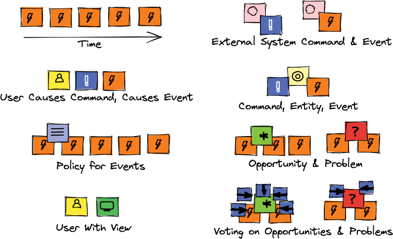

图 3.7 大图 EventStorming 备忘单。

随着时间的推移，建模表面将不仅充满橙色事件，还会充满其他类型的元素和颜色。当看起来太多时，将它们按时间顺序移动，并撕掉多余的和不属于的。现在看看地板。如果它是五颜六色的，有很多粘性，那就意味着成功。犯这些“错误”并从中学习是很便宜的。去除大量不必要的粘性远比想象的太少要好得多。

## 应用工具

受邀参加这种高空建模体验的人员必须包括业务和技术专家，他们要么对正在开发的系统具有预先存在的知识，要么对后续内容感兴趣的利益相关者。这两个群体很可能会重叠。
包括所有人……

- 发起并负责将愿景推进
- 拥有重要的业务和/或技术利益
- 谁有关于正在探索的系统的问题和答案
- 谁了解已知的已知和已知的未知
- 拥有挖掘未知未知的坚韧
- 推动利用所获得的知识实现超越常规

每个人都应该有一个记号笔和便利贴的访问权限，尤其是用于模拟事件的橙色品种。所有相关人员都应该公开发言。
考虑在办公室举办派对或午餐。怎么了？除非有适当的计划来推动事情发生，否则大多数人会坐着或站着等待有人向食物迈出第一步。一个或几个真的很饿而且不那么害羞的人直接冲进去，拿一个盘子，拿些食物，找一个适合吃所提供食物类型的地方，然后开始吃。这些先行者有时被称为破冰船。计划中的破冰船使任何人都可以更轻松地获得食物。这可能就像指派几个人将盘子分发给其他人然后护送他们去吃食物一样简单。
以类似的方式，通过要求一个或几个参与者准备打破僵局来启动 EventStorming 会话。破冰船应该通过思考并在橙色便签上写下时间线中某个事件的名称来开始风暴过程。将其放置在相对于它在时间轴中发生的位置的建模表面上，靠近开头、中间或接近结尾。这些破冰事件基于众所周知的事情，或者至少是关于系统如何运作或将如何运作的普遍假设。图 3.8 显示了一些破冰事件的早期位置。

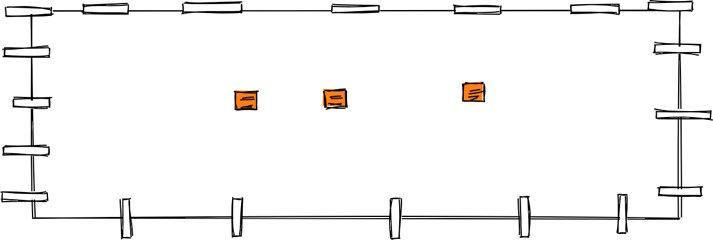

图 3.8 破冰船事件掀起了风暴并促进了自发性。

当团队开始寻求高度一致并渴望达成共识和团队批准时，就会出现 EventStorming 会话中最严重的问题之一。这实际上是关闭创造力的方法。敏捷强调个人表达和自发性，而不是共识和认可。因为每个人都有记号笔和便利贴，所以提高了自发性。鼓励每个人写下他们所知道的以及他们认为对现有或假设的改进。
对话会潮起潮落。时间线可以在想法流动一段时间和潮起潮落之后整理出来。一些参与者将脱离主组然后重新加入。这是完全自然的，不应气馁。
有时会存在不确定性，甚至对当前的情况或应该如何处理存在分歧。如果有合适的业务专家在场，这些歧义可能会得到解决，但有时对现有或提议的业务流程规则的理解不够。处理这个问题的错误方法是让分歧继续存在，因为这表明正确的问题和正确的答案是不可用的。在这种情况下，主持人应该使用紫色政策粘性，在混淆点将其拍在建模表面上，并命名它。将此视为未来对话的占位符，可能需要与更熟悉该主题的人进行访谈。可能还需要研究以了解更多必须遵循的标准，并且可能需要围绕特定知识领域或当前缺乏的知识领域进行实验。
图 3.9 展示了如何使用策略来标记相关事件的未知数。回顾第 2 章中的图 2.6 和图 2.7，它们显示了围绕名为“一键式应用程序提交”的影响的发现。图 3.9 中的事件对应于那里出现的可交付成果。此 EventStorming 会话可能发生在影响映射会话之前或之后，或同时发生。这些工具可以在适当的时候轻松地一起使用。

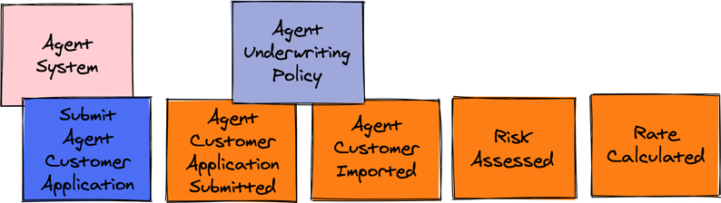

图 3.9 代理承保政策标志着模型需要更多细节的地方。

图 3.9 中的代理承保政策的要点是，风暴团队不确定有关提交代理客户导入所需的全部数据以及同一客户的保险申请的详细信息。图 2.6 和 2.7 的想法是，一键式应用程序提交必须携带客户帐户和应用程序信息的完整负载，但团队还不知道必须是什么或代理将如何提供（例如，WellBank）。因此，他们用一项政策来标记这一领域，该政策必须受到至少几位不同 NuCoverage 主题专家的关注。使用该策略允许风暴会话继续进行，而不会陷入目前无法消除歧义的细节中。
图 3.9 还说明了一个命令是如何引起一个或多个事件的。命令 Submit Agent Customer Application 来自外部代理系统（例如 WellBank）。团队决定在大图模型中显示此命令，因为它有助于说明使用和流程场景的完整上下文。表明外部代理系统负责发布命令表明需要在该区域完成大量工作。外部系统无疑将成为涉及另一组的正在进行的 EventStorming 会议的目标。该小组可能会因这项工作而有一些成员重叠。
回顾图 3.10，我们发现了机会和问题。当受保用户查看其保单信息时，应提示他们增加其覆盖范围。例如，具有良好驾驶记录的用户可能会获得多辆车的折扣。此外，当 NuCoverage 开始通过白标渠道提供家庭保险时，被保险人也可能会获得更优惠的家庭保险覆盖范围和定价。该团队讨论了如何做到这一点，并确定这将需要来自代理（例如 WellBank）的额外数据。此过程应包括主动电子邮件和活动以及客户每月银行对帐单中共享的优惠。

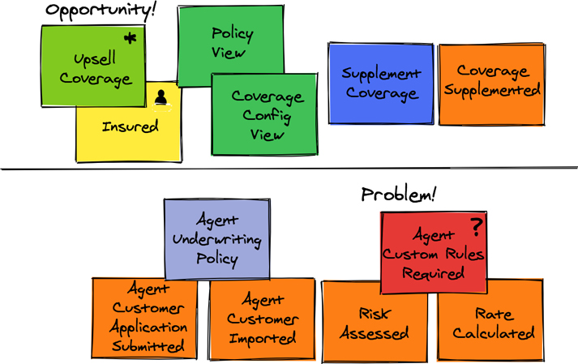

图 3.10。一个机会和一个问题已被确定。

图 3.10 也突出了一个问题。尽管 WellBank 等代理对 NuCoverage 为其客户提供的风险和费率规则以及保费和承保范围感到满意，但该团队预计一些代理会希望为所有这些项目指定自定义规则，甚至可能更多。此外，NuCoverage 可能需要提供可定制的用户界面组件，甚至超出了品牌重塑的样式。
当团队到达对机会和问题进行投票的点时，共识是肯定应该立即追求 Upsell Coverage 机会。然而，由于 WellBank 是第一个上线的代理商，并且目前很乐意提供标准的 NuCoverage 风险和费率规则，以及保费和保险，因此团队投票认为现在不是做出决定的最后一个负责任的时刻需要代理自定义规则。这个具体问题将被积压并在适当的未来时间解决。第 6 章“映射、失败和成功——二选一”中的“应用工具”部分解释了未来会发生什么。
NuCoverage 团队想要解决的另一个问题是，NuCoverage 从可用数据中观察到，为什么有如此多的申请人在完成之前就退出了申请流程。与那些开始申请的用户相比，完整的申请提交率非常低，这意味着大量潜在的新政策没有发布。 NuCoverage 决定使用 EventStorming 来发现当前订阅过程。
图 3.11 显示了订阅过程的开始，但在很早的时候，可以观察到一个有趣的模式。承保和费率上下文不断地交换信息。团队成员之间的讨论表明，必须不断评估根据风险的费率，并且必须在订阅过程中反复计算费率。根据当前评估的风险，可能会向申请人提出一些额外的问题，申请人填写他们的回答。因此，随着填写不同申请表的字段，风险和费率会一遍又一遍地重新评估和重新计算。

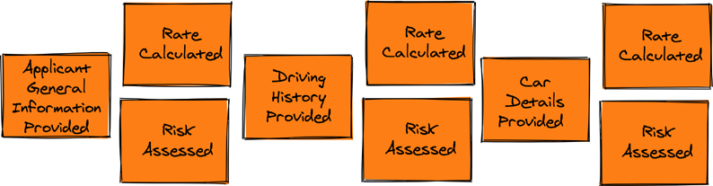

图 3.11 当前订阅流程。

团队很快发现，Rate 上下文必须有非常详细的数据才能计算出最公平的价格并评估正确的风险，这对用户体验有着非常直接的影响。为了获得最终评分，申请人必须回答许多问题，有时如果没有非常具体的文件摆在他们面前，他们就无法回答。如果估计的风险很高，订阅过程就会停止，让申请人感到沮丧，无法申请保单，甚至无法查看计算出的保费。团队得出结论，订阅过程过于繁琐，风险评估和费率计算必须以不同方式进行。他们抛弃了当前的 EventStorming 模型并开始了一个新的模型。
碰巧一段时间以来，Rate 团队一直在使用机器学习算法进行可控且安全的实验，以期取代旧的费率计算和风险评估方法。他们不想跟随炒作和玩弄机器学习算法，而是想实际使用这种方法。因此，实验为团队提供了了解软件如何从机器学习中受益的机会。他们在维护当前的风险评估和费率计算模型方面遇到了真正的痛苦。规则真的很复杂，将新规则纳入模型非常困难，价格调整计算非常容易出错。 Rate 团队正在花费部分时间修复基于错误计算的价格和糟糕的风险评估的生产错误。图 3.12 突出显示了他们的工作结果。

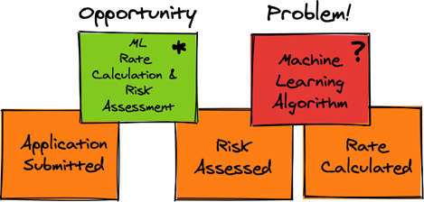

图 3.12 发现机器学习机会。

对业务的影响是巨大的。鉴于该公司已经拥有大量历史数据，机器学习似乎是一项非常有前途的技术。此外，更多的数据可以很容易地从数据提供商处购买^2^，从而丰富机器学习算法。考虑到申请表中的最小输入，该团队随后可以使用新算法来评估风险并计算比率。即使团队预计会出现一定数量的误报，企业为太多不良司机提供保险的风险也不那么高。随着时间的推移，机器学习算法将得到微调，结果应该会更好。此外，该团队将通过 A/B 测试对新实施进行试验，以进一步限制交付对财务造成损害的实施的风险。这个机会的发现让团队的积极性大增，申请流程可以简化的事实又带来了另一个发现。

> 2 此提述并非指未经所有者同意而出售的私人个人信息，而是指在某些国家/地区可以购买的不可识别信息。此类信息包括有关车辆及其相关风险的数据：事故、被盗车辆数量等。

NuCoverage 的业务人员听说可以简化申请流程，想出了另一个想法。他们已经考虑了一段时间如何使用社交媒体渠道来推动销售，但知道这几乎是不可能的，因为申请表很复杂。不过，现在他们可以设想在 Facebook 上建立一个聊天机器人，让用户只需点击几下即可申请政策。该企业不仅可以利用社交媒体推荐引擎，还可以根据机器学习算法可用的上下文和历史数据确定最佳风险和价格。这在图 3.13 所示的模型中被捕获。

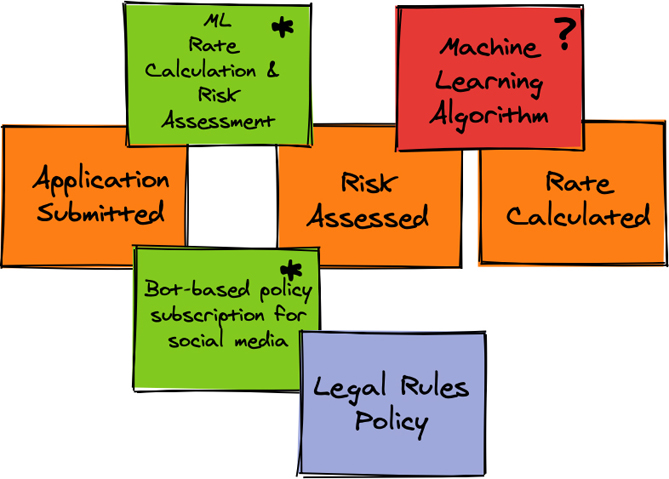

图 3.13 EventStorming 导致了另一个有趣的发现。

该企业知道，大多数年轻人仅使用社交媒体和手机来了解世界。 打开此保单申请渠道将是 NuCoverage 寻求扩展到新市场的关键推动因素。 通过证明企业了解年轻人来赢得年轻人的青睐，有可能建立终生的忠诚度。
然而，无论生活带来什么变化，企业还必须证明其有能力与保单持有人和持续的社会趋势一起飞跃和发展。 企业必须解决每个保单持有人生命中的下一个阶段，因为大多数将涉及新的可保风险。 这意味着更多的实验和基于发现的学习来揭示深度知识，这将在本书第二部分中学到的领域驱动方法提供便利。

## 概括
你应该使用能够帮助团队克服沟通挑战并深入了解协作沟通、学习和改进软件构建的工具。在容错文化中实现安全和快速的实验是创造支持创新的环境的关键。 EventStorming 捕捉了人类思维的表达方式。它包括记录表达为可操作命令的意图的方法，以及诸如事件之类的操作的结果是探索的关键。此外，许多建模元素可用于更深入的学习：策略、数据和行为实体、用户角色、视图、上下文边界，以及标记机会和问题的方法，以及追求哪些。
本章最突出的要点如下：
事件优先建模弥合了所有利益相关者之间的沟通差距，并实现了以人为本的生产力和发现。
使用事件优先模型推动实验有助于主动学习，并在人们的时间和工具方面以低成本加速知识获取。
EventStorming 通过克服阻碍基本沟通的现有业务孤岛的挑战来实现跨部门合作。
通过检查事件开始建模工作有助于团队利用建设性反馈并通过理解业务软件的复杂性来快速迈向深度学习。
迄今为止，本书着重强调了通过学习和发现来实现业务软件战略，从而带来差异化创新。在第二部分中，我们注意到企业如何通过建立在已经讨论过的方法的基础上来获得领域驱动的结果。采用知识驱动的观点可以对软件产品进行稳定的改进，从而实现具有竞争优势的战略差异化。

## 参考

- [3M-Paper] https://www.3m.com/3M/en_US/company-us/all-3m-products/~/3M-White-Masking-Paper/?N=5002385+3293242382&rt=rud
- [DDD-蒸馏] 沃弗农。领域驱动设计提炼。波士顿：Addison-Wesley，2016 年。
- [爱迪生博物馆] http://edisonmuseum.org/content3399.html
- [事件风暴] https://leanpub.com/introducing_eventstorming
- [财富-坎贝尔] https://archive.fortune.com/magazines/fortune/fortune_archive/1996/05/13/212382/index.htm
- [金发姑娘] https://en.wikipedia.org/wiki/Goldilocks_and_the_Three_Bears
- [HBR-失败] https://hbr.org/2011/04/strategies-for-learning-from-failure
- [倒U] https://www.researchgate.net/publication/258180060_Too_Much_of_a_Good_Thing_The_Challenge_and_Opportunity_of_the_Inverted_U
- [Pacon-Paper] https://pacon.com/dual-light/rainbow-colored-kraft-duo-finish-rolls-36-x-1000-white.html
- [电话历史] https://en.wikipedia.org/wiki/History_of_the_telephone
- [Remote-Bad] https://blog.avanscoperta.it/2020/03/26/remote-eventstorming/
- [远程需求] https://blog.avanscoperta.it/2020/03/26/eventstorming-in-covid-19-times
- [Sharpie] https://www.sharpie.com/all-markers/classic/super/SHSuperBlackFine
- [时代-爱迪生] https://time.com/3517011/thomas-edison/