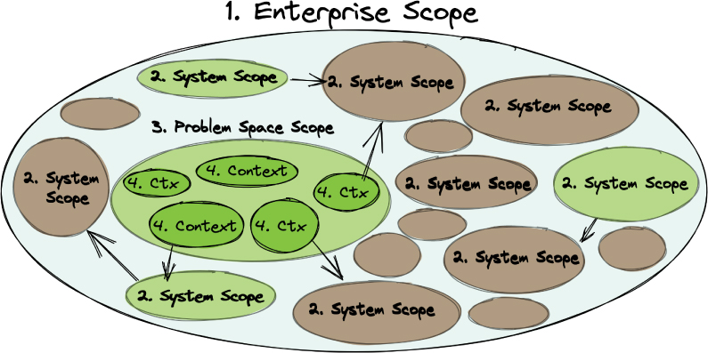

# 达到领域驱动的结果

领域驱动是一个奇怪的术语。 Merriam-Webster 词典给出了域这个词的十个定义。前三个可能是想到这个词时想到的想法：

1. 完全和绝对的土地所有权
2. 行使统治权的领土
3. 由某些物理特征明显标记的区域

本书讨论商业软件战略和创新。因为每个业务都是独一无二的，所以“领域”很可能会引起人们对财产和运营的业务所有权的“支配”，甚至可能是其中的显着特征。虽然没有错，但这些都不是本书中如何使用“域”的最佳解释。
第 1-3 章着重强调通过学习和发现来实现业务软件战略，从而带来差异化创新。这种对学习和发现的强调指向了 Merriam-Webster 词典中对域的第四个定义，它是最合适的：

> 知识、影响或活动的领域

每个企业都有一个专门的知识领域，这是通过现有的专业知识以及集体和共享学习活动获得的。这种知识一旦反映在软件产品中，就会对消费者产生影响。现在，深入研究前三个定义，结果确实是业务领域内拥有的知识产权。它反映了商业创造力的显着特征，即对知识获取投资和推进最先进技术的绝对决心的回报。这肯定是一个知识、影响和活动的领域。
领域驱动指出，企业通过在其当前影响和活动范围内外对知识获取进行投资来推动结果。该业务通过稳步改进其基于技术的产品来推动自身的进步和增长。本书不断断言，通过基于实验的发现来学习，才能产生最具创新性的结果。

> 敏捷方法中的创新
>
> 作为使用方法论或流程执行框架的示例，Scrum 确定了将项目放入产品待办列表的四个主要原因：
>
> 1. 特征
> 2. 错误
> 3. 技术工作
> 4. 知识获取
>
> 令人失望的是，知识获取被置于最后一位，因为它应该始终排在第一位。团队如何在理解之前将新功能放入待办事项列表中？即使他们在充分了解之前将该功能放入待办列表中，但在尝试实施它之前，至少必须对知识获取进行尽职调查。同样令人失望的是，知识获取经常被描述为技术动机，例如“研究各种 JavaScript 库并做出选择”。大多数认为自己是 Scrum 从业者的开发人员也不知道这个基本原理。存在此类问题的事实可能表明方法或至少执行的优先级存在更大的问题。
> 如果你正在使用 Scrum，请将知识获取放在首位，并根据领域驱动的实验来标记此类任务，尤其是那些有更高潜力带来突破并导致差异化创新的任务。在可追溯的业务目标的锤子下，通过影响传递每个基于功能的新任务，这可能是通过 EventStorming 学习会议首次发现的。

使用领域驱动方法需要与软件开发人员一起工作的业务专家的突出和一致参与。这完全符合#agile 长期以来的原则：

- 敏捷宣言：“我们的首要任务是通过早期和持续交付有价值的软件来满足客户。业务人员和开发人员必须在整个项目中每天一起工作。向开发团队和在开发团队内部传达信息的最有效和最有效的方法是面对面的交谈。” [敏捷宣言-原则]
- 极限编程 (XP)：“客户始终可用。极限编程 (XP) 的少数要求之一是让客户可用。 [这] 不仅是为了帮助开发团队，也是为了成为其中的一员。 XP 项目的所有阶段都需要与客户进行沟通，最好是在现场进行面对面的沟通。 ……你需要专家。” [经验值]

诚然，#agile 和 XP 的某些方面都随着时间的推移而发生了变化。我们在这里注意到“客户”的重要性不是为了给出一个严格的定义，而是强调那些了解手头领域目标的人必须是可用的，并且每个人都必须是一个或多个团队的成员.这些人可能被称为赞助商、客户、用户、产品支持者等。无需详尽地确定业务专家在任何给定子系统中可以扮演的每个角色，但你应该认识到必须有一个或多个能够支持正在开发的产品并推动软件目标的交付。参与其中的每个人，包括产品的最终用户，都必须对结果感到满意。

## 域和子域

谈到股票投资，知道在哪里投资和不投资是财务成功的关键。俗话说，“你不能把握市场时机。”这一现实让投资者更有理由根据关键财务指标和市场状况进行投资，这些都是证券行业知识的可靠来源。
当谈到商业软件战略时，了解哪里投资最多，哪里投资最少对于财务成功同样至关重要。尽管第一次完全正确的情况很少见，但可能没有那么重要。在商业世界中，当前正确的事情以后很可能会出错。不断监测对实现业务目标的尝试影响，以及研究关注用户满意度的市场状况，是衡量创新努力效果的合理方法。
软件涉及整个业务的广度和深度。大型企业中所有软件的整个领域或知识领域都非常庞大。对于任何单个项目或相当大的业务计划来说，在定义的工作范围内包含整个领域的大量细节都太复杂了。无论如何，团队可能会发现大多数都是无关紧要的。为任何给定的软件开发工作的范围定义约束对于成功交付至关重要。
因为知识领域的范围与其特定目的相关，所以术语领域可以有一些范围和细微差别也就不足为奇了。为便于讨论，定义了四个。图 4.1 说明了四个作用域，在下面的列表中进一步定义了它们。

1. 企业范围庞大。大型企业中的所有软件都是业务的完整领域。在这个范围内，不可能创建单一的深入知识来源。
2. 大中型系统范围。获得商业许可的企业系统（例如 ERP）以及大型定制遗留系统都属于此范围。在领域知识方面，这些更接近范围 3，但可能没有很好的规划和架构。它们通常是第 1 章和第 2 章中描述的大泥球系统，但事实并非如此。
3. 中到大的问题空间范围。问题空间是随着一组解决方案的开发而展开的知识领域，但需要多个团队，其成员具有各种类型的专业知识（即范围 4）。归根结底，问题空间是系统开发方面的努力。
4. 较小的上下文范围。问题空间内的每个单独的专业知识交流上下文都是专业业务专业知识的知识领域。

图 4.1 本书使用的领域知识领域的四个范围。

企业架构框架可以帮助管理范围 1 的大型数字企业。但它通常不会提供有关大型企业每个部分的深入信息。这通常被锁定在团队的默会知识中。这样的框架是模式或本体，它支持企业的一组正式的和结构化的观点。有时，该框架还有助于定义企业架构的过程。这样一个框架的力量是帮助组织和盘点公司的数字资产，以帮助进行规划和决策。两个这样的框架是 Zachman 框架 [Zachman] 和开放组架构框架 [TOGAF]。图 4.1 仅提供了对整个企业的有限一瞥，绝不是使用企业架构框架的结果的反映。
如图 4.1 所示，范围 2 通常反映了一种随意的方法，这种方法导致了第 1 章和第 2 章中描述的大泥球系统。不过，情况并非如此。可以以不反映临时方法的方式构建和实施系统。两者的区别如图 4.1 所示，编号为 2 的示波器分别为棕色/深色和绿色/浅色。大泥球系统通常非常大。那些经过深思熟虑的架构往往规模更大，新软件更专注于特定的解决方案，并与先前存在的 Big Ball of Mud 系统集成，以利用有效的方法，但不会弄脏手。

> 抽象装置
>
> 这个讨论可能看起来太抽象了。如果是这样，请将范围 3 问题空间视为 NuCoverage 推出其基于 SaaS 的保险平台。考虑范围 3 问题空间中的范围 4 上下文划分为接收、承保、风险、续订和索赔。这一点在第 5 章“上下文专业知识”中有更详细的解释。目前，抽象对于想象和插入问题空间和专业领域与任何给定业务中存在的特定知识领域很有用。

图 4.1 还显示了一个正在进行的范围 3 战略计划。该工作领域旨在产生一定程度的突破性创新，这意味着团队以基于实验的学习为主导。这里存在一个整体的知识领域，但正在努力将问题空间域划分为专业的专业领域。范围 3 中的范围 4 上下文表明了这一点。这种描述不是为了创建孤岛，而是承认不同的专家从不同的角度看待问题空间。共同获得知识并用于解决大中型问题空间，而专业领域得到认可和严格尊重。作为一个完整的问题空间，范围 3 将具有范围 4 上下文专业知识的不同领域。每个都由一个团队管理。每个团队至少包括一名该上下文专业领域的专家。让一个团队负责一个上下文可以保护专业领域不被其他团队开发的目标和基于通信的语言混淆和分裂。
这将我们带到最低级别的范围。在范围 3 问题空间内有五个不同专业的范围 4 子域上下文。五个上下文中的每一个都代表了关于一个集中且相对狭窄的知识领域的特定对话发生的地方。在每个上下文中，由一个或多个业务专家和开发人员组成的团队对给定术语和任意数量的表达在他们的对话中的含义有共同的理解。作为一个目标，在给定的上下文中不应该存在歧义，尽管毫无疑问会有一些歧义。当检测到任何一个时，有意识地努力清除模糊的含义和相关的软件规则和行为。
范围 4 带来了另一个术语：子域。子域是域的子部分，特别适用于范围 3。通常情况下，子域与业务能力相同。理想情况下，如图 4.1 所示的上下文应该与子域一一对应。将子域主要视为一个问题空间概念，并认识到每个子域都具有或多或少的战略业务意义。
在第 5 章中，图 5.1 显示了此处图 4.1 中表示的特定上下文。分配给上下文的名称会引起对相应子域的注意。当单个模块化上下文中存在多个子域时，就会出现问题。这些问题往往与单个源模块如何因与上下文的中心主题无关的概念而过载，而上下文的中心主题应该是一个单独的、定义良好的子域。例如，随着额外保险奖励的定义，NuCoverage 的保单持有人帐户子域会出现问题。研究不同的目标清楚地表明新的子域已经出现，必须从保单持有人账户中删除并位于新的奖励计划子域中。当解决方案经过精心设计时，每个子域都应该与同名的上下文一一对应。
范围 3 问题空间是否表明解决方案的所有知识都包含在五个上下文中？这是非常不可能的，甚至更不切实际。五个范围 4 上下文中至少有几个与先前存在的 Big Ball of Mud 遗留系统集成。大型企业中的任何努力都不会消除所有凌乱和不合时宜的遗留部分。利用现有的东西，因为它有效。任何最终被分解的 Big Ball of Mud 系统仍将与当时较小的上下文集成，每个上下文都代表一个子域。毫无疑问——这将是大家齐心协力克服因多年忽视而造成的复杂性的结果。
至少还存在一个相关问题：范围 3 问题空间是否代表了一种架构，其中五个上下文物理地包含在单体应用中？或许。也许不会。正如第 2 章所强调的那样，这是一个很好的开始方式，因为它会延迟团队不应该尽早处理的一系列问题。随着时间的推移，架构可能会从单体式切换到分布式，但这是在最后一个负责任的时刻做出的决定。目前，范围 3 主要代表一个战略问题空间，必须进行大量学习才能达到差异化结果。

## 概括
本章介绍并推广了这样一种概念，即应推动每个企业在其当前影响和活动范围内外对知识获取进行投资。反映在软件产品中的知识是真正的业务差异化因素，对用户具有真正的影响。然而，了解在哪里投资最多和在哪里投资最少对于财务成功同样至关重要，并且还必须成为商业软件战略的公认组成部分。本章介绍的域和子域有助于加强软件作为利润中心的正确应用。
本章最重要的要点是：

- 在企业的每个核心知识领域内通过基于实验的发现来学习将推动最具创新性的结果。
- 通过影响来追踪业务目标可以实现更高的突破潜力，从而产生差异化的创新。
- 领域驱动方法需要与软件开发人员一起工作的业务专家的突出和一致参与。
- 专家不是头衔，可以通过产品赞助商、客户、用户、产品冠军等角色获得业务专业知识。
- 域用于确定整个业务问题空间。子域是具有特定上下文范围的域的子部分。
- 每个子域都应该与业务能力和专业知识背景一一对应，但业务能力会随着时间的推移而扩展，相应的子域也会随之而来。

接下来，我们将在称为领域驱动设计的技术的帮助下，更深入地寻找专业知识的业务边界并将其上下文化。这种技术为战略和战术软件开发提供了工具——那些解决问题空间并帮助过渡到解决方案空间的工具。它符合前面讨论的软件创新目标，并有助于本书中的那些目标。

## 参考

- [敏捷宣言-原则] https://agilemanifesto.org/principles.html
- [TOGAF] https://www.opengroup.org/togaf
- [XP] http://www.extremeprogramming.org/rules/customer.html
- [扎克曼] https://www.zachman.com/about-the-zachman-framework