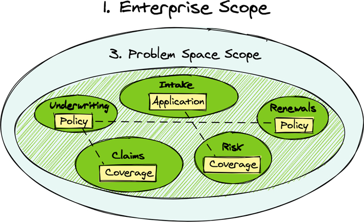

# 上下文专业知识

第 4 章，“实现领域驱动的结果”，确立了具有边界的上下文划分是必要的，以防止与使用相同术语但对这些术语有不同定义的专家进行对话时出现混淆。如“域和子域”一节所述，单个问题空间域中通常有多个视角。可以说，不同的专家从不同的角度看待问题空间。本章提供了在第 4 章中更抽象地讨论的主题的具体示例。这将澄清可能在抽象视图中提出的任何问题。

## 有界上下文和无处不在的语言

被称为领域驱动设计 (DDD) [Evans-DDD] 的软件开发方法解决了本书迄今为止讨论的上下文和通信。 DDD 的名称是针对相对狭窄的知识领域进行的一组专门对话，如图 4.1 所示。在图 4.1 中，它们被标记为范围 4，并带有单词 Context 或缩写为 Ctx。在 DDD 中，这些对话形成了所谓的无处不在的语言。这种语言存在于一个上下文中，称为有界上下文。
是的，图 4.1 是抽象的，因为这些概念可以应用于任何具体领域。在图 5.1 和“业务能力和上下文”部分前面有这些概念的具体示例。

图 5.1 限界上下文以其专业领域和语言命名。

Ubiquitous Language 和 Bounded Context 这两个名字可能不熟悉，看起来很神秘，但没有必要挂在它们上面。他们只是确定了已经广泛讨论的两个概念。它们为应用 DDD 的软件开发人员提供了一种共享一组名称的方法，这些名称指的是每个相关人员都可以使用的特定设计概念：
无处不在的语言。以团队为中心的通用术语集，在专业业务专长的知识领域中使用。通常，为团队创建通用语言的动机是参与项目的人员的不同背景，他们可能会以不同的名称想到一些概念。即便如此，该语言主要准确地识别了团队特定上下文中使用的各种术语的含义。这就是为什么在给定的上下文之外，相同的术语往往会具有至少轻微（如果不是很大）不同的含义。 “无处不在”这个词可能有点误导，因为它并不意味着这种专门的语言（包括定义）在整个商业组织中都是众所周知的。相反，该语言在单个团队内是已知的，但从对话中的术语和表达对该团队来说变得熟悉并渗透到团队产生的工件的意义上来说，它被认为是无处不在的。这是任何类型的软件建模，包括渲染到图纸和源代码模型中的内容。他们都“说”同一种语言。
有界上下文。单个团队使用术语、表达式和定义的业务规则来讨论和建模软件的上下文，这些规则反映了专业的、已获得的业务知识 - 一种无处不在的语言。术语和表达不仅是文字，而且有明确的定义。上下文是有界的，因为对话使用清楚理解的含义发生在边界内，而不是外部团队的财产，并且外部其他业务工作使用的术语和含义不会穿透团队既定的边界。在模块化方面，将限界上下文视为粗粒度模块。如何部署模块是另一回事。如第 2 章“基本战略学习工具”所述，应首先选择模块，并尽可能晚地选择部署选项。
图 4.1 显示了五个不同的有界上下文，每个都有自己专门的通用语言。通常，单个限界上下文归单个团队所有。但是，一个团队可能拥有多个限界上下文。要求限界上下文归单个团队所有，可确保不同团队之间相互冲突的目标和优先级不会导致单一语言中的混淆对话和不匹配的概念。

> 寻找边界
>
> 在参加 EventStorming 会议并使用其他发现和学习工具时，识别正确的限界上下文似乎过于具有挑战性。找到“正确”的限界上下文本身就是一个学习过程，这意味着犯错才能最终正确是一种成就。今天的“正确”在未来可能并不那么正确，这也是事实。
> 回想一下，任何一种模块化的第一个驱动因素是概念的凝聚力，这是通过交流和经验学习的。更具体地说，参与解决非常具体问题的对话的人可能与需要参与其他解决问题的对话的人不同。那是因为专业知识随着要解决的问题而变化。如果合适的人不在场并且稍后必须被召集，他们的参与可能不会发生在同一个解决问题的对话中。当多个专家聚在一起，但对某些定义和操作的“正确性”存在分歧时，他们可能没问题。话虽如此，他们的多种观点将焦点指向不同的背景。寻找围绕专业领域的商业模式边界，表明知识的各个领域。

强边界内的专用通用语言允许不同的团队对含义略有不同或差异很大的概念（包括其业务规则）使用相同的术语。例如，考虑术语产品。它可以有多种含义，包括你可以购买的东西，例如保险产品；计算数学乘法表达式的结果；以及要使用某些项目执行技术开发的软件。更典型的是，单个企业使用的产品这个词的含义略有不同。在保险行业，保单很可能是一个跨上下文使用的术语，每个上下文都有不同的含义。
试图将策略的所有含义统一到一个软件组件中充满了问题。 DDD 通过限界上下文避免了此类问题，该限界上下文用于分离术语策略的各种用途。在每个限界上下文中，术语策略都有明确的含义。这个想法是将单个企业中的差异视为正常而不是异常来接受和接受。
这种强边界还允许团队对相似的概念使用不同的语言术语。这可以通过考虑多种人类语言来最好地说明，其中相同的事物具有完全不同的名称。例如，英语的覆盖范围是其他三种语言的三个不同的词：法语、couverture；德语，abdeckung；和西班牙语，cobertura。将限界上下文视为使用国语的国界。虽然这个类比可能看起来有点牵强，但确实，业务的不同领域对重叠概念使用完全不同的术语，这些术语具有细微差别的含义。保险单的想法在整个企业中可能有以下名称：

- 政策
- 覆盖范围
- 合同
- 形式

可能不容易认识到的是，当这种差异存在于同一组织内时，当使用限界上下文来分离这些明显的语言差异时，不同的语言会推动自然的粗粒度解耦。换句话说，这些不同的术语将用于不同的专业领域。重要的是要注意这种情况并将它们分开。
如何知道何时使用了正确的术语？实际上，在前面的示例中，用于指代策略的所有四个名称都是正确的。同样，正确性取决于使用该术语的上下文，因为上下文预示着四个不同的专业领域。图 5.1 通过上下文名称引用图 4.1 中的五个上下文中的每一个来引起对这一点的注意。
每个限界上下文都应根据其专业领域进行命名。在该区域内，每个术语的使用都与上下文边界相关：

- 摄入上下文。保险申请由申请人提交。
- 风险背景。 Coverage 包含来自提交给 Intake Context 的应用程序的数据，用于计算与承保保单相关的风险。虚线指出Risk所用数据的来源——即数据来自Intake。 Risk 如何接收数据不一定用虚线表示。尽管应用程序数据源自 Intake Context，但在对其进行清理和扩充之后，它接下来会流向 Underwriting Context，然后流向 Risk Context。
- 承保背景。保单是收到申请详情，然后计算保险风险和保费率的结果。此处未显示速率计算组件，但当前可以通过与 Big Ball of Mud 遗留系统的集成来计算速率。
- 声明上下文。承保范围基于承保上下文中的保单数据。声明区域可能会也可能不会持久保存此数据。它可以在提出索赔时及时获得。此覆盖范围不同于风险上下文中的覆盖范围。
- 更新上下文。本政策基于承保政策，但并不完全相同。与在承保中承保和管理保单所需的内容相比，更新保单所需的内容最少。新费率可能通过重新评估风险（图 5.1 中未显示）来确定，这将基于对索赔范围提出的任何损失（或缺乏），进而对续保的保费产生影响。

这些上下文中的每一个都与同名的子域一一对应。即子域所代表的业务能力概念是在同名的有界上下文中实现的。

## 核心域
核心域是一个子域，在其中开发了重点核心战略业务能力。它是一个顶级的差异化因素，通过大量的交流和实验来验证对全新和创新想法的投资，然后使用有界上下文来实施。
核心域实际上是业务愿景所关注的地方。这是企业必须擅长的地方。在影响映射方面，有意推动业务实现目标的参与者、影响和可交付成果将是核心。最好的业务专业知识和软件开发人员组成了一个核心团队。因此，核心域值得在人才和时间上进行投资。
在图 5.1 中，承保很可能是作为一项核心计划开始的，因为它负责产生业务。起初，人类承保人将负责大部分风险评估并确定与这些评估相匹配的保费。然而，NuCoverage 知道它必须通过使用机器学习的风险管理来“击败市场”。与申请人进行 Intake 和 Underwriting 互动的网站获得了早期的核心焦点。与此同时，风险环境也在不断发展。在未来，当 NuCoverage 有信心将风险管理从人手中解放出来并将其转移到智能精算数学模型中时，这个开关就会翻转，并且 Intake 和 Underwriting 变得不那么重要了。
这表明一个企业可能有多个核心计划。在大型系统开发工作中，可能只有计划，例如承保和风险的后台工作。然而，这些举措的实际数量将与实现业务目标所需的创新水平一致。对核心计划的实际数量进行任意限制并不是无益的。与往常一样，这取决于。一个关键的限制因素是已经在职的人才以及可以招募并投入到核心计划中的人才。
我们在这里使用人才一词强烈暗示，必须以科学、实验的心态进行交流。这些人的智慧、创造力和干劲应该是可怕的，他们只能以与能力相当的报酬来换取。创新是有代价的，有点像财富 500 强 CEO 驾驶的汽车。尽管如此，天赋不是傲慢和戏剧的借口。最优秀的人在团队中工作，并且知道他们无法独自完成所有工作，因为他们了解自己的局限性。

> 当心维护模式
>
> 核心领域通常在项目开始时就受到业务部门的大量关注和投资，直到令人满意的交付支持定义的战略目标。该团队由经验丰富的高级开发人员、架构师和业务专家组成，他们将开展工作并取得成功。
> 大多数情况下，一旦实现了主要里程碑并满足了项目期限，项目就会过渡到维护模式。经验丰富的团队被解散，并聘请了一个初级团队来修补错误并添加任何缺乏的功能。然而，学习方面的重大突破发生在系统在生产中运行一段时间时。一直以来，反馈都是从平台监控工具、用户、客户和其他利益相关者那里收集的。必须进行调整和改进。这一阶段的一个关键问题是，随着经验丰富的团队成员的解散，项目开始时获得的原始知识已经丢失。替代者没有足够的观点、技能或知识来做出正确的决策和实施选择。
> 这就是为什么一个架构良好且结构合理的项目会变成一个大泥球的原因之一。最好拒绝维护模式的思维，让团队保持团结，并在项目的整个生命周期内继续投资。

早期，初创企业可能难以专注于一件事或几件事，但它必须了解其业务将在哪里获得收入以及如何取得成功。回顾一个想法的萌芽以及它是如何被风险投资的，可以帮助组织保持或重新获得关注。采用目标和关键结果 (OKR) 流程已使一些小型初创公司估值达到数千亿美元 [Measure]。不过，如果不小心，一家初创公司可能注定要走向熵——但至少它有一个优势，它不是从那个位置开始的。这使得快速创新成为可能。
对于大型企业来说，了解核心重点应该是什么可能不那么困难，但挑战很可能在于应该在哪里以及如何实现该重点。一家成熟的企业可能从熵状态开始，并且必须努力处理不破坏其现有数字资产的问题。第 6 章“映射、失败和成功——二选一”中“上下文映射”部分的讨论可以帮助企业管理这种情况。
此外，核心建模工作很可能不会在很长一段时间内保持核心。新投资将继续进行必要的新创新。今天的核心可能在未来的某个时候成为新计划的支持部分。

## 支持子域、通用子域和技术机制

企业不能像在核心领域那样在任何地方进行投资，也不需要。尽管绝对有必要，但大型系统的许多部分既不有趣也不值得深入投资。系统的这些不太重要的子域用于支持核心部分的整体功能。
这种较小的域往往分为两个主要领域：支持和通用子域。我们还可以添加另一个与实际业务无关的典型杂耍：技术机制。

### 支持子域
支持子域是为核心域的功能提供支持所必需的，但不值得投入核心领域的巨额投资。支持子域可能不包含可授权或订阅可用的商业软件产品。如果这样的支持子域在商业上确实存在，那么它很可能是高度可配置和可定制的。
因为支持子域可能无法购买，所以几乎肯定必须定制开发。然而，因为它不是核心，一个团队不应该在系统的这个支持领域花费过高的费用。一方面，被选中在这个子域工作的人才不应该是顶级的。虽然子领域人才无疑需要与业务专家沟通，但必要的讨论可能更多地由核心团队推动，因为核心团队知道他们需要什么来支持他们的努力。
另一种支持子域是具有可重用业务能力的遗留子系统。几乎肯定需要为遗留操作创建一个接口，以提供比可能（或可能不存在）更好的集成体验。同样，第 6 章中的“上下文映射”部分以多种方式解决了处理此问题的方法。
例如，NuCoverage 的两个传统支持子域是风险管理和保费率计算。必须为两者开发集成接口，因为它们的使用目前是遗留系统内部的。从长远来看，最好将这些资产从遗留系统中分离出来，并将它们移动到它们自己的上下文中，以便频繁地更改它们。这将在风险管理中更快发生，因为它将过渡到核心域。

### 通用子域

通用子域很复杂，需要大量的领域专业知识来开发，但可以通过多个商业闭源或开源产品获得。想想使用带有复选框的功能列表并排比较的两个或多个产品。对于这两种产品，几乎所有的复选框都被选中。应该选择哪一个？也许应该根据感知的声誉优势、一种产品的更大客户总数、市场上的时间长度或其他半有形或无形方面做出决定。
对于 NuCoverage，通用子域的示例可能包括行业标准风险模型、政策文档格式和生成、应用程序和索赔的照片图像扫描、批量销售和营销电子邮件提供商、客户关系管理、企业资源规划、身份和访问管理以及类似。

### 技术机制

不幸的是，软件开发的一些最低级别的领域往往会吸引开发人员的注意力，因为它们通常更具有技术性。管理层必须小心，不要让最优秀的人才被归类到这些领域，这些领域在前沿技术方面可能很有趣，但在业务底线方面却不会产生太大的收益。与这些工具相关的实际业务方面——如果有任何超越数据持久性和移动的方面——对深思熟虑的建模的要求较低。创新已经存在于机制中。

### 挑战软件工程师

优秀的工程师受到挑战的激励。如果他们没有受到他们正在解决的问题的挑战，他们就会在他们采用的技术中寻找挑战。解药是提供真正的挑战，这样工程师就不必寻找自己的挑战。
就技术吸引力而言，预计会看到一些最新的云基础设施和应用程序编程接口 (API)、部署容器、数据库、Web 用户界面框架、网络通信、消息传递以及任何有望实现大规模和高吞吐量。尽管肯定需要一些这些使数据移动和企业滴答作响的机制，但请注意，这些程序员磁铁不值得他们通常受到的全神贯注。让业务创新挑战大于前沿技术的吸引力。

## 业务能力和背景

第 2 章讨论了围绕业务能力组织团队并在分离业务能力的模块中捕获关键设计沟通的重要性。例如，限界上下文是一个顶级粗粒度模块，其中包含业务功能。
从长远来看，限界上下文可能不会保持其最初设想的样子。边界可能会改变。例如，在分解大泥球时，相关团队可能会发现一种称为保单持有人帐户的业务能力。这是管理任何类型保单的所有保单持有人的地方，并且此功能包括他们各自持有的保单种类的一些知识是有道理的。

> 作为收入来源的商业能力
>
> 一项业务能力必须与至少一个业务目标直接相关。不应猜测公司是否需要定义业务能力。业务能力回答“什么？”关于公司产生收入的方式的问题。关于业务能力的一个实质性问题是“如何？”影响映射，在第 2 章“有目的的战略交付”一节中讨论，从“为什么？”这个问题开始解释了推动软件交付。当团队在特定的专业知识背景下开始研究业务能力时，应该没有问题“为什么？” “为什么？”必须将其表述为明确的业务目标，但可通过询问“如何？”来确定可交付成果。一些影响将改变“谁？”的行为。参与者（例如，客户和竞争者）来达成“为什么？”目标。这使得承包商模型没有空间推动一项或多项影响映射练习尚未确定的特性和功能。影响可能会随着时间的推移而改变，取决于每个人的成功或失败，但目标不会改变，直到企业决定它不再是一个必要的目标。

该模块中包含的概念之一是数字保单文件，承认给予模范保单持有人的奖励。因为汽车保险是 NuCoverage 从事的第一个业务，所以支持的奖励是安全驾驶员奖励。使用主流政策信息维持安全驾驶员奖励似乎是合乎逻辑的。然而，随着时间的推移，NuCoverage 开始推出新的保险产品，包括新的奖励类型。例如，健康保险产品与 Good Health Rewards 相关联，而人寿保险也提供类似的奖励。这些奖励不仅旨在改善个人保单持有人的驾驶和健康状况，还旨在降低因对 NuCoverage 的财务影响而导致的车祸、医疗保健成本和过早死亡的风险。
随着这些奖励的数量开始增加，显然新的业务能力和新的专业领域开始形成。现在将保单持有人账户的奖励分解为他们自己特定的粗粒度模块是有意义的。奖励计划上下文是新的有界上下文的选定名称。与奖励相关的对话和学习机会在此背景下得到解决。在未来的某个时候，最好将特定奖励分解为它们自己的限界上下文。
一个设计良好的微服务应该包含业务能力，这意味着第一步是将微服务视为有界上下文。这决定了你在服务中放入的内容——即反映在通用语言中的建模业务能力。服务应该是自治的，支持模型作为数据和具有业务规则的操作。这种方法应该在整个系统解决方案中尽可能广泛地使用，不留任何关于业务能力在整体中的位置的问题。当然，这并不意味着短期内每个大泥球都可以被替换，但是使用上下文映射（在第 6 章中更详细地描述）是一种制造子域的显式表面的方法。
包含单一业务能力的限界上下文超越了技术边界。如果架构层包括 Web 用户界面，那么某种形式的以 JavaScript 运行的客户端代码将参与表达无处不在的语言。此外，主要服务将使用基础运行时平台（例如 Java 或 .NET）实现。不出所料，基于模型的业务功能可能会使用多种编程语言以及运行时平台来利用这些支持提供的特定技术优势。
企业业务部门、部门或部门并不总是能够很好地表明业务能力所在的位置。计算逐渐对业务运营产生越来越大的影响，其中工作流以前是由文件柜和从办公桌移动到办公桌的备忘录驱动的。现在电子文件夹、文件、电子邮件和工作流路由的使用要广泛得多。然而，之前或当前的业务运营和数据访问实践都没有定义业务的能力。因此，不应将业务能力与业务流程（以“ing”结尾的运营细节，例如定价）混淆，后者可能包含多种业务能力以完全解决业务运营问题。
要完全了解如何使用#agile 实现业务能力，需要检查在自然环境中工作的用户。否则，团队可能会错过在用户日常工作流程中收集重要步骤和手势的机会。这样的调查几乎肯定会发现应该通过改进系统来解决的痛点和解决方法。例如，假设你观察到一个用户在其显示屏上有一个或多个便利贴，或包含使用说明的电子表格，以帮助他们记住如何导航到和使用应用程序中的重要软件功能。这指出了一个必须承认和纠正的问题。这是在每个业务能力范围内充分开发知识领域的一部分。

## 不太大也不太小

“微服务好吗？”部分在第 1 章“业务目标和数字化转型”中，确定微服务与规模无关，而与目的有关。 “微”这个词在暗示某种尺寸限制方面具有误导性。然而，它不应该传达这些内涵。有关更多详细信息，请参阅第 1 章中的讨论。
就微服务或模块化单体而言，应用相同类型的模块化和设计实践，因为它们都专注于有界上下文。因此，你可能会问：有界上下文有多大？虽然这是一个错误的问题，但答案是另一个问题：上下文中的泛在语言有多大？换句话说，规模不能作为标准目标准确衡量，因为它是高度相关的。
限界上下文是对业务能力的封装，每个业务能力都必须有完整的实现。给定业务能力的任何部分都不应该在其限界上下文之外遗留或实现。限界上下文的唯一设计驱动力应该是业务能力及其泛在语言的范围，而不是规模。

> 嵌套有界上下文？
>
> 提出这个问题并不少见。不确定问这个问题的人是否真的理解有界上下文是什么以及它是如何设计的。想想这三个例子中提供的含义：
>
> 1. 如果上下文中有上下文，那么外部上下文或内部上下文将“说”两种语言的超集，而另一个会“说”其中的一个子集，这是理所当然的。外部上下文似乎最有可能“说出”超集。问题是，到底是为了什么？这看起来很笨拙，但对某些人来说可能是可行的。请参阅第 6 章中的“共享内核”部分，其中描述了某些人可能想到的内容。然而，共享内核通常不打算以这种方式使用。
> 2. 另一种可能性是“内部”上下文根本没有嵌套，而是独立的（例如，微服务）并且只能通过“外部”上下文访问。封装和细节隐藏是众所周知的原则。例如，得墨忒耳定律被称为“最少知识定律”。这似乎比第一个例子更合适，但并不是一个惊天动地的想法。它是（a）一个子系统与（b）另一个集成，然后又与（c）另一个集成，其中（c）对于（a）是未知的。这是一个常见的服务组合。
> 3. 也许问题不是关于嵌套上下文，而是关于具有“嵌套”内部组件的单个上下文。如果是这种情况，则上下文中的组件只是具有某些可见性范围的有界语言的多个元素。这也是一种常见的模式。
>
> 关于嵌套上下文如何工作，可能还有其他想法，这些想法或多或少有用。

考虑到这些因素，限界上下文通常不会像 100 行代码那样小。尽管不太可能在 100 行任何编程语言代码中实现完整的业务功能，但如果这是实现它所需要的，它可能会实现。此外，单个限界上下文本身不太可能是单体应用。
可以公平地得出有界上下文往往较小的结论。如果确实如此，将限界上下文视为微服务就足够了。如果其他驱动以某种方式导致相应的业务能力发生变化，比如被划分为多个业务能力，则根据驱动将其转化为多个Bounded Contexts。此前，越来越多的保单持有人奖励就证明了这一点。相反，如果存在变化率、技术规模和/或性能驱动因素，则对这些驱动因素做出响应。在这三种情况下，部署可能会发生变化，但逻辑有界上下文保持不变。假设这些驱动因素从一开始就存在，但没有经验证据，将会损害正在设计的系统。在最后负责任的时刻做出任何必要的改变是#agile 思维，也是更好的选择。

## 概括
本章介绍了领域驱动设计，重点介绍了两个战略建模工件，无处不在的语言和有界上下文。被称为核心域的专用有界上下文是开发战略业务能力的地方。本章还提供了关于不同类型的业务子域以及它们如何连接到业务功能及其限界上下文的观点。
最突出的几点是：

- 无处不在的语言代表发生在相对狭窄的知识领域中的对话，该领域由限界上下文语境化。
- 每个业务概念、各种术语的含义以及在上下文的特定语言中使用的约束业务规则都既准确又明确。
- 有界上下文界定了其无处不在的语言的适用性。
- 每个限界上下文应该由一个团队拥有，但一个团队可以拥有多个限界上下文。
- 核心领域是业务愿景的重点所在，也是对人才和时间进行投资的地方。
- Bounded Context 的大小应该由业务能力的范围和它的 Ubiquitous Language 来界定。

第 6 章介绍了帮助映射多个专业背景之间的团队关系、协作和集成的工具。映射类型解决了广泛的团队间情况、通信渠道以及从集成源交换信息和请求行为的方式。

## 参考

- [埃文斯-DDD] 埃里克·埃文斯。领域驱动设计：解决软件核心的复杂性。马萨诸塞州波士顿：Addison-Wesley，2004 年。
- [措施] 约翰·多尔。衡量什么重要：谷歌、博诺和盖茨基金会如何用 OKR 震撼世界。纽约：投资组合，2018 年。