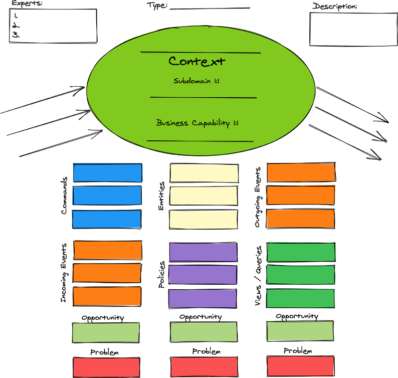

# 映射、失败和成功——选择两个

在任何涉及核心领域的项目中，几乎无法想象这种创新环境不需要与任何其他系统或子系统集成，包括 Big Ball of Mud 遗留系统。甚至有可能其他一些新的支持和通用子域将作为有界上下文实现，核心域必须依赖于“远程”功能。在这里，“远程”可能是指同一 Monolith 中的上下文模块与其他模块隔离，但它们之间没有网络，或者它实际上可能意味着物理上的远程。
本章从映射团队关系和多个专业背景之间的集成开始。后来，我们看到了许多关于导致失败的不良建模实践的警告。这些不是最终导致良好结果的快速失败，因此必须避免它们。接下来，我们探索往往会导致成功的实践。最后，我们演示了如何在问题空间及其解决方案中应用实验和发现工具。

## 上下文映射

任何两个有界上下文之间的映射称为上下文映射。本节提供了有效描述各种映射的图表和解释。图表很棒，但上下文地图超越了绘图。它们帮助团队识别他们面临的情况，并提供工具来发现和解决特定的建模情况。 Context Maps 的主要作用如下：

- 跨团队沟通
- 项目思考、学习和规划
- 集成情况发现和所需的解决方案

上下文映射被认为是真正的团队间关系，并作为源代码集成模式实现。本节讨论如何使用上下文映射将任何两个有界上下文相互集成。
任意两个有界上下文之间的上下文映射在图中表示为两个上下文之间的一条线，如图 6.1 所示。这条线可以有多种含义，包括现有的或必须建立的团队沟通类型，以及实现整合的方式。

图 6.1 两个有界上下文的上下文映射由上下文之间的线表示。

在描绘当前存在哪些条件的现实时，会努力评估团队之间作为组织结构和政治结果的实际关系和沟通。这种现实的观点清楚地表明，可能无法改变大部分动态，但强调了协同努力可以取得回报的地方。
在探索各个上下文映射类型之前，请考虑有关各种模式的一些要点。首先，上下文映射最初用于映射存在的内容。几乎总会有一些预先存在的系统，这些系统将包含新上下文必须与之集成的子系统。显示那些现有子系统是什么，并指出新上下文的团队与外部子系统及其集成产品中的每个团队的当前关系。上下文映射模式不是相互排斥的——它们往往会重叠。例如，合作伙伴关系可以包括使用共享内核和/或已发布语言。一个团队可能会寻求一些目标来改进其从现有情况到最有用情况的映射。有时这行得通。
现在考虑不同上下文映射类型的概述：

- 合伙。两个团队作为一个相互依赖的单元一起工作，以实现紧密一致的目标，这些目标通常必须一致交付。
- 共享内核。两个或多个团队共享一个团队同意的域概念的小模型。该协议包括共享小模型的语言。每个团队都可以自由设计特定于其语言的附加模型元素。
- 客户-供应商发展。一个团队作为供应商团队的集成商处于客户的位置。客户被认为是供应商的下游，因为供应商控制着客户的集成机制。
- 墨守成规。下游团队必须与上游模型集成，例如与客户-供应商开发。由于种种原因，下游不能将上游模型翻译成下游语言，而必须符合上游的模型和语言。
- 反腐败层。下游团队必须与上游模型集成，例如与客户-供应商开发。下游团队翻译上游模型，使其适合自己的模型和语言。
- 开放主机服务。上下文的团队提供了一个开放的 API，它提供了一种灵活的方法来在其上下文与其他人之间交换信息。
- 出版语言。开发了具有基于语言的类型名称和属性的标准化格式，用于在两个或多个上下文之间交换信息。该语言已发布，这意味着它提供了定义明确的模式，包括查询结果文档、操作命令和结果事件。
- 分开的方式。下游团队可以与上游模型集成，例如与客户-供应商开发；然而，为了避免这种情况以换取有限的利益，它选择创建自己的一次性解决方案。

现在让我们考虑每个上下文映射模式的细节。

### 合伙

与合作伙伴关系一样，这一过程涉及两方。 一些伙伴关系涉及更多的个人或组织，但通常我们认为伙伴关系只是双方的。 在讨论这种上下文映射类型时，让我们将伙伴关系映射限制为发生在两个团队之间的映射。
每个团队都拥有自己的限界上下文，但当然，它们必须以某种建设性和互利的方式协同工作。 在图 6.2 中，紧密的团队间依赖关系由两个有界上下文之间的粗线描述。 因此，伙伴关系的重点主要集中在团队之间的关系上，但也有可能他们比通常情况下更了解彼此的语言。

图 6.2 负责不同限界上下文的两个团队可能需要伙伴关系。

两支球队的目标一致，而且没有另一支球队都无法取得成功，这通常是真的。他们必须将他们的努力和沟通与这些共同目标紧密结合，这意味着他们必须在支持功能、集成、测试和时间表方面进行大量协调。例如，如果团队相互依赖，那么他们很可能共享某种模型，并且两个最终部署不能单独上线。至少一个必须在另一个之前不久部署，或者同时部署。
现在，就自治而言，这不是最好的主意。实际上，这根本不是一个好主意。但有时这是必要的。为了在组织文化和结构中建立团队自治，合作伙伴关系可能只是完成战略计划的短期措施。事实上，长期维持这种关系可能会给两个团队的运营带来压力，而且自治是不可能的。在我们在本章中介绍的一些即将到来的具体例子中，很明显，长期保持高度接触的伙伴关系是不必要的。
当两个团队实际上只是在同一个团队职责范围内创建子域的子团队时，负担会减轻。换句话说，一个七人团队可能让所有七名团队成员都在一个核心域上工作，然后将两个或三个成员分开来创建一个支持子域，因为最好将一个不是真正核心部分的模型彻底分开的战略。或许它是核心，但所涉及的专家和两者之间的变化速度大不相同，因为它们是由不同的战略重点驱动的。
例如，考虑风险子域团队。风险团队将通过机器学习更加专注于精算任务。这个团队逐渐意识到，他们也默认继承了计算保费费率的工作。毕竟，利率与风险确定的结果密切相关。团队明白，虽然这是业务的必要部分，甚至可能是其核心，但基于精算风险的算法由不同的业务专家驱动，并且以与费率计算不同的速度变化。
毫无疑问，随着时间的推移，精算结果将产生不同的数据类型，但风险团队不想承担额外的负担，为要使用的费率计算设计标准信息交换规范。风险团队更希望该标准由更专注于保费率需求的团队制定。一个独立的 Rate 团队甚至可能会实施该标准。
在两个上下文（风险和比率）之间创建分离意味着必须有两个团队。即便如此，两个团队必须紧密合作，原因有两个：

- 信息交换标准必须由费率团队指定但由风险团队批准，因此需要持续协调。
- 风险和利率产品必须同时准备好发布。

长期维持这种伙伴关系不是一个好主意，因此两支球队将在未来需要较少协调的情况下解决打破密切联系的问题。为此，他们将依赖其他上下文映射模式。

### 共享内核
共享内核是一种映射，其中可以在两个或多个有界上下文之间共享一个小模型——这种共享实际上被包含为每个消费上下文的无处不在语言的一部分。共享内核既是一种团队间的关系，也是一种以代码为中心的技术关系。
团队间的沟通在这里很关键；否则，任何参与的团队都不太可能知道一个团队已经拥有一个可以共享的模型，甚至不太可能意识到共享的必要性和潜力。或者，两个或多个团队可能需要认识到大型系统中的上下文之间将存在共享概念，并理解他们应该围绕它形成一些标准。在这种情况下，模型的复杂性和精度足够高，不共享它对所有潜在受益者来说会更糟。
例如，也许一个给定的系统甚至整个组织内的几个子系统都需要标准的货币类型。不了解应如何处理货币计算和货币之间交换的程序员可能会导致一些非常大的货币问题——甚至是法律问题。由于大多数货币方案使用小数点来表示整个面额的一小部分，因此程序员通常认为浮点数是最好的类型。实际上这样做会导致金钱损失和/或收益，最终会导致巨大的财务差异。浮点值是在给定业务中模拟货币的最糟糕方式。首先，舍入的做法对于单精度和双精度浮点数都充满危险。如果财务计算需要小数精度，那么使用“大十进制”类型可提供数十亿小数位的精度。其次，通常最好将货币值视为没有小数点、缩放或四舍五入的整数。在这种情况下，有一个隐含的和可视化的格式化小数点在整个数字字符串的右侧放置了许多数字。货币转换和对多种货币的支持也在这里发挥作用。
如果系统没有提供满足金融标准所需的多功能性和正确性的共享货币类型，如图 6.3 中的货币共享内核所示，那么每个参与其中的人都应该回家重新思考他们的生活。

图 6.3 名为 Monetary 的共享内核包括 Money 和其他货币类型。

请注意，图 6.3 并不表示货币是一个单独的有界上下文。它不是——但它也不仅仅是一个图书馆。货币是至少两个团队同意共享的模型的一部分。为了更清楚地说明这一点，Monetary 模型不保留 Money 对象或记录。相反，共享和使用货币模型的限界上下文负责将货币值持久保存在它们自己的单独存储中。也就是说，Underwriting 将任何 Money 值保留在其拥有的数据存储中，而 Risk 将任何 Money 实例保留在其单独拥有的数据存储中。
这种共享模型在其他领域也很重要。例如，考虑通过收集多个卖单的股票价格来支持买入交易的固定买入价的股票交易，这些卖出订单一起平均为买入的固定价格。这个模型概念有时被称为“报价栏”。它可以是共享内核的一部分，该内核在由各种专业交易子域使用的模型中提供通用交易组件。
使用国家或国际编码标准会出现另一个潜在问题。例如，医疗和保健领域使用 ICD-10 代码，该代码在近 30 个国家/地区被认可用于计费和报销收集目的。 100 多个国家使用 ICD-10 代码来报告死亡原因的统计数据。这些类型的标准形成了自然的共享内核模型。
一个常见的错误是将限界上下文之间交换的某些类型的信息（例如事件）视为共享内核。这通常不是这种情况，因为当一个事件被消费限界上下文接收时，通常会在外部边界转换为命令或查询。当这种转换发生时，在消费限界上下文的核心（即在其域模型中）永远不会知道特定的外部事件类型。执行从外部语言到当地语言的翻译意味着外部语言不会被用作当地环境的可接受语言。因为它不是本地上下文通用语言的一部分，所以它不会在两个上下文之间共享。
本地域模型将真正共享的类型（例如货币）视为其通用语言的一部分。如果允许外部事件在本地域模型中有意义，那么它可能被视为共享内核的一部分。这实际上不是一个好的做法，因为它在此类事件的生产者和消费者之间建立了强耦合。从外部事件转换为内部命令是更好的选择。

### 客户-供应商发展
考虑当团队之间存在高度自治时所涉及的动态：

- 有两支球队。
- 一个团队被认为是上游。
- 另一个团队被认为是下游。
- 下游团队需要上游的集成支持。
- 上游团队对下游团队获得的东西拥有支配权。

这种关系为上游团队提供了自主权。下游团队也可以实现高度自治，但他们仍然依赖于上游。只要上游为该团队提供必要的集成功能，下游就会保持有利的局面。下游可能只需要上游已经提供的东西，这将使每个团队都能保持自己的节奏。然而，如果上游没有也不能/不会提供下游需要的东西，情况可能正好相反。也可能是下游团队的声音足够大，他们的需求对上游的影响足够大，以至于上游团队在他们自己计划的功能发布方面重新紧随其后。这种关系甚至可能会产生足够负面的后果，以至于下游压力导致上游团队偷工减料，从而导致他们自己的模型变得脆弱。考虑到这些后果对双方都有重大影响，除非小心翼翼地帮助他们一起工作，否则两个团队的努力可能会脱轨。事实上，这种政治影响力实际上可以完全翻转上下游关系。
例如，假设为了保持自治，上游团队打算在他们自己的模型上取得快速进展。然而，这些成就可能是以牺牲下游为代价的。如果上游以不再支持下游的方式发生变化，例如破坏先前建立的信息交换协议和模式，就会发生这种情况。一个典型的情况是，当上游的其他压力不兼容时，一个或多个先前依赖的下游环境发生了变化。回归首先伤害了下游团队，但毫无疑问，上游团队很快就会受到影响，因为他们必须修复他们破碎的交换合同。
建立正式的客户-供应商开发关系可以让上游和下游团队都站稳脚跟。以下是必要的：
在两个团队之间建立正式的关系，让双方在沟通和对支持的承诺方面保持诚实，并且作为一个客户，了解他们不是他们的供应商，也可能是前合作伙伴所面临的孤独压力。

尽管上游独立于下游取得成功是可能的，但建立正式的命名关系往往会加强一种理解，即两个团队之间必须达成一致，但不能达到合作的程度。达成一致对于整体成功至关重要。
在同一组织之外，这种模式可能更难以实现。然而，即使上游团队作为一个独立的组织完全处于外部，他们仍然必须理解他们的客户很重要并有发言权。尽管客户并不总是正确的，但承认他们确实向供应商支付了真实的钱是有帮助的，这就是使他们“正确”的原因。否则，将不可能留住客户——工作留任也是如此。供应商越大、权力越大、影响力越大，就越不可能采取利他行为——也就是说，除非客户同样规模更大、权力更大、影响力更大，并且为服务支付了很多钱。
让上游团队为其产品建立 API 和信息模式标准将有所帮助。即便如此，上游供应商必须愿意接受一些责任来满足下游客户的要求，这进一步需要就交付什么以及何时交付进行一些谈判。一旦这些参数到位，就必须采取措施确保下游客户得到一些可靠的必要支持流。
之前对 Risk 和 Rate 之间的伙伴关系的讨论表明，长期保持这种相互依赖会给两个团队的运营带来压力，而且自治是不可能的。随着时间的推移，随着它们的同步发布带来可靠的稳定性，将有可能脱离伙伴关系。然后，团队很可能可以建立客户-供应商开发关系，向前发展。图 6.4 描述了这种关系的上下文映射。

图 6.4 两个团队之间的客户-供应商开发关系。

乍一看，速率上下文可能是上游，因为在伙伴关系下，它负责指定信息交换协议和模式。然而，即使在这种关系中，风险也有能力接受或拒绝规范。实际上，合作伙伴关系中已经建立了一些客户-供应商开发关系，尽管规模很小，因为协调发布优先级往往会否决对模式质量采取强硬路线。团队希望建立一个更通用的规范，以更好地支持未来的风险确定。同时，他们知道尝试实现这一结果不会有成效，尤其是在很早的时候。因此，他们决定将这项努力推迟到最后一个负责任的时刻。团队同意稍后需要开发合同的第二个或第三个版本，届时他们将学到足够的知识来更好地确定如何建立更灵活的模式。

### 墨守成规的人

当少数条件中的至少两个存在时，符合主义关系才有效。上游模型又大又复杂，而且……
下游团队无法翻译上游模型，通常与时间、能力和/或团队带宽有关。因此，它们出于必要而符合。
下游团队不会通过翻译上游模型实现任何战略优势。这可能是确定下游模型可以足够接近上游模型的问题；或者下游解决方案可能是临时的，因此使解决方案更加复杂是浪费。
下游团队无法为他们的环境提出更好的模型。
上游集成信息交换模式的设计是对上游内部模型结构的一一映射，内部模型的变化直接反映到交换模式中（这是一个糟糕的上游设计）。
在这种情况下，下游团队决定（或被迫）完全符合上游模型。换句话说，下游使用上游的泛在语言，结构或形状将是一对一的。
考虑这种模式的一种方法是认识到上游的 API 用于交换信息和执行操作，而不是尝试使其更优化地适应本地下游模型。如果来自上游的数据必须以任何方式进行操作，甚至是持久化，然后再发送回上游，那么它就存在于下游，就像在上游一样。
如图 6.5 所示，下游速率上下文符合上游风险上下文的评估结果模型。这是因为保费率计算基于风险评估，无需更改费率计算。 Rate Context 团队对上游评估结果模型规范有重大影响，这使得使用交换模式和符合模型语言和结构更加可口。

图 6.5 下游 Conformist 按原样使用上游模型。

没有理由翻译上游，因为这样做是不必要的、耗时的、自命不凡的工作，也会增加风险。如果选择翻译作为首选方法，每次上游评估结果模型更改时，下游模型的翻译层也必须更改。当然，Rate 团队必须对评估结果模型的上游更改做出反应，但由于他们对规范有很大的影响，他们实际上可以提前计划必要的消费者代码修改。
理想情况下，每个团队的上下文将尽可能具有凝聚力，并尽可能与其他上下文分离。耦合和内聚是根据改变某些东西所需的工作量来定义的 [StrucDesign]。如果这两个上下文中的任何一个不经常更改，那么耦合就不是真正的问题。考虑更改频率并防止耦合（如果它会对团队产生负面影响）是一个很好的经验法则。
在这种特殊情况下翻译确实没有意义，但不可能制定一揽子规则。相反，应根据具体情况做出这些决定。应适当考虑上游泛在语言与下游消费者泛在语言的兼容性，但也必须权衡前面列出的其他因素。此外，以下上下文映射确定了采用翻译方法的其他后果。

### 反腐层
反腐败层与顺从者完全相反。这种模式采取防御性集成的观点，尽一切努力防止上游模型破坏下游模型。下游是反腐败层的实施者，因为该团队必须负责将上游可用的任何内容转换为其消费模型的语言和结构。下游也可能必须将数据更改发送回上游。当这种情况发生时，下游模型必须转换回上游理解的模型。
在许多情况下，上游系统是遗留的 Big Ball of Mud。如果这是真的，不要指望上游有丰富的面向客户端的 API 和定义明确的信息交换模式。与上游的集成可能需要被授予上游数据库的用户帐户并执行即席查询。尽管本书无意提出技术建议，但承认 GraphQL 的引入代表了此类工作的游戏规则改变者似乎确实是恰当的。然而，我们不应该将 GraphQL 的存在视为以需要使用它的不合标准的方式设计集成的借口。
即使上游模型确实拥有丰富的面向客户端的 API 和定义明确的信息交换模式，下游团队仍可能决定将上游模型转换为自己的通用语言。从上游上下文中强加一个或多个外来词 ^1^ 可能不适合下游无处不在的语言。团队可能会决定，对于某些本地术语来说，形成 calque^2^ 是很自然的，和/或定义一个完全不同的术语可能会更好。所有这些选项都可以在认为合适的情况下混合在一起。翻译决策属于下游团队。

> 1 外来词是一个或多个词，与另一种语言完全相同。例如，除法语以外的所有使用“déjà vu”的语言都使用外来词。
>
> 2 calque 由一个或多个来自一种语言的单词组成，并被音译为目标语言。例如，英语“beer Garden”与德语“biergarten”相呼应。

重点并不一定是上游模型是一团糟，难以轻易与之交换信息，并且必须执行英雄壮举才能将其转化为下游消费。相反，重点是，如果下游不以上游的方式思考和说话，那么从下游团队时间和能力的角度来看，翻译将是有帮助的，甚至可能是合适的。
图 6.6 描绘了一个反腐败层访问具有当前 NuCoverage 溢价计算规则的 Big Ball of Mud 遗留系统。这是作为风险上下文团队的临时步骤完成的，这将足够，直到可以在本地完全实施改进的模型。

图 6.6 费率上下文向遗留系统查询溢价计算规则。

图 6.6 所示的模型在添加、编辑、删除、启用和禁用规则方面将更加通用。反过来，这些规则可以用于生产中的实验性 A/B 测试。在那之前，Rate Context 团队已经实施了他们认为是他们完全设计的未来模型的相当好的代表。因此，他们将上游规则转换为他们的本地模型，作为测试他们对新本地模型的假设的一种手段。目前，当需要工作模型时，拥有通用模型并不重要。

### 开放主机服务

有时，团队预先了解当前和未来集成客户的需求，并有足够的时间为他们进行规划。在其他时候，团队可能不知道任何集成需求，然后在试图追赶时被抓住。创建开放主机服务可以解决这两种情况。
将开放主机服务视为用于交换信息的 API，其中一些交换可能需要 API 提供者支持从下游到上游模型的数据突变。
现在，考虑上游团队可能会遇到的以下潜在集成情况。让我们以 Rate 团队为例。

#### 团队早知道

在午餐对话中，实施 Rate Context 的团队了解到至少有其他下游团队需要访问他们的模型。下游团队对围绕计算出的保费率进行分析感兴趣。在同一次午餐期间，新的下游分析团队宣布了他们的依赖关系，这表明另一个团队，可能还有更多团队，也将需要相同类型的集成。现在（突然）上游团队没有面试其他团队，只知道一个。他们是否应该努力为他们目前知道的单个依赖下游团队提供 API？或者他们应该只为这个团队提供一个数据库用户帐户？

> 断言：与一个下游客户端共享对数据库的访问从来都不是一个好主意
>
> 这种方法提供了对持久数据的深入访问，以及潜在的创建和更新权限。想象一下，当拥有团队仍然幸福地不知道它们时，“随意”发生的数据突变可能造成的损害。深度依赖还使得上游很难更改数据库模式，或者对下游影响很大，或者两者兼而有之。随着时间的推移，可能很难知道谁依赖于数据库，谁不依赖于数据库，而这通常是一个艰难的教训。一旦系统在生产中运行，性能就会下降，更糟糕的是，不同表上的死锁会使整个系统陷入停顿。根据经验，使用共享资源往往会将耦合隐藏在应该显式建模的地方。由于这些和其他原因，共享对持久性机制的直接访问是一个非常糟糕的主意。
> 上游 Rate 团队可以设计一个 API 来处理单个下游客户端，但没有太多花里胡哨的东西。这可能需要下游分析团队承担一些开销，从与上游 API 的不太理想的交换中自行转换消耗的模型。至少现在它似乎是一个只读 API，这意味着它只是基于查询的。

如果上游 Rate 团队要采访其他潜在的下游客户，他们可以更好地确定更广泛的需求。如果他们从一个或多个客户那里得到肯定的答复，那么在 API 的开发上投入更多精力是值得的，尤其是当其他团队需要交换查询之外的信息时。 Rate 团队进行了一些采访，了解到现在至少三个团队（包括分析）需要 API 访问权限，另外两个团队需要将新的和更改的信息推送回 Rate Context。

#### 团队很惊讶

期望提供开放式集成的团队面临的最糟糕情况之一是，当他们对迟到的需求感到惊讶时。这个问题可能是由于组织的沟通结构不佳造成的。回想一下康威定律：一个组织生产的系统将反映其通信结构。现在想一想当通信潜伏发生时会发生什么，并且声明其依赖关系的团队需要在短时间内获得支持。现实正是任何人都期望的悲伤场景。 API 的结果将反映可用于实施它的精简时间表。如果处理得当，债务将被记录和支付。更现实的是，如果其他团队不断提出类似的“哦，顺便说一句”的支持请求，情况只会在好转之前变得更糟。
尽管有时会做出明显的努力来改善组织沟通渠道，但一些组织过于庞大和复杂，无法完全防止这种不愉快的情况，至少在短期内是这样。任何组织都不应该接受这种现状，因为有办法打破团队之间的沉默和墙壁。为了团队、项目和公司的利益，尽早解决这些障碍。考虑在使用同一系统的团队之间实施每周闪电（10 到 15 分钟）会谈。 4 到 6 个团队可以在一小时内展示他们的进度。这些会议必须由所有相关方参加，并且演示文稿不得包含虚言或吹嘘的重点。相反，团队必须分享他们所拥有的价值、他们在哪些方面遇到困难以及他们需要什么。
另一种方法是通过确定每个团队中必须与首席工程师协作以确保集成计划和正确同步的负责工程师，将工程学科纳入系统。首席工程师将采用所谓的整合事件或同步和稳定事件——形成有目的的组织沟通结构的结果。这些事件每隔一段时间进行计划和跟踪，以确认所有集成团队通过跨子系统的工作集成交付新功能的子集。良好的集成事件将带来隐藏的问题和交互，以及次优化正在扼杀组织使用此新产品取得成功的整体能力的地方。如果在会议团队日程中出现问题，负责工程师必须尽早与总工程师沟通这些问题，但最迟应该在整合活动中浮出水面。这种以工程为中心的方法不是项目管理，而是工程师共同努力以实现与业务目标保持一致并实现业务目标的技术里程碑。
假设由于生产问题午餐约会被取消，Rate 团队发生了意外——这种情况即使在相对较小的组织中也很容易发生。在前一个场景中，只是偶然的机会让 Rate 团队了解需要信息交换的 Analytics 团队。同样，Rate 团队也只是偶然地得到了其他团队最终需要依赖关系的提示。如果午餐重新安排在下周，工作主题可能会被法网、冠军联赛、WNBA 或那张很棒的 Oceansize 专辑抢占先机。然后，惊喜！
没有时间处理这些计划外的糟糕情况的主要问题是，其他团队可能会被迫分道扬镳，甚至与传统的 Big Ball of Mud 进行整合，因为它被替换时可能会落后于曲线，因为例如，通过新的速率上下文。还需要付出很多努力才能与遗留系统集成，并保持一厢情愿的想法，即所交换的内容在数周、数月甚至数年后仍然具有相关性。即使沟通失败，Rate 团队也无法通过延迟其他团队的日程安排来强制整合。
Rate 团队在短期内可以做的最好的事情是提供一些不太好的下游通道。也许开放一组 REpresentational State Transfer (REST) 资源将使这个解决方案更能被两个团队接受，并能够满足时间紧迫的需求。或许可以求助于下游团队的帮助，而那个团队可能确实会因为他们潜在的沟通而遭受一些痛苦。事实上，即使是现代化的 Rate Context 上的有限 API 也可能比笨拙的遗留系统更好用。
尽管如此，通过引入诸如此处提到的那些工程学科，可以在很大程度上避免所有这些麻烦的情况。

#### 服务接口
在上述两种情况下，Rate 团队及其家属最终都在同一个地方——各方都面临来自外部的压力。如果有更多的时间来思考、计划和实施，Rate 团队就会站稳脚跟。即便如此，交付是唯一可行的选择，因此团队继续前进。
在发现三个团队将依赖 Rate 之后，挑战似乎不在于 API 本身的复杂性，而在于所涉及的信息交换模式。因为保险费率规则和计算最终会被更改，甚至可能每天多次更改，并且新规则数量的不断变化可能很大，所以信息交换模式将是一个移动的目标。下一部分“已发布语言”将更详细地描述如何应对这一挑战。
一个考虑是某些信息最好作为在上游速率上下文中发生的事件流可用。因为所有三个依赖项都对上游发生的更改的某个子集感兴趣，所以 Rate 团队可以使查询 API 的一部分成为下游“订阅”他们所关注的 Rate 上下文中发生的总数的一种方式愿意分享。此查询 API 可能会作为 REST 资源提供。风险团队可能会将事件放在发布-订阅主题上。
这两种策略各有优势。如第 2 章“基本战略学习工具”所述，组织可以使用架构决策记录 (ADR) 来概述可能的决策；在这种情况下，有两个。集成测试可用于演示选项。下游团队对这两种方法的熟悉程度可能是决定性因素，但不一定。做出决定后，将其包含在 ADR 中。
Rate 团队必须牢记，他们的事件流可能无法承载消费者所需的全部负载。如果是这样，API 必须支持提供比事件携带更深入的信息视图的查询，或者事件本身应该携带更丰富的有效载荷。查询返回的一个问题是与提供事件引用的数据版本相关的挑战。现在上游中被视为当前的数据可能已经转换了一次或多次，因为导致最终查询返回的事件可以由下游处理。缓解这种情况可能需要上游维护潜在查询数据的快照版本。或者，如前所述，事件可以被设计为携带关于事件发生时的状态的足够大的有效载荷，以否定查询。作为另一种可能性，下游可能必须了解如何处理不再包含当前状态之前发生的事情的查询返回结果。速率上下文提供速率计算事件以消费下游上下文，如图 6.7 所示。

图 6.7 具有多个下游消费者的开放主机服务。

可能没有预料到承保是下游，因为它是风险的上游，而 Rate 根据风险的评估结果计算保费。然而，承保必须以某种方式消耗计算出的保费是可以理解的。如果承销商不订阅下游头寸，它就必须进行一些非常奇怪的波动才能获得溢价。重要的是，费率计算事件必须携带与原始承保申请或导致风险评估和费率计算的某些其他类型的实体相关联的身份。预计，分析上下文也会使用该事件。同样，Agents Context 使用该事件，让 WellBank 和其他代理有机会在每个步骤发生后不久查看处理活动。
API 的其余部分应该以极简主义的心态设计，只提供绝对必要的内容。此 API 可以作为 REST 资源或通过异步消息传递提供。在当代系统设计中考虑基于简单对象访问协议 (SOAP) 的远程过程调用 (RPC) 似乎很愚蠢，但它们仍然可用，并且可能会存在于某些遗留系统中。如果今天需要 RPC，通常会使用 gRPC 而不是 SOAP。更重要的是，随着下游客户端驱动功能和信息交换模式，API 应该随着时间的推移而构建。这可以通过消费者驱动的合同 [Consumer-Driven-Contracts] 来实现，该合同是在消费者表达他们的需求时制定的。使用这种方法时，可以为每个消费者量身定制合同。也有可能为所有消费者提供由所有消费者需求合并确定的所有信息的超集。
第三部分的章节更详细地介绍了 API 设计的风格。接下来，我们讨论API的另一半——即信息将如何交换？

### 出版语言

限界上下文通常是通用系统解决方案中一个或多个其他协作限界上下文甚至外部系统所需的信息源。如果信息的格式难以理解，那么它的消费将是棘手且容易出错的。为了避免这种困境并增强相关信息的可交换性，组织可以采用标准化的强模式。在领域驱动的术语中，这被称为已发布语言。已发布语言可以采用多种形式，如表 6.1 中所述。

表 6.1 从国际到单一企业服务的已发布语言模式

| 类型                                                   | 例子                                                         | 结果                                                         |
| ------------------------------------------------------ | ------------------------------------------------------------ | ------------------------------------------------------------ |
| 由管理组织支持的国际或国家工作组定义的行业范围的强模式 | Health Level 7 (HL7) 数字医疗交换标准：对于整个系统解决方案中的所有子域以及跨系统和组织之间的子域，使用 HL7 交换医疗临床和管理信息可能是一项要求。 | HL7 在支持确定的记录类型方面是一个强大的模式，但在每个记录类型中的字段定义方面却很弱。 这可能导致模式被滥用，并可能需要使用它的业务实体进行解释，这可能与其他组织的使用不同。 即使使用 HL7，组织间数字医疗保健交换也可能需要数据生成和解析的转换或重组。 |
|                                                        | GS1 全球数据识别标准。 这是围绕 B2B 信息交换（包括电子商务）的条形码和其他标准的起源。 | 有一个定义明确的标准，即使在每种记录类型中也是如此，但它可能需要大量记录来定义一个非常小的数据集。 在一个电子商务使用示例中，需要 300 到 350 个记录类型才能正确定义总行数少于 20 的产品订单信息数据集。 创建标准的源代码实现、生产者输出编写者和消费者输入阅读者是一种耗时的经历。 这强调了“规范数据模型”模式的缺点，在这种模式中，试图制定一刀切的标准。 这种方法会导致膨胀，因为它试图定义大量行业中所有可能需求的超集。 |
|                                                        | ICD-10 是国际疾病和相关健康问题统计分类的第 10 次修订版，这是世界卫生组织制定的医学分类清单。 | 这是一套庞大但清晰直接的医学编码。                           |
| 由特定业务实体内的委托人管理的组织内部标准             | 这些标准由每个组织根据具体情况定义。 与标准定义组织集成的外部企业可能（或必须）使用该标准。 甚至内部系统也可能必须使用相同的标准来交换信息。 | 为定义提供灵活性，并为外部集成提供明确的方向。 然而，这种方法会给组织的系统企业内部的交换增加不必要的开销，因为可能需要系统间和上下文间交换来提供比实际甚至可能更多的信息。 |
| 上下文/子域标准                                        | 每个限界上下文可以定义自己的数字交换标准。 每个其他限界上下文、子域和整个系统解决方案都必须使用由每个给定限界上下文定义的强模式。 | 为每个子域 à la 有界上下文提供最佳信息交换模式定义。 对于需要与其他几个有界上下文集成的单个有界上下文来处理所有不同的模式可能很困难。 然而，有许多集成可能会指向其他问题。 此外，上下文/子域标准可能不足以用于组织企业外部的集成。 即便如此，通过将单个模式标准输入为组织间交换定义的那些标准的超集，可以更全局地使用它们。 |

表 6.1 中列出的国际模式标准只是各个行业中可用的标准的一小部分。使用此类标准时存在明显的权衡，但需要注意的一件重要事情是，使用强大的规范模型对于内部企业使用具有明显的劣势。这些模型不仅更难以坚持，而且还要承担更高的传输开销。如果企业在云上，这将对成本产生影响。
图 6.8 显示了 NuCoverage 中的三个已发布语言示例。风险上下文有自己的发布语言，其中一个元素是名为 Risk Assessed 的事件。速率上下文具有不同的发布语言，其中一个元素是速率计算。 Risk Assessed 事件对Rate 有影响，而Rate Calculated 事件被承保上下文消耗。反过来，承保上下文根据一个或多个费率计算事件构建报价，并为每个完成的报价发出报价生成事件。

图 6.8 风险、费率和承保提供自己的发布语言。

维护国际、国家和组织定义的发布语言并使其对消费者可用的一种方法是通过模式注册表。一个有价值的模式注册表支持任意数量的业务上下文模式，每个模式都有多个版本，并提供版本之间适当的兼容性检查。一个这样的模式注册表可作为开源、反应式 VLINGO XOOM 的一部分在其 Schemata 工具 [VLINGO-XOOM] 中使用。

### 分开的方式

当一个团队可能会与另一个限界上下文集成，但成本可能高于获得的潜在收益时，该团队可能会决定采用各自的方式。采取不同方式的团队创建他们自己的一次性解决方案，或者做出更简单的建模决策，帮助他们快速解决面临的问题。
给定的限界上下文可能与其他上下文根本没有集成。但是，可以根据具体情况应用此模式。换句话说，正在讨论的团队可能会与一个或多个限界上下文集成，但不会与其他限界上下文集成。

The downside to taking this route appears when the solution chosen creates significant silos of data and/or domain expertise expressed in software that are roughly duplicates of other areas of a system.一定程度的重复并不总是坏事，但太多就是太多了。不要重复自己 (DRY) 是一句适用于知识而非代码的格言。通过在多个上下文中编码的专业知识来创建大量重复数据和重复知识并不是分离方式模式的预期效果。

## 地形建模
在参与 EventStorming 会话时，似乎很难找到界限。正如之前所建议的，参与者应该从业务能力的角度思考，并认识到专家之间的沟通驱动因素。这些是组织边界的最佳方式，也是最好的起点。随着业务的增长和变化，新的业务能力变得必不可少，更多的细化将会发生。
另一个有助于定义边界并阐明边界如何协同工作的工具是地形方法。地形可能意味着一些事情。根据 Merriam-Webster 词典，其定义包括：

1. 
    1. 通常在一个地方或地区的自然和人造特征的地图或图表上详细描绘图形的艺术或实践，特别是以显示它们的相对位置和高程的方式。
    2. 地形测量。

2. 
    1. 表面的构造，包括其浮雕及其自然和人造特征的位置。
    2. 物体或实体的物理或自然特征及其结构关系。

所有这些定义都适用于使用这种方法。
是的，限界上下文内的通信有助于团队了解内部的内容，但限界上下文之间的通信和映射会进一步告知上下文本身。这些元素包括上下文映射，但通过增强的可视化映射模型掌握详细信息交换模式的实际流程更有帮助。使用地形建模是一种更好地了解系统形状和特征的方法。图 6.9 提供了地形建模的模板。

图 6.9 地形建模模板图。

图 6.9 中模板的几个区域可以填写信息（见表 6.2）。 生成的模型可以按照处理流程的顺序放置在桌面或墙上，类似于 EventStorming 时间线。 该模板为团队提供了许多占位符，可用于显示比 EventStorming 时间线中单个点给出的更多上下文。 可以根据需要将其他占位符区域添加到建模地图的任何部分。 该模板有意省略了架构细节，虽然这些细节对于运行时操作是必要的，但只是为了混淆模型中更重要的部分。
表 6.2 地形建模模板区域和说明

| 区域类型       | 描述                                                         |
| -------------- | ------------------------------------------------------------ |
| 专家           | 写出对通信上下文知识领域做出贡献的业务专家的姓名。           |
| 类型           | 子域类型：核心、支持或通用。                                 |
| 描述           | 上下文目的的简要总结。                                       |
| 语境           | 在上一行写上通信上下文的名称（即有界上下文的名称）。         |
| 子域 1:1       | 写下此上下文的子域的名称。上下文和子域应该具有一对一的关系。如果名称相互冲突，则子域对齐有问题。如果往往有多个子域，则模型焦点可能存在问题。 |
| 业务能力 1:1   | 写出此上下文提供的业务能力的名称。上下文和业务能力应该是一对一的关系。如果名称相互冲突，则业务能力对齐存在问题。如果往往存在多种业务能力，则模型聚焦有问题。 |
| 箭头，左侧     | 可用的传入集成和协作点，以及哪些上下文使用它们。如果已知，命名上下文映射类型和使用它的有界上下文。已知的合作者将是合作伙伴或上游上下文；下游将是未知的。 |
| 箭头，右侧     | 与其他上下文的传出集成和协作。命名上下文映射类型和目标有界上下文（如果已知）。已知目标可能是合作伙伴或上游上下文；下游将是未知的。 |
| 命令           | 分派到域模型的突出命令。                                     |
| 实体           | 命令所指向的域模型中的显着实体。                             |
| 即将发生的事件 | 实体发出的突出事件。                                         |
| 传入事件       | 限界上下文通过表示集成点的左侧箭头接收到的突出事件。         |
| 政策           | 要应用于传入事件或分派到域模型的命令的任何业务规则。         |
| 查看/查询      | 必须将模型更改投影到其上的突出查询模型视图，以确保相关查询将提供可见数据。 |
| 机会           | 必须利用团队学习所揭示的任何机会。                           |
| 问题           | 必须解决团队学习揭示的任何问题。                             |

使用纸和笔来模拟正在设计的系统的处理流程会促进持续的额外对话驱动程序，从而深入了解软件的内部工作原理。是否缺少通过协作和集成实现完整功能所需的业务能力？似乎有需要改进的地方或需要进一步澄清的地方？用笔和纸进行更改是快速失败、学习和重新启动的更快、更便宜的方法。
参与集成的每个团队都可以带走他们的上下文和周围协作的上下文拓扑的副本。每一个发现和学习的机会都会带来信心和创新的机会。

## 失败和成功的方法

失败可以带来好处，因为它会产生学习机会。这种受控的失败是基于使用实验的科学方法，并最终导致成功。虽然学习可以从本节讨论的失败中获得，但这些都不是可以在短期内帮助组织的那种失败。相反，可以而且应该避免此类故障。它们与滥用领域驱动工具有关，通常会导致整体无法实现业务目标。
应用领域驱动方法的失败通常与几个不同的错误有关，所有这些错误都可能在起作用，或者可能只是一些最阴险的错误。考虑以下常见的陷阱：

1. 没有战略重点。忽视战略发现和学习机会是领域驱动方法的重点。它还会像往常一样导致软件开发，所有问题都已经讨论过了，因为业务专家不会参与其中，开发人员将像以前一样创建混乱的组件鸿沟。开发人员认为只需要遵循领域驱动方法中的一些技术思想就可以了，但不应用战略学习是一个大错误。
2. 做的太多太快了。使用战略发现，但只是粗略地作为开始编码的借口，充满了问题。这与根本不使用战略设计大致相同，尽管可能会发现一些短期内合适的边界。即便如此，在团队有充分理由之前尝试将限界上下文与分布式计算结合使用时，或者在尝试理解战略目标并首先使用单进程模块化解决业务问题时，都会出现问题。这种偏见可能会导致过度设计的技术方法，过分强调解决方案而不是战略。领域驱动的方法是关于发现、学习和创新。
3. 到处都是紧耦合和时间依赖性。尤其是当事情进展得太快时，对限界上下文之间的上游和下游依赖关系给予的关注太少。通常这也是由于所使用的集成风格。例如，REST 和 RPC 会导致非常紧密的耦合，无论是在 API 依赖关系中还是在时间上。^3^ 甚至很少考虑努力解开数据类型依赖关系。通常，这种忽视导致几乎每个集成都成为上游上下文的顺从者。通常，当使用 REST 和 RPC 时，会感觉两个服务之间不存在网络，即使它存在。当网络不稳定时，即使是很短的时间，也会对集成造成严重破坏，导致整个系统的级联故障。即使在使用消息传递和事件时，如果没有努力在上下文之间解耦数据类型，耦合仍然是一种负担而不是一种资产。

> 3 临时耦合是有害的，因为当另一个分布式服务完成得比预期或可容忍的慢时，另一个分布式服务就会失败。

4. 广泛复制数据。每一条数据都有一个记录系统——即原始来源和对数据的权威。当任何单个数据被复制并存储在其源之外的另一个位置时，就有失去源和对其的权限的风险。随着时间的推移，那些了解数据副本不应用于最终决策的员工可能会离开项目，或者独立工作的新员工可能会对所有权做出错误的假设，不当使用数据，甚至可能提供副本对其他人。这会导致严重的问题。
5. 技术故障。这些故障有几种不同的类型：
    1. 对错误或模型差异进行快速修复可能会导致无处不在的语言逐渐失真。
    2. 开发人员可能会预先追求高度抽象的类型层次结构，以努力为未知的未来需求打开大门，从长远来看，这很少被证明是正确的。一般来说，以代码重用的名义采用的抽象，甚至强调具体的重用目标，充其量只会导致不必要的包袱，并可能导致大量的返工。
    3. 为项目分配技能不足的开发人员将导致几乎一定的失败。
    4. 由于业务建模知识差距或缺乏后续行动来支付已确认和记录的债务而未确认或记录债务是另一个技术故障。

大多数这些重大项目失败——可能无法恢复——已经在本书中以一种或另一种方式解决了。最可悲的是，它们都是可以避免的。在一个或两个领域驱动专家的帮助下，项目或计划的工作正在进行中，并在每个月的项目中得到一些指导，团队既可以加快速度，又可以帮助他们成长和成熟。以下是成功的方法：

- 了解业务目标。所有利益相关者都必须清楚地牢记要通过领域驱动的努力实现的业务目标。了解现有知识就是可用的全部，新知识可以改变项目方向。
- 使用战略学习工具。一旦业务目标在每个人的脑海中牢固确立，就可以通过使用影响映射、事件风暴、上下文映射和地形建模，建立具有良好组织沟通结构的团队来挖掘问题空间领域，以符合康威定律。一切都是实验，直到它不是。如果那个时候永远不会到来，不要气馁。小事上的失败，以及快速而廉价地做到这一点，就是最好的发现和学习。
- 花时间消化所学。不要急于开始制定具体的解决方案。代码应该很早就写出来，但要以实验为目的，从而导致发现和学习。有时可能需要几天时间来确定上下文边界，即使这些看起来是正确的，至少也可能需要进行一些细微的调整。有时边界是正确的，但某些概念和数据被盗用。愿意将一些概念转移到不同的有界上下文中，并认识到何时概念已与它们的合法所有权更加明确。这甚至可能在项目进行几天或更长时间后发生。在处理遗留现代化和大型企业数字化转型时，这些概念和数据迁移似乎需要更多时间来解决。
- 采用松耦合和时间解耦技术。一个限界上下文对另一个限界上下文的了解越少越好。一个限界上下文接受另一个限界上下文的 API、信息和内部结构到它自己的越少越好。一个限界上下文对另一个限界上下文在给定时间范围内完成任务的能力的依赖越少越好。一个限界上下文依赖另一个限界上下文以相对于任何其他限界上下文的任何顺序提供信息的次数越少越好。松散耦合和时间解耦是我们的朋友。
- 尊重数据来源和权威。利益相关者必须学会避免在其权限之外复制数据并访问它以进行一次性操作。第 5 章“上下文专业知识”提供了在尊重原始来源的同时访问来自不同服务的数据的方法。
- 使用适当的战术工具。本书重点介绍了详细的实现技术，但作者提供了一本关于深入实现模式和实践的后续技术书籍《实施战略单体和微服务》（Vernon & Jaskuła，Addison-Wesley，即将出版）。简而言之，避免使用上下文中不必要的技术工具，并且在没有理由的情况下往往会导致更昂贵的设计。

在用于处理手头已经很复杂的业务领域的战略和战术工具和方法中提倡简单。制胜战略指导团队实现业务目标，从而实现最终的业务愿望：回报丰厚的创新。

## 应用工具
第 3 章“事件优先实验和发现”中的“应用工具”部分描述了一个 EventStorming 会话的记录，其中 NuCoverage 发现了一个有问题的问题：申请人在申请过程完成之前就退出了。该团队确定的一个解决此问题的机会是使用机器学习算法来评估风险并计算比率；然而，NuCoverage 团队不清楚机器学习如何适应整个应用程序处理。他们决定举办另一个更接近设计级别的 EventStorming 会议，以帮助他们应对这一特定挑战。经过团队成员和业务专家的深入讨论，新的申请流程的设计开始成型。
回顾第 3 章，当前的申请流程不断在风险环境的评估和利率环境的保费计算之间交换信息，以便在申请人通过申请表进行时，可以获得最准确的预计保费报价并实时呈现给申请人.这通过评估申请人是否必须回答其他问题，为正在进行的申请信息收集工作提供支持。所有这些动态都用于同时在申请人之前保持当前预计的保费报价，并允许 NuCoverage 更准确地评估风险和（重新）计算最新的保费。不幸的是，它产生了一个漫长而繁琐的应用程序，团队将尝试通过引入机器学习算法来简化它。
新的申请流程只需要从申请表中获取最少的数据，对申请人的要求几乎为零。相反，复杂性将被封装在机器学习风险评估和溢价计算模型中。这种发现和学习迭代的结果是，为了实现团队的目标，需要一个特定的业务流程来处理申请表、风险评估和保费率计算之间的交互。团队决定将其命名为 Application Premium Process。在图 6.10 中，此过程显示在紫色（或淡紫色或桑树色）便签上。完成申请表后，将发生申请提交事件。它由应用程序高级流程处理，指导后续步骤。团队继续在 EventStorming 会话上进行迭代，以发现各个处理步骤将是什么。

图 6.10 团队确定了应用程序溢价流程。

基于机器学习算法的风险评估相当复杂。此过程将需要访问多个外部数据源并处理复杂的算法校准步骤。如图 6.11 所示，NuCoverage 团队认为最好将评估建模为 Risk Assessor 无状态域服务，如第 7 章“域概念建模”所述。它在收到来自应用程序高级流程的评估风险命令后开始风险评估步骤。风险评估的结果在评估结果聚合中捕获，并发出风险评估事件。此事件由应用程序高级进程处理，这将导致下一个处理步骤。

图 6.11 使用机器学习设计风险评估步骤。

应用溢价流程开始的下一步通过发出计算费率命令触发溢价率计算。费率计算处理同样是一个复杂的步骤，因为根据评估结果、风险权重和特定代理的业务专家定义的其他标准，可以应用任意数量的不同计算规则。然而，计算步骤本身是无状态的。考虑到这些因素后，将速率计算器设计为域服务似乎是最佳选择（图 6.12）。未来可能会发生变化，但鉴于目前的知识，域服务是正确的选择。计算费率后，会发出包含计算出的溢价作为其有效负载的费率计算事件。此事件由应用程序高级进程处理，这将再次引发下一步。

图 6.12 溢价率计算步骤的设计。

按照前面的步骤，可以向申请人提供报价。 Application Premium Process 通过发出 Record Premium 命令进一步驱动应用程序进程。此命令会为申请人生成政策报价，并显示在 UI 中。图 6.13 说明了这个过程。

图 6.13 存储保费并发布保单报价的最后一步。

团队决定再次审查整个流程设计，目的是确定申请到报价处理的不同背景。如图 6.14 所示，该团队使用放置在各个步骤上的粉红色贴纸来识别整个时间线所涉及的上下文。此时间线是 EventStorming 会话的全部结果。目前，每个人都对结果很满意，但他们都意识到还有更多的东西需要学习。

图 6.14 作为 EventStorming 会话的结果的新应用程序进程。

确定的在申请过程中起作用的限界上下文是承保、风险和费率。承保上下文负责在流程开始时收集申请表数据并在结束时发布保单报价。驱动应用程序所有步骤的应用程序溢价流程存在于承保上下文中是有道理的。 Risk Context 在其相关的机器学习算法的帮助下评估风险。费率上下文使用适当的标准规则和适用于特定代理的规则计算保险费率。
作为设计会话的最后一步，团队决定使用上下文映射来指示不同上下文之间的关系以及集成将如何工作，使这些变得明确。图 6.15 显示了这种映射。

图 6.15 承保、风险和费率之间的上下文映射。

在本章前面的“合作伙伴关系”部分，我们注意到当风险团队意识到他们默认继承了利率计算时，鉴于他们前面已经很紧张的任务，这种分配对他们来说似乎是有问题的。这种认识影响了将原始风险团队拆分为两个团队来管理不同环境、风险和利率的决定。因此，共有三个 NuCoverage 团队将致力于端到端的应用程序到报价处理。三个团队中的每一个都将分别处理承保、风险和利率方面的工作。最初，一个务实的决定确定风险和利率应该在伙伴关系中起作用。这两个团队的目标是相互依存的，至少在实施的早期阶段是这样，如果没有两者的成功，就无法完成整体报价。事实上，评估的风险和利率计算模型之间需要进行重大校准。如果两个团队不致力于建立伙伴关系，那么同步他们的设计就会不必要地困难。如前所述，合作伙伴关系无需长期维持。在某个时候，合作伙伴关系可能会成为瓶颈，阻碍一个或两个团队在业务以不相关的优先事项向前推进时彼此独立地取得进展。
团队考虑设计一种可在承保、风险和费率上下文之间共享的发布语言。这种提议的语言将包括驱动处理所需的命令和事件。但是，最终确定不需要单一的发布语言，因为应用程序高级流程将管理跨上下文的依赖关系，无论是上游-下游、点对点还是其他任何可能需要的东西。即使在承保上下文内实现的应用程序高级流程中，模式注册表也将用于保持松散耦合。
承保上下文位于风险和费率的下游，因为它们取决于评估的风险和计算的保费率。这些绝对是客户-供应商关系。承销团队必须与风险和利率团队同步，以整体实施从申请到报价的流程。风险和利率上下文都将定义它们自己的有限但独立的发布语言，应用程序高级流程将使用这些语言。承保上下文必须将应用程序数据传达给风险上下文，但应用程序数据必须根据风险发布语言进行格式化。相比之下，费率上下文将其计算的费率和保费模型元素作为其自己的发布语言传达给承保人。这些考虑有助于规范这些交换并提供上下文之间非常需要的松散耦合。

## 概括
本章提倡使用上下文映射来识别任何两个团队之间的关系及其各自的限界上下文。上下文映射可帮助团队识别他们面临的情况，并提供工具来识别和解决导致整个系统解决方案的特定建模挑战。使用地形方法进行上下文映射有助于定义边界并指定各种有界上下文如何协同工作。对滥用领域驱动工具的常见陷阱提出了警告，这可能导致代价高昂的整体故障。这些警告转变为有用的指导，以便正确使用相同的工具取得成功。
遵循以下指导原则：

- 通过将上下文映射应用于每个集成点来发现实际现有的团队间关系，并且（可能）尝试通过改进给定的关系和集成方式来解决更好的情况。
- 将适当的上下文映射选项（例如合作伙伴关系、客户-供应商开发、Conformist、反腐败层、开放主机服务和发布语言）正确应用于当前和未来的建模情况。
- 地形建模是了解系统的形状和特征并掌握限界上下文之间详细信息交换流程的一种手段。
- 小心避免滥用领域驱动工具。这样做可能会导致整个项目失败，进而导致无法实现业务目标。
- 大多数领域驱动的陷阱都是可以避免的。聘请并留住领域驱动的专家，以帮助启动并保持系统架构和开发正常进行。

第 7 章“领域概念建模”介绍了战术领域驱动的建模工具，这些工具用于在源代码中表达知识领域，而不会因歧义而引起混淆。

## 参考

- [消费者驱动合同] https://martinfowler.com/articles/consumerDrivenContracts.html
- [StrucDesign] W. P. Stevens、G. J. Myers 和 L. L. Constantine。 “结构化设计。” IBM 系统期刊 13，没有。 2 (1974)：115-139。
- [VLINGO-XOOM] https://github.com/vlingo 和 https://vlingo.io