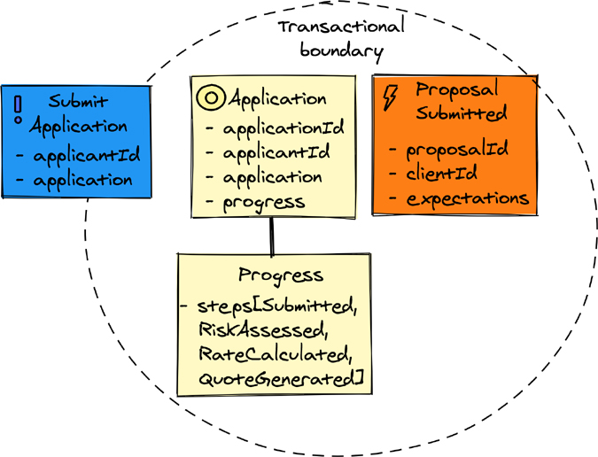
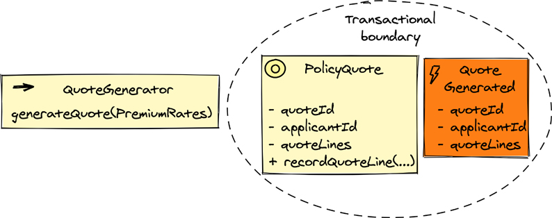

# 建模领域概念

许多项目可以从精心设计的领域模型中受益，但事实并非如此。通常，缺乏深思熟虑的建模是由于将业务概念视为数据。毕竟，我们不断被提醒“数据是企业最重要的资产”。鉴于对大数据和快速移动数据的强烈亲和力，似乎很难反驳这种推理。但是，即使你赋予数据最高的重要性，如果没有聪明的人学会如何处理数据以从中提取最大可能的价值，数据就毫无意义。
这就是战术建模的用武之地。一旦你对要采取的战略方向有了很好的理解，就可以更加关注实施。当业务模型的实现主要基于数据时，结果主要由以下元素组成：

- 大名词是模块。当以数据为中心时，模块通常具有数据操作工具的特性，而不是业务驱动因素：工厂、实体、数据访问对象或“存储库”、数据传输对象、数据服务和数据映射器。
- 中型名词是实体、以业务为中心的服务和数据操作工具。这些都在上一点列出来了。
- 小名词是实体或其他以数据为中心的工具的字段、属性或特性。想想任何数据对象的详细部分——这些都是小名词。

在他们的培训和咨询活动中，作者喜欢让其他人描述他们从醒来到现在的一天，但只能使用名词。尽管可能希望听到小组中的几个人大声说出“闹钟、浴室、壁橱、衣服、厨房”等内容，但大多数人甚至难以开始可能会令人惊讶。那是因为人们不会用名词来思考。
相反，人们在概念中思考，当与其他人交流时，必须通过表现力来描述。为此，他们需要包含名词的词形和修辞格，但远远超出它们。当软件在没有人做出这些努力的情况下实现时，它会使软件处于混乱状态。每个源代码的读者都必须从成百上千个大、中、小名词中解读其含义。这种方法非常复杂且充满风险，因此项目经常失败。根本不可能记住每个名词，甚至其中的一小部分，以及它们对所有其他名词的影响。清晰、狭义和明确的行为意图至关重要。
本章强调使用丰富的表达式对业务概念进行建模的重要性，并使用语言来扩充数据和业务规则，以传达使用软件完成的业务工作的最佳方式。这样做将传达明确的含义。有关这些主题的其他指南，例如实现领域驱动设计 [IDDD] 和快速入门指南领域驱动设计提炼 [DDD-提炼]。在这里，我们不太详细地考虑这些工具，但提供了足够的信息来理解这些概念。

## 实体
在对作为单个事物的概念整体进行建模时使用实体。赋予实体个性是通过生成并为其分配唯一身份来完成的。其唯一性必须在实体的生命周期范围内实现。如果实体被认为是建模上下文中的顶级概念，则必须为其分配一个全局唯一标识。如果实体包含在父实体中，则子实体必须仅在其父实体中唯一标识。请注意，实体的模块名称、概念名称和生成的身份的组合共同使给定的实体实例具有唯一性。
下面两个实体都被赋予了标识值1，但是由于它们的模块名和概念名不同，所以它们是全局唯一的：

```java
com.nucoverage.underwriting.model.application.Application : 1
com.nucoverage.rate.model.rate.PremiumRate : 1
```

实体也可以是可变的（可修改的），基于对象的实体很可能是可变的，但仅凭这一点并不能将其视为实体。那是因为实体可以是不可变的。它的唯一性是实体成为实体的关键，模型中的个体事物。在图 7.1 中，Application 是一个实体，applicationId 持有其唯一标识。



图 7.1 组成聚合作为事务边界的实体和值对象。

## 值对象

值对象是一个模型化的概念，具有一个或多个数据属性或属性，它们共同构成一个完整的值；因此，它是一个恒定的、不可变的状态。与具有唯一标识的实体不同，值对象的标识并不意味着是唯一的。可以说一个值没有身份，但它确实有身份的概念。一个值的身份由它的类型名称和它的所有组合属性/属性决定；也就是说，它的完整状态标识了每个值。在值的情况下，身份的唯一性不是预期的。具有相同标识的两个值相等。无论价值同一性对你是否有意义，最重要的是要了解两个或多个价值之间的平等是很常见的。
值的一个例子是整数 1。两个整数值 1 是相等的，并且在单个软件过程中可以有很多很多的 1 值。另一个示例值是文本字符串“one”。在一些现代编程语言中，整数值 1 是标量，是基本的单值类型之一。其他标量包括 long、boolean 和 char/character。根据其定义的来源，字符串可能会或可能不会被视为标量。然而，这并不重要：一个字符串通常被建模为一个字符数组，它的功能行为提供了有用的、无副作用的操作。
图 7.1 中的其他值类型包括 ApplicationId（由 applicationId 实例变量指示）和 Progress。进度跟踪在父应用程序实体上执行的工作流处理步骤的进度。当每个步骤完成时，Progress 用于捕获每个单独的步骤以及已经发生的步骤。为了实现这种跟踪，Progress 的当前状态不会改变。相反，先前步骤的当前状态（如果有）与新步骤组合以形成新的 Progress 状态。这维护了值不变性约束。
当考虑值 1 时，可以推理出值不可变的逻辑。值 1 不能改变；它始终是值 1。如果可以将值 1 更改为值 3 或 10，那将毫无意义。这不是讨论可以保存值 1 的整数变量，例如 total。当然，可变变量 total 本身是可以改变的——例如，通过分配它来保存值 1，然后再分配它来保存值3，然后是值 10。不同之处在于，虽然变量 total 可以更改，但它所持有的不可变值（例如 1）是常量。尽管 Progress 状态比整数更复杂，但它的设计具有相同的不变性约束。 Progress 状态无法更改，但可用于派生 Progress 类型的新值。

## 聚合体
通常，某些业务规则将要求单个父对象中的某些数据在父对象的整个生命周期内保持一致。鉴于存在父对象 A，这是通过在 A 上放置行为来实现的，该行为同时更改在其一致性边界内管理的数据项。这种行为操作称为原子性；也就是说，该操作原子地更改了 A 的一致性约束数据的整个子集。为了保持数据库中的一致性，我们可以使用原子翻译。原子数据库转换旨在围绕被持久化的数据创建隔离，类似于 A 的原子行为操作，以便数据将始终写入磁盘，而不会在隔离区域外发生任何中断或更改。
在域建模上下文中，聚合用于维护父对象围绕其数据的事务边界。一个聚合用至少一个实体建模，并且该实体拥有零个或多个其他实体和至少一个值对象。它构成了一个完整的领域概念。称为根的外部实体必须具有全局唯一标识。这就是为什么一个聚合必须至少保存一个值，即它的唯一标识。实体的所有其他规则都适用于聚合。
在图 7.2 中，PolicyQuote 是管理概念事务边界的根实体。事务边界是需要的，因为当一个聚合持久化到数据库时，原子数据库事务提交时必须满足所有业务状态一致性规则。无论我们使用的是关系数据库还是键值存储，单个聚合的完整状态都是原子持久化的。对于两个或更多这样的实体状态，可能无法做到这一点，这强调了从聚合交易边界的角度思考的必要性。



图 7.2 域服务负责指导小型业务流程。

## 域名服务

有时，建模情况要求操作应用作为其操作类型的成员实现的业务规则是不切实际的。当操作必须提供比典型实例方法更多的行为时，当操作跨越两个或多个实例或相同类型时，以及当操作必须使用两个或多个不同类型的实例时，就会出现这种情况。在这种建模情况下，请使用域服务。域服务提供一个或多个显然不属于实体或值对象的操作，如通常预期的那样，并且服务本身不拥有像实体或值对象那样的操作状态。
图 7.2 显示了名为 QuoteGenerator 的域服务。它负责接受一个名为 PremiumRates 的参数值，将其转换为一个或多个 QuoteLine 实例（包括特定的覆盖范围和保费），并将每个实例记录在 PolicyQuote 聚合上。请注意，当记录最后的 QuoteLine 时，会发出 QuoteGenerated 事件。
应用服务和领域服务之间的一个重要区别是应用服务不能包含业务逻辑，而领域服务总是包含。如果应用服务用于协调此用例，它将管理事务。无论哪种方式，域服务都不会这样做。

## 功能行为
存在许多领域建模方法，但迄今为止，面向对象范式已完全占据主导地位。然而，有一些方法^1^可以使用纯函数而不是可变对象来表达域行为。第 8 章“基础架构”中的“具有命令式 Shell 的功能核心”部分讨论了利用功能核心方法的好处，该方法强调对领域模型使用纯函数。结果是代码更可预测，更容易测试，更容易推理。虽然用纯函数式语言更容易表达函数式行为，但好消息是不需要从面向对象语言切换到函数式语言，因为函数式基础几乎可以与任何编程语言一起使用。当代面向对象的语言，例如 Java 和 C#，结合了函数式构造，使函数式编程甚至超越了基础。尽管它们不具备全功能语言的所有特性^2^，但使用此类语言可以轻松实现具有功能性行为的领域模型。

> 1 有些人会说“更好的方法”来强调这样一个事实，即最近围绕函数式编程范式的炒作可能会使面向对象编程显得过时。然而，作者强调每个编程范式都有其优点和缺点，并且没有一个范式在每个用例中都表现出色。
>
> 2 随着新版本流向市场，函数式编程功能已添加到几种面向对象的语言中。这导致了多范式语言的出现，这使得从面向对象编程切换到函数式编程以及返回变得更加容易。关于语言中混合范式的有效性以及它是否以某种方式阻碍了正在开发的业务软件模型的表达仍然存在问题。

使用领域驱动设计方法的领域建模适用于表达为功能行为的模型。 Eric Evans 在他的著作领域驱动设计 [DDD-Evans] 中强调了使用“无副作用函数”的重要性，以避免调用产生副作用的操作的任意深度嵌套而导致的意外和意外后果。事实上，如上所述，值对象是实现功能行为的一种方式的示例。在不能避免副作用的情况下，如果不深入了解每个操作的实现，就无法预测结果。当副作用的复杂性无限时，解决方案就会变得脆弱，因为它的质量无法保证。避免此类陷阱的唯一方法是简化代码，这可能包括至少采用某些功能行为。功能性行为往往用较少的努力就很有用。 （在这两种范式中都有很多代码编写不佳的例子，所以不要指望函数式编程语言提供任何灵丹妙药。）
考虑一个基于风险和利率报价政策的例子。致力于承保上下文的 NuCoverage 团队决定在对 PolicyQuote 建模时使用功能行为方法：

```java
public record PolicyQuote
{
    int QuoteId;
    int ApplicantId;
    List<QuoteLine> QuoteLines;
}
```

在此示例中，PolicyQuote 被建模为不可变记录。不变性描述了创建记录以使其状态无法更改的方法。这至少有两个好处：
PolicyQuote 实例可以传递给不同的函数，而不必担心函数会修改它们的状态。消除了与可变对象相关的不可预测性。
实例可以在并发环境中跨线程共享，因为它们的不可变性质消除了锁定和死锁的可能性。
尽管这些要点可能不是 NuCoverage 团队的主要决策驱动因素，但了解这些好处在设计不变性时是免费的很有帮助。
为领域概念定义不可变结构是采用功能行为的第一步。在此之后，NuCoverage 必须使用纯函数定义具体行为。其中一项操作是记录要由 PolicyQuote 组成的 QuoteLine 实例。使用传统的 OOP 方法，将在 PolicyQuote 实例上调用 RecordQuoteLine 操作，并改变其内部状态以记录新的 QuoteLine。对于函数行为方法，这种行为是不允许的，因为 PolicyQuote 是不可变的，并且一旦实例化就无法更改。但是还有另一种方法，它根本不需要任何突变。 RecordQuoteLine 操作可以实现为纯函数：

```java
public Tuple<PolicyQuote, List<DomainEvent>> RecordQuoteLine(
    PolicyQuote policyQuote,
    QuoteLine quoteLine)
{
    var newPolicyQuote =
        PolicyQuote.WithNewQuoteLine(policyQuote, quoteLine);

    var quoteLineRecorded =
        QuoteLineRecorded.Using(quoteId, applicantId, quoteLine);

    return Tuple.From(newPolicyQuote, quoteLineRecorded);
}
```

在此示例中，RecordQuoteLine 被定义为一个纯函数：每次使用相同的值调用该函数时，都会产生相同的结果。这意味着与纯数学函数类似，如果将 2 作为输入参数传递，则函数 power = x * x 将始终产生 4。 RecordQuoteLine 函数简单地返回一个^3^由 PolicyQuote 的新实例和一个新的 QuoteLine 附加到当前报价行集合的新实例以及 QuoteLineRecorded 域事件组成的元组。

> 3 元组表示两个或多个任意类型的组合作为一个整体。此处， PolicyQuote 和 List\<DomainEvent> 作为一个整体进行处理。元组在函数式编程中经常使用，因为一个函数可能只返回一种类型的结果。元组是包含多个值的单个值。

请注意，输入参数 policyQuote 永远不会发生变化。这种方法的主要优点是 RecordQuoteLine 函数提高了其行为的可预测性和可测试性。无需研究此函数的实现，因为当前应用程序状态不会有任何可观察到的副作用或意外变化。
函数范式的另一个重要好处是，如果要组合的函数的输出类型与构成它的函数的输入类型相匹配，则可以很容易地组合纯函数。这些机制超出了本书的范围，但在后续实施书中提供，实施战略单体和微服务（Vernon & Jaskuła，Addison-Wesley，即将出版）。
功能行为的主要收获是它简化了模型中使用的抽象的表面，提高了它们的可预测性和可测试性。考虑到现代面向对象语言的功能及其提供的好处，使用它们的动力非常大。至少在最初，尝试使用“带有命令式外壳的函数核心”方法进行函数式编程。

## 应用工具
领域建模是进行实验的最佳场所之一，第 3 章“事件优先实验和发现”中描述的基于事件的快速学习就是一个例证。应该使用最能描述正在建模的业务概念的名称和行为表达式快速执行实验。这可以通过便签、虚拟白板和其他协作绘图工具，当然还有源代码来完成。这些工具将在本书的其余章节中应用。
这些建模技术的许多示例可以在《实现领域驱动设计 [IDDD] 和快速入门指南领域驱动设计精炼 [DDD-Distilled] 中找到。

## 概括

本章介绍了领域驱动设计战术建模工具，例如实体、值对象和聚合。这些工具的适当使用取决于它们打算处理的建模情况。另一个建模工具，函数行为，用于使用纯函数而不是可变对象来表达域模型行为。
本章中的主要信息如下：

- 在对作为唯一标识的个体事物并具有有状态生命周期的概念整体进行建模时使用实体。
- 值对象封装了共同构成整个值的数据属性/属性，并提供无副作用的行为。值对象是不可变的，不会试图唯一地标识自己，而只能通过其类型的整个值和所有组合的属性/属性来标识。
- 聚合对可以由一个或多个实体和/或值对象组成的整个概念建模，其中父实体表示事务一致性边界。
- 使用领域服务对本身无状态的业务操作进行建模，如果将其作为行为包含在实体或值对象上，则会被放错位置。
- 函数式行为在纯函数中包含业务规则，但不需要使用纯函数式编程语言。换句话说，可以使用当代的面向对象语言（例如 Java 或 C#）来实现纯函数。

第二部分到此结束。我们现在过渡到第三部分，“事件优先架构”，该部分讨论提供实用目的而非技术阴谋的软件架构风格和模式。

## 参考

- [DDD-蒸馏] 沃恩弗农。领域驱动设计提炼。马萨诸塞州波士顿：Addison-Wesley，2016 年。
- [DDD-埃文斯] 埃里克·埃文斯。领域驱动设计：解决软件核心的复杂性。马萨诸塞州波士顿：Addison-Wesley，2004 年。
- [IDDD] 沃恩弗农。实现领域驱动设计。马萨诸塞州波士顿：Addison-Wesley，2013 年。