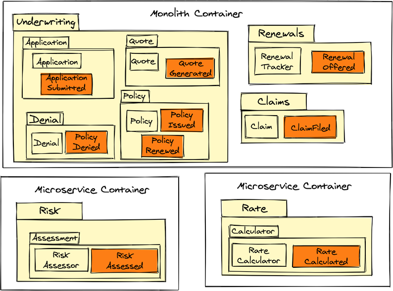

# 基础架构

似乎每本以任何方式讨论软件架构的书都试图定义软件架构。以下是来自其他来源的一些示例。

> 程序或计算系统的软件体系结构是系统的一个或多个结构，它包括软件元素、这些元素的外部可见属性以及它们之间的关系。 【实践中的软件架构】
> 系统的基本组织体现在其组件、它们彼此之间以及与环境的关系以及指导其设计和演化的原则中。 [ISO 47010]
> 所有的架构都是设计，但并非所有的设计都是架构。架构代表了塑造系统形式和功能的重要设计决策，其中重要是通过更改成本来衡量的。每个软件密集型系统都有一个架构：有些是有意的；有一些是偶然的；大多数是紧急的。所有有意义的建筑都源于一个充满活力、充满活力的审议、设计和决策过程。
> ——格雷迪·布赫

好吧，这些都不错。可能有些想法是隐含的，但没有明确说明。也许另一次尝试是值得的。以下是作者尝试更新旧定义的尝试。这反映了本书所讨论的内容，并且已经使用了好几年。
至少有三组主要的语句可以帮助定义软件架构。 (1) 架构是团队沟通的结果，它导致对业务目标的共同理解，如何平衡各个利益相关者的目标，以及如何理解和解决与质量属性相关的有影响的特征；也就是说，没有目的就没有有效的建筑，如果没有通过交流将意图社交化，就无法很好地理解目的。 (2) 通过指定支持软件初始和持续开发的有目的的灵活性和约束，架构意图被捕获并表达为整个系统和单个服务的一组当前和未来决策。 (3) 架构意图和决策被表达出来，呈现为视觉形式——图形和/或文本——并在具有模块化结构和明确定义的组件到组件协议的软件工件中表达。

请注意，此定义的所有三个部分都进行了大量交流，而更传统的定义中似乎缺少交流。声音建筑不能在真空中开发。定义中没有任何部分建议特定的工具或格式，应由相关团队选择。这是通过交流将软件意图社会化的全部部分，捕捉和阐明该意图的最佳方式应该由创建它的人决定。接受反馈是一项需要培养的宝贵技能。
作者还建议阅读 Vaughn Vernon 签名系列中的另一本书，即 Murat Erder、Pierre Pureur 和 Eoin Woods 的《实践中的连续架构》。它提供了有关如何将持续方法应用于软件架构的深入建议，并包含解决关键质量属性和跨领域问题的深入指导，例如安全性、性能、可扩展性、弹性、数据和新兴技术，所有使用从头到尾的案例研究 [Continuous-Architecture] 进行说明。
软件架构被抛到脑后，被视为寻求更高薪水的普通程序员的某种正式而无用的仪式而被忽视的情况并不少见。确实存在过度设计的架构，但那些来自不成熟的架构。重点是：

> 如果你认为好的架构很昂贵，请尝试使用差的架构。
> ——布莱恩·富特 [BBoM]

你可以现在为架构付费，也可以稍后付费。作者建议现在最好。尽管如此，好的架构不需要很昂贵。本章支持这一主张，并将过度设计的架构置于总线之下。
我们将考虑许多专门支持事件优先系统的架构风格和架构模式。这就是从前几章获得的关于业务驱动因素的理解，现在指向基于整体软件架构将如何支持业务目标做出明智的决策。仅仅因为它们看起来有用，甚至很酷，就在广泛的任意架构选择集合中进行选择显然存在危险，就好像一堆架构决策会自动产生好处一样。同样，架构决策的目的是实现质量属性要求，例如灵活性、安全性、性能和可扩展性。如果没有这些要求，架构决策就毫无意义，而且往往是有害的。深入的细节超出了本书的范围，但在我们的后续实施书中提供，实施战略单体和微服务（Vernon & Jaskuła，Addison-Wesley，即将出版）。
接下来我们的议程是一系列现代架构选项，每个选项都根据其整体定义进行描述，但也根据其优势和劣势进行限定。与软件开发中涉及的所有事情一样，团队做出的架构决策往往会产生积极和消极的后果。

## 架构风格、模式和决策驱动因素
重申一下，并非每种架构风格和模式都适合任意一组任意的业务、技术、规模、性能或吞吐量限制。一组特定的约束将驱动一个有目的的架构。同样，并非每个限界上下文在业务战略目标方面都同等重要，这对架构决策具有重要影响。
此处讨论的架构包括系统级和服务/应用程序级的架构。系统级架构定义了各种子系统如何协同工作以解决与共享的有影响的功能相关的质量属性，包括软件协作和集成。服务/应用程序架构定义了单个子系统（服务/应用程序）如何处理与其自身有影响的特征相关的质量属性。
第 2 章“基本战略学习工具”讨论了架构决策记录 (ADR)，它是一种确定围绕软件架构做出的每个决策的业务和技术驱动因素的手段。团队使用 ADR 来帮助解释为什么各种风格和模式是有用的，但它们也突出了在给定解决方案中应用这些选择的潜在负面后果。

### 端口和适配器（六角）

最通用的架构风格之一是端口和适配器，也称为六边形。这种风格继承了传统 Layers 架构 [POSA1] 的概念，但它强调不同的优势并且开销要少得多。一些突出的优势基于当代软件驱动程序，例如测试和松散耦合。

> 允许应用程序同等地由用户、程序、自动化测试或批处理脚本驱动，并独立于其最终运行时设备和数据库进行开发和测试。 [端口适配器]

由于外部设备与用于与软件服务或应用程序交互的其他机制之间的根本差异，有时会遇到问题。这些机制可能是浏览器、手机或平板电脑、其他服务或应用程序、流媒体或消息传递机制、批处理、测试或其他计算资源。服务或应用程序不应直接暴露于与外部世界的交互，因为这会干扰独立于技术的业务逻辑和处理。
为了避免将服务或应用程序耦合到各种输入-输出设备和机制的潜在问题，在两组关注点之间创建一个适配器层。如图 8.1 所示，端口和适配器架构风格通过将架构的一部分视为外部而另一部分视为内部来定义这种分离。左边是一些驱动程序类型，也称为主要参与者：HTTP，外部调用的过程或函数，以及流动的流或消息。在右侧是许多驱动类型，也称为次要参与者：支付网关、数据库、过程或函数向外调用，以及流动的消息流。端口的位置由内部圆形应用区域周围的粗边框显示。

图 8.1 端口和适配器架构，也称为 Hexagonal、Clean 和 Onion。1

1、有人认为Onion架构更接近于Layer，在适配器方面没有区分外部和内部。有些人认为 Onion 是 Layers 的同义词。与其让数千人抱怨 Onion 的遗漏，不如在这里提到它，以及一个潜在的警告（或至少是一个特定的细微差别）。

> 笔记
> 外部左侧的驾驶员演员发送输入请求或通知。外部驱动的参与者由内部的应用程序驱动以完成用例：有些是双向的，提供请求和响应；其他人收到单向通知。外部左适配器需要将传入的请求或通知调整为应用程序可以使用以执行其支持的用例的数据类型。应用程序使用外部权利的适配器来持久化和查询，以及传递通知。只有外面的人知道内部用例的存在。外部驱动的参与者忽略了用例。

图 8.1 不包含一组详尽的传入和传出适配器类型。任何给定的适配器类型不限于创建单个实例。显示的适配器是服务和应用程序通常使用的适配器。例如，不需要单个数据库类型或实例，或者单个流源和接收器，或者一个消息传递主题。图 8.1 中的元素仅代表了大量的可能性。
端口和适配器的一些明显优势如下：

- 两个主要层中的每一层都可以单独测试；也就是说，可以在不需要特定应用程序实现的情况下测试任何适配器，并且可以在没有任何给定适配器实现的情况下测试应用程序。
- 所有设备适配器都可以由模拟/伪造和实际机制支持。 （这并不意味着不测试具体的适配器，因为它们总是如此。相反，mocks/fakes 用于测试依赖于适配器的单元。）
- 每个实际机制可能有多种类型（例如 Postgres、MariaDB、HSQLDB、AWS DynamoDB、Google Cloud Bigtable 或 Azure Cosmos DB）。
- 可以根据需要引入新的适配器类型，无需大量的前期架构/设计；也就是说，团队可以采用#agile 和紧急的架构设计。
- 多个外部适配器可以使用相同的内部应用层设施。
- 应用程序与设备级技术细节保持完全隔离。

也可能存在缺点，具体取决于与外部机制集成的决定：

- 数据映射器（例如对象关系映射工具）的使用可能会导致复杂性。但是，这个缺点是由于选择了持久化集成，而不是因为端口和适配器本身强制了这些选择。
- 域模型可以通过接口利用与远程服务和应用程序的集成。接口实现可能会泄露底层实现细节，例如网络和服务故障导致的异常和错误。这可以通过一些方法来避免，包括本章和第 9 章中讨论的方法。例如，将 Functional Core 与命令式 Shell 一起使用可以使域模型与外部远程集成完全隔离。命令式外壳必须单独完成所有集成工作，并且不涉及功能核心。 Functional Core 仅提供纯的、无副作用的函数。
- 其他缺点可能包括由于需要更多层而增加了复杂性；创建和维护成本；并且缺乏组织代码（目录和层）的指导。作者至少没有经历过这些说法，不知道那些引用这些所谓问题的人是否阅读过文献并完全了解 Ports 和 Adapters。经验告诉我们，可以在几分钟内构建一个基本的、结构良好的架构，其层数远少于典型的 N 层应用程序所需的层数。所选择的机制和相关的适配器会增加系统的复杂性，但这与架构风格无关。如果不使用端口和适配器架构，这样的系统至少具有相同的复杂性。

端口和适配器架构将内部应用层与设备输入-输出的细节隔离开来。该应用程序仅专注于业务驱动的用例。多个左外适配器类型可以有效地重用应用程序端口来执行操作，而不是每个适配器类型都需要单独的端口类型。
这种架构设计可以采用依赖倒置原则 [SOLID]，其中基础设施变得依赖于应用程序，而不是应用程序依赖于基础设施。应用程序可以避开具体的设备依赖项，因为对外部权限的次要参与者类型的任何此类依赖项都通过适配器接口进行管理。适配器接口通过其服务构造函数/初始化器或可能的基于容器的依赖注入提供给应用程序。
适配器应遵守单一职责原则 [SOLID]，这意味着单个适配器应专注于适配指定支持的输入-输出，而不是更多。任何适配器都不应该依赖于另一个适配器。
有人声称端口和适配器是一种不必要的重量级架构风格，但坦率地说，这种批评既没有根据，也没有根据。如图 8.1 所示，Ports and Adapters 软件架构包括给定输入和输出端口所需的适配器数量和种类——不多也不少。也只有两个主要层。
当然，任何架构风格和模式都可能受到过度设计的影响。不要指望端口和适配器本身可以防止这种执行不力的实现。如图 8.2 所示，里面的 Application 的性质是非常通用的；也就是说，模式没有定义应用程序内部应该如何工作。更重要的是，即使显示的四种性质中的任何一种都不复杂，尽管每种性质都有其优点（如以下部分所述）。

图 8.2 具有不同应用程序类型的端口和适配器架构。

#### 带有事务脚本的服务层

服务层描述如下：

> 从接口客户端层 [即端口适配器] 的角度定义应用程序的边界及其可用操作集。它封装了应用程序的业务逻辑，在其操作的实现中控制事务和协调响应。 [福勒-PEAA]

服务层提供特定于应用程序的服务，通常称为应用程序服务，如图 8.2 中从左到右的前两个变体所示。该图的左上角是一个仅由应用服务组成的服务层。此示例使用某种形式的事务脚本、活动记录或数据访问对象 [Fowler-PEAA]。这三种模式用于创建-读取-更新-删除 (CRUD) 操作，而不会产生域模型的开销。当限界上下文主要专注于数据收集并执行简单的创建和更新以及偶尔的删除时，它们都很有用。不存在业务驱动的复杂性。就 Cynefin 而言——如第 2 章“使用 Cynefin 做出决策”一节所述——这很清楚/显而易见/简单。主要工作在于使用应用程序服务进行写入和读取，并可能封装进出数据库的数据访问，但任何此类访问封装都特意保持微不足道。

#### 具有领域模型的服务层

在图 8.2 右上角的服务层中，应用服务伴随着位于应用层下方软件核心的领域模型。当（如第 7 章所述）需要在创新的、核心的、差异化的业务软件计划中解决域 ^2^ 复杂性时，将使用域模型。在图 8.2 所示的系统中，应用服务用于管理用例协调和数据库使用，包括事务^3^。

> 2 再次重申，领域是指知识领域。
>
> 3 用例和事务可以通过其他方式进行管理，例如在适配器中，否定服务层。即便如此，你也应该小心不要让适配器承担太多责任。

#### Actor的领域模型

Actor 模型是一种消息驱动的对象模型，它在高度并发和可扩展的计算环境中提供专门的和隔离良好的功能，如第 9 章“消息和事件驱动的体系结构”中所述。^4^ 传入适配器直接分派到域模型对象中。尽管没有应用程序服务，但域模型可能会提供基于参与者的域服务。

> 4 这与具有领域模型的服务层不同，因为底层 actor 平台旨在减轻应用程序开发人员的负担，而不是将其移到团队代码中的其他位置。

端口和适配器的这种实现提供了这种架构风格的最简单和最简洁的渲染，将巨大的功能打包到一个小尺寸中。 ^5^ 一个演员，在设计上，与其他演员在物理上是隔离的——这更加强调了两者之间的声音区别业务逻辑和基础设施问题。

> 5 虽然通常是一个硬件术语，但这里的形状因素似乎很合适，因为 Actor 模型中的单个 Actor 已被称为微型计算机。

#### 带有命令式外壳的功能核心
带有命令式 Shell 的功能核心弥合了端口和适配器与功能编程之间的差距。尽管受到函数式编程原则的启发，Functional Core 也很容易适用于非纯函数式的编程范式。例如，函数式编程的基本优势可以通过面向对象的编程语言（如 Java 和 C#）来实现。这种方法背后的想法是为领域模型编写纯函数式代码，同时将命令式代码的副作用 ^6^ 转移到周围环境中，称为命令式外壳。因此，功能核心是可预测的，更容易测试，并在最重要的地方使用。

>  6 副作用是在其本地环境之外修改了一些状态变量值；换句话说，除了向操作的调用者返回一个值（主要效果）之外，该操作还有一个可观察的效果。例如，执行 I/O 操作（如网络调用或数据库调用）是一种副作用。

可预测性来自这样一个事实，即纯函数总是为相同的输入返回相同的结果，并且永远不会引起可观察到的副作用。同样，纯函数更容易测试，因为重点是有意义的输入和输出。不需要创建模拟或存根，因此不需要单元测试内部知识。实际上，完全避免模拟是 Functional Core with Imperative Shell 的目标之一。
另一个优点是，当域代码通过接口调用有副作用的域服务时，这种方法降低了泄漏技术问题的风险。例如，错误处理可能有问题。使用 REST-over-HTTP 端点不仅会导致预期类型的错误（例如 404 Resource Not Found），还会导致意外错误（例如网络故障）。错误处理逻辑可能很难测试，除非非常小心，否则它会在整个域模型中传播。这个问题的深入细节超出了本书的范围，但在后续的实现书中提供。
端口和适配器架构性质比较
表 8.1 比较了此处描述的四种性质，并概述了它们在实用性、复杂性、模型隔离性、可演化性、质量属性和可测试性方面的差异。
表 8.1 领域模型实现的不同架构方法的比较及其影响

|                          | 带有事务脚本的服务层                                         | 具有领域模型的服务层                                         | Actor的领域模型                                              | 带有命令式外壳的功能核心                                     |
| ------------------------ | ------------------------------------------------------------ | ------------------------------------------------------------ | ------------------------------------------------------------ | ------------------------------------------------------------ |
| 隔离域模型               | 不; 专注于数据更新                                           | Yes                                                          | Yes                                                          | Yes                                                          |
| 业务复杂性               | 低的; 业务规则不多或没有，主要是数据集中                     | High                                                         | High                                                         | High                                                         |
| 领域模型与基础设施的隔离 | 技术开销低，但不存在领域模型，所以主要涉及数据访问封装。 非常接近基础设施问题，这会给长期维护带来风险。 | 域模型与基础设施很好地隔离，但需要不断努力以保持隔离不受基础设施问题的影响。 它可能需要应用服务进行协调。 | 领域模型与基础设施问题很好地隔离。 隔离嵌入在底层 Actor 模型实现中，这有助于维护域模型，同时使它们不受任何基础架构问题的影响。 | 领域模型与基础设施问题很好地隔离，因为它基于纯函数。 这种设计可以防止纯函数与基础设施交互并直接产生副作用，从而保证保持域模型的隔离。 |
| 可进化性                 | 低的。 领域模型的缺乏使得难以向更复杂的业务场景演进。        | 中到高。 取决于域模型如何与其他基础设施问题保持隔离。        | 很高。 添加业务行为非常简单。                                | 很高。 添加新的业务行为非常简单。                            |
| 可扩展性、性能和并发性   | 非常低。                                                     | 从低到高。 它可能需要围绕域模型实现技术代码，以跟上可扩展性和并发性要求。 域模型本身并不面向并发，因此周围的代码必须处理它。 | 很高。 Actor Model 实现保证了开箱即用的可扩展性、性能和并发性。 | 高的。 域模型基于纯函数，这意味着它支持并发。 但是，命令式 Shell 代码可能需要一些韧性才能使其更具可扩展性和性能。 |
| 可测试性                 | 低的。 根据管理基础设施问题的方式，可能会很困难。            | 高的。 领域模型被很好地隔离，所以很容易测试。                | 高的。 每个方面都是可测试的。                                | 高的。 域模型非常易于测试。 但是，除非通过集成测试，否则命令式 Shell 不容易测试。 |

### 模块化
模块化的重要性已经确立，我们甚至提供了一些示例。本节将架构重点应用于模块化。图 8.3 提供了一个模块化 Monolith 的示例。

图 8.3 具有五个有界上下文作为模块的单体容器。

容器本身不一定是特殊的。这只是部署一组可执行软件的一种方式。它可能是一个 Docker 容器，甚至可能有一个 Kubernetes Pod 围绕在它周围，用于同地、共同调度和共享的运行时上下文。然而，Monolith 容器的重点是内部的五个主要模块。这些模块中的每一个都代表一个有界上下文。如前所述，Monolith 是软件架构开发早期开始的好地方，甚至可能是长期解决方案。
这五个模块一起部署在一个容器中的事实并不是限界上下文模块紧密耦合或在它们之间具有任何强大的渗透依赖关系的借口。这是绝对不能接受的，就像微服务之间存在这种依赖是不可接受的一样。有界上下文之间的松散耦合可以使用上下文映射来实现，就像第 6 章“映射、失败和成功——选择两个”中描述的那样。图 8.3 显示了上下文中已发布语言的形成。此外，相关事件可以使用异步消息传递机制跨上下文进行通信，即使在单体解决方案中也很实用，但这是轻量级的选择，而不是重量级的组件。
在五个有界上下文模块中的每一个模块中，都有特定于相应泛在语言的内部模块。显示的每个内部模块都包含有凝聚力的模型组件，不依赖于其他模块，或者可能是非循环的。
随着时间的推移，我们观察到，风险和利率这两个主要模块的变化速度明显快于其他三个模块的变化速度；风险和利率模块也以彼此不同的方式变化。根据这一观察结果，团队确定最好将风险和利率模块拆分为两个独立的微服务。图 8.4 显示了结果。该解决方案现在变成了三个外部容器，它们与原始 Monolith 容器具有相似或相同的性质。可能每个都是一个 Docker 容器，每个可能都有一个包含它的各自的 Kubernetes Pod。

图 8.4 一个 Monolith 容器和两个微服务容器，总共有五个有界上下文。

三个独立的容器之间有一个网络，这引入了与分布式系统相关的挑战。即便如此，如果在创建原始单体架构的过程中尽早小心，模块化上下文之间的消息传递机制应该会迫使每个消息发布者和订阅者围绕与非确定性延迟、无序顺序和交付多样性相关的问题进行设计.如前所述，最初为 Monolith 引入的消息传递机制可能是轻量级的，但现在这将被更强大的机制所取代。当涉及云网络和其他基础设施时，可能会出现除此之外的一些挑战，但它们不应该是大惊喜——不像网络被视为“免费午餐”。
所有上述变化率和非确定性消息传递驱动程序都表明系统架构服务于一个目的，而不是系统成为满足其架构师的愿望和好奇心的架构的主机。

### REST 请求-响应
REST 架构风格和模式支持在应用程序资源交换期间生成的请求和响应。应用程序状态的交换通常使用非本地表示（例如，数字数据以基于文本的格式呈现）。 REST 的行业标准实现是 HTTP，它不仅是一种网络传输协议，也是一种用于交换和修改信息的协议。 HTTP 甚至通过超媒体支持应用程序工作流，这意味着相关数据的链接嵌入在资源交换中。请求是使用基于动词的方法发出的，其中四个被认为是最低限度的：POST、GET、PUT 和 DELETE。这些方法旨在对基于实体的完整资源进行操作。
REST 最常用于客户端-服务器通信，例如浏览器和服务器之间的通信。 REST 通常被认为仅对创建-读取-更新-删除 (CRUD) 应用程序有用，但实际上它的用途要广泛得多。例如，这种架构风格可用于提供限界上下文之间的集成。本章讨论浏览器到服务器的用例。第 9 章重点介绍限界上下文之间的集成。
虽然只有四种方法被认为是最少的，正如前面提到的和表 8.2 所示，作者提倡使用第五种动词方法 PATCH。此方法支持部分更新——允许精确定位对基于实体的资源所做的特定更改。使用 PATCH，将 CRUD 首字母缩写词扩展为 CRUUD；现在有第二个更新选项，该选项仅适用于部分实体更改。
表 8.2 包括用于部分更新的 PATCH 表单 CRUUD 而不是 CRUD

| POST   | Create          |
| ------ | --------------- |
| GET    | Read            |
| PUT    | Update          |
| PATCH  | Update, Partial |
| DELETE | Delete          |

在基于 PUT 的更新中，目的是替换整个实体状态。这样做时，如果实际上只修改了实体的一小部分，则服务器端应用程序很难确定发生了哪些具体的更新。如果用例实现是为了产生基于事件的结果，那么确定细粒度事件应该是什么就过于复杂了。这导致事件非常粗粒度。当实体的整个状态被打包到单个事件中，并且该事件被命名为应用程序更新时，所有内容和任何内容都会同时进行通信。事件的消费者必须根据较旧的状态执行某种差异比较；否则，它可能会以破坏性或引发错误的方式应用完整状态。
如图 8.5 所示，使用 PATCH 时不会出现繁琐的状态修改确定。通过部分更新，可以直接确定用例的基于事件的细粒度结果是什么，因为很清楚发生了什么变化。图 8.5 所示架构的一个关键优势是可以更快地执行后续的风险重新评估和费率重新计算，因为只有有限数量的更改数据才能通过特定事件进行精确传达。

图 8.5 执行 CRUUD 部分更新使精确定位事件类型及其内容变得简单。

> 笔记
> 使用 PUT 可以完成类似于 PATCH 的事情，但提交的实体必须指出完整有效负载中的内容发生了变化。使用 PUT 减少了 PATCH 所需的暴露 URI 的数量，^7^ 并且它可能被认为是减少客户端对额外 URI 的认识的一种方法。然而，如果团队采用 HATEOAS 的想法，^8^ 则客户端无需对资源的访问进行硬编码。
>
> 7 PUT 产生开销：完整的实体有效载荷必须穿过网络两次；客户必须了解如何指示部分更改的实体；并且服务器必须知道如何通过指示器进行调度。
>
> 8 Hypertext As The Engine Of Application State (HATEOAS)：这个首字母缩略词，很多人不知道如何发音，它代表的想法是一旦客户端在顶级“铸造”URI 上使用 GET，所有其他资源都将可通过响应负载中提供的链接获得。这会持续引导客户端完成服务/应用程序提供给该客户端的所有内容。

第 9 章讨论 REST 如何支持消息驱动和事件驱动的架构。

## 质量属性
基础架构包括质量属性。在众多可能的质量属性中，我们选择在这里讨论我们认为最突出的一个子集：安全性、隐私、性能、可扩展性、弹性和复杂性。下面的部分讨论了其中每一个所涉及的权衡。

> 笔记
> 有兴趣了解更多关于解决质量属性的读者可以参考《Continuous Architecture in Practice》[Continuous-Architecture]，Vaughn Vernon Signature 系列中的一本书。

### 安全

如今，很难想象一家公司不使用在线技术处理至少部分业务活动。但是，即使是部分开放的访问权限也可能使企业面临危险。无论是依赖可公开访问的网站、HTTP API，还是合作伙伴通过专用网络或 VPN 进入的各种集成端点，开放访问都会对业务安全构成多重威胁。
例如，数据可能被盗或损坏。运行日常操作的通用计算资源可能会感染病毒并受到危害。还有一种可能性是，各种攻击和渗透可能需要相当长的时间来检测，甚至可能在造成严重破坏之前被忽视。在最坏的情况下，损害可能会导致整个企业倒闭。此类潜在威胁可能会导致安全团队成员“睁一只眼闭一只眼”。
考虑有史以来最具破坏性的网络攻击之一 [CyberAttack]。在首次出现后的几个小时内，被称为 NotPetya 的恶意软件就从一家小型乌克兰软件企业蔓延到世界各地的无数设备。它使包括 FedEx、TNT Express 和马士基在内的全球航运公司瘫痪数周，造成超过 100 亿美元的损失。并非每一次网络攻击都有如此广泛的渗透或如此严重的后果，但根据瞻博研究 [Juniper] 和福布斯收集的数据，仅在 2019 年，网络犯罪就造成了 2 万亿美元的损失。此外，据估计，到 2021 年的某个时候，总损失可能会达到这个数字的三倍。马里兰大学最近发现，每 39 秒就会发生一次网络攻击，而安全公司迈克菲报告说，每分钟都会引入 480 次新的高科技威胁.根据一项研究参考资料，很大一部分数据泄露是由应用程序安全问题引起的，而不是由基础设施 [Verizon-SEC] 引起的。
开发具有彻底设计的安全功能的系统至关重要，这可能是对十年的轻描淡写。安全性必须是一个设计目标 [Secure-By-Design] 并且它必须是完整的 [Agile-SEC]。否则，破坏商业资产可能会通过头条新闻导致极端的财务损失和公司声誉受损。很多时候，安全性的实施或加强只是作为事后的想法，导致系统通过未知的漏洞暴露给潜在的攻击者。
请注意，微服务具有不同的攻击面，由于利用它们的无数机会，这些攻击面可能会使威胁更加严重。这些机会通常是由于服务的分布式状态、网络访问和分布式安全机制。单体架构可以使用整个应用程序自然可用的进程内安全上下文。相比之下，由于微服务由多个分布式服务组成，安全上下文必须从一个服务传递到另一个服务。
服务间安全依赖的最突出例子是建立和验证用户身份。在 Monolithic 系统中，用户身份可以在用户登录时建立一次，并且对每个模块保持可用，直到用户最终退出。在构建基于微服务的系统时，很难想象要求用户登录到完成业务系统操作所需的每一个服务。
在微服务架构的约束下工作时，正确实施可行的安全性可能非常具有挑战性。这导致在与哪些方面可能易受攻击的挑战和未知数相关的情况下，合理地担心会出错。然而，公司拥有大量可以依赖的行业标准和工具。现代应用程序开发人员必须至少实现两个方面的安全性：

- 身份验证：验证试图访问单体应用或微服务的人或其他软件组件的身份的过程。主要目标是验证用户的凭据，例如用户身份和密码，或提供 API 访问权限的密钥。存在许多不同类型的身份验证协议，但最常用的是 OpenID Connect，它使用访问令牌 (JWT) 作为身份验证的证明。
- 授权：验证经过身份验证的用户是否被允许在特定业务环境和特定数据上执行请求的操作的过程。大多数情况下，这涉及基于角色的安全性以及支持细粒度授权的相关访问控制列表 (ACL) 或权限的组合。前者授予合法用户访问某些高级业务功能的广泛权限。后者通过确保每个人都扮演必要的用户角色并具有所需的权限来授予真实用户对专门组件的特定操作的授权访问权限。

现代身份验证和授权协议严重依赖安全访问和承载令牌的使用，系统安全架构应要求将令牌包含在特定的 HTTP、RPC 和消息传递请求中。访问/承载令牌高度安全，可通过身份验证检索。令牌携带足够的信息来证明用户的真实性和使用给定服务产品的权限。令牌可能会在标准时间范围后过期，但可以通过重新生成来更新。再生确保用户仍然可以进行适当的访问，同时防止攻击者通过限制其生命周期来破坏令牌的秘密编码。这是通过使安全机制的密码学成为移动目标来实现的。
可以在开发过程的早期结合以下实践，以设计以安全为中心的系统：

- 安全性设计：安全性不能是事后的想法，因为这种懒散的方法会导致设计脆弱、脆弱且缺乏最佳安全性。

- 默认使用 HTTPS：传输层安全性 (TLS) 旨在确保计算机应用程序之间的隐私和数据完整性。 HTTPS 需要证书。证书可以通过云提供商生成。证书授予通过公钥基础设施 (PKI) 使用加密通信的权限，并验证证书持有者的身份。

- 加密和保护机密：应用程序可能会拥有用于通信的机密。这些机密可能是 API 密钥、客户端机密或用于基本身份验证的凭据。所有这些秘密都应该被加密，并且应该由第三方云服务存储和管理。 Azure Key Vault 是密钥管理器的一个示例。

- 作为部署管道一部分的安全检查^9^：静态应用程序安全测试 (SAST) 工具旨在分析源代码或代码的编译版本，以帮助发现安全漏洞。主动使用这些 SAST 工具通过宝贵的即时反馈发现缺陷；不要依赖于较晚发现漏洞。

- > 9 这些技术有用且好用，但缺乏工具，这使得完全实现预期目标具有挑战性。 SAST 仅揭示有限类型的安全漏洞。因此，有必要执行许多其他安全测试，包括自动和手动。

- 不要创建自己的安全机制或加密代码：并非每个人都是安全专家。依靠外部工具和库，这些工具和库经过数以千计的开发人员、系统和个人服务的使用而经过实战测试。

在实现系统和单个服务时，还有许多其他点需要考虑，无论是使用 Monoliths、微服务，还是同时使用两者。考虑到这里概述的要点肯定会有助于提高安全性。后续书籍提供了有关架构和实施安全性的详细信息。

### 隐私
磁盘存储已经变得非常便宜。因此，许多企业都希望尽可能多地捕获和存储信息，即使该信息具有不确定的价值并且以后可能会被丢弃。数据已成为众所周知的最有价值的业务资产，因此即使数据可能没有任何价值，但承担有限的存储数据费用似乎是值得的。借助机器学习 (ML) 算法处理大量数据，可以获得有关客户、竞争对手和市场的有用知识，这些算法为将数据转化为商业智能提供了机会。在这项工作中，企业总是会收集一些可用于获取有关个人信息的数据。尽管具有潜在价值，但在存储和处理此类个人信息时必须小心谨慎。
存储大量关于个人的数据可能是一把双刃剑。一个缺点是，窃取大量个人信息，甚至少量高价值个人信息，往往是发起安全攻击者的目标。事实上，盗窃敏感数据是恶意个人的最大动机之一。人们可以举出许多信用卡号被盗的例子，即使是来自 Apple 等科技巨头。存储企业运营所需的最少数据可以消除这种安全威胁，因为它降低了企业作为目标的价值。
在某些国家/地区，政府政策定义了如何收集、存储和使用个人数据。最著名的政策是“通用数据保护条例”[GDPR]。其主要目的是让个人控制他们的个人数据。 GDPR 保证个人有权删除他们的任何个人数据，例如他们的电子邮件地址、政府颁发的身份、IP 地址、姓名、街道地址、出生日期、年龄和性别。该法律针对在属于欧盟 (EU) 的国家/地区的领土内运营的所有企业，但其他个人数据保护政策已在欧盟以外的其他国家/地区制定。在所有此类情况下，在政策管辖范围内运作的企业如果想在这些市场中运营，就必须遵守。
图 8.6 说明了必须引用隐私数据的事件如何从远处这样做，以便事件保持不变，隐私数据只存在直到必须被删除。

图 8.6 存储可以删除的最少匿名和分离的私人数据。

除了图 8.6 中所示的元素之外，还可以考虑其他程序，在考虑与个人隐私相关的数据时，这些程序将节省大量工作。考虑以下作为所需的最少步骤：

- 存储最少的私人数据。存储的可识别个人身份的数据越少，企业为遵守隐私保护政策（例如 GDPR）而必须承担的工作就越少。欧盟境内的个人可以随时要求删除其个人数据，企业必须遵守。这减少了这些人的敏感数据被盗的威胁。
- 让法律团队参与进来。与法律团队合作处理隐私要求，并了解用户注册时遵循的隐私政策。
- 了解目的。确保清楚了解存储每条数据的目的。
- 制定保留计划。确保有一个明确定义的数据保留政策并实施它。
- 了解哪些数据是可识别和可销毁的。根据 GDPR 要求，必须有一种既定的方法来按需查找和删除与特定个人相关的所有隐私数据。
- 匿名化和分离私人数据。某些数据无法轻易删除，或者出于法律、审计或历史原因可能需要保留。例如，在使用事件溯源时，某些领域事件可能倾向于包含受私有数据保护策略保护的用户信息。在这种情况下，建议将数据隐私设计为应用程序功能，而不是将其视为补丁。所有必须长期保存的个人数据都必须进行匿名化处理，匿名化后的内容不能衍生出任何个人信息。要将匿名数据与流数据（例如领域事件）相关联，请将实际用户个人数据替换为全局唯一标识，例如通用唯一标识符 (UUID) 令牌。唯一身份指向高度安全的存储记录。然后可以根据要求清除所有保存私人数据的记录。唯一身份可能会继续存在，但会指向没有敏感信息的数据。剩下的就是没有任何有意义的用户信息的数据。

世界各地的人们都要求免受不请自来的入侵和监视。系统应该为隐私而设计，即使是在美国等国家，在这些国家，隐私法很难被推销 [WP-Privacy]。当美国和其他非欧盟企业希望在超越国界的市场上取得成功时，情况更是如此。
企业如何收集、管理和保护私人数据的透明度对于与期望隐私的客户和合作伙伴建立信任和问责制至关重要。不幸的是，许多公司艰难地了解到隐私的重要性。确保他们的数据隐私表明公司的运营符合客户的最佳利益。为了在这方面取得成功，数据保护流程和程序必须被视为系统架构设计的基础。
表现
性能最突出的方面是延迟。对于微服务，物理网络参与服务之间的通信这一事实会增加延迟。编组和解组数据以及通过网络发送字节都需要时间。光速是非常快的。无论数据传输的速度有多快，相对较短的距离都需要时间让光通过光纤网络传播。光在真空中以最高速度传播，而光纤网络不是真空。考虑表 8.3 [光纤延迟] 中的示例往返时间。
表 8.3 以毫秒为单位往返时间的光纤路由

| 路线         | 光纤往返 |      |
| ------------ | -------- | ---- |
| 纽约到旧金山 | 42       | ms   |
| 纽约到伦敦   | 56       | ms   |
| 纽约到悉尼   | 160      | ms   |

此外，在可观察到的人类尺度上，几毫秒或几毫秒（即不到一秒）是不可分割的，因此似乎不存在。 计算机在更严格的时间尺度上运行，其特点是极少的几分之一秒。 通常以纳秒为单位来衡量计算机操作，其中一纳秒是十亿分之一秒。 为了更好地可视化延迟如何影响处理，我们可以在人类尺度上表达计算时间。 Brendan Gregg 在系统性能：企业和云 [SysPerformance] 一书中，通过将单个 CPU 周期设置为等于一秒来缩放各种计算机操作的相对时间。 如表 8.4 所示，结果令人震惊。
表 8.4 将纳秒扩展到秒的计算时间

| Event                      | 实际延迟  | 人类尺度的延迟 |
| -------------------------- | --------- | -------------- |
| 一个 CPU 周期              | 0.4 ns    | 1 秒           |
| 一级缓存访问               | 0.9 ns    | 2 秒           |
| 二级缓存访问               | 2.8 ns    | 7 秒           |
| 三级缓存访问               | 28 ns     | 1分钟          |
| 主内存访问 (DDR DIMM)      | ~100 ns   | 4 分钟         |
| 英特尔傲腾内存访问         | <10 μs    | 7 小时         |
| NVMe 固态硬盘输入/输出     | ~25 μs    | 17 小时        |
| 固态硬盘输入/输出          | 50–150 μs | 1.5-4 天       |
| 旋转磁盘 I/O               | 1–10 ms   | 1-9 个月       |
| 互联网运营：旧金山至纽约市 | 65 ms     | 5 年           |
| 互联网运营：旧金山至香港   | 141 ms    | 11年           |

网络操作，如表 8.4 底部所示，当表示为人类规模的延迟时，需要数年才能完成。那是因为在 65 毫秒和 141 毫秒中有数十亿纳秒。
说微服务之间每个网络操作的延迟线性累积是不准确的。假设异步消息传递至少用于某些服务间通信，所有这些异步消息请求都是并行运行的。使用发布-订阅（即扇出）模式，生产者发送的一条消息可以传递给几乎无限数量的消费者。
还可以通过服务在本地保留来自其他服务的数据副本来减少延迟，从而消除不断检索特定数据所需的网络操作。然而，当非所有者缓存数据时，可能会出现其他问题，例如数据变得陈旧时。当缓存非拥有数据的服务在数据陈旧后对其进行操作时会发生什么？这取决于使用的数据以及服务合同是否基于准确性，假设有人在合同谈判期间意识到需要考虑这一点。一些服务合同可能是模糊的，而另一些则必须是精确的。可以通过逐出陈旧数据、及时刷新数据或不缓存对时间和服务需求高度敏感的数据以确保准确性来避免问题。
随着更多操作同时执行，总延迟减少。并行执行解决给定问题所需的所有操作会在所有这些并行操作中最慢的所需的时间量内产生完整的结果。除了数据库访问和可能的消息传递机制所需的之外，Monolith 没有网络延迟，因为所有正常操作都在进行中。即使在一个完美的可并行世界中，Monoliths 仍然会更快并具有更高的吞吐量，特别是对于无法轻松扩展到多台机器的工作负载。
此外，性能与可扩展性密切相关。一个以相反的方式影响另一个；也就是说，它们具有相反的关系。

### 可扩展性

在深入研究单体和微服务架构的可扩展性属性之前，考虑对计算资源的潜在需求是有帮助的。鉴于：

- 一个 Monolith 和一组微服务都被分配了相同的工作
- 每个微服务是：
    - 在 Docker 容器中运行
    - 由 Kubernetes 等集群管理工具编排
    - 使用日志聚合和监控

即使没有深入挖掘和展示确切的数字，也可以安全地假设微服务的运行方式将需要一些单体应用不需要的处理开销。尽管如此，微服务能够提供更智能的资源使用。由于集群管理器可以根据使用特定组件的需求分配特定的计算资源，因此对于使用较少的微服务，整体资源利用率可以低得多。对于 Monoliths，情况正好相反。由于整体 Monolith 代码的一小部分需要最多的资源，因此基于需求的扩展会带来不成比例的成本。因此，微服务可以独立扩展代码的资源密集型部分，而 Monolith 的每个实例都必须能够访问其最资源密集型部分所需的峰值资源。
虽然 Monoliths 不容易扩展，但有办法解决这个限制。正如第 9 章“无服务器和功能即服务”部分所述，可以将云原生模块化 Monolith 部署为无服务器 ^10^，并在云上以尽可能低的财务成本获得无限规模的所有好处。虽然这种方法不是免费的，但它是可以实现的。该系统必须经过精心设计并满足一些云原生设计要求。事实上，以无服务器的方式运行模块化 Monoliths 和微服务会产生相同的好处。

> 10 我们并不是建议将旧版 Big Ball of Mud 部署为无服务器实体。这里所说的 Monolith 将被设计为无服务器，具有云原生特性。将设计良好的 Monolith 部署为无服务器的主要好处是降低了操作复杂性，如果将系统设计为数百个小型功能即服务 (FaaS) 组件，则会产生这种情况。但是，无服务器解决方案会有一些大小限制。在撰写本书时，AWS Lambda 必须在 10 GB 内存中运行。这比之前的 3 GB 限制要小。

### 弹性：可靠性和容错
弹性是一种软件质量，当小组件不可避免地出现故障时，它可以抵抗级联故障。模块化的 Monolith 和 Big Ball of Mud Monolith 有很大的不同。模块化的 Monolith 可以在设计时考虑到可靠性和容错性，类似于微服务，但技术开销更少。在同一个进程中运行不需要复杂的机制来保证可靠性。相比之下，Big Ball of Mud Monolith 不可靠，因为彻底测试应用程序非常困难，质量测试很少存在。缺乏广泛的测试意味着错误很容易进入生产环境。作为事后的想法，通常很难通过有效的可靠性措施来增加大型泥浆巨石球。这些观点已经确立，显然本书关注和重点是架构、设计和开发模块化单体。
微服务也难以广泛测试，因为每个单独的服务都可能与其他微服务提供的功能交互和/或依赖于其他微服务提供的功能。通过测试它们的协作和集成来使它们很好地协同工作是一项具有挑战性的任务。在生产中而不是在测试中发现缺陷并不罕见。
如前所述，发生在模块化 Monolith 内部的操作是在进程中和直接进行的。任何网络故障都不会妨碍此类操作，因为不涉及网络。即使网络操作保证 99.9%^11^ 可靠，也有 0.1% 的时间会出现问题。 99.9% 的正常运行时间服务水平协议 (SLA) 意味着系统将每年停机 8.77 小时、每月 43.83 分钟、每周 10.08 分钟和每天 1.44 分钟。很明显，可用性标准中的 9 越多越好。尽管如此，在 SLA 之外的全天中断作为意外异常，肯定会产生最大的影响。少用网络比多用网络有很大的优势。

> 11 可用性通常表示为 SLA 内给定年份正常运行时间的百分比。它通常表示为“N 个 9”，例如 99.9% 或“三个 9”（https://en.wikipedia.org/wiki/High_availability）。

即使模块化的 Monolith 可以提供很多功能，但与微服务不同，它也不能轻易保证故障隔离。如果在一个模块中发生未处理的异常——或者更糟糕的是，一个不可恢复的异常，例如由于内存泄漏导致的内存不足——它可能会导致运行所有服务的整个进程崩溃。对于微服务，只有一个服务在崩溃时丢失，但前提是注意第 11 章“像老板一样的微服务单体化”中“有决心的心理准备”部分中提到的措施。如上所述，故障监督可以防止广泛的系统崩溃。
微服务的设计应该考虑到网络和其他类型的故障。当服务遇到网络中断或完全崩溃时，资源管理器（例如，Kubernetes 或特定于云提供商的程序）可以快速关闭服务并启动另一个服务实例。
另一种确保容错的方法是有目的地制造混乱作为测试。 Netflix 开发了一个测试工具 ChaosMonkey，它随机终止一个服务，以确保正确实现容错 [ChaosMonkey]。正确恢复的断言包括 (1) 一个新的服务实例替换掉下来的服务； (2) 网络呼叫重路由； (3) 整体架构可靠并继续按预期运行。

### 复杂度

整个系统的复杂性体现了许多具有挑战性的方面。它源于部署的复杂性、正在开发的代码的复杂性、在生产中运行整个系统的复杂性以及监控和观察系统的持续挑战。从代码库的角度来看，Monolith 应用程序代码通常保存在单个存储库中，称为 mono-repo。通过这种设置，服务之间的模块间通信更容易跟踪，并且在集成开发环境 (IDE) 静态分析的帮助下，可以快速发现处理流程。
我们并不是暗示微服务不能使用 mono-repo^12^ 功能。然而，在实际层面上，微服务可能是通过混合语言和技术来构建的，这会增加整体系统的复杂性。此外，处理不同的库和框架以及跨服务的每个库和框架的不同版本非常复杂。

> 12 mono-repo 是一个单一的源代码修订跟踪存储库，它保存了大型系统中潜在许多项目的所有源代码。有关更多信息，请参阅 https://en.wikipedia.org/wiki/Monorepo。

系统的部署和自动可扩展性也可能非常复杂。 Monolith 易于部署，因为它们是独立的，并且该公司可能在将业务软件部署到单台机器方面积累了数十年的经验。扩展 Monoliths 是启动一个部署单元的新实例的问题。相比之下，微服务的部署和可扩展性要复杂得多。部署到不同计算机节点的协调可能非常复杂，用于扩展的工具（例如 Kubernetes）需要真正的专业知识。
然后是在生产中运行系统的挑战。日志记录和监控可能更简单或更复杂，具体取决于 Monoliths 或微服务的使用。在生产环境中运行 Monolith 时，通常只有一个或几个日志文件需要搜索和检查，从而使调试问题变得不那么复杂。微服务的情况则不同：跟踪问题可能涉及检查多个甚至许多日志文件。不仅需要找到所有相关的日志输出，而且以正确的操作发生顺序聚合和合并所有日志也很重要。通常，Elasticsearch 等工具用于聚合和查找跨服务的所有相关日志输出。

## 应用工具
架构决策不应该突然变成具体的。现在可能为时过早，团队可能还不够了解，就任何给定的架构问题做出合理的决定。等到真正需要做出决定，而不是根据推测做出决定，这永远不会错。在没有确认需求的情况下做出决定是不负责任的，并且可能有害。回想一下，所有的决定都应该在最后负责任的时刻做出。
本书的第四部分展示了第三部分中讨论的特定架构和模式的应用。

> 模块优先
>
> 一个公平的问题是，将内部模块（Intake、Processing、Policy、Renewals）提升为它们自己的顶级模块是否有意义？这是一种可以及时考虑的可能性，这样做可能有好处。但是，让我们回到先前的建议，该建议实质上断言：“团队还没有足够的信息来接受该决定。”现在去那里是不负责任的。未来的对话可能会朝着这个方向发展，但现在就得出结论是没有意义的。

## 概括

本章首先回顾了软件架构的许多定义中的一些，然后提出了一个具有新见解的新定义。考虑了许多专门支持事件优先系统的架构风格和架构模式。特别是，端口和适配器（六边形）架构风格可以适应高层架构决策，支持较低级别的多样性。端口和适配器的一个显着优势是它支持即时决策。它是一种健全且通用的架构，可在此基础上做出其他架构决策及其各自的实现。总之，本章提出了以下要点：

- 端口和适配器可以用多种方式表达，包括带有事务脚本的服务层；具有领域模型的服务层；使用 Actors 域模型压缩层；和带有命令式外壳的功能核心。
- 模块化是自适应架构的关键，其中单体导致单体和微服务的混合，或者完全微服务，这取决于服务的目的。
- REST 架构通常用于有限的 CRUD 应用程序，但可以通过使用基于 CRUUD 的部分更新扩展到域驱动和事件驱动的架构。
- 架构决策的目的是实现质量属性要求，例如灵活性、安全性、隐私、性能、可扩展性和弹性，同时降低复杂性。
- 并非每种架构风格和模式都适合所有系统和子系统约束。
- 一些旨在解决某些质量属性的架构决策可能会与其他架构相悖，因此需要进行权衡。

## 参考
- [敏捷-SEC] 劳拉·贝尔、里奇·史密斯、迈克尔·布伦顿-斯波和吉姆·伯德。敏捷应用程序安全性：在持续交付管道中实现安全性。加利福尼亚州塞瓦斯托波尔：O'Reilly Media，2017 年。
- [BBoM] http://laputan.org/mud/
- [ChaosMonkey] https://github.com/netflix/chaosmonkey
- [连续建筑] Murat Erder、Pierre Pureur 和 Eoin Woods。实践中的连续架构。马萨诸塞州波士顿：Addison-Wesley，2021 年。
- [网络攻击] https://www.wired.com/story/notpetya-cyberattack-ukraine-russia-code-crashed-the-world/
- [光纤延迟] https://hpbn.co/primer-on-latency-and-bandwidth/
- [GDPR] https://en.wikipedia.org/wiki/General_Data_Protection_Regulation
- [ISO 47010] ISO 47010；是 IEEE 标准 1471； https://en.wikipedia.org/wiki/IEEE_1471
- [端口适配器] https://alistair.cockburn.us/hexagonal-architecture/
- [POSA1] Frank Buschmann、Regine Meunier、Hans Rohnert、Peter Sommerlad 和 Michael Stal。面向模式的软件架构第 1 卷：模式系统。新泽西州霍博肯：威利，1996 年。
- [安全设计] https://www.manning.com/books/secure-by-design
- [实践中的软件架构] Len Bass、Paul Clements 和 Rick Kazman。实践中的软件架构，第 3 版。马萨诸塞州波士顿：Addison-Wesley，2013 年。
- [固体] https://en.wikipedia.org/wiki/SOLID
- [系统性能] 布伦丹格雷格。系统性能：企业和云，第 2 版。马萨诸塞州波士顿：Addison-Wesley，2021 年。
- [Verizon-SEC] https://enterprise.verizon.com/resources/reports/dbir/
- [VLINGO-XOOM] https://vlingo.io
- [WP-隐私] 华盛顿邮报。 https://www.washingtonpost.com/news/powerpost/paloma/the-cybersecurity-202/2018/05/25/the-cybersecurity-202-why-a-privacy-law-like-gdpr-would-be- a-tough-sell-in-the-us/5b07038b1b326b492dd07e83/