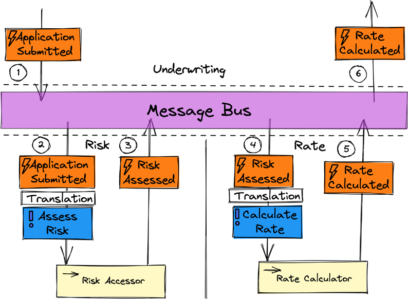
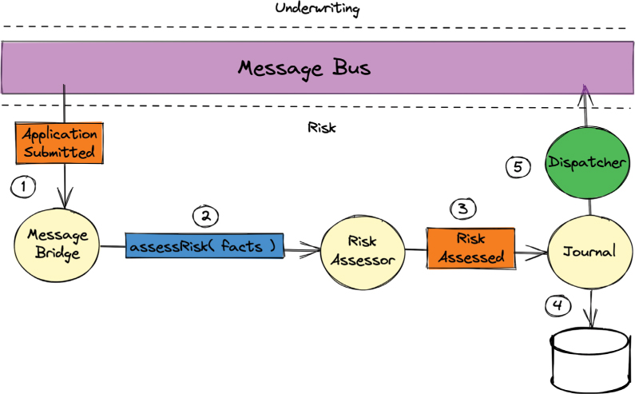
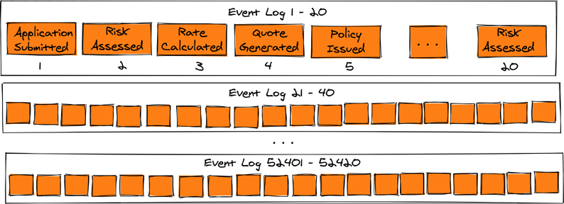
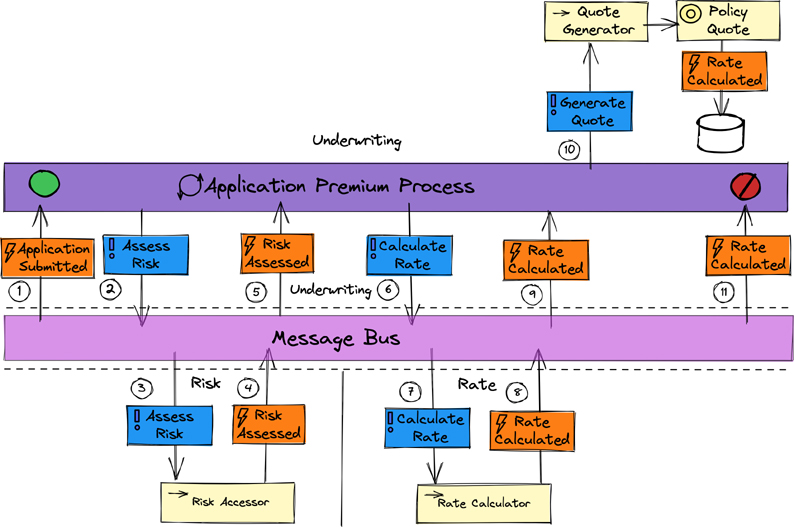
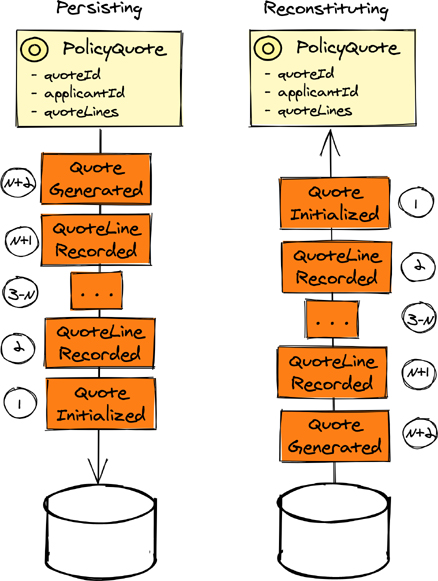
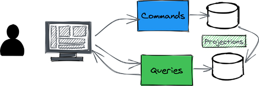

# 消息驱动和事件驱动架构

消息驱动架构是一种强调发送和接收消息在整个系统中扮演重要角色的架构。一般而言，与表述性状态传输 (REST) 和远程过程调用 (RPC) 相比，选择消息驱动架构的频率较低。这是因为 REST 和 RPC 似乎比消息传递更类似于通用编程语言范式；前一种方法提供抽象，给人以过程调用和方法调用的印象，许多程序员已经熟悉这些。
然而，与通用编程语言相比，REST 和 RPC 是脆弱的机制。由于编程语言中的脆弱机制，过程调用或方法调用失败的可能性很小。使用 REST-over-HTTP 和 RPC 方法，很可能由于网络和远程服务故障而发生故障。当故障确实发生时，一个远程服务和另一个远程服务之间的时间耦合往往会导致客户端服务完全失败。给定用例中涉及的远程服务或子系统越多，问题就越严重。正如分布式系统专家 Leslie Lamport 所描述的那样：
分布式系统是一种由于你从未听说过的机器发生故障而阻止你工作的系统。

当系统使用异步消息传递时，往往可以避免这种级联故障，因为请求和响应都是暂时解耦的。图 9.1 突出了编排的事件驱动过程中涉及的子系统之间的松弛时间依赖性。需要明确的是，事件捕获和传达业务利益（通常）是一种消息形式，而消息驱动流程是事件驱动流程的超集。 ^1^



图 9.1 事件驱动的编排：消息总线上的事件转换为命令。

> 1 有些使用严格的消息定义，指定它必须直接从发送方点对点发送到接收方。他们还可以将事件限制为仅通过 pub-sub 发送的事件。作者认为，这是一个过于局限的观点。下一节讨论使用基于轮询的 REST 作为读取事件日志的方法。尽管许多消费者可能会阅读这样的事件提要，但它与 pub-sub 的推送模型不同。当然，任何人都可以持有自己的观点，因此任何一种观点都不一定是错误的。

> 精心设计和编排的流程
>
> 这是流程管理的两种主要风格：编排和编排。编排包括一种分散的流程风格，例如，使用消息发布事件，每个子系统上下文必须确定事件是否与其相关，如果是，则将事件应用于其状态。上下文中子系统响应发出的一个或多个事件将与一个或多个其他子系统相关。编排相对容易理解，并且在流程只有几个步骤时最实用。这种流程管理风格的一个缺点是，当流程停在某处时，很难确定哪里出错以及为什么出错。另一个缺点是事件依赖与不拥有事件的子系统耦合，并且必须主观地解释并应用于它们自己的目的。而且，当然，随着系统和流程复杂性的增加，对事件的依赖会变得非常复杂。
> 相比之下，编排具有集中式的流程管理器（即 Saga）风格，它接收流程中涉及的任意数量的子系统发出的事件，然后创建命令消息，将流程的后续步骤驱动到相关子系统。使用编排流程的优点包括减少给定流程中涉及的子系统之间的依赖关系，因为编排器承担了从事件到命令的全部转换责任。协调器可能是故障的中心点，但考虑到设计良好的分布式系统所共有的可扩展性和故障转移策略，这通常不是一个重要的问题。通常，协调器由对其最终结果最感兴趣的团队设计和实施。当必须在协调器内部应用的流程中涉及的子系统之间进行更改时，它们可能会成为阻碍。协调器可能过于复杂，无法控制复杂度较低的流程。编排器不能成为业务逻辑的地牢；它必须仅用于驱动过程的步骤。

整个系统通过发生在给定子系统中的事件通过消息总线提供给其他子系统来工作。消息驱动架构也是反应式架构，因为组件（如图 9.1 所示）在消息刺激发生之前是被动的，然后适当的组件对这些刺激做出反应。相比之下，命令式代码通过 REST 和 RPC 过程调用或方法调用来驱动响应。反应性被定义为具有四个主要特征：响应性、弹性、弹性和消息驱动[反应性]。
在图 9.1 中，跨三个子系统上下文（承保、风险和费率）执行的六个步骤共同提供了通过 Web 为申请人报价保单保费所需的计算费率。承保子系统上下文幸福地不知道达到结果所涉及的细节。在“提交申请”事件发生后的某个时间，承保人将被告知可提供可报价的保费率。
所需的承保结果可能需要 2 秒或 12 秒才能实现。 Underwriting 没有失败，因为基础设施被预先配置为在 5 秒后超时，这会影响对 REST 请求的响应。并不是说 12 秒是可接受的长期服务水平协议 (SLA)——但在面临风险或利率子系统完全故障、随后在不同的云基础设施上完全恢复时，它是完全可以接受的，甚至可能在另一个地区。普通的 REST 和 RPC 都无法通过这条途径。
请注意图 9.1 中流程的一个细节，这是由于编排的性质：在消息总线上发送的事件必须由接收者翻译，以便内部刺激以消费上下文的语言进行转换。事件 Application Submitted 对 Risk 没有任何意义——但它在转换为 Assess Risk 之后才有意义。对于在 Rate 上下文中的 Risk Assessed 也是如此：当转换为计算 Rate 时，这是完全合理的，因为可以从作为 Risk Assessed 事件的一部分提供的评估结果中确定速率。
虽然消息总线通信通常用于跨子系统上下文的协作计算，但它不适用于单个子系统上下文中的消息驱动通信。如图 9.2 所示，子系统上下文中的各个组件可能被实现为在 Actor 模型运行时中运行的 Actor。每个actor 组件都是消息驱动的，因此actor 是反应性的。当一个actor希望另一个actor做某事时，它会向另一个actor发送一条消息，该消息将异步传递。尽管每个消息传递都是异步执行的，但图 9.2 所示的流程是根据步骤编号依次运行的。



图 9.2 子系统上下文内的反应式架构是通过使用 Actor 模型实现的。

在图 9.2 中，每个单独的参与者都由一个圆形元素表示（与表示普通对象的矩形元素相反）。 Actor之间的消息发送可以与基于消息总线的不同。例如，第 1 步和第 2 步表明 Message Bridge 角色（驱动程序适配器）从消息总线接收应用程序提交事件消息，并将其调整为发送到风险评估者角色的消息。看似正常的方法调用并不是通常用于对象到对象通信的方法。此方法调用将调用意图打包到一个基于对象的消息中，该消息在风险评估者参与者的邮箱中排队。评估风险（事实）消息将尽快作为风险评估参与者实施的实际方法调用传递。
Actor 模型的性质确保所有计算机处理器始终被使用，从而形成高效的计算解决方案，从而降低本地和云基础设施的运营成本。这是由 Actor 模型运行时使用计算节点的有限线程数以及由所有 Actor 协作执行的调度和分派来完成的。有限数量的线程必须分布在任意数量的参与者上。每个在其邮箱中有可用消息的参与者都被安排在线程可用时运行，并且（通常）在使用该线程时仅处理单个待处理消息。演员可用的任何剩余消息都计划在当前消息完成后传送。
这突出了 Actor 模型的另一个好处。每个参与者一次只能处理一条消息，这意味着参与者是单独的单线程，尽管许多参与者在短时间内同时处理消息意味着整个运行时模型是大规模并发的。每个参与者都是单线程的这一事实意味着它不需要保护其内部状态数据不被两个或多个同时进入的线程使用。参与者不得共享可变内部状态的规则进一步加强了国家保护。
图 9.2 和本书中突出显示的用例类型得到了 VLINGO XOOM 的特别支持，VLINGO XOOM 是一个基于单体和微服务架构的 Actor 模型 [VLINGO-XOOM] 的免费和开源 (FOSS) 反应性工具集。

## 基于消息和基于事件的 REST
如第 8 章所述，REST 可用于跨限界上下文的集成，但 REST 如何支持消息驱动和事件驱动架构？尽管大多数人不会从消息传递的角度考虑 REST，但这实际上是它的专长。 HTTP 规范以消息的形式引用每个请求和响应。因此，根据定义，REST 是一种消息驱动的架构，而事件是一种独特的消息类型。诀窍是将事件消费请求转换为异步操作。正是这些技术不像典型的 Web 应用程序模式那样广为人知。
但是为什么有人想要通过 REST 向消费者提供消息，特别是事件？一些原因包括 Web 具有高度可扩展性，世界各地的开发人员都了解 Web 和 HTTP 背后的思想，并且提供静态内容非常快（并且可以在服务器和客户端上缓存）。开发人员通常不熟悉消息总线和代理，或者至少比 HTTP 更不熟悉它们。对消息总线和代理感到不舒服不应阻止使用消息驱动和事件驱动架构。
事件日志
作为一个基本的经验法则，每个持久存储的事件都必须是不可变的；也就是说，它绝不能改变。第二个相关规则是，如果事件出错，而不是修补其持久状态，则必须有一个补偿事件，该事件稍后持久化，并最终在消费者将事件应用到数据之上时“修复”错误的数据他们在知道错误之前就产生了。换句话说，如果消费者已经错误地消费了一个事件，那么稍后更改它对这些消费者没有帮助。他们永远不应该重新开始并从头开始应用所有事件——这可能会导致灾难。在考虑以下几点时，继续执行这些规则。
当事件发生在子系统上下文中时，它们应该按照它们发生的顺序持续收集。根据事件序列，可以虚拟地或物理地创建一系列事件日志。图 9.3 提供了这些日志的描述。



图 9.3 事件日志从 1-20 开始并持续到近 100 万个事件。

这可以通过使用支持分配给每个事件然后递增的可靠序列号的正式数据库（与平面文件或平面文件目录相反）来完成。关系数据库通过称为序列的功能或另一个称为自动增量列的功能支持此过程。通过确定单个日志中的最大条目数，然后创建一个虚拟移动窗口来动态地为每个日志提供服务，从而逻辑地创建事件日志。
与专用日志数据库相比，关系数据库的一些负面权衡包括事件日志服务有些慢。如果存储了大量事件，则用于长期维护它们的磁盘空间可能会出现问题；但是，如果系统使用支持云的关系数据库，则这种担忧可能永远不会成为实际问题。即便如此，创建一个表的虚拟数组可能是有意义的，其中每个表将只保存最大数量的事件，然后多余的事件将溢出到下一个逻辑表中。还存在这样的风险，即用户可能会被诱惑修改数据库中的现有事件，但绝不能这样做。因为日志是过去发生的记录，所以修补事件是不正确的。
一个好的关系型数据库和一个使用技巧高超的开发者，不仅可以在一个表中支持数以百万计的数据库行，而且可以通过正确的键索引来实现快速检索。虽然这个说法是对的，但它所表达的观点是假设单个数据库表中的数百万行就足够了。实际上，有些系统每天都会产生数百万甚至数十亿的事件。如果在这些条件下关系数据库仍然有意义，则表的虚拟数组可以提供帮助。很明显，这样的系统可以使用高度可扩展的 NoSQL 数据库来代替。这也可以解决一系列问题，但使用单调递增的整数键插入新事件效果不佳。这样做通常会极大地妨碍此类数据库采用的分片/散列算法。
还有其他方法可以处理这种情况。如图 9.3 所示，可以通过将一系列平面文件写入作为可服务 REST 资源的普通磁盘来维护事件日志。写入每个日志文件后，内容将作为静态内容可用。静态平面文件可以复制到几个或多个服务器，就像缩放典型网站内容时所做的那样。
这种方法的一个可能的缺点是需要一个平面文件结构，它不仅指定应该将多少事件写入单个日志平面文件，而且还指定文件在磁盘上的布局方式。操作系统限制了给定目录中可以保存的文件数量。即使系统能够在单个目录中存储大量文件，这些限制也会减慢访问速度。类似于电子邮件服务器使用的层次结构的方法可以非常快速地访问平面文件。
与关系数据库的积极权衡是平面文件和目录布局的绝对数量几乎不会提供修补内容的诱惑。如果这不是一种威慑，那么安全访问文件系统就可以了。
无论做出何种选择，都可以通过多种方式使用 REST 使用事件，如以下部分所述。

### 用户投票

订阅者可以使用日志资源的简单轮询：

```sh
GET /streams/{name}/1-20
GET /streams/{name}/21-40
GET /streams/{name}/41-60
GET /streams/{name}/61-80
GET /streams/{name}/81-100
GET /streams/{name}/101-120
```

在此示例中，{name} 占位符替换为正在读取的流的名称，例如承销，或者更一般地说，策略市场。前者将仅服务于特定于承保的事件，而后者将提供各种子系统上下文中所有事件的完整流，包括承保、风险和利率。
缺点是如果订阅者轮询没有正确实现，客户端会不断请求下一个尚不可用的日志，这些请求可能会导致大量网络流量。请求还必须限于合理大小的日志。这可以通过使资源标识固定范围来强制执行，下一个和上一个日志由响应标头中的超媒体链接引用。可以使用响应标头元数据建立缓存技术和定时读取间隔，以消除请求淹没。此外，甚至可以使用通用的铸造 URI 来提供部分日志：
```GET /streams/policy-marketplace/current```
当前资源是消耗最近事件日志资源的手段。如果当前日志（例如 101-120）超出给定客户端尚未读取的先前事件日志，则 HTTP 响应标头将提供导航至先前日志的链接，该链接将被读取和应用在当前日志之前。这种向后导航将一直持续到客户端最近应用的事件被读取。从那时起，将应用所有尚未应用的事件，包括向前导航直到到达当前日志。再一次，缓存通过防止从服务器重新读取预读但尚未应用的日志，即使它们是通过冗余 GET 操作显式请求的，也适用于这种方法。这在实施领域驱动设计 [IDDD] 和我们自己的后续书籍实施战略单体和微服务（Vernon & Jaskuła，Addison-Wesley，即将出版）中有更详细的解释。
服务器发送的事件
尽管服务器发送事件 (SSE) 以支持服务器到浏览器事件馈送而闻名，但这并不是此处的预期用途。浏览器使用的问题在于并非所有浏览器都支持 SSE 规范。即便如此，SSE 还是事件生成器与其非浏览器、需要接收事件的服务/应用程序客户端之间的一个有价值的集成选项。
SSE 的规范规定，客户端应请求与服务器的长期连接以进行订阅。订阅后，客户端可以指定它成功应用的最后一个事件的标识符。在这种情况下，客户端可能之前已订阅但在流中的某个点断开连接：

```sh
GET /streams/policy-marketplace
…
Last-Event-ID: 102470
```

正如提供其当前起始位置所暗示的那样，客户端负责维护其在流中的当前位置。
作为订阅的结果，可用的事件将从 Last-Event-ID 的开头或位置开始流式传输，并一直持续到客户端取消订阅或以其他方式断开连接。以下是 SSE 规范批准的格式，但实际应用程序可能包含更多或更少的字段。每个事件后跟一个空行：

```sh
id: 102470
event: RiskAssessed
data: { “name” : “value”, … }

…
id: 102480
event: RateCalculated
data: { “name” : “value”, … }

…
```

要取消订阅流，客户端发送以下消息：

```sh
DELETE /streams/policy-marketplace
```

发送此消息时，订阅终止，服务器发送 200 OK 响应，服务器关闭其端的通道。在收到 200 OK 响应后，客户端也应该关闭通道。

## 事件驱动和流程管理

本章前面的部分阐明了事件驱动流程管理背后的想法，其中重点是精心设计的流程。编排需要有界上下文参与一个过程，以理解来自一个或多个其他上下文的事件，并根据它们的本地含义解释这些事件。在这里，重点转移到编排^2^ [指挥者]，让一个中心组件负责从头到尾推动流程。 ^3^

> 2 Netflix 发现，面对不断增长的业务需求和复杂性，扩展基于编排的流程变得更加困难。精心设计的 pub-sub 模型适用于最简单的流程，但很快就显示出其局限性。出于这个原因，Netflix 创建了自己的编排框架，称为 Conductor。
>
> 3 一个过程可能永远不会结束，因为正在进行的消息流——无论是事件、命令、查询及其结果，还是其他东西——可能永远不会结束。在这里，从开始到结束的过程用于实际目的，但请注意，这种风格没有任何限制。

在图 9.4 中，名为 Application Premium Process 的流程经理负责将完整构造的报价结果推送给已提交申请的申请人，其步骤在以下列表中进行了描述。
由于从申请人提交的申请文件创建了聚合类型的应用程序，因此发生了 ApplicationSubmitted 事件。为简洁起见，未显示应用程序实例创建。当流程管理器看到 ApplicationSubmitted 事件时，流程开始。

1. ApplicationSubmitted 事件被转换为名为 AssessRisk 的命令，并在消息总线上排队。
2. AssessRisk 命令被传送到风险上下文，在那里它被分派到名为 RiskAssessor 的域服务。 RiskAssessor 下面是处理细节（图 9.4 中未显示）。
3. 一旦评估了风险，就会发出 RiskAssessed 事件并在消息总线上排队。
4. RiskAssessed 事件被传递给流程管理器。
5. RiskAssessed 事件被转换为CalculateRate 命令并在消息总线上排队。
6. CalculateRate 命令被传递到 Rate Context，在那里它被分派到名为 RateCalculator 的域服务。 RateCalculator 下面是处理细节（图 9.4 中未显示）。
2. 计算出速率后，将发出 RateCalculated 事件并在消息总线上排队。
3. RateCalculated 事件被传递给流程管理器。
4. RateCalculated 事件被转换为 GenerateQuote 命令并在本地直接调度到名为 QuoteGenerator 的域服务。 
5. QuoteGenerator 负责将 PremiumRates 解释为 QuoteLines 并分派到名为 PremiumQuote 的聚合（有关详细信息，请参阅第 7 章“领域概念建模”和第 8 章“基础架构”）。当记录最后的 QuoteLine 时，会发出 QuoteGenerated 事件并将其存储在数据库中。
6. 一旦事件存储在数据库中，它就可以在消息总线上排队——这对于 QuoteGenerated 事件也是如此。在应用程序高级流程的情况下，收到 QuoteGenerated 事件标志着流程的结束。



图 9.4 编排：在总线上发送命令以驱动过程结果。

检查图 9.4，似乎在消息总线上对事件和命令进行排队的尝试可能会失败，从而导致整个过程失败。然而，考虑到所有事件和从它们转换而来的命令首先被持久化到一个数据库中，然后被放置在消息总线上，有时会重复，直到这个努力成功。这建立了至少一次交付合同。步骤 10 和 11 首先突出显示持久性，将第二个序列加入队列。然而，在图 9.4 中说明的所有步骤的详细程度会减损主要流程并掩盖应从示例中收集的要点。
对于协调的流程，流程经理负责驱动流程。这通常将流程本身置于下游，因此协作上下文不需要了解有关流程细节的任何信息，只需了解如何履行其核心职责。
在前面的示例中，应用程序溢价流程位于承保上下文中。然而，情况不必如此，因为该过程可能被单独部署。然而，默认情况下，将流程与需要完成流程的限界上下文组件一起部署是有意义的。此设计选择是为应用程序溢价流程做出的，该流程位于承保上下文中。这样的设计往往会降低整个过程的复杂性。
问题仍然存在：应用程序高级流程和所涉及的上下文是作为单体部署还是作为单独的微服务部署？使用消息总线，如图 9.4 所示，似乎暗示着微服务架构。这是可能的，但不一定如此：
消息总线可以使用轻量级消息传递在 Monolith 内部提供，例如使用 ZeroMQ。
团队可能已经决定 Monolith 应该使用更可靠的消息传递中间件或基于云的消息总线（或消息日志），例如 RabbitMQ、Kafka、IBM MQ、JMS 的实现、AWS SNS、AWS Kinesis、Google Cloud Pub/ Sub 或 Azure 消息总线。^4^ 选择最适合你的项目要求和 SLA 的方式。

> 4 可能的消息传递机制的数量太多，无法在此列出详尽的列表。此处确定的选项是作者更熟悉的选项之一，通常被广泛使用。

该解决方案可能需要使用微服务架构，或单体和微服务的混合。可靠的消息传递机制，无论是基于云的还是本地的，都是这些情况的合理选择。
正如第 6 章中所讨论的，模式注册表的使用降低了跨上下文依赖关系的复杂性，以及应用程序高级流程所需的各种发布语言的翻译和翻译的复杂性。 VLINGO XOOM 提供了一个这样的 FOSS 模式注册表，即 Schemata [VLINGO-XOOM]。

## 事件溯源
软件开发人员习惯于将对象存储在关系数据库中。使用领域驱动的方法，通常是以这种方式持久化整个聚合的状态的问题。可以使用称为对象关系映射器的工具来帮助完成此任务。最近，一些关系数据库围绕存储序列化为 JSON 的对象进行了创新，这是解决对象和关系模型竞争力的共同阻抗的一个很好的权衡。一方面，可以通过专门的 SQL 扩展以与关系列大致相同的方式查询序列化的 JSON 对象。

> 5 许多架构师和开发人员都熟悉这些阻抗，因此本章不提供详尽的描述。它们通常涉及为了某种建模优势而构建对象的愿望，然后会遇到对象关系映射工具和/或数据库的限制。在这种情况下，对象关系映射工具和数据库获胜，对象建模者失败。

然而，有一种替代的、完全不同的对象持久性方法强调相反的一面：不要存储对象；而是存储他们更改的记录。这种做法称为事件溯源，^6^ 要求在事件中捕获对聚合状态的更改记录。

> 6 事件驱动模式比本书中描述的要多。我们的后续著作《实施战略单体和微服务》（Vernon 和 Jaskuła，Addison-Wesley，即将出版）中提供了广泛的描述。

在接下来的讨论中参考图 9.5 很有帮助。



图 9.5 事件溯源用于保持聚合状态并重构它。

事件溯源背后的想法相当简单。当聚合处理的命令导致其状态发生变化时，该变化至少由一个事件表示。代表变化的一个或多个事件是细粒度的；也就是说，它们代表了捕捉变化本质所需的最小状态。这些事件存储在一个数据库中，该数据库可以维护特定聚合的事件发生顺序。事件的有序集合称为聚合流。每次发生对聚合的更改并发出一个或多个事件时，它代表流的不同版本并且流长度增加。
假设讨论中的 Aggregate 实例超出范围并且由运行时进行垃圾收集，如果它的后续使用变得必要，则必须重新构建 Aggregate 实例。正如预期的那样，它的状态必须再次反映从它的第一个事件到最近的变化的所有变化。这是通过按照事件最初发生的顺序从数据库中读取聚合的流，然后将它们一一重新应用到聚合来实现的。这样，Aggregate 状态逐渐被修改，以反映每个事件所代表的变化。
这种方法听起来既强大又简单，到目前为止也是如此。然而，你必须小心地使用这把剑，因为它也会造成痛苦。

> 直截了当，除非……
>
> 挑战不是最初使用事件溯源时出现的，而是主要由于其他一些原因：
> 当一种或多种聚合类型发生重大设计更改时
> 当聚合流中的事件发生错误时
> 重构具有大量事件流的聚合的状态时
> 当必须从事件组装复杂的数据视图时
> 处理设计更改涉及生成表示一个流的划分或两个或多个流的合并的流。
> 必须修补一个聚合实例流中的事件中的错误。而“补丁”，我们的意思是不补丁数据库中的现有事件数据，而是添加一个新事件，可能是仅用于补丁的不同类型。这旨在引起一种解释，以补偿先前受影响的重组聚合状态中的错误，以及先前包含错误的事件的任何下游消费者。如果给定类型的一个聚合实例流中出现错误，则该聚合类型的所有实例或至少其中许多实例中很可能存在相同的错误。问题在于产生事件的代码。因此，代码必须是固定的，流必须按照描述进行修补。
> 当聚合的状态由大型事件流构成时，可以通过使用状态快照来增强重构其状态时的性能。此类快照是在特定版本间隔（例如每 100、200 或达到可接受性能的任意数量的版本）拍摄的完整聚合状态。当为了重构聚合状态而读取流时，首先读取快照，然后仅读取在快照版本之后发出的事件并按该顺序应用于状态。
> 使用事件溯源时，你应该假设几乎总是需要命令查询职责分离（CQRS；在下一节中描述）。 CQRS 用于将聚合发出的事件投影到在用户界面上查询和呈现的视图中，或者用于其他信息需求的视图。
> 这一切都不容易，但话说回来，所有软件都会发生错误，并且无论使用哪种持久性方法或选择的数据库是什么，迁移都会发生在持久状态。有一些方法可以减轻疼痛。提供有关使用事件溯源的深入指导不在本书的范围内，但你可以在我们的后续实施书《实施战略单体和微服务》（Vernon 和 Jaskuła，Addison-Wesley，即将出版）中找到该信息。

当理解使用事件溯源的潜在痛苦时，它往往会引起一些关于为什么首先要使用它的疑惑。这没什么错——问为什么通常是好的。最糟糕的情况是在没有清楚了解为什么和如何使用事件溯源时，^7^ 因为此应用程序通常会带来遗憾和对事件溯源的指责。很多时候，架构师和程序员基于阴谋而不是业务驱动的目的做出技术和设计选择，然后在意外的复杂性中陷入困境。此外，架构师和程序员经常受到供应商生产的技术驱动框架和工具的影响，这些框架和工具试图让他们的市场相信事件溯源是实施微服务的最佳方式。 ^8^

> 7 作者听到的关于事件溯源的一些最响亮的抱怨是不理解它的结果，因此没有正确使用它。
>
> 8 假设微服务是好的是使用它们的弱理由。只有当需要告知目的时，微服务才是好的。坚持认为微服务总是好的，并且事件溯源是实施微服务的最佳方式的供应商正在误导他们的客户，无论是有意还是无意。

在获得收益之前注意到痛苦是一个重要的警告信号，对于没有经验的、好奇的和容易上当的人来说。
好消息是使用事件溯源有非常明确的理由。接下来，我们考虑可能的收益，同时理解这些可能需要一些痛苦——但这都是软件模式和工具体验的一部分。它们带有一揽子交易，称为权衡和后果，每个选择总是有积极和消极的一面。关键是，如果正面是必要的，那么负面也是必要的。现在，考虑从事件溯源中获得什么：

1. 我们可以维护在使用事件溯源的每个给定聚合类型的实例中发生的每个更改的审计跟踪。这可能是特定行业所要求的，或者至少是聪明地在特定行业中使用。
2. 事件溯源可以与会计中使用的总账进行比较。永远不会对现有条目进行更改。也就是说，只有新条目会添加到分类帐中，并且不会更改任何条目以进行更正。由一个或多个先前条目引起的问题通过添加一个或多个新条目来进行补偿。这在侧边栏“直截了当，除非……”中有所描述。
3. 事件溯源对于解决特定业务问题的复杂性非常有用。例如，由于事件既代表业务领域中发生的事情，也代表它们发生的时间，因此事件流可用于基于时间的特殊目的。
4. 除了将事件流用于持久性之外，我们还可以通过许多不同的方式应用它们，例如决策分析、机器学习、“假设”研究和类似的基于知识的预测。
5. 作为“总账”的审计跟踪兼作调试工具。开发人员可以使用一系列事实事件作为考虑每个级别更改的手段，这可以深入了解何时以及如何引入错误。当对象状态被每个新更改完全替换时，此帮助不可用。

限界上下文中的某些聚合类型可能适合使用事件溯源，而其他类型则不适合。相反，如果所有聚合类型的所有更改的完全有序流对业务很重要，则这种混合方法将不实用。
尽管它在技术解决方案中有动机，但应仅出于正当的业务原因使用事件溯源，而应避免用于其他目的。考虑到这一点，之前事件采购的好处列表中只有 1-3 点具有商业动机。第 4 点和第 5 点没有，但是当满足 1-3 中的任何一个时是有利的。

## CQRS

系统用户查看数据的方式往往与创建和修改数据的用户不同。系统用户必须经常查看更大、更多样化、粗粒度的数据集才能做出决定。一旦做出这个决定，系统用户执行的操作就是细粒度的和有针对性的。考虑以下示例：

- 想想医生在开药前必须查看的所有患者数据：患者的生命体征、过去的健康状况、治疗和程序；当前和过去的调解；过敏（包括对药物的过敏）；甚至患者的行为和情绪。在此审查之后，医生将记录药物、剂量、给药、持续时间和补充次数，可能在表格的单行中记录。
- 承销商必须查看已提交申请的数据；所有研究，例如财产检查或申请人的健康检查；过去的损失或健康状况索赔；评估风险；并使用所有这些数据来计算推荐的可报价溢价。在考虑了整套信息后，承保人可以单击按钮为保单提供报价或拒绝向申请人提供保单。

这使得可视模型和操作模型不一致。可用的数据结构通常围绕操作模型而不是可视模型进行优化。在这种情况下，组装可视数据集可能非常复杂且计算成本高昂。
CQRS 模式可用于解决这一挑战。如图 9.6 所示，这种模式需要两种模型：一种针对命令操作进行了优化，另一种针对聚合可视数据集的查询进行了优化。



图 9.6 命令和查询模型形成了两种可能的路径。

图 9.6 中的模式的工作原理如下：

1. 用户将看到来自查询模型的视图数据集作为表单。
2. 用户做出决定，填写一些数据，然后将表单作为命令提交。
3. 命令在命令模型上执行，数据持久化。
4. 持久化的命令模型更改会根据需要投影到查询模型中，以便查看尽可能多的数据集。
5. 返回步骤 1。

图 9.6 显示了命令模型和查询模型作为两个独立数据库的存储。虽然这样的设计对于大规模和高通量系统来说是有意义的，但并不是真正必要的。模型存储可能只是虚拟/逻辑分离，实际上使用单个数据库或数据库模式。鉴于这两个模型在物理上是一个并且单个事务可以管理多个写入，这种设计意味着命令模型和查询模型都可以在事务上保持一致。保持事务一致性可以为开发人员省去当两个模型在物理上分离但最终保持一致时所带来的麻烦。
使用Event Sourcing时，一般也需要使用CQRS。否则，除了通过聚合唯一标识之外，没有其他方法可以查询事件源命令模型，这使得实施任何复杂的查询以呈现广泛的可见数据集要么不可能，要么极其令人望而却步。为了克服这个限制，从事件源命令模型发出的事件被投影到查询模型中。

## 无服务器和功能即服务

基于云的无服务器架构正日益成为软件行业的一股力量。这种趋势反映了无服务器设计提供的简单性和节省。 “无服务器”一词似乎有点误导，因为该解决方案显然需要计算机。^9^ 是的，但实际上是从云用户-开发人员的角度应用该术语。云供应商提供服务器，而不是由订户承担此责任。对于云用户来说，没有服务器，只有可用的正常运行时间。

> 9 正如软件专业人士不断提醒的那样，命名是很难的，软件名称太快一成不变。与 HATEOAS 一样，也许可以将“无服务器”视为代表概念的字形。

为了更明确地定位无服务器架构，有些人使用了术语后端即服务 (BaaS)。然而，仅仅考虑托管应用程序的“后端”并不能充分描述全部好处。无服务器架构也是基础设施即服务（IaaS），其中基础设施不限于计算机和网络资源。更具体地说，从这个角度来看，基础设施包括应用程序开发人员不需要创建和（有时）订阅者甚至不需要付费的各种软件。就古老的格言“专注于业务”而言，这确实是一个飞跃。以下是使用无服务器架构的一些主要好处：

- 用户只需为实际的计算时间付费，而不是为众所周知的“永远在线”配置的服务器付费。
- 显着的成本节省通常令人难以置信，但用户无论如何都可以相信它们。
- 除了决定所需的云软件组件外，规划更容易。
- 这些解决方案使用了大量免费或成本极低的硬件和云原生软件基础设施和机制。
- 由于基础设施问题的减少，开发速度加快。
- 企业可以部署云原生模块化单体。
- 无服务器架构为浏览器客户端和移动客户端提供了强大的支持。
- 因为他们需要创建更少的软件，用户实际上可以专注于业务解决方案。

第 8 章“基础架构”中讨论的端口和适配器架构仍然很有用，并且非常适合无服务器方法。事实上，如果精心构建和设计，服务和应用程序打包很有可能不需要改变。如前所述，在处理基础设施软件方面大大减少的开销有很大的好处。主要区别与服务和应用软件的架构、设计和运行方式有关。术语云原生是指利用所有专门构建的基础设施以及数据库和消息传递等机制，这些机制本身是专门为云计算设计的。
考虑来自用户的基于浏览器的 REST 请求的示例。请求到达由云供应商提供的 API 网关。网关配置为了解如何将请求分派到服务或应用程序上。当分派发生时，云平台会确定 REST 请求处理程序（即端点或适配器）及其软件依赖项是否已在运行且当前可用。如果是这样，请求将立即分派给该请求处理程序。如果没有，云平台会在订阅者的软件运行的情况下启动服务器，并将其分派给请求处理程序。无论哪种情况，从那时起订户的软件都可以正常运行。
当请求处理程序向客户端提供响应时，订阅者对服务器的使用结束。云平台然后确定服务器是否应该保持可用于未来的请求，或者应该关闭。订户只承担处理请求的成本，以及为此所需的硬件和软件基础设施的任何适用成本。
如果实际处理请求的整个时间是 20、50、100 或 1,000 毫秒，这就是订阅者为运行他们的软件而支付的费用。如果一两秒钟内没有请求到达，则订阅者不会为那段时间付费。将其与云配置服务器进行比较，无论它们是否在使用中，每天每一秒都会产生成本来保持活动和准备就绪。
功能即服务 (FaaS) 是一种无服务器机制，支持针对上述特征的软件架构和设计。然而，FaaS 通常用于将非常小的组件部署到其运营能力中。这些功能旨在执行非常集中的操作，并且可以非常快速地完成。想象一下在一个非常大的系统中创建一个单一的过程或方法——这大致是实现和部署 FaaS 时解决的范围。
一个区别可能是请求的处理方式。从函数式编程的角度考虑，函数是用无副作用的行为实现的。正如第 8 章中的“具有命令式 Shell 的函数核心”部分所述：“[A] 纯函数始终为相同的输入返回相同的结果，并且永远不会引起可观察到的副作用。”根据这个定义，可以将给定 FaaS 运行的整个状态作为输入参数提供，不需要数据库交互。结果是通过产生一个新值来确定的，然后 FaaS 会使用该值，就像函数一样工作。输入可能是系统中其他地方引起的事件，也可能是传入的 REST 请求。无论如何，FaaS 本身可能不会与数据库交互，无论是读取数据库还是写入数据库。写入数据库会导致副作用。也就是说，使用数据库作为读取和写入状态的过程或方法对 FaaS 没有限制。

## 应用工具
本章和前几章已经给出了几个应用消息驱动和事件驱动架构的例子。其余章节详细介绍了第三部分中解释的特定架构和模式的应用。配套书《实施战略单体和微服务》（Vernon & Jaskuła，Addison-Wesley，即将出版）提供了详尽的实施示例。

## 概括

本章通过完成一些较小的基于步骤的案例，考虑了使用分布式系统和子系统之间的同步来完成一个大型用例的挑战。引入消息驱动和事件驱动架构是为了执行复杂的多步骤流程，同时避免由于异步消息传递和时间解耦导致的级联故障。介绍了同时使用编排和编排的流程管理，以及这些方法之间的差异以及每种方法的使用方式。 REST 在流程管理中的作用也得到了描述。引入了事件溯源和 CQRS，包括它们在消息和事件驱动系统中的使用。无服务器和 FaaS 架构在未来的云计算中显示出前景。以下是本章的行动项目：

- 使用编排来分散处理有限的多步分布式用例。
- 当需要具有多个步骤的复杂流程时，采用集中式编排模式，推动相关子系统之间的步骤。
- 当需要熟悉的技术方法时，请考虑使用基于 REST 的客户端和事件驱动通知的提供者。
- 使用事件溯源来持久化表示实体随时间推移的状态的事件记录流。
- 使用 CQRS，将服务/应用程序命令操作和状态与查询使用的操作和状态分开，以显示状态分组。
- 这完成了第三部分。第四部分将这部分和前两个部分联系在一起，以构建以业务为中心的单体应用和微服务。

## 参考

- [指挥] https://netflix.github.io/conductor/
- [IDDD] 沃恩弗农。实现领域驱动设计。马萨诸塞州波士顿：Addison-Wesley，2013 年。
- [反应式] https://www.reactivemanifesto.org/
- [VLINGO-XOOM] https://vlingo.io