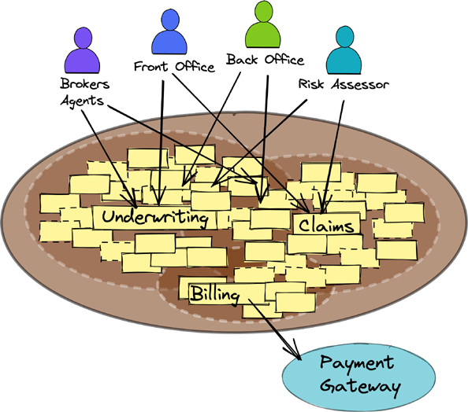
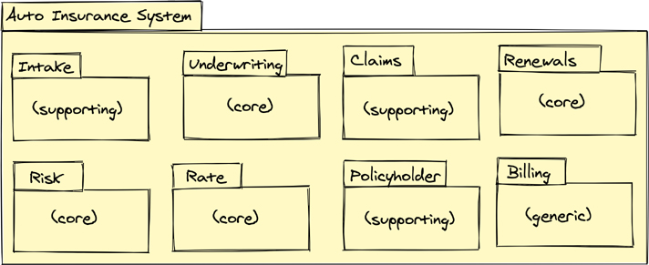
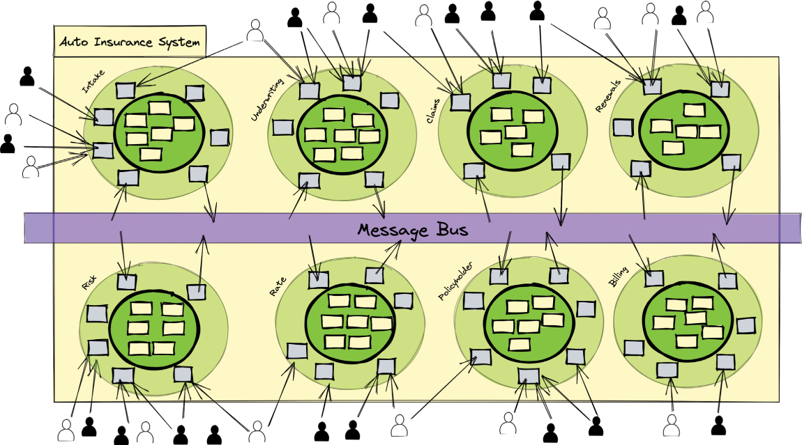
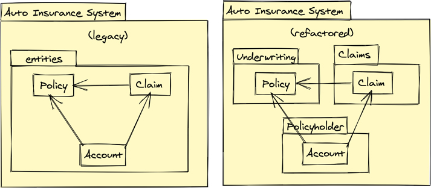
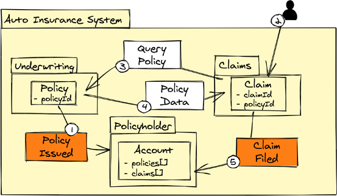

# 像你的思想一样建造单体

构建干净且不妥协的 Monoliths 不是白日梦，而是大量系统的最佳选择。它也不像 1-2-3 那样容易实现。它需要思考、技能、纪律和决心——与创建微服务时所需的心态非常相似。

> 笔记
> 本章继续介绍第 1 章中介绍并贯穿本书的运行案例研究。如果示例中的某些上下文似乎缺失，请参阅前几章。

首先，我们将回顾为什么在许多情况下单体是一个不错的选择，至少在早期，以及如何使用先前定义的战略工具集有效地创建单体架构。组织应该学习架构、设计和构建满足其业务战略目标并且可维护和可扩展的单体应用程序。

> Monoliths 的原因和方法
>
> 以下列表回顾了之前提出的要点，例如在第 1 章和第 2 章中，它们有助于形成新的 Monoliths 以及重构和重构现有的 Monoliths：
>
> - 为什么？许多软件系统不需要使用微服务。
> - 如何？使用快速迭代、增量价值创造和逐步改进的实验是最好的方法。
> - 如何？错误并不致命，只要它最终导致正确；培养安全实验和快速失败的文化，从而带来有价值的学习。
> - 为什么？巨石本身并不坏；正是它们中的许多包含的泥浆确保了熵。
> - 为什么？ Monolith 应该是一种架构，而不是非架构。
> - 如何？建立一个支持创造力和创新的环境，没有技术障碍。
> - 如何？面对康威定律，在几乎扁平结构的小团队中进行有效沟通是取得全面成功的唯一途径。
> - 如何？无所畏惧地支持对内容或方式的改变，以便你的组织能够实现创造力和创新；相反，不要与任何扼杀创造力和创新的事物结婚。
> - 如何？拒绝损害业务运营的内容和方式；也就是说，下一代软件必须足够成熟，才能支持退役上一代软件。
> - 为什么？避免增加对预期寿命缩短的系统的承诺，或由于担心先前努力的沉没成本而继续大量投资。
> - 如何？思考和重新思考，这需要决心并消耗精神和情感能量。
> - 为什么？谨防通过每天甚至每小时修补持久数据来忽略丢失和补偿的业务逻辑；团队可能缺乏对为什么需要临时数据补丁的充分理解。
> - 如何？害怕在尝试替换大泥球 (BBoM) 时丢失单个更改和更改的上下文；仔细跟踪被更换子系统的所有变化。
> - 如何？注意与重构或替换现有 BBoM 相关的未知因素；由于被视为简单的不可预见的复杂性，可能会浪费大量时间。
> - 如何？模块化为遵循业务能力而非业务线的限界上下文。

Monoliths 有三个主要关注点和目标：

1. 从一开始就获得一个 Monolith 并保持这种状态
2. 在之前做错事后立即获得单体
3. 从单体到微服务

今天，大多数组织都在追求第三个关注点和目标，因为他们需要处理错误的单体应用。作者不适合说第三个关注点是错误的目标，但利益相关者应该愿意考虑它可能不是必需的，甚至不是最好的目标。假设从 Monolith 到微服务的过渡是正确的最终目标，那么最初关注第二个问题可能是更好的初始策略。
了解如何在处理第二个问题时取得成功最好通过观察如何成功实现第一个目标来实现。作为类比，请考虑接受过识别假币培训的人。他们没有了解每一个可能的假币例子，部分原因是不可能了解所有这些以及无休止的伪造新方法的尝试。相反，他们通过练习来了解真实货币的一切：“触摸、倾斜、看、看。”那些接受过这些方式训练的人能够检测到各种伪造的企图。他们可以解释赝品的所有错误之处，以及如果是真品会怎样。
根据这一推理，本章将按顺序处理列出的第一个和第二个目标。第 11 章“从单体到像老板一样的微服务”，通过研究实现这种转变的两种不同方法，深入探讨了第三个目标。在开始之前，在撰写本文之前大约 20 年提供一个简短的历史概述是公平的。

## 历史的角度
提供一个 21 世纪初期行业的历史视角是正确的，因为在不了解决策时间的影响的情况下判断过去的决策是不公平的。当 NuCoverage 于 2007 年首次踏上旅程时，“软件正在吞噬世界”的宣言还没有做出。那还是四年的未来。甚至在 2001 年之前，由于互联网热潮，软件已经扮演了不同的角色。尽管刚刚起步的全球 Web 还没有成熟到远远超过宣传册和电子商务店面，但它已经开始大踏步前进。
到 2001 年，软件即服务 (SaaS) 1.0 的失败主要是由于雄心勃勃的商业计划和缺乏开发企业级系统的经验、本地运营的费用（因为云不可用），以及——尤其是— 桌面套件锁定。那个时候，“内联网”很流行，但软件在很大程度上仍然是对人类决策的增强。除了从电子商务商店购买外，在 Web 上开展业务的情况很少见。
毫无疑问：在日常业务中，人类仍然承担着大量的认知负担。软件负责管理大量数据，这些数据不受人类使用的影响，而无需围绕特定用例进行扩充。业务仍在通过电话和电子邮件进行。这些业务人员拥有作为软件出售的产品来帮助处理他们的任务。低技术知识工作者使用商业企业办公产品（例如 SharePoint）来隐藏许多不可或缺的电子邮件。这些拥有商业知识但缺乏承担此类职责的技术技能的工人会入侵文档管理存储库并将他们的电子邮件和附件发送到这些杂乱无章的准“数据仓库”。在将原有电子邮件和新电子邮件一起归档仅几个月后，这些仓库几乎无法使用，而且肯定远不如许多纸质文件系统那样有条理。它们实际上是美化的网络文件系统，在层次结构或命名上没有规则或限制，在其中尝试使用低质量的搜索工具查找内容，导致许多误报和很少的真假。企业可能会忘记尝试从这些数据中获取商业智能，除非他们采取重大举措来执行清理、重组和重组，以便将数据塑造成有用的潜在知识库，而不是可用性问题。
“办公自动化”的试错方法并非孤立于最终用户设计的棘手文档管理系统。尽管如此，考虑到主要的软件开发和生产平台也令人大开眼界。从 1990 年代后期到 2004 年，Java 世界一直由 J2EE 统治。从 2003 年到 2006 年，Spring Framework 开始颠覆 J2EE，甚至被应用程序架构师与 J2EE 应用程序服务器的设施混合在一起。
分歧的另一边是 .NET Framework，它于 2002 年问世。到 2004 年，关于 .NET 的流行度超过 J2EE 的说法比比皆是，但现实似乎比这要少一些。 .NET 对 J2EE 的更好改进之一是省略了任何类似于 Enterprise JavaBeans (EJB) 的内容。 EJB 实体 Bean 是一场彻头彻尾的灾难，从来没有真正为数据库实体对象提供令人信服的解决方案。有线索的 Java 开发人员很快意识到 TOPLink 和后来出现的 Hibernate 提供了远超卓越的对象持久性体验。那些坚持 Entity Bean 潮流的人多次跌跌撞撞。在 .NET 方面，实体框架于 2008 年问世，但遭到了极大的失望。奇怪的映射规则迫使不切实际的对象设计，并且在没有高级应用程序开发人员的大量帮助的情况下克服这些困难需要几年时间。
鉴于 2007 年左右的科技世界状况，NuCoverage 最初只是构建软件，帮助承保人发布保单和理赔员确定正确的损失范围，从而很好地控制了其雄心壮志。在发布保单或涵盖索赔时，没有面向 Web 的应用程序提交或虚拟握手。这种保守的方法使公司走出了大门，在通过经验学到更多知识的同时，它可以在提高系统的同时快速实现盈利。
问题是 NuCoverage 软件团队对软件架构没有很好的理解和欣赏，也没有任何关于模块化不同业务能力的线索。 更聪明、更有经验的人很早就可以观察到这种差距。 结果，随着时间的推移，团队逐渐面临债务和熵严重不足的现实。 没过多久，最初的泥块就造成了损失。 不出所料，年复一年堆积的未确认和未偿还的债务导致一层又一层的泥，直到图 10.1 所示的大泥球巨石让 NuCoverage 致力于缓慢修复和新功能的传送带。



图 10.1 NuCoverage Big Ball of Mud 是多年忽视和权宜之计的结果。

了解了采用业务功能模块化的软件架构后，NuCoverage 企业如何被塑造成一个整体，以迎接多年的变化？
超越技术和框架。将 SharePoint、Enterprise Java、Entity Framework、JPA、数据库产品和消息总线扔到问题领域永远不会让团队免于思考的需要。即使每个软件 IT 部门、CIO、CTO 和开发人员都面临着疯狂的技术故障，但有一些合理的方法和指导方针实际上可以提供帮助。
域驱动设计 (DDD) 于 2003 年引入，端口和适配器架构于 2004 年引入。甚至更早，层架构可从软件架构模式 [POSA1] 的第一卷中获得。极限编程 [XP] 早在 DDD 之前就已经存在，敏捷宣言 [Manifesto] 也是如此。在 DDD 中发现的几个想法与 XP 和敏捷宣言有着惊人的相似之处。到 2004 年 [BC-HBR] 明确提到了组织（业务）能力。此外，在 NuCoverage 加入竞争之前很久，面向对象的设计 [OOD] 和编程 [OOP]、域建模 [Domain-Modeling] 以及类职责和协作 [CRC] 的方法就已被使用。那时存在的一些想法、模式和工具有机会在 2007 年影响架构和开发。然而，这并不意味着它们被使用，并观察从过去和现在开发的系统的结果，很明显，在很大程度上他们仍然不是。

## 从一开始

不要低估聘请顶级软件架构师和开发人员的重要性。顶级企业会在 C 级高管中寻找便宜货吗？那么，既然可以招募认真的从业者，为什么还要购买底层软件开发人员呢？了解要招聘的人员——即拥有合适技能的合适人选。请注意，软件工程方面的专业知识虽然不同，但与执行管理人员的专业知识一样重要。
尽管 NuCoverage 可能赞成大大降低软件开发成本对其有利的想法，但它绝对不是。为早期版本的最小系统采取保守的第一步并不能证明低质量的架构和设计是合理的。事实上，恰恰相反是有道理的。早期完善的、经过测试的架构和设计将为系统的代码库做好准备，以继续开发渐进式高级功能，并实际上促进了更快速的长期交付。首先，必须重视委托架构师和领导工程师以狂热的、鹰派的意识和热情来守护架构和代码质量，作为他们永无止境的优先事项。
考虑一下 2007 年 NuCoverage 的重新启动会产生什么结果。在阅读以下描述时，必须牢记 2007 年的背景。更明确地说，以下讨论不代表当代背景——即 WellBank 何时接近 NuCoverage。相反，当 NuCoverage 处于启动模式时，这些事件发生在此之前。

### 业务能力
回想一下，业务能力定义了业务做什么。这意味着，虽然企业可能会被重组为一个全新的结构，但新结构不会改变其业务能力。在大多数情况下，该业务仍然在做新结构出现之前的工作。当然，重组可能是为了启用新的业务能力，但重组前一天有利可图的业务能力并没有在后天被抛弃。这强调了通常最好根据其实现的业务能力来定义软件模型的通信边界的观点。
在图 10.1 中，三个业务功能很明显：承保、索赔和计费。它们是保险公司的明显选择。然而，NuCoverage 启动团队还必须发现和识别其他必要的功能。
如表 10.1 所示，NuCoverage 创业团队共同确定了他们的业务能力。这需要对通过统一对话理解的具体使用场景进行演练，以形成对业务目标的共同理解。表 10.1 中描述了每一个的初始目的和实现。
表 10.1 2007 年发现的 NuCoverage 初始业务能力

| 业务能力           | 描述                                                         | 类型 |
| ------------------ | ------------------------------------------------------------ | ---- |
| 录取               | 接收和验证申请，这些申请可以通过 Web 提交，但通常通过传真和电子邮件从代理处收到，或者通过邮寄方式直接从申请人那里收到纸质表格。接收过程可能需要联系代理和申请人以请求丢失的数据或纠正不明确和相互矛盾的信息。批准的申请将通过电子信息传送给承保公司。 | 配套 |
| 支持               | 对给定的可保风险是否值得接受做出决定，导致要么发布保单，要么拒绝该保单。 NuCoverage 聘请人类承保人根据风险模型的基于软件的协助来评估可保风险。承保人对风险模型建议的审查，以及任何必要的额外研究和与其他承保人的讨论，导致最终的人工决定。最终的承保决定被记录下来。用于承保流程的其他业务能力中的任何细节都在各自的上下文中收集。 | 核心 |
| 风险               | 计算风险评估是保险的核心，因为它是确定给定可保风险的潜在损失程度的一种手段。 NuCoverage 成功的一个关键是它开发了软件精算风险模型，该模型通过自动计算和建议帮助人类承保人做出决策。最初的重点是导致差异化费率的汽车和驾驶员风险。此业务目标需要仔细审查，以通过接受最不可能的潜在损失来降低风险。 | 核心 |
| 费率               | 保费率的计算基于风险模型建议并结合承销商审查和推理。结合数据和人力的结果记录在这里。随着时间的推移，最终记录的费率结果将用于逐步改进自动费率计算，同时提供根据过去经验应用的原因。 | 核心 |
| 保单持有人（账户） | 保留每个保单持有人的帐户以及他们所有保单的历史但有限的快照。当承保人签发新保单时，该业务交易的记录将输入相应保单持有人的账户。这可能需要建立一个新的保单持有人账户。 | 配套 |
| 索赔               | 捕获作为保单持有人索赔的损失，并提供计算实际损失和结算付款的方法。损失和结算可用于以后的续订和可能的近期保费调整。如果损失很可能是欺诈性的但无法证明，这是主动提高保费率的经典原因。如果可以证明欺诈，该保单肯定会被取消。 | 配套 |
| 续订               | 更新政策的过程开始的地方。该过程需要收集针对保单的索赔（如果有），以及当前的风险模型和由于覆盖特定风险的成本增加而可能增加的费率。续签流程包括理赔审核、审批风险、新计算费率等，获取后发送给Underwriting进行续签审批结果。最终的保单更新记录在承保人和保单持有人的账户中。 | 核心 |
| 计费               | 跟踪保费支付时间表并根据承保政策的签发生成发票。管理未付款和收款，这可能会导致建议取消保单。最初付款是通过支票或银行转账进行的。未来的付款可能会通过信用卡支付。目前，信用卡交易费用的成本可能与 NuCoverage 的利润率相同或更高。当建立大量支付并且新技术支付网关可用时，这可以在未来克服。 | 通用 |

图 10.2 显示了具有八个 Bounded Contexts 模块的 Monolith 容器，每个模块代表一种业务能力。表 10.1 和图 10.2 中的业务能力类型表明了各自的战略价值水平。



图 10.2 最初的 NuCoverage 问题空间域被实现为一个模块化的 Monolith。

目前，Risk业务能力绝对是一个核心领域。由于迫切需要确保高业务价值和一体化交互运营，最初有四种不同的具有核心价值的业务能力。承保人在利用以下四个核心上下文的同时执行其基本工作流程并获取有价值的决策信息：承保、风险、费率和续订。毫不奇怪，承销商对其工作流程和指导环境有很多话要说，将四大核心业务能力视为承销产品套件。
随着时间的推移，核心价值将趋于转移。例如，随着风险和利率功能的不断改进，承保变得更加自动化，承保将转变为支持角色。续订也是如此。将添加新的核心域。
在最小平台成功上线并持续改进几年后，另一个业务能力出现了——即奖励。如第 5 章“情境专业知识”所述，安全驾驶员奖励是最初引入的保单持有人奖励。最初，它被认为是保单持有人帐户功能中的一个简单值。尽管这不是一个有利的长期决定，但在业务优先级将额外的奖励功能排除在外之前就足够了。
架构决策
在确定业务能力后，NuCoverage 现在需要做出一些架构决策。例如，各类用户将如何与平台互动？将使用基于 Web 的用户界面似乎很明显。即便如此，对支持员工工作职责的设备的需求也在不断增长，这些设备在员工外出时需要移动性和便利性。是否有一种合理的方法来提出、跟踪并最终确定需要哪些架构决策，以及如何通过睁大眼睛的采用来提供用户驱动的机制和其他机制？
团队依靠架构决策记录 (ADR) 来定义、提议、跟踪和实施突出的架构选择。清单 10.1 提供了三个示例。第 2 章“基本战略学习工具”中描述了 ADR 决策方法。这些示例说明了汽车保险系统团队做出的相关决策。
清单 10.1 ADR 捕获用户界面和消息交换建议和决策

```sh
Title: ADR 001: REST Request-Response for Desktop User Interfaces

Status: Accepted

Context: Support Web-based user interfaces with REST

Decision: Use Web standards for desktop clients

Consequences:
  Advantages: HTTP; Scale; Inexpensive for experiments
  Disadvantages: Unsuitable for most mobile devices


Title: ADR 002: Use Native Device Development for mobile apps UI

Status: Accepted

Context: Support iOS and Android Toolkits for mobile apps

Decision: Use iOS and Android standard toolkits for mobile apps

Consequences:
  Advantages: Native look and feel
  Disadvantages: Multiple device types, form factors, languages,  toolkits; slow development


Title: ADR 003: Platform Message Exchange

Status: Accepted

Context: Collaborating subsystems exchange commands, events, and queries

Decision: Use RabbitMQ for reliable message exchanges

Consequences:
  Advantages: Throughput; Scale; Polyglot; FOSS; Support available
  Disadvantages: Stability?; latency vs in-memory transport?;
                 support quality?; Operational complexity
```

> 笔记
> 在接下来的讨论中，有多个对各种架构和相关模式的引用，例如 REST、消息传递和事件驱动架构。有关这些概念的讨论，请参见第 8 章和第 9 章。

图 10.3 中的八个有界上下文与图 10.2 中的那些一一对应。图 10.3 中突出显示的是正在使用的架构——即端口和适配器；在图 10.2 中，重点是用于将每个有界上下文与其他有界上下文分开的模块。实际上，在图 10.3 中，看起来好像每个有界上下文都有几乎精确的架构实现，但这只是象征性地绘制的。实际上，由于端口和适配器的性质，各种有界上下文可能有一些相似之处。但是，架构层的内部应用程序部分（可能带有域模型）将根据处理不同级别复杂性的需要进行不同的实现。有关更详细的示例，请参见第二部分“推动业务创新”和第三部分“事件优先架构”。



图 10.3 单体内部的八个有界上下文，每个都使用端口和适配器。

请注意，为简单起见，用户界面的显示未在图 10.3 中显示，因此看起来好像用户直接与适配器交互。此外，用户通常会严格显示在每个子系统的左侧。这里的架构被“旋转”，以方便向用户展示系统周围并在多个子系统中扮演角色。
ADR 的结果可以在图 10.3 中确定。 ADR 001 及其 REST 请求-响应架构，以及用于移动应用程序用户界面的 ADR 002，在用户与 Monolith 的交互中得到识别。此外，在消息总线（或代理）上的消息交换中可以看到 ADR 003 的结果。它通过 Monolith 的中心叠加，代表所有有界上下文在 Monolith 内部协作和集成的方式。 NuCoverage 软件开发团队对在 NuCoverage 成立的同一年发布的 RabbitMQ 早期版本印象深刻。
正确理解和正确实现这种单体架构的关键是在每个有界上下文和其他有界上下文之间进行完全清晰的分离。在图 10.3 中，这由使用消息总线进行上下文间通信的所有上下文表示。然而，在每个上下文的边界处必须有适配器，如第 8 章所述，以适合集成情况的方式适应每个有界上下文的所有输入和输出。如第 6 章所述，识别任何上下游关系至关重要。当一个限界上下文位于另一个限界上下文的下游时，下游上下文必须将自己的语言转换为上游上下文的语言。这将在消息（事件、命令、查询）放置在消息总线上之前发生。因此，上下文之间的耦合以适当的方向性保持，在大多数情况下应该是单向的。
不要认为图 10.3 暗示在上下文之间只有一种正确的通信方式——即通过可靠的（具有至少一次传递语义的持久消息）异步消息传递。通过使用尊重上游 - 下游关系的上下文间请求 - 响应 API 可以实现相同的效果。此类 API 甚至可以异步执行，并且完全由事件驱动。
即便如此，如果企业选择使用请求-响应 API 而不是通过消息总线的消息传递 API，它必须明白这可能会影响到未来架构决策的平滑过渡。在这一点上，限界上下文之间的任何协作和集成都需要处理分布式系统常见的故障。正如第 11 章“从单体到像老板一样的微服务”中所解释的，网络、服务器和其他基础设施故障在面对幼稚的实现时可能会带来灾难性的后果。准备实施故障恢复计划。
一般来说，通过实现消息总线/代理，由于时间解耦，其中一些问题可以“开箱即用”得到缓解。好处来自延迟容忍设计，而不是依赖基于时间限制的请求-响应通信的服务级别协议 (SLA)。当许多消息在消息总线/代理中排队并需要传递时，接收器可能会在短时间内被大量消息突发所淹没。使用 Reactive Streams 在这里会有所帮助，因为它支持所谓的背压，它为接收者提供了一种方法来设置处理窗口内的交付限制。当然，首先选择弹性机制很重要。对于消息生产者和消费者来说，可能会发生与消息机制的实时连接的暂时丢失，以及其他失败，例如代理领导。然而，通过重试持久化数据来克服这些挑战远比尝试处理与访问多个临时耦合服务 REST API 相关的问题简单得多。由于消息传递往往发生在带外，用户通常不会意识到临时故障，而使用临时耦合服务的 API 最常将问题“摆在用户面前”。
需要明确的是，每个限界上下文都应该拥有自己的数据库，并且不能从限界上下文外部直接共享或访问这些数据库。任何设计良好的具有目的架构的上下文都不应直接与任何其他系统级上下文或该上下文之外的任何遗留系统共享其数据库。这适用于任何存储，以及任何仅供内部使用的排队机制。与此类上下文集成的唯一方法是通过其面向公众的 API，这可能是通过 REST、RPC 和/或消息传递。有关详细信息，请参阅本书的第二部分和第三部分。
有时在创建单体时为每个有界上下文分配一个完全不同的数据库实例是不切实际的。根据使用的数据库产品，可能有多种方法可以创建具有多个模式（Postgres 和 Oracle）的单个数据库。对于其他数据库产品，使用单个数据库实例但使用特定于上下文的表可能是一种可能的解决方案。在这两种可能的数据库设计中，一个关键的约束是提供唯一的用户帐户和凭据，以防止轻松访问上下文拥有的数据库资源，这些资源必须受到保护，以免被其他上下文直接使用。属于限界上下文的数据库资源必须呈现为对位于上下文之外的其他资源几乎不可见。由于使用单个数据库的多个或多个限界上下文的潜力，许多连接和同时操作的所有规模和性能后果都可能发生。
在应用层的限界上下文和处于中心的域模型中，严格采用以下策略模式将使对象和时间耦合最小化：

- 模块
- 基于聚合的实体
- 领域事件
- 域名服务

本书的重点被有意限制在战略上；并不是要讨论这种系统的全面实施。我们的后续书《实施战略单体和微服务》（Vernon 和 Jaskuła，Addison-Wesley，即将出版）详细描述了这些以及其他实施工具和技术。

## 对对错
本节中介绍的时间线与刚才描述的时间线不同。这个始于 2007 年，但这一努力导致整个汽车保险系统变成了一个可怕大小的大泥球。现在，14 年后，NuCoverage 必须将这个巨大的错误变成正确的。在这种情况下，任务将作为单体到单体重构而不是单体到微服务的转换来完成。第 11 章更详细地描述了从 Monolith 到微服务的飞跃。

> 需要小心
>
> 将系统从一个大泥球转变为模块化的 Monolith 并不容易，甚至不简单。它需要很多具有商业头脑的战略纪律、聪明的策略、小孩手套的护理，甚至更多的耐心。请注意，这里列举的技能是从一开始就没有使用的，或者至少很长时间没有使用的。将巨大的错误转化为正确的工作通常被认为是这样的：“停止一切，给我们的团队三个月的时间来纠正它。”坦率地说，虽然这可能是可能的，但它可能不会成功。通常通过进行连续的权宜修复来运行的实时系统的动态很可能会妨碍“停止一切”的心态。软件业务照旧只会妨碍团队（包括保持系统运行所需的各种更改），使他们无法专注于“使之正确”的短期目标。因此，本节特意避免销售短期成功的幻想。即使相信某个特定的团队可以通过这种方式取得成功——而且可能是可能的——但对他们来说，胜算肯定不是好兆头。如果成功似乎仍然确定，那么该团队的荣誉。对于大多数组织而言，由于达到这个熵水平需要相当长的时间，因此进行必要的调整需要相当大的精神转变，以及时间和金钱。 （冒着进行前向引用的风险，请参阅第 11 章中的“决定扼杀什么”部分，以了解适用的其他注意事项。）

第 1 章“业务目标和数字化转型”和第 2 章“基本战略学习工具”讨论了软件出错的原因。试图找出软件实施不佳的所有可能原因是不切实际的。大多数时候，软件实施只是以这种方式开始。不太常见的是，它开始时很好，然后随着时间改变了建立健全架构和有效设计的团队动态而陷入混乱。无论以何种方式出错，向正确过渡是新的首要任务。
组件源代码出现混乱的一些常见方式如下：

- 技术而非战略业务重点
- 无纪律、随意的结构（非建筑）
- 缺乏以业务为中心的模块化；技术驱动的最小模块
- 没有单元测试；一些大型的、缓慢的、层间集成测试
- 贫血模型；以 CRUD 为中心的应用程序
- 业务逻辑丢失在用户界面中，并跨越多个层
- 单个技术模块中的大量程序源文件
- 许多组件源文件（类）之间的深度错综复杂的耦合
- 模块间强大的双向耦合
- 没有关注点分离；跨多个层分离的单个关注点（两者可以同时存在）

毫无疑问，这个列表可以继续下去，但我们注意到这些是常见的“大件”项目。换句话说，这些问题在维护现有代码和尝试纠正错误方面带来了很高的成本。
首先考虑几个最高层次的问题：技术动机、结构差、缺乏有意义的模块化。清单 10.2 提供了一个典型的模块化故障情况。^1^ 如果该结构仅托管一个单一的、明确定义的业务通信上下文，即单一业务能力的实现，则该模块结构和模块名称可能不会是灾难性的。但它没有，即使有，这种模块化结构也几乎没有用。

> 1 注意所选择的无意义的“ais”模块命名法，它代表汽车保险系统。然而，这是该系统模块的命名问题中最少的。此外，如果架构和设计得当，以业务为中心的代码库永远不应该需要称为“帮助程序”和“实用程序”的组件。

```sh
nucoverage.ais.controller
nucoverage.ais.dao
nucoverage.ais.dto
nucoverage.ais.endpoint
nucoverage.ais.entity
nucoverage.ais.helper
nucoverage.ais.repository
nucoverage.ais.service
nucoverage.ais.util
```

事实上，这种模块结构很可能用于“组织”整个单体汽车保险系统。想一想：八个主要业务功能都隐藏在一组具有零业务意义的模块中。在许多（如果不是全部）单个模块中，实际上会有数百个组件源文件（例如，类）。只有每个模块的内容的隐性知识——利用大象般的记忆——才能导致内部混乱的生存。那些不能依靠自己的记忆的人会对那些不断提出问题的人征税。但真的，混乱吗？甚至没有提到多个方向的模块间耦合，但它在从大泥球中挖出和重塑有意义的组件的任何努力中都发挥着重要作用。是的，混乱绝对是正确的词。
尽管如此，纠正问题是可能的。团队从哪里开始采取纠正措施，以及在整个过程中应遵循哪些步骤？

### 变化中的变化
每天可能发生的一件事是变化； 也就是说，每天都会发生变化，只是为了通过方便的错误修复来保持系统运行。 这是常态。 虽然这看起来像是一个无情的敌人，但当需要不止一种改变并且团队决定放慢一点时，它实际上可能是一个朋友。 随着补丁修复的发生，团队可能需要一些额外的时间来启动和继续导致清理的重构。
纠正措施的首要方法之一是向由于业务驱动程序而必须更改的代码添加测试，例如制作补丁和其他错误修复。 每次进行补丁或任何其他更改时，创建相应的测试。 考虑连续重复以下步骤：

1. 步骤 1. 添加测试以验证正在更改的代码的最终正确性，然后修复业务驱动的错误。
    1. 首先创建由于错误被修复而失败的测试。
    2. 通常在这种努力的开始，最好的测试不是独立的单元，而是粗粒度的集成层。例如，给定一个由贫血模型支持的服务层，针对服务层创建测试最有意义，因为测试贫血模型几乎没有用。针对贫血模型的测试只会测试属性/属性设置器和获取器是否正常工作，这几乎不可能出错，尤其是当它们像典型的那样由 IDE 生成时。在这项工作的早期阶段，测试服务层是否设置了预期的属性/属性很有用。
    3. 更正错误的代码，以便测试通过。提交对主要代码库的更改。
2. 步骤 2. 测试到位并进行修复后，立即尝试模块化并尝试将相关业务逻辑从服务层代码移动到模型中。
    1. 是否可以将带有当前错误修复的代码重新定位到以业务为中心的新模块结构中？如果是这样，请迈出这一步。测试重构不会导致回归。可能需要添加一个或多个测试才能确定。通过将相关代码从先前测试中重构到新测试中，为重新定位的代码创建新测试。
    2. 当服务层面临贫血模型时，在服务层方法中找到重构机会。通常，服务层使用一系列实体属性/属性设置器。这些 setter 可以聚合到实体上的单个行为方法中。为此，将 setter 调用迁移到模型实体上的新方法，并让服务层现在调用该新实体方法。新方法的名称应在上下文中反映无处不在的语言。前后测试，在服务层和模型上使用测试，以确保组件从贫血中恢复。
    3. 如果出现其他方便、速赢的机会来重构靠近要修复的代码的代码，请立即投入并使其正确。这些努力可以集中在代码的额外模块化和/或将服务层业务逻辑分解到模型中。保持一些保守，以便这项工作不会导致回归。应始终测试所有此类更改。这些速效必须不需要数小时的劳动，只需几分钟。
    4. 在进行每个更改并且所有测试都通过后，将测试和主要代码更改提交到主代码库。
3. 步骤 3. 当需要额外的更改来修复错误或在已经受到一些关注的代码中添加功能时，抓住机会发现更多重构的机会。
    1. 为以下所有重构创建准备测试。
    2. 模块化其他与先前更改但留在旧模块中的源文件（例如，类）相关的源文件，因为它们当时不需要更改。
    3. 将来自服务层的额外业务逻辑考虑到模型中；也就是说，当模型贫血时，找到业务逻辑的唯一机会是在服务层。
    4. 在进行每个更改并且所有测试都通过后，将测试和主要代码更改提交到主代码库。
4. 步骤 4. 当服务层采用多个参数用于设置实体数据时，将所有相关参数重构为它们各自的值对象类型。将值对象类型传递到之前在将实体设置器聚合到实体上的单个行为方法时引入的实体行为方法。
5. 第 5 步。随着代码库变得更加稳定，每天需要修复的错误越来越少，请利用前面步骤中定义的时间进行重构。在这一点上，改进将趋于加速，因为团队的经验和信心都在增长。

考虑构建为单体的汽车保险系统的八个有界上下文的合理模块结构。如表 10.2 所示，每个有界上下文在 NuCoverage 公司标识符下都有一个相应的模块。上下文识别模块下的每个子模块都解决了特定的架构问题。

表 10.2 单体车险系统以业务为中心的模块和结构

| 上下文模块              | 子模块                     | 描述                                                         |
| ----------------------- | -------------------------- | ------------------------------------------------------------ |
| nucoverage.intake       |                            | Primary Intake module                                        |
| nucoverage.underwriting |                            | Primary Underwriting module                                  |
|                         | application                | Application Services/Service Layer                           |
|                         | infrastructure             | Adapters and data objects home                               |
|                         | infrastructure.data        | Data objects used for deserializing from REST requests and serializing to REST responses |
|                         | infrastructure.query       | Query model interfaces                                       |
|                         | infrastructure.messaging   | Messaging adapters                                           |
|                         | infrastructure.persistence | Persistence adapters                                         |
|                         | infrastructure.resource    | REST resource adapters                                       |
|                         | model                      | Domain model                                                 |
| nucoverage.claims       |                            | Primary Claims module                                        |
| nucoverage.renewals     |                            | Primary Renewals module                                      |
| nucoverage.risk         |                            | Primary Risk module                                          |
| nucoverage.rate         |                            | Primary Rate module                                          |
| nucoverage.policyholder |                            | Primary Policyholder module                                  |
| nucoverage.billing      |                            | Primary Billing module                                       |

在表 10.2 中，没有显示每个上下文模块的子模块。而是显示了承保上下文模块的子模块；它们代表了在其他上下文模块中可以找到的公共子模块。可能还有其他子模块，尤其是在每个上下文的模型中。基础结构模块中可能还有其他子模块。例如，如果使用 gRPC，就会有一个 infrastructure.rpc 子模块。
尽管立即将此 Monolith 分解为单独的可执行组件（例如 Java JAR 文件或 Windows DLL 文件）可能很诱人，但最好暂时将整个系统保留在单个源项目和单个可执行组件中。原因将在下一节“打破耦合”中解释。
以这种方式使用逐渐但持续改进的代码库几个月，并且可能比预期的时间少，将使代码从一团糟的混乱变成一个更具可读性、可变性和稳定的版本。
其中一位作者的朋友，在建筑行业有经验，他断言，以有序的方式拆除建筑结构所需的时间只有建造所需时间的十分之一或更少。目的不仅仅是摧毁建筑物，而是重新利用其所有重要部分。软件构建与建筑施工行业不太相似，但这一断言很可能为大型系统代码库的有序重构和重组提供线索，目的是显着重用其代码。尽管到目前为止代码库一直是一种负担，但现有代码的重构可能比新构建的代码更简单。如果需要 10 年的时间才能达到技术债务的高度，那么团队可能需要长达一年的时间才能通过使用我们刚刚描述的逐步改进方法来摆脱债务。假设一个团队有经验来巧妙地解决这个困难的情况，它肯定不会需要10年才能达到一个大大改善的状态。至少，为这次重构设定的原始构建时间框架的十分之一是一个不错的目标，团队甚至有可能以相当大的优势超越它。

### 打破耦合
仍有一个重大挑战需要克服。到目前为止，该团队已经避免打破大多数组件之间的强耦合。这一挑战是成功削减更改以实现完全重构的系统代码库的最困难的部分。将强耦合组件分解为松散耦合或完全解耦的组件是一项艰巨的工作。实际上，大泥球中的紧密耦合可能是造成破坏系统质量和困扰开发团队的神秘错误的最大原因之一。这是最难追踪的错误类型。更重要的是，在一个非常混乱的大泥球中的一些这样的错误可能永远不会被完全理解。无情的系统故障的根本原因必须改变。
考虑到这一点发生了什么。以前在一个非常大的模块中的特定类型（例如实体）的所有组件现在分布在多个上下文模块中。当然，在上下文正确的模块中容纳组件是一种理想的效果。不希望的是组件之间仍然存在耦合。这个问题一直没有得到解决，因为它是重构中最难处理的，并且可能对大型开发团队造成极大的破坏。在进行解耦工作时，很容易破坏系统的稳定性，中断之前的良好进展。这是一种糟糕的容易。
由于上下文模块之间仍然存在耦合，因此暂时最好使用单一存储库进行源代码修订控制。有些人甚至更喜欢长期的单一回购。最初，这可能有助于降低维护跨可执行组件（例如 Java JAR 文件和 Windows DLL 文件）的依赖关系的复杂性。
如图 10.4 所示，遗留的 Policy、Claim 和 Policyholder 之前都位于一个过于拥挤的模块 NuCoverage.ais.entity 下，以及整个系统中的所有其他实体。现在它们都被重新定位到特定的上下文模块和子模块。好的。但是检查表示实体之间耦合的线。尽管耦合以前是主要问题的结果，但开发人员几乎看不到它，除非他们专门寻找它。现在它开始像拇指一样突出。打破这些耦合是一项乏味的工作，但它可以很容易地完成。



图 10.4 实体已重新定位到上下文模块，但仍是耦合的。

解耦的主要策略可以概括为两条规则：

1. 对于已耦合但已重新定位到单独上下文模块中的组件，在此步骤中将断开耦合作为重中之重。假设有跨上下文模块的业务规则需要组件之间的一致性，则采用最终一致性。
2. 对于落在同一个上下文模块中的组件，优先考虑这些组件，暂时将它们解耦最不重要。假设有跨上下文模块的业务规则需要组件之间的一致性，则采用即时的事务一致性。在实现第一优先级解耦后，将这些作为最终一致性的潜在候选者进行处理。

解决第一要务需要消除上下文间组件直接耦合。为了在上下文之间进行协作和集成，必须有一些耦合。尽管如此，联轴器的种类还是可以改变的，并且连接的牢固度会大大降低。
如图 10.5 所示，通过三种方式减少耦合：

- 不同上下文模块中的组件不再具有事务一致性。
- 缺乏事务一致性意味着时间耦合大大减少。
- 没有从一个上下文模块中的组件到其他上下文模块中的组件的直接对象引用。参考仅通过身份。



图 10.5 打破上下文间依赖与事件驱动架构的耦合。

在 Claim 中可以看到仅通过身份引用的示例，它保存了针对其提出索赔的政策的 policyId。此外，一个 Account 持有一个或多个 policyId 引用，用于发布给保单持有人的每项保单。每个提交的索赔也是如此，账户为每个索赔持有一个 claimId。可能还有其他值数据与身份一起保存，例如策略类型与其各自的 policyId 一起保存。
正如第 5 章所讨论的，Renewals Context 在其模型中需要一个 Policy 类型。承保范围内的保单是其签发的原始记录。在 Renewals 上下文中创建策略不是重复代码或错误地无视不要重复自己 (DRY) 原则。 Renewals Context 对 Policy 有不同的定义，即使它与其发布的原始记录相关。这是限界上下文的部分目的。显式分离承认并保护差异，避免将两种不同的语言混淆成一种对两种用途都错误的语言。最好的模型反映了团队在特定环境中保持高度沟通的能力。

> 无视 DRY（不要重复自己）
>
> 代码统一是有代价的。它导致耦合和复杂性，并导致模块和处理它们的团队之间的沟通增加。尽管如此，代码重复还是很糟糕的。
> 对 DRY 的狂热追求往往是基于对 DRY 是关于代码的误解。不是。这是关于知识的。 DRY 旨在强调知识的重复是一个糟糕的选择。例如，Claims Context 可能有一个 Policy 作为值对象，其中包含 Claims 所需的所有属性。承保上下文中的保单是一个实体，与索赔中的保单非常不同。那些对 DRY 持有错误观点的人会坚持将两者统一为一个类；然而，这样做会导致一个复杂的模型，包括创建一个与其他一切高度耦合的“神类”。
> 这种统一模糊了两个单独的上下文之间的界限，这两个单独的上下文应该有意将策略建模为两个不同的概念。限界上下文完全是关于按业务语言将概念划分为上下文正确的模型。在承保和索赔中创建一种独特的政策并不违反 DRY，即使不同模型中代码的某些方面有一些相似之处。

另一个乏味的挑战是迁移现有的数据库表以支持新模型实体类型的新上下文边界。打破模型上的耦合几乎肯定需要对数据库进行更改。
使用对象关系映射时，通常一个实体使用外键引用其他实体，包括正向和反向关系。跨上下文数据库/模式的外键约束将被消除，并且很可能出现在同一数据库/模式中。根据使用的数据库类型，可能需要一列或多列来保存关联实体的身份，或者这些列可能嵌入到完全序列化的实体状态中。身份引用技术用于相同上下文的实体和上下文间引用的实体。
数据库迁移在企业应用程序中很常见，因此不应将其视为危险的步骤。然而，必须谨慎处理这些迁移，这进一步强调了在逐步、逐步细化执行这些解耦工作时需要保守。正如“对与错”一节所述，团队应该为每个新定义的上下文创建一个单独的数据库、数据库模式或访问管理的数据库表。
接下来，团队将进行第二个优先级重构——即尽可能多地分解相同上下文的耦合。使用聚合（实体事务边界）规则，将所有实体与其他实体分离，除非它们需要事务一致性来满足业务规则。

> 小心代码重用的设计
>
> 模块化设计的原则之一是提倡代码重复而不是耦合。显然，虽然重用代码的能力是好的，就像许多被误解和误用的好想法一样，通过要求重用来制造更多的问题可能会导致更多的问题而不是它解决的问题。鲍勃·巴顿 (Bob Barton)^2^ 说，“好的想法通常不会扩大规模”；换句话说，适用于有限范围的想法在应用于更广泛的范围时将不起作用。考虑使用与建造单户住宅相同的原则、工具和技术建造摩天大楼。它不会工作。对于更大规模的代码重用设计也是如此。开发人员冒着花费太多时间试图塑造代码以供将来使用的风险，最终代码将几乎没有或没有实际效用。事实上，为重用而设计可能会使一次性代码失败。设计用于重用。
>
> 2 Bob Barton 被公认为 Burroughs B5000 和其他计算机（如 B1700）的首席架构师，以及数据流的共同发明者。
>
> 设计和实现可重用代码需要预见未来的需求。预测未来是非常困难的，被证明是正确的人很少。这就是为什么本书提倡在可接受的失败下进行实验。因此，代码重复（实际上应该被视为代码上下文化）是可取的，并且通常是可取的，以避免不明智的耦合。

所有“helper”和“util”（或实用程序）组件很可能从遗留系统中完全消除。不需要或几乎不需要额外的组件。该批次通常用于容纳跨业务组件使用的通用代码，例如强制执行规则、验证和约束状态以及运行简单流程。这些组件应该主要是域模型的一部分。如果它们不能完全放在实体和值对象类型中，那么它们很可能适合由域服务处理。否则，一些“帮助程序”和“实用程序”组件可能会保留或成为服务层（即应用程序服务）的一部分。

## 保持正确
毕竟组织的决心和大力的努力都集中在建立一个具有战略意义的模块化 Monolith 的目标上，无论是从一开始还是通过费力的修正，最令人失望的结果是逐渐滑入大泥球.当那些致力于最初工作的人离开项目时，就会发生这种情况。尽管这种迁移在一定程度上可能会发生，但组织应努力防止大规模外流。
一方面，系统项目的偏离可能会由于正常的人员流失而发生。有能力和有动力的工程师想要新的挑战，可能没有办法让他们中的一些人留在团队中。发生这种情况时，必须将最有经验的手替换为具有相似优势和技能的其他手。
另一方面，管理层通常会将更有经验的工程师转移到新项目中，并用经验不足的工程师来填补他们留下的漏洞。当设计良好的系统被认为“完成”并进入“维护模式”时，往往会发生这种情况。这种方法的问题在第 2 章“使康威定律正确”一节中讨论——特别是在要点“保持团队团结”。认为一个系统在达到 1.0 甚至 1.4 版本时就“完成”了解决复杂问题，这通常是错误的心态。关于区分价值的方法的一些最重要的见解很可能就在前面。
现有大型代码库中新创新的本质意味着需要进行重大的架构和模型设计更改。一个领域模型概念可以拆分为多个新概念，也可以将两个或多个合并为一个概念，每个概念具有不同的事务边界，并具有新的特征——这意味着将发生重大变化。在没有任何架构和设计监督的情况下，这些类型的更改不能留给经验不足的开发人员。弄错这些变化很容易导致滑下滑坡，并以新的大泥球结束。
与任何投资一样，需要谨慎小心以保持战略性代码库处于良好状态。一个战略软件差异化因素值得持续投资和关注，以在未来几年保持其红利流动。

## 概括

本章考虑了单体应用作为架构选择的原因和方法。巨石不应该被误认为是一个大泥球。 Monoliths 是一种从一开始就实现良好架构的解决方案的手段，或者在它们之前的架构不佳之后正确地塑造它们。本章再次考虑了业务能力，以证明它们与软件模型的关系。架构决策记录 (ADR) 可以帮助团队定义、提议、跟踪和实施他们的主要架构选择。还提供了有关如何避免组件之间耦合的指南。强耦合通常会导致混乱的大泥球——应该避免这种情况，否则最终会被击败。本章最后给出了关于如何使战略代码库保持良好秩序的建议。
以下是本章的行动项目：

- 并非每个系统都需要微服务架构。对于许多团队和企业情况，单体应用是可行的替代方案和架构选择。
- 业务能力定义了业务做什么，并且通常即使业务结构重组也不会改变。
- 理解每个有界上下文的重要性并保持它们之间的清晰分离是正确实现单体架构的关键。
- 从大泥球转变为巨石需要大量具有商业头脑的战略纪律、明智的策略和耐心。
- 事件驱动的架构使耦合显式，突出了上下文间的依赖关系。
- 提防维护模式，因为它往往是一个陷阱，导致忽视仍然领先的战略差异化价值。

第 11 章探讨了从单体应用过渡到微服务的几个选项。第一个选项探讨了如何从模块化良好的单体架构转变为微服务。第二种选择将一大堆泥土巨石强加给微服务。第一个选项相对简单——但不要计划第二个选项非常困难。

## 参考

- [BC-HBR] https://hbr.org/2004/06/capitalizing-on-capabilities
- [CRC] https://en.wikipedia.org/wiki/Class-responsibility-collaboration_card
- [领域建模] https://en.wikipedia.org/wiki/Domain_model
- [进化] Neal Ford、Patrick Kua 和 Rebecca Parsons。构建进化架构。加利福尼亚州塞瓦斯托波尔：O'Reilly Media，2017 年。
- [宣言] https://agilemanifesto.org/
- [OOD] https://en.wikipedia.org/wiki/Object-oriented_design
- [面向对象] https://en.wikipedia.org/wiki/Object-oriented_programming
- [POSA1] https://en.wikipedia.org/wiki/Pattern-Oriented_Software_Architecture
- [XP] http://www.extremeprogramming.org/rules/customer.html