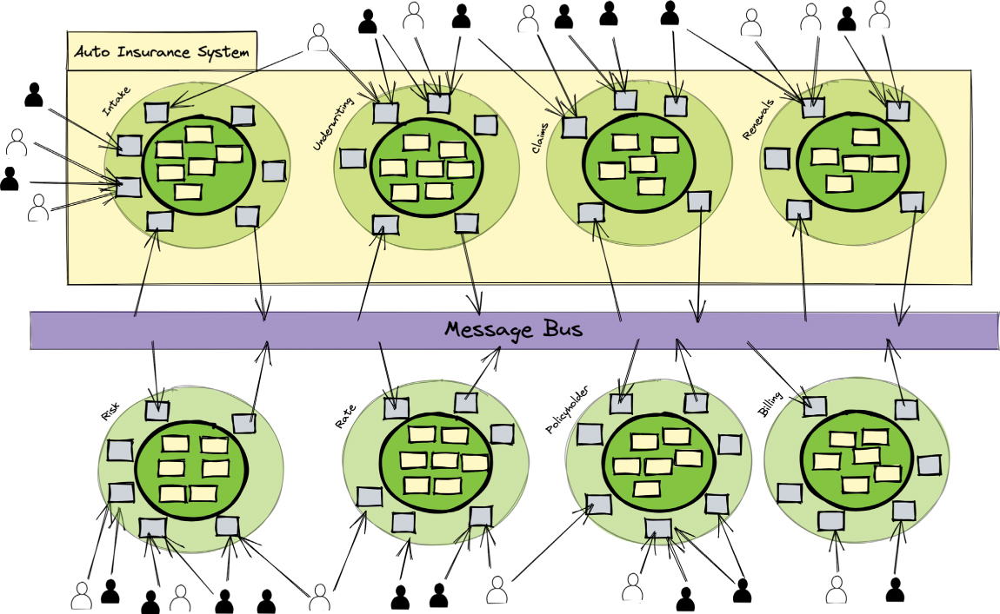
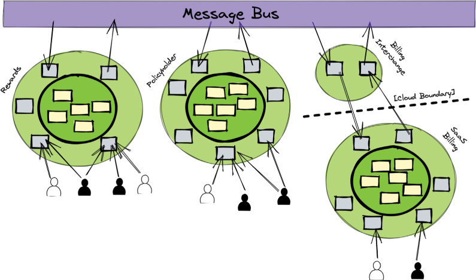
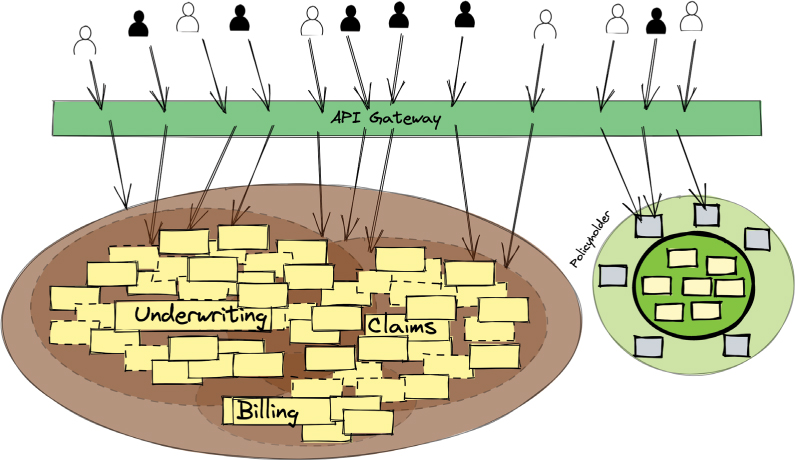
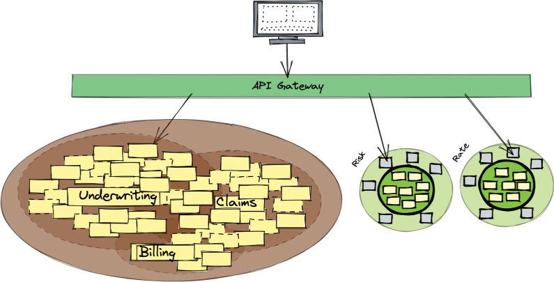
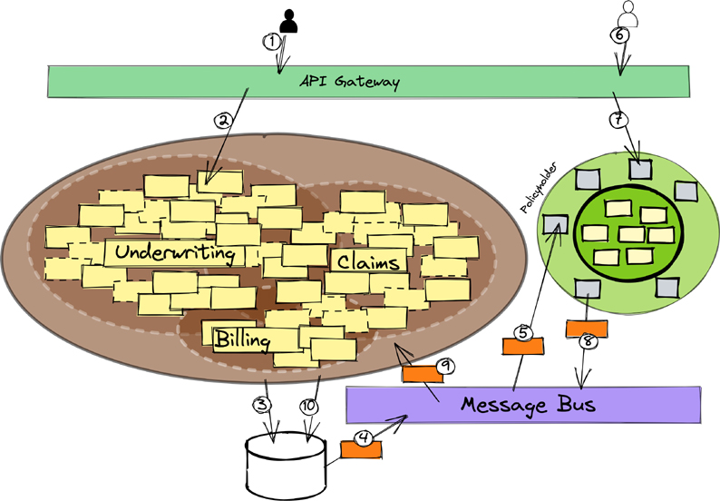

# 从单体到像老板一样的微服务

在某些情况下，使用微服务是最佳选择。这些主要在第 1、2 和 8 章中进行了讨论。尽管微服务具有优势，但可能没有必要进行彻底的更改以在系统范围内使用微服务。微服务的数量应根据业务目的和技术理由确定。

> 笔记
> NuCoverage 的运行案例研究已在第 1 章中介绍并贯穿本书，本章将继续进行。如果示例中的某些上下文似乎缺失，请参阅前面的章节。

从仅使用 Monolith 的架构过渡到一定数量的微服务可能意味着保留 Monolith 的某些部分以与新提取的微服务一起运行。用完整的微服务阵列完全取代单体应用也可能是一个很好的理由。本章介绍了这两种方法。

## 有决心的心理准备

当从 Monolith 中分离出微服务时，新引入的分布式系统组件会带来更高的运行时故障可能性。引入故障可能性的不仅是微服务，还包括提供端到端解决方案所需的整个分布式生态系统。这主要是由于对网络在不同计算节点之间进行通信的依赖性增加，以及两者都倾向于失败的事实：节点越多，网络和节点发生故障的可能性就越大。为了理解新的复杂性，考虑掉入分布式计算陷阱的影响是有益的。以下是分布式计算的谬误列表[谬误]：

1. 网络是可靠的。
2. 延迟为零。
3. 带宽是无限的。
4. 网络是安全的。
5. 拓扑不会改变。
6. 有一名管理员。
7. 运输成本为零。
8. 网络是同质的。

现在，考虑相信这些的结果以及分布式系统将如何因为它们不真实而失败。以下是分布式系统软件失败的原因：

1. 网络不可靠并且会在没有警告的情况下随时间变化，并且软件缺乏弹性和恢复策略。
2. 延迟是不确定和不可预测的，并且由于缺乏经验的软件开发人员普遍存在的遗忘而恶化。
3. 带宽在违反直觉的时候波动，而这种不一致会因天真而加剧。
4. 由于互联网的历史开放性，以及安全团队需要平衡默认开放性与企业安全策略的复杂性，甚至不遵守强制安全策略的普通用户的自满和松懈，网络并不完全安全。
5. 拓扑具有次优路由并产生意想不到的瓶颈。
6. 未知数量的管理员创建了会降低或阻止流量的冲突策略。
7. 构建网络传输并非易事。它们的构建错误可能会产生负面的财务和/或功能和质量相关的后果。
8. 假设网络完全由相同或相似的部分组成，会导致 1-3 的效果。

第 1-3 点表示分布式系统的主要问题。大多数软件都没有准备好处理网络故障或分布式计算常见的任何其他故障。第 1-8 点仅解决网络故障；它们不考虑与网络无关的软件故障。现在将所有其他类型的故障添加到该列表中：应用程序错误、服务器和其他硬件故障、减慢或停机的持久性资源以及其他一般基础设施故障。所有这些问题都可能导致灾难性的后果。
分布式系统必须具有非朴素的设计。设计时考虑到故障预防和恢复：

- 故障监控：通过在应用程序组件周围放置软件隔板来防止级联故障。
- 断路器：通过阻止对故障组件的访问，直到该组件恢复到完全运行状态来防止级联故障。
- 具有上限指数退避的重试：为从客户端到服务器的失败请求提供重试方法，直到服务器恢复到完全运行状态，但不会因以恒定速率快速重复重试而使网络或服务器不堪重负。
- 幂等接收器：当服务器多次收到相同的请求时，它知道如何安全地忽略后续操作，否则再次执行操作而不会产生负面后果。
- 无序消息传递：通常以与交换数学 (2 + 3 = 3 + 2) 相同的方式适用，它适用于加法和乘法，但不适用于减法和除法。此外，与其要求特定的顺序，不如了解什么是所有必要消息传递的总数，并仅在达到总数时才采取下一步行动。
- 使用减载、卸载和背压避免过多的请求和/或交付：为了减轻子系统的运行时负担，减载会删除/忽略一些不必要的工作。卸载将工作分配给有能力的其他工人。消费者使用背压来限制在给定时间范围内可能从生产者接收的元素数量。

当然，这些补救措施都不能单独解决所有问题。至少，故障监督可以防止灾难性后果。对于某些建筑设计，可能难以引入监督。 Actor 模型的使用通常将提供监督作为平台要求，但并非总是如此。尽管如此，大多数软件运行时环境都缺乏监督。
然而，即使采用监督也不应该被视为一个完整的解决方案。仅具有本地恢复的持续故障，以及缺乏合作稳定设计，不会逆转恶化的条件或防止计算异常。想想处理不当的重新交付和错误排序的变异操作的负面后果。例如，由于无法识别的重新交付而不断增加或减少财务帐户将对多方造成金钱损失，甚至可能对错误负责方造成致命的伤害。

> 迁移到微服务不应该是一个（典型的）项目
>
> 项目的特征包括计划、预定的工作量、资源和开发人员的分配、开始日期、各种里程碑以及可能的结束日期。对于从单体到微服务的工作，创建具有上述约束特征的项目是错误的。在获得理解、信心和动力之前承诺约会的过度压力会导致问题。从事“新事物”的人和那些受制于持续的业务压力和对遗产的奴役的人之间会产生摩擦。人们总是低估了努力和复杂性，以及工程师缺乏推动所需变革的技能的可能性。
> 从 Monolith 到微服务的过渡应该是一个持续的、不间断的努力，得到所有致力于成功的利益相关者的支持。它必须是一个商业目标。对于团队来说，拥有合适的人 - 具有高级技能的成熟开发人员至关重要。此外，团队应围绕业务能力进行组织，并具有跨职能技能，如第 2 章“基本战略学习工具”中的“文化和团队”部分所述。
> 团队必须做好预防滑坡故障的心理准备和决心，并预见到出现的小技术故障可能会变成大技术故障。必须紧随其后的是稳健的设计和实现，这对于成功的分布式系统操作至关重要。

## 模块化单体到微服务
第 10 章“按照你的意思构建单体应用”概述了构建模块化单体应用的两种方法：

- 从一开始就构建一个模块化的 Monolith。
- 通过逐渐将大泥球重构为模块化整体，从大泥球的负面影响中恢复过来。

第 10 章中的图 10.2 和 10.3 说明了在名为 Auto Insurance System 的单个部署容器中形成八个上下文模块的最终目标。无论使用哪种方法，NuCoverage 现在都有一个模块化的 Monolith。即便如此，系统的一些新动态仍在引起痛苦。
总共有五个团队致力于八个子域和上下文模块。每个模块以不同的速率变化，但八个模块中的两个，风险和速率，变化特别频繁。业务规则以及分别执行精算处理和定价计算的算法都发生了变化。此外，Risk 和 Rate 必须独立扩展，因为它们的负载很重并且需要更多资源。此外，该公司计划扩大奖励产品，增加新的保险产品线将带来其他一些影响。这意味着奖励必须从保单持有人账户中扣除。定制的遗留计费子系统已经老了，缺乏新的计费规则和支付选项。它将被基于软件即服务 (SaaS) 的计费解决方案所取代。
所有这些变化都要求从 Monolith 中提取一些上下文到微服务中：

- 风险背景
- 速率上下文
- 保单持有人账户背景
- 奖励上下文
- 计费上下文

还会有其他的提取，但有足够多的陌生挑战来面对这些最初的提取。对这五种业务能力进行逐步细化将有助于团队以相对较低的风险获得经验。
初始任务一次提取一个上下文模块。如图 11.1 所示，在相对较短的时间内，四个现有的上下文已经被提取到四个自治的微服务中。尽管 Billing Context 最终将被完全取代，但团队采取了保守的步骤，以特定目的提取现有的模块化上下文。更多重构紧随其后。

图 11.1 面对提取到微服务的上下文，模块化的 Monolith 缩小了。

笔记
与图 10.3 的情况一样，为了简单起见，图 11.1 中没有显示用户界面，因此看起来用户是直接与适配器交互的。此外，用户通常会严格显示在每个子系统的左侧。这里的架构被“旋转”，以便于向用户展示系统周围并在多个子系统中扮演角色。稍后将在“用户交互”部分讨论用户界面。
由于 Monolith 已经在使用具有可靠交付的消息总线，因此在提取新上下文时，通过消息传递使用命令、事件和查询的上下文间通信不需要更改。改变的是，任何新的微服务都必须自行管理安全性以阻止不良行为者并提供授权以控制谁可以做什么。此外，必须从保单持有人帐户上下文中提取奖励模型，并且必须极大地改变计费上下文，主要是为了在现有系统和新的 SaaS 计费服务之间提供传输。我们将在技术问题清单中添加另一项：每个有界上下文都应该拥有自己的数据库。
基于 SaaS 的计费服务不了解汽车保险系统的事件，也不提供向其传输事件的方法。如图 11.2 所示，为了促进 NuCoverage 系统与订阅计费服务的集成，我们需要一个小的计费交换上下文，负责将本地事件转换为基于 SaaS 的计费服务上的 API 调用。

图 11.2 继续返工和模型提取。

基于 SaaS 的计费服务提供了一个提要，它提供了一个事件记录流，其中包含有关在那里发生的事情的信息。 NuCoverage Billing Interchange Context 将该流转换为发布到 NuCoverage 消息总线上并在需要时理解的事件。事件类型已经存在，因此整个系统不需要因为使用新的计费子系统而改变。
Billing Context 的初始提取似乎是一个浪费的步骤，因为其中的大部分内容将被丢弃。的确，Billing 中的遗留业务逻辑最终会消失。即便如此，根据重构指南的建议，证明提取当前计费上下文不会破坏系统会更安全。完成此操作后，可以将旧记帐上下文提供的每个功能一一重定向到新的 SaaS 记帐服务。
诚然，团队可以将计费功能从 Monolith 内一个一个地重定向到订阅服务。^1^ 然而，采取初始步骤将创建最终所需的分离。具体来说，计费功能将不再存在于 Monolith 内部，并且会减少一个团队，从而导致其他团队的变革步伐发生冲突。这将特别有用，因为 Billing 会进行大量重构，并且每天或至少每周都会开始发布多个版本。考虑与它可能提供或可能不提供的值相比，提取当前计费上下文需要多少时间，并决定团队应该如何进行。

> 1 这是 Strangler Fig 应用程序模式（也称为 Strangler）的一种形式，将在下一节中讨论。

最后，将 Rewards 模型从 Policyholder Accounts Context 中提取到其自己的 Rewards Context 中，并打包部署为微服务。这是一个相当简单的提取，因为当前的奖励支持仅作为帐户类型的一个或几个属性实现。尽管如此，将这些迁移到一个新的环境中并确保所有奖励问题现在都在一个地方解决，至少会为团队提供一些暂停和思考的机会。好消息是，随着特定保险产品的上线，奖励的数量和类型现在可以更容易地扩展以推广新的保险产品线。

## 大泥球到微服务
从 Monolith 中提取组件更具挑战性的方法是将大泥球直接分解为微服务。考虑到这项工作需要同时假设几个复杂性，不难看出它的挑战性。第 10 章“对与错”一节中描述的所有步骤都必须通过狭窄的接缝推挤和挤压，每次返工任务都必须将其撬开。因为这一切都是在现有的 Big Ball of Mud 仍在生产中运行时完成的，所以这种分解不会破坏或损害任何东西，或者至少不会持续很长时间。总的来说，由此产生的巨大变化将相当于一次非常大的飞跃。即便如此，要进行剧烈的跳远，还需要减轻很多重量，并需要加强软件。
同样，重大变化涉及从麻烦的软件开发行为转变，以卵石的半径为中心，成为在高度优化的迭代过程中运作的团队，同时采用具有质量保证的业务驱动策略。这必须很快发生。一项艰巨的任务？绝对地。
以下是必须发生的事情的简短列表：

1. 确定大泥球中存在的所有业务能力。
2. 根据战略意义对业务能力进行排名：核心竞争优势>支持功能>可被第三方解决方案替代的通用操作。
3. 收集仍然相关但现在不相关的业务规则和功能清单。
4. 确定将按优先级顺序提取哪些业务能力。
5. 计划如何提取第一个业务能力。
6. 在步骤 1-5 中迭代工作并逐步交付。

在早期，第 4 步可能会使球队偏向于优先进攻以获得轻松的胜利。一个例子是用新的微服务替换旧的保单持有人帐户。这自然会导致创建奖励上下文，以便它可以从保单持有人账户中提取。这些变化是最简单的，可以帮助建立团队的经验和信心。
步骤 5 中固有多个不同的细节。以下部分公开了细节，不一定按顺序给出。可以根据需要在任何给定时间采取一些步骤。在大多数情况下，这种技术被称为“扼杀”巨石，就像藤蔓勒死一棵树一样。

### 用户互动
系统始终保持启用状态并可供系统用户使用。因此，用户界面必须保持一致。
通过在用户和 Monolith 之间放置 Facade [GoF]，可以促进维护系统与用户的合同。图 11.3 显示了作为 Facade 的 API 网关，其工作方式如下所述。

图 11.3 使用 API 网关将用户请求定向到当前实时上下文。

1. 最初，所有用户请求都从 API 网关定向到旧版 Big Ball of Mud。
2. 随着业务能力的特征被提取到微服务中并为用户启用，API网关被更改为将部分或全部用户请求定向到新启用的微服务。
3. 该方案可用于 A/B 测试，以确定 A 组和 B 组中的用户是否有好/坏和更好/更坏的体验。
4. 如果新微服务有糟糕或更糟的体验，请将所有用户请求返回到旧版 Big Ball of Mud。
5. 如果测试确定新启用的微服务健全且正确集成，则将所有用户请求定向到那里。

对每个新提取的微服务重复这些步骤。
不使用 API 网关也可以成功重定向请求，但需要更改 UI。尽管以这种方式执行 A/B 测试可能会更困难，但它仍然是可行的。作者成功地使用了这种方法。尽管如此，API 网关使它变得更简单。
无论使用何种方法，这里的一个常见复杂性是需要处理必须拆分的单个请求。当旧微服务和一个或多个新微服务都提供所请求服务的一部分时，就会发生这种情况。无论它们产生什么结果，都必须汇总多个结果。这通过 API 网关处理要简单得多。查询请求和响应通常可以很容易地聚合。相比之下，创建和更新的请求并不那么容易聚合。一些查询工具可以使此任务运行得更顺畅，但该解决方案可能会冒需要完全和直接访问数据库而不是使用设计良好的应用程序和域模型的风险。 GraphQL 等查询工具也可以通过 REST 请求-响应通信工作，从而保留有价值的应用程序服务和域模型。该模式被称为用于服务器端资源聚合的 GraphQL [TW-GraphQL]。
前面的讨论指出需要重新思考用户界面的设计和构建方式。随着数据被隔离到遗留系统中的各个模块中，或者随着整个业务功能在自主微服务中重新实现，用户界面必须显示来自多个来源的数据的聚合，以提供有意义的用户体验。不再只有一个地方可以获取所有要在用户界面中呈现的数据。^2^ 这也是使用 API 网关的另一个原因。如图 11.4 所示，改变用户界面工作方式的模式称为复合 UI。

> 2 实际上，从来没有一种方便的方法可以将来自大泥球的数据聚合到用户界面中，尽管从外部角度可能存在这种方式存在的错觉。

图 11.4 NuCoverage 为丰富用户体验而设计的复合 UI。

使用此模式时，UI 会意识到在一个 Web 页面中组装了不同的组件。这是通过使用相对简单的 HTML Web 标记语言来实现的。它提供基于块的文档分割或划分，可用于组合网页的各个区域以显示来自不同子系统的数据。每个段或部门从不同的来源获取其内容。在图11.4中，需要渲染三个用户界面组件，分别是在legacy中查询Underwriting，在新微服务中查询Risk和Rate。所有这些聚合和组合工作都可以通过 API 网关进行管理。 API 网关可以使用传统的 REST 查询或专门的 GraphQL 查询。
请注意，可以使用其他方法实现相同的目标，例如前端和微前端的后端。这些方法在我们后续的实施战略单体和微服务（Vernon & Jaskuła，Addison-Wesley，即将出版）一书中详细描述。

### 协调数据更改

在扼杀 Monolith 的同时，微服务中维护的数据必须交给遗留，而遗留数据必须交给微服务。否则，用户将看到他们认为相同数据的不一致视图。因此，每当系统状态数据在遗留系统中发生变化时，或者当微服务的状态被修改时，通常必须在另一侧协调更改。也就是说，对遗留系统状态的更改通常可供所有使用此数据的微服务使用。同样，遗留应用程序可能需要在微服务中进行状态更改。因为“一般”和“可能”不是决定，每个案例都必须单独处理。

> 笔记
> 将“协调”称为“同步”似乎更好，因为这里描述的是一种同步。然而，数据无疑将采用不同的形式，并可能在遗留系统和新微服务之间改变其含义。因此，作者选择了“和谐”和“和谐”这两个术语。这里发生的事情类似于两个音域不同的歌手，但仍然可以和声唱歌。

这种跨进程的数据和谐最终会保持一致。因此，如果遗留系统状态发生变化，必须协调的微服务将只能在一段时间后才能合并更改。为此，微服务与遗留系统中的数据至少会有短暂的差异。遗留系统最终与微服务中的数据更改协调一致。除了查询多个数据源并合并到最新快照之外，对于这种暂时的不匹配，没有什么可以做的。即便如此，在当前用例完成之前，可能会发生对相同数据的更改。在分布式计算中，确实没有“现在”，时间总是胜过一致性。
当双方至少部分地依赖于相同的数据时，协调双方的数据修改是必不可少的。这可能看起来很奇怪，但在整个业务能力被一个或多个微服务取代之前，所有拥有相同数据的子系统最终必须就系统状态达成一致。这在一段时间内可能是必要的，尽管它不是最终目标。最终目标是单一的事实来源。

> 单一的真相来源
>
> 设计良好的系统具有单一的事实来源，其中一组给定的数据（例如实体）归一个记录子系统所有。在将 Big Ball of Mud 分解为微服务的过程中，在进行复杂的重构和提取时，通常可能会也可能不会维护单一的事实来源。
> 一些遗留系统更容易处理，并且在整个分解过程中保持严格的单一事实来源是可能的。由于需要在微服务中轻松查询数据，因此可能仍然需要根据微服务内部的数据更改结果更新遗留数据。尽管如此，对迁移数据的所有更改都必须仅在拥有的微服务中进行。
> 如果创建严格的单一事实来源过于复杂，则可能需要暂时放宽规则。一些代码库和数据库模式非常复杂，以至于不可能在任何时候都对给定的实体类型保持严格的单一事实来源的同时，逐步将多个微服务发布到生产中。始终坚持严格的单一真实来源限制可能意味着很少（如果有）微服务将逐步推出。结果更像是瀑布式的努力，经过数月甚至数年的举重手术后最终大爆炸释放。在部署任何或至少几个微服务之前，这项工作可能会被取消。
> 最终，在记录系统中，每个数据元素应该只有一个真实来源。这并不意味着永远不会发生数据重复。事实上，我们承认，试图让两个或多个经常变化的数据元素长期保持一致不仅困难而且风险很大。这一系列复制“真相”的多重来源绝不能长期维持，当然也不能永久维持。在某些时候，扼杀必须证明对遗产是致命的。请参阅本章的最后一节“拔掉遗留的 Monolith”。

当然，在任何时候都无法实现单一的事实来源，因为在任何给定时刻，遗留或给定微服务的变化都只会记录在一个地方。只有最终达到系统状态的和谐；也就是说，一个真正的分布式系统总是最终一致的。实际上，在具有许多不断变化的数据源的大型复杂系统中，所有系统状态永远不会完全一致。实现这一壮举需要违背物理定律，所以最好不要尝试。
接下来，我们将介绍实现依赖系统状态的最终数据协调的三种主要方法：数据库触发器、事件表面和变更数据捕获 (CDC)。

#### 数据库触发器

第一种方法使用数据库触发器。当触发器触发时，会创建一个事件来表示更改的内容、插入到事件表中并由事务范围管理。该事件通过消息发布提供给微服务。给定的用例可能需要触发器在单个事务中的多个表上触发。触发器的问题在于 RDBMS 类型以外的数据库产品不支持它们。即使它们得到支持，使用触发器也可能很乏味。在负载较重的数据库上使用触发器时，触发器也可能很慢。
当没有更好的解决方案可用时，作者使用了这种技术。在一个案例中，遗留的 Big Ball of Mud 是在一种神秘的语言和框架中实现的，并使用现代编程语言进行了大量的重新实现和新工作。由于在该环境中广泛使用 Microsoft SQL Server 数据库，因此很难使用触发器以外的任何东西。幸运的是，使用 SQL Server，所有触发器都可以在事务提交之前触发，从而能够将多表修改聚合到单个事件中。当时，更改数据捕获不是一个选项。在这种情况下使用数据库触发器具有挑战性，但它奏效了。

#### 事件表面
协调数据的第二种方法是在遗留数据库中创建一个表，用于插入与每个翻译相关的事件。称之为事件表，以及技术事件表面。我们将这种技术命名为事件表面，因为最初的实现不是用事件设计的，但现在事件被塞进了遗留系统代码库中，以使其更容易扼杀。数据库触发器和事件呈现之间的区别在于，第一种方法在触发一个或多个触发器时创建事件，而第二种方法在应用程序代码中显式创建事件并将其与实体一起保存到数据库中。
当插入、更新或删除一个或多个应用程序实体以执行用例时，应用程序（可能是服务层）创建一个新事件并将其插入到事件表中。实体和事件在同一个事务中提交。该事件稍后将被后台任务查询并通过消息传递发布。
这里的复杂性在于，通常很难找到创建和注入事件的好地方。有时多个服务层组件会独立修改系统状态，同时在单个事务范围内进行管理。除非某个顶级组件正在编排子任务，否则如何以及在哪里创建单个事件？也许每个单独的服务层组件都会创建一个独特的事件，而微服务必须处理多个事件而不是一个。如果线程本地或线程静态概念可用，并且假设遗留代码是每个请求的单线程，则这可用于将所有线程内更改聚合到单个事件中。这些技术主题在我们的后续书《实施战略单体和微服务》（Vernon 和 Jaskuła，Addison-Wesley，即将出版）中进行了详细讨论。

#### 变更数据捕获

第三种方法使用支持变更数据捕获 [CDC] 的特殊数据库工具。事实上，触发器可用于实现一种形式的变更数据捕获，但有一类用于此任务的高度专业化的工具可以更好地工作。应用此类工具时，数据库事务日志仅保存要对基础数据进行的更改。提取工具作为独立于数据库的进程运行，从而消除了与耦合和争用相关的任何问题。这种特定技术称为数据库事务日志拖尾。
例如，名为 Debezium [Debezium] 的工具可作为开源提供。 Debezium 在其支持的数据库产品数量方面存在一些限制，但其能力一直在稳步增长和改进。不出所料，Debezium 优先支持开源数据库产品。在撰写本文时，共有九种受支持的数据库产品——六种开源产品和三种完全商业化的产品。认真对待这个产品并注意这个空间。
如果正确使用 Change Data Capture，则使用它是非常有效的。此类工具可用于其他解决方案，并且有描述这些的模式。本系列的后续书籍“实施战略单体和微服务”（Vernon 和 Jaskuła，Addison-Wesley，即将出版）中描述了其他模式。

#### 应用数据协调事件

之前讨论的所有协调数据的方法都是达到同一目的的一种手段。它们并不是为了让大泥球成为更好的工作场所，尽管这可以成为一个目标（如第 10 章所述）。在这种情况下，NuCoverage 决定将其 Big Ball of Mud 逐块分解，最终退役。
前面讨论的方法之一可能适合这种特定情况，或者至少提供一些关于在其他情况下有效的重要线索。一旦选择了一种方法，就可以将其应用于协调数据。图 11.5 和下面的列表解释了这个过程是如何从头到尾进行的。

图 11.5 使用变更数据捕获将本地数据修改分发给系统对等方。

1. 用户提交请求。
2. API 网关将请求定向到遗留系统。
3. 数据修改被持久化到遗留数据库事务日志中。
4. Change Data Capture 读取数据库事务日志并分派给侦听器，侦听器创建一个放置在消息总线上的事件。
5. 消息总线将事件传递给微服务，从而建立一致性（隐含数据库持久性）。
6. 用户提交请求。
7. API 网关将请求定向到微服务。
8. 微服务发出的事件（隐含数据库持久性）放置在消息总线上。
9. 消息总线将事件传递给协调数据的遗留系统。
10. 统一的数据修改保留在旧数据库中。

请注意，双方必须了解如何检测和忽略在完整往返期间看到的事件。也就是说，由遗留系统引起的协调微服务中状态的事件将依次发出遗留系统将接收的事件。遗留系统必须知道忽略作为完整往返结果的事件。对于作为直接用户操作的结果在微服务中发起的事件也是如此，用于协调遗留中的状态，继而从变更数据捕获发出事件。微服务必须知道忽略作为完整往返结果的事件。如果不考虑这一点，单个数据库事务可能会导致无限同步。这种结果可以通过携带发起者相关身份/标签的每个事件来避免，所有接收者必须将其传播到他们发出的事件中。当在家里看到发起者的相关身份/标签时，可以安全地忽略携带它的事件。

### 决定扼杀什么
前两个小节描述了促进使用名为 Strangler Fig Application [Strangler-Fig] 或简称 Strangler [Strangler] 的模式的过程。^3^ 在这里，我们考虑如何在 Strangler 创建的生态系统中工作。

> 3 有趣的是，马丁福勒后来决定不喜欢他最初使用的“扼杀者应用程序”这个名字，因为“扼杀者”这个词有“令人不快的暴力内涵”。然而，百科全书和其他来源使用“扼杀者”作为这种植物物种的通用名称。作者使用了软件行业最著名的名称，即“扼杀者”。

有趣的是，物理扼杀无花果本身，如果它是有知觉的，可能会被贴上机会主义者的标签。它首先从动物（例如猴子）的体内爬上树，然后以最令人不快的包裹存放在树上。生长开始于从雨水中吸收阳光和养分，以及从成为宿主的树上吸收植物凋落物。扼杀无花果从其卑微的起点开始，沿着丰富而便利的路径开始缓慢生长。当根部找到地面时，它们会将自己牢固地嵌入土壤中并开始积极地生长。这开辟了新的机会，通过消耗树木本来会收到的养分来强行超越寄主树木。在它覆盖整个寄主树的地方，扼杀无花果通过发展更粗的根并挤压树干来收紧它的抓地力。它同时延伸到宿主上方，包围顶部并阻挡阳光的照射。令人难以置信的是，不仅是勒死树木，还有阳光的枯竭和根系对土壤养分的垄断。
有机的“机会主义战略和战术”为扼杀遗留的大泥球提供了一个成功的框架。这是一个恰当的比喻，我们可以从中学到宝贵的教训。

- 当我们刚开始时，事情会变得又丑又臭，从我们卑微的开始似乎还有很长的路要走，但开始是必须的。
- 慢慢开始，并倾向于优先考虑轻松获胜。我们之前引用的示例是用新的微服务替换旧的保单持有人帐户。
- 在实现了一些早期的成长并获得了信心之后，有可能通过获得某些胜利的更多机会来发芽新的根源。
- 继续这种模式，直到团队已经掌握了这些技术。
- 开始积极增长，收紧对 Monolith 的控制。
- 如果选择杀死 Monolith，那么最后的挤压可能不会太远。

这种方法的一个好处是，可能没有必要将遗产的包袱向前推进。有可能将一些现有代码迁移到微服务，但应谨慎进行。扼杀与从大泥球重构为模块化单体不同，这是一个很好的机会，可以减轻遗留的负担并从一组精心设计的微服务中获得力量。这将在本章后面的“拔掉遗留的单体应用”一节中更详细地讨论。

考虑一些关于将大泥球单体分解为微服务的注意事项：

- 当心模糊的行为。遗留代码没有给定业务行为的显式模型。其他障碍包括具有太多职责的组件、业务逻辑被抛到用户界面和基础设施中、用户界面和服务层产生冲突，以及行为和业务规则被复制。 （从技术角度来说，这些问题可能包括相关组件的低内聚和任何两个或多个组件之间的高耦合等问题。）这个障碍列表并不详尽，但所选择的示例肯定经常在野外看到。其中一位作者遇到了这样一种场景：用户界面包含业务规则，触发了大量技术工作流和流程以及与业务合作伙伴的集成。^4^ 分层选择列表包含业务逻辑，根据所涉及的列表项，不同类别的数据将被更新，触发工作流程和流程。代码库在理解业务逻辑和规则方面没有提供任何实际帮助。为了改变这种不愉快的情况，深入分析和广泛的考古挖掘，包括商业专家的帮助，最终导致了知识的获取。

> 4 如果它不明显，这是一个往往远远超出错误的反模式。

- 不要继续错误的行为。从业务和技术角度来看，大泥球的某些部分经常被错误地实施。即使面对设计不佳的系统，业务人员也必须完成他们的工作。因此，用户设计的解决方法比比皆是。这种隐性知识是在用户社区中获得和共享的，软件永远不会满足他们的需求。熟悉会滋生自满。与之抗争：不要将相同的错误模型复制到新的微服务中。相反，不断挑战业务专家以帮助发现突破性创新。不断检查遗留分解的脉搏，监控结果的接收方式。一种启发式方法是观察用户使用系统完成某项任务。用户体验是否直观？用户是否需要特殊知识来解决问题？用户是否需要纸质说明、显示器上的便签或带有黑客的秘密电子表格？更有经验的用户可能会记住大部分知识，因此在某些情况下可能难以发现用户体验问题。观察，是的——但也要询问和挑战。要有理解力和同理心。
- 不要在 Monolith 中实现新功能。正在进行的分解工作可能需要一些时间，但在等待这些任务完成时，业务不会停滞不前。相反，企业将不断需要新功能。如果当前在 Monolith 中的某些业务功能应该在微服务中重新实现，请尽可能避免在 Monolith 中为该业务功能实现新功能。这样做会浪费时间和精力，除非迫切需要在 Monolith 的剩余遗迹之一中引入新功能。除了限制 Monolith 的增长和规模（应该缩小）之外，在微服务中构建新功能将加速开发并更快地交付业务价值。

从大泥球中提取业务能力行为需要非常艰苦的工作。必须付出大量努力来重新发现领域、确定其规则并挑战它们。

## 拔掉遗留的 Monolith
一方面，在某些时候，对遗产进行最后的挤压并使其消亡可能是实际的，甚至是必要的。另一方面，该操作可能不切实际或不必要。如果决定让遗留的某些部分继续运行，则有可能清除其代码库中的过时代码。或者可能是之前的代码非常混乱，以至于删除大片甚至小片都不切实际。最可悲的是，在可预见的未来及以后，很可能需要协调遗留和微服务之间的数据。
如果某些业务功能根本不会被提取，或者将在短时间内保持相关性，请让遗留的 Monolith 继续运行。当然，这是不可取的，因为即使在遗留业务能力的数量减少的情况下，保持数据和谐的操纵几乎肯定是必要的。当然，让 Monolith 与新的微服务同时运行会增加运维和开发的复杂性，这肯定会导致更大的业务风险。
有些情况不能容忍保留遗留系统，即使终止它会带来很大的复杂性。考虑一下公司本身被长期过时或极不受欢迎的计算机机器和软件束缚的情况，更不用说更新许可证和支持合同的巨额费用了。感觉就像付钱给暴徒以保护暴徒本身。这种遗留开销会带来巨大的“税收”，除非组织采取严厉措施，否则它永远不会结束。即使超出供应商锁定，在某些情况下，聘请开发人员来维护传统几乎是不可能的。原始代码可能已由现在有曾孙或不再与我们在一起的人实施。
由于这些以及更多原因，在给定的许可和支持合同到期日期之后，一个不太重要的泥泞遗留系统不能继续使用。一些半牵引拖车（例如卡车或大型拖车）必须停在一个装运码头，在那里魁梧的搬运工将一些庞然大物推入拖车，并将它们带到计算机博物馆。负责拆除遗产的团队必须是扼杀者无花果的最佳人类形态。对于一些 CEO、CFO、CIO 和其他想要从 1960 年代和 1970 年代继续前进的人来说，拔掉机器插头的感觉从未如此美妙。

## 概括

本章考虑如何从单体架构转变为微服务架构。因为理解微服务的挑战必不可少，所以首先介绍了与分布式计算相关的问题。接下来，我们考虑了从模块化良好的 Monolith 过渡到微服务的最简单步骤。有了这种理解，我们概述了与直接从大泥球中提取微服务相关的挑战，并为此提供了分步指导。最后，本章描述了在面临与摆脱不健康的技术锁定相关的挑战时，最终拔掉遗留的 Big Ball of Mud 的目标。
本章的主要内容如下：

- 分布式计算引入了几个复杂的挑战，当采用单体架构时，这些挑战大多是可以避免的。
- 从遗留系统实现微服务架构的最简单、最直接的方法是从一个模块化良好的单体开始，就像在第 10 章中开发的那样。
- 将遗留的 Big Ball of Mud 系统中的组件直接提取到微服务中更具挑战性，因为这样做需要同时假设多个级别的复杂性。
- 当每个微服务和遗留应用程序实现请求的服务的一部分时，将 API 网关视为在多个微服务和遗留应用程序之间聚合请求的一种方式。
- 复合 UI 是聚合来自多个服务的数据的好方法。
- 在将功能从单体应用迁移到微服务时，请考虑始终为任何数据提供单一的真实来源。
- 将遗留系统迁移到微服务时，数据库触发器、事件呈现和变更数据捕获是需要考虑的模式。

在第 12 章（本书的最后一章）中，我们将介绍目前为止所见的所有内容。

## 参考

- [CDC] https://en.wikipedia.org/wiki/Change_data_capture
- [Debezium] https://debezium.io/
- [谬论] https://en.wikipedia.org/wiki/Fallacies_of_distributed_computing
- [GoF] Erich Gamma、Richard Helm、Ralph Johnson 和 John Vlissides。设计模式：可重用的面向对象软件的元素。马萨诸塞州雷丁：Addison-Wesley，1995 年。
- [扼杀者] https://docs.microsoft.com/en-us/azure/architecture/patterns/strangler
- [Strangler-Fig] https://martinfowler.com/bliki/StranglerFigApplication.html
- [TW-GraphQL] https://www.thoughtworks.com/radar/techniques/graphql-for-server-side-resource-aggregation