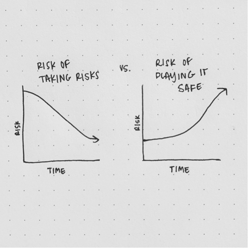
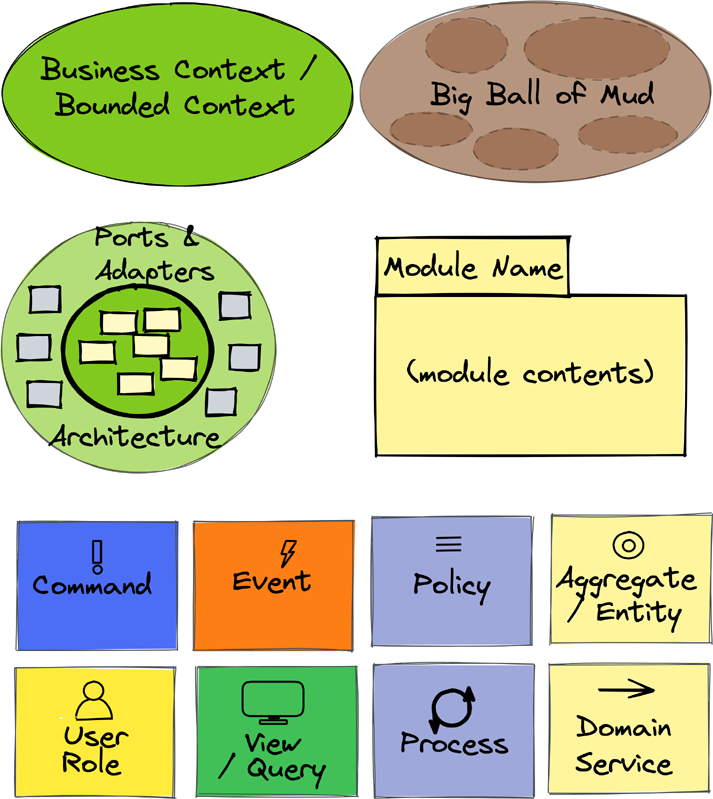

# 前言

您的组织很可能不会通过销售“传统意义上”的软件来赚钱，也许永远不会。这并不意味着软件不能在为您的组织赚钱方面发挥重要作用。软件是最富有公司的核心。
以缩写 FAANG 所代表的公司为例：Facebook、Apple、Amazon、Netflix 和 Google（现在由 Alphabet 控股）。这些公司中几乎没有一家公司销售任何软件，或者至少他们不指望软件销售来产生大部分收入。
Facebook 大约 98% 的收入是通过向希望访问其社交网站成员的公司销售广告来赚取的。广告空间具有如此高的价值，因为 Facebook 的平台为会员之间提供了巨大的互动。某些成员关心其他成员发生的事情和整体趋势，这让他们与人、情况和社交平台保持联系。吸引 Facebook 会员的注意力对广告商来说价值不菲。
苹果在很大程度上是一家硬件公司，销售智能手机、平板电脑、可穿戴设备和电脑。软件带来了所述智能手机和其他设备的价值。
亚马逊采用多管齐下的方法来创收，作为在线零售商销售商品；出售对无限电子书、音频、音乐和其他服务的订阅；和销售云计算基础设施即服务。
Netflix 通过销售电影和其他视频流服务的多级订阅来赚取收入。该公司仍然通过 DVD 订阅赚钱，但是这部分业务正如预期的那样，随着点播流媒体的日益普及而急剧下降。通过在电视和移动设备上运行的面向用户的软件体验增强和控制视频流。然而，真正繁重的工作是由提供来自亚马逊 AWS 的视频的基于云的系统完成的。这些服务提供 50 多种不同格式的视频编码，通过内容交付网络 (CDN) 提供内容，并在面对云和网络中断时处理混乱的故障。
谷歌还通过广告销售赚钱。这些广告与其搜索引擎软件的查询结果一起提供。 2020 年，Google 通过直接使用软件（例如通过 Google Workspace）赚取了大约 40 亿美元。但是 Google Workspace 软件不必安装在用户计算机上，因为它是使用软件即服务 (SaaS) 模型在云中提供的。根据最近的报道，谷歌拥有近 60% 的在线办公套件市场，甚至超过了微软声称的份额。
从这些行业领导者的经验中可以看出，您的组织不需要销售软件来赚取市场领先的收入。然而，它需要使用软件来在现在和未来几年内在业务中脱颖而出。
此外，要使用软件进行创新，组织必须认识到软件架构师和工程师队伍——最好的——很重要。他们非常重要，以至于对最好的需求使他们难以招聘。想想在 WNBA 或 NFL 选秀中获得前 20 名选秀权中的任何一个的重要性。当然，这种描述并不适用于每个软件开发人员。许多甚至大多数人都满足于“打钟”，支付抵押贷款，并尽可能多地在电视上观看 WNBA 和 NFL。如果这些是您想要招聘的潜在客户，我们强烈建议您立即停止阅读本书。相反，如果那是您曾经去过的地方，但现在您想要做出有意义的改变，请继续阅读。
对于那些寻求卓越和加快创新步伐的组织来说，重要的是要意识到软件开发的成功者不仅仅是“有价值的”。如果一家企业要通过软件进行创新以统治其行业，那么它必须认识到，软件架构师和工程师之流是“新王者”，这是斯蒂芬·奥格雷迪 (Stephen O'Grady) 在 2013 年出版的著作《The New》中创造的术语。 Kingmakers：开发者如何征服世界 [New-Kingmakers]。为了在软件方面真正取得成功，所有具有大胆目标的企业都必须了解是什么推动了这类开发人员超越常见的软件创建。他们渴望创建的软件种类绝非普通或显而易见的。最有价值的软件开发人员想要制作决定行业未来的软件，这是您的组织必须发出的招聘信息，以吸引 (1) 最好的和 (2) 那些足够关心成为最好的人。
本书适用于 C 级和其他业务主管，以及参与领导软件开发角色的每个角色和级别。负责交付直接导致战略差异化或支持战略差异化的软件的每个人都必须了解如何通过软件推动创新。
作者发现，今天的 C 级和其他高管与过去几十年的前辈不同。许多人精通技术，甚至可能被视为其业务领域的专家。他们的愿景是在特定的地方让事情变得更好，并且他们吸引了其他高管和深入的技术专业人士，他们了解创始人或创始人正在努力实现的目标：

- 接近技术愿景的 CEO，例如初创公司 CEO，以及希望了解软件在未来的作用的 CEO
- 负责促进和支持软件开发作为差异化因素的 CIO
- 通过创新引领软件愿景的 CTO
- 高级副总裁、副总裁、董事、项目经理和其他负责实现愿景的人
- 首席架构师，他们会发现本书鼓舞人心，是一份有力的指南，可以激励软件架构师和高级开发人员团队以商业思维和有目的的架构推动变革
- 各个级别的软件架构师和开发人员，他们都在努力坚定自己的商业心态——即认识到软件开发不仅仅是获得丰厚报酬的手段，而是通过软件创新超越平凡和显而易见的繁荣

这是所有软件专业人员都必须通过使用、反思和实践本书中探讨的专家技术来学习的重要信息。
战略单体和微服务：使用有目的的架构推动创新不是一本关于实现细节的书。我们将在下一本书“实施战略单体和微服务”（Vernon 和 Jaskuła，Addison-Wesley，即将出版）中提供此类信息。本书是一本关于软件作为商业战略一部分的书。
对于在软件行业缺乏深厚知识或经验的领导者来说，这本书绝对会很有趣。它通过展示每个软件计划必须如何发现伟大的想法、有目的的架构、战略性的设计和实施以克服复杂性来提供信息。同时，我们强烈警告读者不要将意外或故意的复杂性拖入软件中。推动变革的重点是提供比用户/客户期望的更好的软件。因此，这本书旨在改变那些陷入现状、捍卫自己的工作的人的思想，而不是作为下一代思想、方法和设备的拥护者不懈地前进——也许成为因此，工业的未来。
本书的作者曾与许多不同的客户合作，并亲眼目睹了软件开发的消极面，即坚持工作安全和捍卫地盘是目标，而不是通过推动繁荣来使业务蓬勃发展。许多最富有的公司规模如此之大，并且在多层管理和报告结构下参与了如此多的举措，以至于它们的愿景-实施-接受途径远非连续性的证明。考虑到这一点，我们试图让大众意识到“软件正在吞噬世界”这句格言是正确的。我们的课程充满了现实主义色彩，表明可以通过渐进的实际步骤来实现创新，而不是需要瞬间的巨大飞跃。
尝试创新总是有风险的。也就是说，从长远来看，根本不承担任何风险可能会更具风险和破坏性。下面的简单图表使这一点非常清楚。

图 P.1 冒险是有风险的，但谨慎行事的风险可能更大。

正如 Natalie Fratto [Natalie-Fratto-Risk] 所暗示的那样，通常情况下，冒险的风险会随着时间的推移而降低，但谨慎行事的风险会随着时间的推移而增加。 Natalie 的风险投资者方面可以在她的 TED 演讲 [Natalie-Fratto-TED] 中看到，其中解释了她投资的企业的创始人类型。正如她解释的那样，许多投资者寻找具有高智商 (IQ) 的企业创始人，而其他投资者则寻找具有高情商 (EQ) 的企业家。她主要寻找具有高适应性商数 (AQ) 的人。事实上，创新需要很强的适应性。你会发现这本书以多种形式重复了这条信息。从实验到发现再到架构、设计和实施，一切都需要适应性。冒险者不太可能成功，除非他们非常适应。
当我们讨论软件创新的主要话题时，不可能完全避免迭代和增量开发这一极具争议的话题。事实上，某种形式的“A 字”——是的，敏捷/敏捷——是无法回避的。本书远未宣传一种使用敏捷或成为精益企业的特定和礼仪方式。可悲的是，作者发现大多数创建软件的公司和团队都声称使用敏捷，但并不了解如何成为敏捷。我们希望强调后者而不是加强前者。敏捷的原始信息非常简单：它专注于协作交付。如果保持简单，这种方法可能非常有用。也就是说，这与我们的主要信息相去甚远。我们只是试图引起人们对“不简单”使用造成损害的地方以及敏捷如何帮助的关注。有关我们认为敏捷如何提供帮助的简要讨论，请参阅第 1 章“业务目标和数字化转型”中的“不要责怪敏捷”部分。
鉴于我们的背景，有些读者可能会惊讶地发现，我们并不将战略单体和微服务视为一本领域驱动设计 (DDD) 书籍。可以肯定的是，我们介绍并解释了领域驱动的方法以及它为什么以及如何有用——但我们并没有限制我们的范围。我们还提供超越 DDD 的想法。这是一本“软件正在吞噬世界，所以要聪明起来，在被抛在后面之前，根据实际目的加入、创新并做出明智的架构决策”。我们正在解决我们几十年来一直与之合作的各类公司的真正需求，尤其是根据我们过去五到十年的观察。
我们一直有点担心我们的鼓声可能听起来太大声。尽管如此，当考虑到其他鼓声在技术驱动的行业中击败时，我们认为一种不同的鼓声是必要的。当许多其他人在高山上，不断地敲击“下一个被过度炒作的产品作为银弹”鼓时，至少必须有一个平衡的尝试，以促进我们的大脑作为最好的工具。我们的目标是表明思考和重新思考是创新的方式，而通用产品的获取和在难题上投入更多的技术并不是战略计划。因此，可以将我们想象成毗邻山上的人们敲着另一面的鼓，通过超越平凡和显而易见的事物，通过创新和与众不同而“成为科学家和工程师”。而且，是的，我们这样做确实出汗了。如果我们强烈的鼓点给读者留下持久的印象，即我们的鼓产生了特定的刺激大脑的节奏，那么我们认为我们已经实现了目标。如果刺激为我们的读者带来更大的成功，则尤其如此。

## 图表的图例/键

图 P.2（第 xxii 页）显示了本书中大多数架构图中使用的建模元素。使用的元素范围从大到小，以及介于两者之间的元素，具体取决于图表的主题。有些取自第 87 页所述的 EventStorming。

图 P.2 本书架构图中使用的建模元素。

在图 P.2 中，上半部分，从左上角开始，是战略和架构元素： 业务/限界上下文是业务能力和知识领域的软件子系统和模型边界；大泥球是大多数企业萎靡不振的“非架构”；端口和适配器架构既是基础又是通用风格；和模块是包含软件组件的命名包。
图 P.2 的下半部分描述了八种战术组件类型，它们出现在一个子系统中，有时会流向其他子系统： 命令导致状态转换；事件捕获并承载跨子系统边界的状态转换记录；策略描述业务规则；聚合/实体持有状态并提供软件行为；用户角色与系统交互，通常代表一个角色； View/Query 收集和检索可以在用户界面上呈现的数据；流程管理多步操作直至最终完成；和域服务提供横切软件行为。
有关元素类型的图例/关键字，请参阅图 P.2，尤其是在阅读黑白印刷书籍时，该书籍使用图案代替颜色。

## 参考

- [Natalie-Fratto-Risk] https://twitter.com/NatalieFratto/status/1413123064896921602
- [Natalie-Fratto-TED] https://www.ted.com/talks/natalie_fratto_3_ways_to_measure_your_adaptability_and_how_to_improve_it
- [New-Kingmakers] https://www.amazon.com/New-Kingmakers-Developers-Conquered-World-ebook/dp/B0097E4MEU

>在 InformIT 站点上注册您的战略单体和微服务副本，以便在更新和/或更正可用时方便地访问它们。要开始注册过程，请访问 informit.com/register 并登录或创建一个帐户。输入产品 ISBN (9780137355464) 并单击提交。在“注册产品”选项卡上查看此产品旁边的“访问奖励内容”链接，然后按照该链接访问任何可用的奖励材料。如果您想收到有关新版本和更新的独家优惠的通知，请选中此框以接收我们的电子邮件。